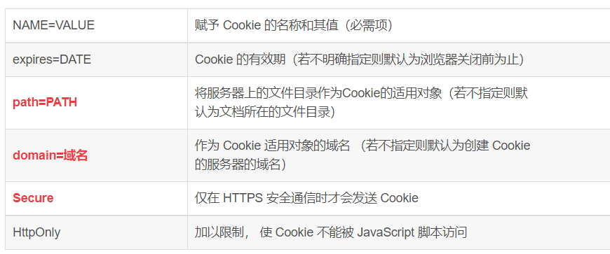
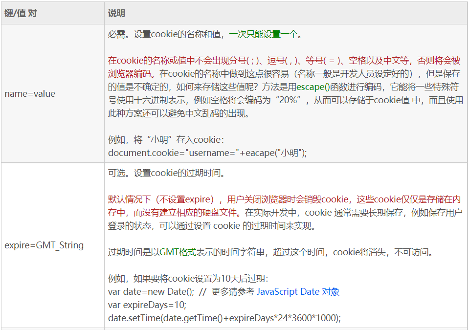
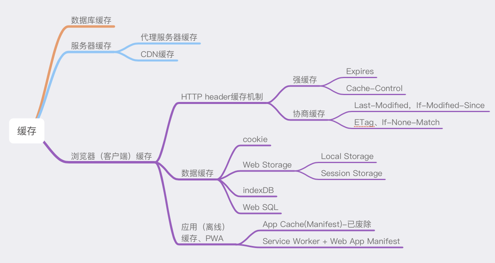
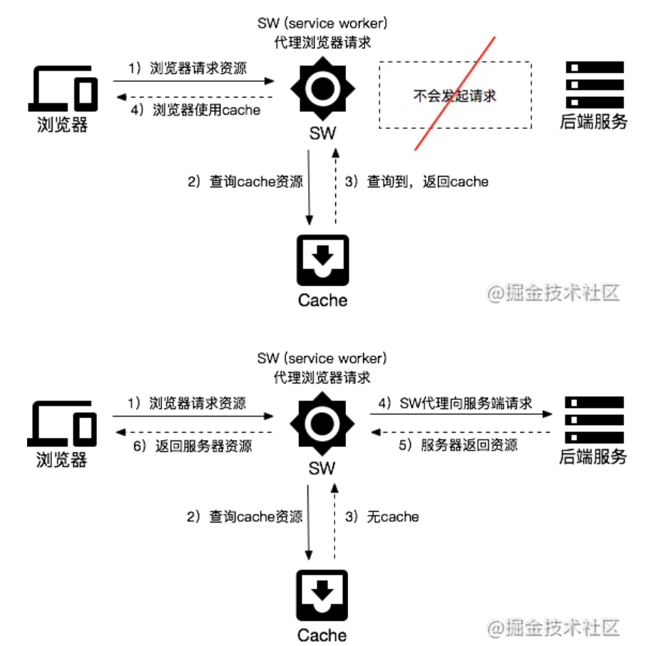

## 语义化标签
header：定义文档的页眉（头部）；
nav：定义导航链接的部分；
footer：定义文档或节的页脚（底部）；
article：定义文章内容；
section：定义文档中的节（section、区段）；
aside：定义其所处内容之外的内容（侧边）；

### title与h1的区别、b与strong的区别、i与em的区别
- strong标签有语义，是起到加重语气的效果，而b标签是没有的，b标签只是一个简单加粗标签。b标签之间的字符都设为粗体，strong标签加强字符的语气都是通过粗体来实现的，而搜索引擎更侧重strong标签。
- title属性没有明确意义只表示是个标题，H1则表示层次明确的标题，对页面信息的抓取有很大的影响
- i内容展示为斜体，em表示强调的文本

## 媒体标签
1. audio：音频
   ```html
   <audio src="music/yinyue.mp3" controls autoplay loop="true"></audio>
   ```
    我们可以通过附加属性，来更友好地控制音频的播放，如：
    - autoplay 自动播放。写成autoplay 或者 autoplay = ""，都可以。
    - controls 控制条。（建议把这个选项写上，不然都看不到控件在哪里）
    - loop 循环播放。
    - preload 预加载 同时设置 autoplay 时，此属性将失效。
  
    为了做到多浏览器支持，可以采取以下兼容性写法：
    ```html
    <!--推荐的兼容写法：-->
    <audio controls loop>
        <source src="music/yinyue.mp3"/>
        <source src="music/yinyue.ogg"/>
        <source src="music/yinyue.wav"/>
        抱歉，你的浏览器暂不支持此音频格式
    </audio>
    ```
    代码解释：如果识别不出音频格式，就弹出那句“抱歉”。
2. video视频
    ```html
    <video src='a.mp4' poster='imgs/aa.jpg' controls></video>
    ```
    我们可以通过附加属性，来更友好地控制视频的播放，如：
   - autoplay 自动播放。写成autoplay 或者 autoplay = ""，都可以。
   - controls 控制条。（建议把这个选项写上，不然都看不到控件在哪里）
   - loop 循环播放。
   - preload 预加载 同时设置 autoplay 时，此属性将失效。
   - width：设置播放窗口宽度。
   - height：设置播放窗口的高度。

   兼容性写法同上
3. source标签
因为浏览器对视频格式支持程度不一样，为了能够兼容不同的浏览器，可以通过source来指定源(见上面)。

## 表单
### H5中新增的语义标签
- `email` 只能输入email格式。自动带有验证功能。

- `tel` 手机号码。

- `url` 只能输入url格式。

- `number` 只能输入数字。

- `search` 搜索框

- `range` 滑动条

- `color` 拾色器

- `time`	时间

- `date` 日期

- `datetime` 时间日期

- `month` 月份

- `week` 星期

上面的部分类型是针对移动设备生效的，且具有一定的兼容性，在实际应用当中可选择性的使用。
代码举例：
<form action="">
    <fieldset>
        <legend>表单类型</legend>
        <label for="">
            email: <input type="email" name="email" required placeholder="例如：a@a.com">
        </label>
        <label for="">
            color: <input type="color" name="color">
        </label>
        <label for="">
            url: <input type="url" name='url'>
        </label>
        <label for="">
            number: <input type="number" step="3" name="number">
        </label>
        <label for="">
            range: <input type="range" name="range" value="100">
        </label>
        <label for="">
            search: <input type="search" name="search">
        </label>
        <label for="">
            tel: <input type="tel" name="tel">
        </label>
        <label for="">
            time: <input type="time" name="time">
        </label>
        <label for="">
            date: <input type="date" name="date">
        </label>
        <label for="">
            datetime: <input type="datetime">
        </label>
        <label for="">
            week: <input type="week" name="month">
        </label>
        <label for="">
            month: <input type="month" name="month">
        </label>
        <label for="">
            datetime-local: <input type="datetime-local" name="datetime-local">
        </label>
        <input type="submit">
    </fieldset>
</form>

代码解释：
`<fieldset>` 标签将表单里的内容进行打包，代表一组；而`<legend> `标签的则是 fieldset 里的元素定义标题。

### 表单属性

- `placeholder` 占位符（背景的灰色提示文字）

- `autofocus` 自动获取焦点

- `multiple` 文件上传多选或多个邮箱地址

- `autocomplete` 自动完成（填充的）。on 开启（默认），off 取消。用于表单元素，也可用于表单自身(on/off)

- `form` 指定表单项属于哪个form，处理复杂表单时会需要

- `novalidate` 关闭默认的验证功能（只能加给form）

- `required` 表示必填项

- `pattern` 自定义正则，验证表单。例如

### 表单事件

- `oninput()`：用户输入内容时触发，可用于输入字数统计；

- `onchange`：在 input 标签失去焦点的时候才会触发；（在输入框内容变化的时候不会触发change，当鼠标在其他地方点一下才会触发；）

- `oninvalid()`：验证不通过时触发。比如，如果验证不通过时，想弹出一段提示文字，就可以用到它。

>https://github.com/qianguyihao/Web/blob/master/01-HTML/08-HTML5%E8%AF%A6%E8%A7%A3.md

## 进度条、度量器
- progress标签：用来表示任务的进度（IE、Safari不支持），max用来表示任务的进度，value表示已完成多少
- meter属性：用来显示剩余容量或剩余库存（IE、Safari不支持）
  * high/low：规定被视作高/低的范围
  * max/min：规定最大/小值
  * value：规定当前度量值

设置规则：min < low < high < max

## Web存储
HTML5 提供了两种在客户端存储数据的新方法：
- localStorage - 没有时间限制的数据存储
- sessionStorage - 针对一个 session 的数据存储

使用HTML5可以在本地存储用户的浏览数据，localStorage和sessionStorage是HTML5提供的对于Web存储的解决方案。

``` css {.line-numbers}
// 储存数据
localStorage.setItem('key', 'value');
sessionStorage.setItem('key', 'value');

// 读取数据
localStorage.getItem('key');
sessionStorage.getItem('key');

// 删除数据
localStorage.removeItem('key');
sessionStorage.removeItem('key');

// 清空数据
localStorage.clear();
sessionStorage.clear();
```
>详见 浏览器原理 &
https://github.com/WindrunnerMax/EveryDay/blob/master/HTML/LocalStorage%E4%B8%8ESessionStorage.md

### localStorage 存储的数据类型

localStorage **只能保存字符串**，如果直接setItem 一个对象，则**会执行Object 的toString() 方法**，保存其结果


**注意**直接存入对象会变成`[object Object]`,所以一定要用JSON.stringify转化。

### 如何设置localStorage的存储时间
- 重写 set(存入) 方法：
存入的值由原本的value改为对象，增加属性：time，对应过期时间。因为localStrorage值不能为对象，所以用json（JSON.stringify）转化。
- 重写 get(获取) 方法：
JSON.parse取出，判断
>http://www.fly63.com/article/detial/1348
>https://blog.csdn.net/weixin_43254766/article/details/83618630

### 浏览器本地存储方式及使用场景

#### Cookie
Cookie是最早被提出来的本地存储方式，在此之前，服务端是无法判断网络中的两个请求是否是同一用户发起的，为解决这个问题，Cookie就出现了。Cookie的大小只有4kb，它是一种纯文本文件，每次发起HTTP请求都会携带Cookie。

---
1. 讲一下cookie？
  我的理解是 cookie 是服务器提供的一种用于**维护会话状态信息**的数据，通过服务器发送到浏览器，浏览器保存在本地的一种纯文本文件，当下一次有同源的请求时，将保存的 cookie 值添加到请求头部，发送给服务端。这可以用来实现记录用户登录状态等功能。cookie 一般可以存储 4k 大小的数据，并且只能够被同源的网页所共享访问。

    服务器端可以使用 Set-Cookie 的响应头部来配置 cookie 信息。一条cookie 包括了属性值 name、expires、domain、path、secure、HttpOnly、SameSite。其中 expires 指定了 cookie 失效的时间，domain 是域名、path是路径，domain 和 path 一起限制了 cookie 能够被哪些 url 访问。secure 规定了 cookie 只能在确保安全的情况下传输，HttpOnly 规定了这个 cookie 只能被服务器访问，不能在客户端使用js 脚本访问。
    客户端可以通过JS脚本,例如document.cookie="key=value"形式设置cookie

    在发生 xhr 的**跨域**请求的时候，即使是同源下的 cookie，**也不会被自动添加到请求头部**，除非显示地规定。

2. session是什么?
session是服务器为了保存用户状态而创建的一个特殊的对象

    在浏览器第一次访问服务器时,服务器会创建一个session对象,该对象有一个唯一的id,即sessionid,服务器会把sessionid以cookie的形式发送给浏览器,当浏览器再次访问服务器时,会携带cookie在请求头,可以通过cookie中的sessionid来访问session对象
    可以实现在http无状态基础上实现用户状态管理(即**两个页面之间的用户状态**,我可以保存在session中)

>作者：但愿不头疼
链接：https://www.nowcoder.com/discuss/648552?channel=-1&source_id=profile_follow_post_nctrack

##### Cookie的特性：
- Cookie一旦创建成功，名称就无法修改
- Cookie是无法跨域名的，也就是说a域名和b域名下的 cookie 是无法共享的，这也是由Cookie的隐私安全性决定的，这样就能够阻止非法获取其他网站的Cookie
- 每个域名下Cookie的数量不能超过20个，每个Cookie的大小不能超过4kb
- 有安全问题，如果Cookie被拦截了，那就可获得session的所有信息，即使加密也于事无补，无需知道cookie的意义，只要转发cookie就能达到目的
- Cookie在请求一个新的页面的时候都会被发送过去


浏览器所持有的 Cookie 分为两种：
- Session Cookie(会话期 Cookie)：会话期 Cookie 是最简单的Cookie，它不需要指定过期时间（Expires）或者有效期（Max-Age），它仅在会话期内有效，浏览器关闭之后它会被自动删除。
- Permanent Cookie(持久性 Cookie)：与会话期 Cookie 不同的是，持久性 Cookie 可以指定一个特定的过期时间（Expires）或有效期（Max-Age）。
  
##### Cookie的使用场景：
- 最常见的使用场景就是Cookie和session结合使用，我们**将sessionId存储到Cookie中**，每次发请求都会携带这个sessionId，这样服务端就知道是谁发起的请求，从而响应相应的信息。
- 可以用来统计页面的点击次数

##### 跨域共享Cookie：
1. 使用Nginx反向代理
2. 在一个站点登陆之后，往其他网站写Cookie。服务端的Session存储到一个节点，Cookie存储sessionId
   
**Cookie的跨域问题**

Access-Control-Allow-Credentials 是否允许客户端发送请求时携带cookie

- A客户端写：withCredentials:true;
- B服务器端写：Access-Control-Allow-Credentials:true;

客户端
```js
var xhr = new XMLHttpRequest();
xhr.open("GET", "http://aaa.cn/localserver/api/corsTest");
xhr.withCredentials = true; // 设置跨域 Cookie
xhr.send();
```

服务端
```js
config.cors = {
    // origin: '*',
    // origin: 'http://127.0.0.1:9384',
    origin(ctx) {
      // return "*"; // 允许来自所有域名请求
      // return ctx.header.origin;// 当*无法使用时，使用这句,同样允许所有跨域
      // return 'http://localhost:8080'; //单个跨域请求
      // 允许多个跨域
      const allowCors = [
        'http://localhost:9384',
        'http://127.0.0.1:9384',
        'http://172.16.92.62:9384',
      ];
      return allowCors.indexOf(ctx.header.origin) > -1 ? ctx.header.origin : '';
    },
    credentials: true, // 前台可以携带cookies 无此选项的话，还是上面的跨域
    allowMethods: 'GET,HEAD,PUT,POST,DELETE,PATCH,OPTIONS',
  };
```
---
```js
@Override
public void doFilter(ServletRequest servletRequest, ServletResponse servletResponse, FilterChain filterChain) throws IOException, ServletException {
    System.out.println("work");
    HttpServletResponse response = (HttpServletResponse) servletResponse;
    response.setHeader("Access-Control-Allow-Origin", "*");
    response.setHeader("Access-Control-Allow-Methods", "POST, GET");
    response.setHeader("Access-Control-Max-Age", "3600");
    response.setHeader("Access-Control-Allow-Credentials", "true");
    response.setHeader("Access-Control-Allow-Headers", "Content-Type, Access-Control-Allow-Headers, Authorization, X-Requested-With");
    filterChain.doFilter(servletRequest, servletResponse);
}
```

此外还可能有SameSite问题(Chrome 80之后，该功能默认已开启)

1. 将SameSite属性值改为None, 同时 将secure属性设置为true。且需要将后端服务域名必须使用https协议访问。
2. 由于设置SameSite = None，有CSRF风险，所以，最佳方案是用token代替Cookie方式作验证。

>[COOKIE跨域获取问题](https://segmentfault.com/a/1190000039227924)
[Cookie 的 SameSite 属性](https://www.ruanyifeng.com/blog/2019/09/cookie-samesite.html)

##### 什么情况下会带上cookie

Set-Cookie响应头字段（Response header）是服务器发送到浏览器或者其他客户端的一些信息，一般用于登陆成功的情况下返回给客户端的凭证信息，然后下次请求时会带上这个cookie，这样服务器端就能知道是来自哪个用户的请求了。

Cookie请求头字段是客户端发送请求到服务器端时发送的信息（**满足一定条件下浏览器自动完成**，无需前端代码辅助）。

下表为Set-Cookie响应头可以设置的属性



请看上面标红的三个属性，拿一个Http POST请求来说  http://aaa.www.com/xxxxx/list

如果满足下面几个条件：

1. 浏览器端某个Cookie的domain字段等于 aaa.www.com 或者 www.com(包括子域名)

2. 都是http或者https，或者不同的情况下Secure属性为false

3. 要发送请求的路径，即上面的xxxxx跟浏览器端Cookie的path属性必须一致，或者是浏览器端Cookie的path的子目录，比如浏览器端Cookie的path为/test，那么xxxxxxx必须为/test或者/test/xxxx等子目录才可以


注：
上面3个条件**必须同时满足**，否则该Post请求就不能自动带上浏览器端已存在的Cookie

>https://blog.csdn.net/john1337/article/details/104571244

---



**注意**
- 如果不设过期时间，这个cookie称为 Session Cookie ，存在内存（进程）中，将会一直存在直到**关闭浏览器（或关闭页面）**，关闭浏览器进程结束就不存在了.（在不设置过期时间的情况下，这个是默认值）
session在客户端是靠cookie维持的。

- 关于domian前面带不带`.`
  前导点表示Cookie也对子域有效；但是，最近的HTTP规范（RFC 6265）更改了此规则，因此**现代浏览器不应在意前导点**。实施不推荐使用的RFC 2109的旧浏览器可能需要该点。

- 服务器 a.b.com 只能设置domain为 a.b.com 或者 b.com

##### 设置cookie

通过JS设置
```js
// 一次只能设置一对键值，但不像传统的JS一般，不会覆盖（设置这个属性可以增加条目而不是覆盖）
document.cookie = 'name=xxx;';

// 也可以一次性设置许多值
 document.cookie=" name=value ; expire=GMT_String ; path=cookieDir ; domain=cookieDomain "
```

e.g.
```js
var username="小明";
var password="123456";
var expire=(new Date()).getTime()+1000*3600*24*30;

// 对 cookie 的值进行编码：
document.cookie = " username=" + encodeURIComponent(username) + " expire=" + expire + " ; path=/ ; domain=.itxueyuan.org ";
document.cookie = " password=" + encodeURIComponent(password) + " expire=" + expire + " ; path=/ ; domain=.itxueyuan.org ";
```

服务端设置（node）
```js
res.setHeader('Set-Cookie', 'name=xxx;');
```

修改cookie
```js
// 修改 cookie 直接覆盖就行
document.cookie = 'name=xxx;';
```

删除cookie
```js
// 直接把 expires 参数设置为过去的日期即可：
document.cookie = "username=; expires=Thu, 01 Jan 1970 00:00:00 UTC; path=/;";
```

#### token (补充)

当用户发送请求，将用户信息带给服务器的时候，服务器不再像过去一样存储在 session 中，而是将浏览器发来的内容通过内部的密钥加上这些信息，使用 sha256 和 RSA 等加密算法生成一个 token 令牌和用户信息一起返回给浏览器，当涉及验证用户的所有请求只需要将这个 token 和用户信息发送给服务器，而服务器将用户信息和自己的密钥通过既定好的算法进行签名，然后将发来的签名和生成的签名比较，严格相等则说明用户信息没被篡改和伪造，验证通过。
JWT 的过程中，服务器**不再需要额外的内存存储用户信息（Session）**，和多个服务器之间只需要共享密钥就可以让多个服务器都有验证能力，同时也解决了 **cookie 不能跨域**的问题。

---
JWT 认证流程：

- 用户输入用户名/密码登录，服务端认证成功后，会返回给客户端一个 JWT(包含用户id 过期时间 权限等信息和签名)
- 客户端将 token 保存到本地（通常使用 localstorage，也可以使用 cookie）
- 当用户希望访问一个受保护的路由或者资源的时候，需要请求头的 Authorization 字段中使用Bearer 模式添加 JWT.

---
>作者：刀剑丛中闯
链接：https://www.nowcoder.com/discuss/649717?source_id=profile_create_nctrack&channel=-1

JWT的组成
- header-----加密算法，类型-----进行base64
- payload-----标准声明(签发者-面向用户-接收方-过期时间等等)、公共声明(任意信息，因为可以被解密，不要放敏感信息)、私有声明(JWT提供者添加，可以被解密，不能存放敏感信息。)----通过base64
- Signature----加密算法(header+'.'+payload+secret)
  
验证(我疑惑的点)：解析JWT以后可以知道用户信息，比如能拿到uuid就能通过了？

JWT防止篡改：Signature，再通过Signature的生成一次，对比就能知道，服务器的secret不能泄漏
为了防止csrf就不要放在cookie中，
还有个问题，如果token被截取到了又怎么办（有特殊场景可以把用户的user-agent(干扰码，每个客户端不一样，就不能解析别的token)和ip放进token进行验证？或者https？想不到别的了）
Token - 服务端身份验证的流行方案：这篇有讲上面的问题


>看 [JSON Web Token 入门教程](http://www.ruanyifeng.com/blog/2018/07/json_web_token-tutorial.html)
https://juejin.cn/post/6844903682501246983
https://juejin.cn/post/6844904034181070861#heading-25

#### LocalStorage
LocalStorage是HTML5新引入的特性，由于有的时候我们存储的信息较大，Cookie就不能满足我们的需求，这时候LocalStorage就派上用场了。

**LocalStorage的优点**：
- 在大小方面，LocalStorage的大小一般为5MB（不一定），可以储存更多的信息
- LocalStorage是持久储存，并不会随着页面的关闭而消失，除非主动清理，不然会永久存在
- 仅储存在本地，不像Cookie那样每次HTTP请求都会被携带

**LocalStorage的缺点**：
- 存在浏览器兼容问题，IE8以下版本的浏览器不支持
- 如果浏览器设置为隐私模式，那我们将无法读取到LocalStorage
- LocalStorage受到**同源策略**的限制，即端口、协议、主机地址有任何一个不相同，都不会访问
  >和cookie的domain属性不同，LocalStorage中子域名也不可以访问。要想访问要跨域（postMessage）
  
>  稍后 [localstorage的跨域存储方案](https://www.jianshu.com/p/e86d92aeae69)

**LocalStorage的使用场景**：
- 有些网站有换肤的功能，这时候就可以将换肤的信息存储在本地的LocalStorage中，当需要换肤的时候，直接操作LocalStorage即可
- 在网站中的用户浏览信息也会存储在LocalStorage中，还有网站的一些不常变动的个人信息等也可以存储在本地的LocalStorage中
- 购物车？
- 鉴权的token也可以存在localStorage中

**怎么查看localstorage最大存储空间**
不停添加数据，知道报错无法添加。用try，catch捕获。
>https://segmentfault.com/a/1190000023557776

#### SessionStorage
SessionStorage和LocalStorage都是在HTML5才提出来的存储方案，SessionStorage 主要用于临时保存同一窗口(或标签页)的数据，**刷新页面时不会删除**，关闭窗口或标签页之后将会删除这些数据。

>注意与vuex的区别，vuex中数据刷新会删除。
因为store里的数据是保存在运行内存中的,当页面刷新时，页面会重新加载vue实例，store里面的数据就会被重新赋值初始化

**SessionStorage的使用场景**
- 由于SessionStorage具有时效性，所以可以用来存储一些网站的游客登录的信息，还有临时的浏览记录的信息。当关闭网站之后，这些信息也就随之消除了。

#### SessionStorage与LocalStorage对比
- SessionStorage和LocalStorage都在本地进行数据存储；
- SessionStorage也有同源策略的限制，但是SessionStorage有一条更加严格的限制，SessionStorage只有在**同一浏览器的同一窗口下才能够共享**；
  >同一浏览器的相同域名和端口的不同页面间可以共享相同的 localStorage，但是**不同页面间无法共享sessionStorage**的信息。
- LocalStorage和SessionStorage都不能被爬虫爬取；

---
**作用域不同**
不同浏览器无法共享localStorage或sessionStorage中的信息。相同浏览器的**不同页面间可以共享相同的 localStorage**（页面属于相同域名和端口），但是不同页面或标签页间无法共享sessionStorage的信息。这里需要注意的是，页面及标签页仅指顶级窗口，如果一个标签页包含多个iframe标签且他们属于同源页面，那么他们之间是可以共享sessionStorage的。
注：Cookie也可以共享。

## HTML5的离线储存



### 缓存的一些应用场景
1、每次都加载某个同样的静态文件 => 浪费带宽，重复请求 => 让浏览器使用本地缓存（协商缓存，返回304）
2、协商缓存还是要和服务器通信啊 => 有网络请求，不太舒服，感觉很low => 强制浏览器使用本地强缓存（返回200）
3、缓存要更新啊，兄弟，网络请求都没了，我咋知道啥时候要更新？=> 让请求（header加上ETag）或者url的修改与文件内容关联（文件名加哈希值）=> 开心，感觉自己很牛逼
>注意：强缓存的更新方式
或者通过同步更新文件名（比如，style-v1.css , style-v2.css）

4、CTO大佬说，我们买了阿里还是腾讯的CDN，几百G呢，用起来啊 => 把静态资源和动态网页分集群部署，静态资源部署到CDN节点上，网页中引用的资源变成对应的部署路径 => html中的资源引用和CDN上的静态资源对应的url地址联系起来了 => 问题来了，更新的时候先上线页面，还是先上线静态资源？（蠢，等到半天三四点啊，用户都睡了，随便你先上哪个）
5、老板说：我们的产品将来是国际化的，不存在所谓的半夜三点 => GG，咋办？=> 用非覆盖式发布啊，用文件的摘要信息来对资源文件进行重命名，把摘要信息放到资源文件发布路径中，这样，内容有修改的资源就变成了一个新的文件发布到线上，不会覆盖已有的资源文件。上线过程中，先全量部署静态资源，再灰度部署页面

### manifest
**（已经被web标准废除）**
离线存储指的是：在用户没有与因特网连接时，可以正常访问站点或应用，在用户与因特网连接时，更新用户机器上的缓存文件。

**原理**：HTML5的离线存储是基于一个新建的 .appcache 文件的缓存机制(不是存储技术)，通过这个文件上的解析清单离线存储资源，这些资源就会像cookie一样被存储了下来。之后当网络在处于离线状态下时，浏览器会通过被离线存储的数据进行页面展示

**使用方法**：
1. 创建一个和 html 同名的 manifest 文件，然后在页面头部加入 manifest 属性：
```html
<html lang="en" manifest="index.manifest">
```
2. 在 `cache.manifest `文件中编写需要离线存储的资源： 
```
 CACHE MANIFEST
 #v0.11
 CACHE:
 js/app.js
 css/style.css
 NETWORK:
 resourse/logo.png
 FALLBACK:
 / /offline.html
```

   - CACHE: 表示需要离线存储的资源列表，由于包含 manifest 文件的页面将被自动离线存储，所以不需要把页面自身也列出来。
   - NETWORK: 表示在它下面列出来的资源只有在在线的情况下才能访问，他们不会被离线存储，所以在离线情况下无法使用这些资源。不过，如果在 CACHE 和 NETWORK 中有一个相同的资源，那么这个资源还是会被离线存储，也就是说 CACHE 的优先级更高。
   - FALLBACK: 表示如果访问第一个资源失败，那么就使用第二个资源来替换他，比如上面这个文件表示的就是如果访问根目录下任何一个资源失败了，那么就去访问 offline.html 。
  
3. 在离线状态时，操作 `window.applicationCache` 进行离线缓存的操作。

**如何更新缓存**：
 （1）更新 manifest 文件
 （2）通过 javascript 操作
 （3）清除浏览器缓存

**注意事项**：
 （1）浏览器对缓存数据的容量限制可能不太一样（某些浏览器设置的限制是每个站点 5MB）。
 （2）如果 manifest 文件，或者内部列举的某一个文件不能正常下载，整个更新过程都将失败，浏览器继续全部使用老的缓存。
 （3）引用 manifest 的 html 必须与 manifest 文件同源，在同一个域下。
 （4）FALLBACK 中的资源必须和 manifest 文件同源。
 （5）当一个资源被缓存后，该浏览器直接请求这个绝对路径也会访问缓存中的资源。
 （6）站点中的其他页面即使没有设置 manifest 属性，请求的资源如果在缓存中也从缓存中访问。
 （7）当 manifest 文件发生改变时，资源请求本身也会触发更新。

 #### 浏览器是如何对 HTML5 的离线储存资源进行管理和加载的
 - **在线的情况下**，浏览器发现 html 头部有 manifest 属性，它会请求 manifest 文件，如果是第一次访问页面 ，那么浏览器就会根据 manifest 文件的内容下载相应的资源并且进行离线存储。如果已经访问过页面并且资源已经进行离线存储了，那么浏览器就会使用离线的资源加载页面，然后浏览器会对比新的 manifest 文件与旧的 manifest 文件，如果文件没有发生改变，就不做任何操作，如果文件改变了，就会重新下载文件中的资源并进行离线存储。
- **离线的情况下**，浏览器会直接使用离线存储的资源。

>Manifest被移除是技术发展的必然，请拥抱Service Worker吧

### PWA(Service Worker)
这位目前是最炙手可热的缓存明星，是官方建议替代Application Cache（Manifest）的方案
作为一个独立的线程，是一段在后台运行的脚本，可使web app也具有类似原生App的离线使用、消息推送、后台自动更新等能力.

PWA，即Progressive Web App, 是提升 Web App 的体验的一种新方法，能给用户原生应用的体验。，PWA并不是某一项特定的技术，而是一系列Web新技术与新标准的集合。通过灵活运用这些标准与技术，可以让我们的用户获得渐进增强的体验。所以，其实PWA本质上依然是一个Web App。

目前有三个限制（不能明说是缺点）

- 不能访问 DOM
- 不能使用同步 API
- 需要HTTPS协议
>https://github.com/amandakelake/blog/issues/43

#### Service Worker

PWA其中一个令人着迷的能力就是离线（offline）可用。

离线只是它的一种功能表现而已，具体说来，它可以：

- 让我们的Web App在无网（offline）情况下可以访问，甚至使用部分功能，而不是展示“无网络连接”的错误页；
- 让我们在弱网的情况下，能使用缓存快速访问我们的应用，提升体验；
- 在正常的网络情况下，也可以通过各种自发控制的缓存方式来节省部分请求带宽；
- ……

而这一切，其实都要归功于PWA背后的英雄 —— Service Worker。
那么，Service Worker是什么呢？你可以把Service Worker简单理解为一个独立于前端页面，在后台运行的进程。因此，它不会阻塞浏览器脚本的运行，同时也无法直接访问浏览器相关的API（例如：DOM、localStorage等）。此外，即使在离开你的Web App，甚至是关闭浏览器后，它仍然可以运行。它就像是一个在Web应用背后默默工作的勤劳小蜜蜂，处理着缓存、推送、通知与同步等工作。所以，要学习PWA，绕不开的就是Service Worker。

---
有了本地的cache还不够，我们还需要能够有效地使用缓存、更新缓存与清除缓存，进一步应用各种个性化的缓存策略。

Service Worker有一个非常重要的特性：你可以在Service Worker中监听所有客户端（Web）发出的请求，然后通过Service Worker来代理，向后端服务发起请求。通过监听用户请求信息，Service Worker可以决定是否使用缓存来作为Web请求的返回。

.png)



>作者：AlienZHOU
链接：https://juejin.cn/post/6844903588691443725

---
Service worker除了针对PWA（推送和消息）以外，对普通web来说，在缓存方面，能比http缓存带来一些额外的好处。
 可以理解为，SW就是浏览器把缓存管理开放一层接口给开发者。

1、改写默认行为。
例如，浏览器默认在刷新时，会对所有资源都重新发起请求，即使缓存还是有效期内，而使用了SW，就可以改写这个行为，直接返回缓存。（**前端可以手动控制缓存**，而不用像http缓存一样全交给后端）

2、缓存和更新并存。
要让网页离线使用，就需要整站使用长缓存，包括HTML。而HTML使用了长缓存，就无法及时更新（浏览器没有开放接口直接删除某个html缓存）。而使用SW就可以，每次先使用缓存部分，然后再发起SW js的请求，这个请求我们可以实施变更，修改HTML版本，重新缓存一份。那么用户下次打开就可以看到新版本了。

3、无侵入式。
无侵入式版本控制。最优的版本控制，一般是HTML中记录所有js css的文件名（HASH），然后按需发起请求。每个资源都长缓存。而这个过程，就需要改变了项目结构，至少多一个js或者一段js控制版本号，发起请求时还需要url中注入冬天的文件名。使用了SW，就可以把这部分非业务逻辑整合到sw js中。
 无侵入式请求统计。例如缓存比例统计、图片404统计。

4、额外缓存。
HTTP缓存空间有限，容易被冲掉。虽然部分浏览器实现SW的存储也有淘汰机制，但多一层缓存，命中的概率就要更高了。

5、离线处理。
当监测到离线，而且又没有缓存某个图片时，可以做特殊处理，返回离线的提示。又或者做一个纯前端的404/断网页面。类似Chrome的小恐龙页面。

6、预加载资源。
这个类似prefetch标签。

7、前置处理。
例如校验html/JS是否被运营商劫持？ js文件到了UI进程执行后，就无法删除恶意代码，而在SW中，我们可以当作文本一样，轻松解决。当然，在HTTPS环境下出现劫持的概率是极低的。

**？sw应该是独立于强缓存和协商缓存的**，因为缓存位置先检查sw然后再检查memory cache，disk cache

## DOM操作
### 获取元素
- document.querySelector("selector") 通过CSS选择器获取符合条件的第一个元素。
- document.querySelectorAll("selector")  通过CSS选择器获取符合条件的所有元素，以类数组形式存在。

### 类名操作
- Node.classList.add("class") 添加class
- Node.classList.remove("class") 移除class
- Node.classList.toggle("class") 切换class，有则移除，无则添加
- Node.classList.contains("class") 检测是否存在class

### 自定义属性
js 里可以通过 `box1.index=100;`  `box1.title` 来自定义属性和获取属性。

H5可以直接在标签里添加自定义属性，**但必须以 `data-` 开头**。

它初衷是数据应与特定的元素相关联，但不需要任何定义。data-* 属性允许我们在标准内于HTML元素中存储额外的信息，而不需要使用类似于 classList，标准外属性，DOM额外属性或是 setUserData 之类的技巧。

举例：

```html
<!DOCTYPE html>
<html>
<head lang="en">
    <meta charset="UTF-8">
    <title></title>
</head>
<body>
<!-- 给标签添加自定义属性 必须以data-开头 -->
<div class="box" title="盒子" data-my-name="smyhvae" data-content="我是一个div">div</div>
<script>
    var box = document.querySelector('.box');

    //自定义的属性 需要通过 dateset[]方式来获取
    console.log(box.dataset["content"]);  //打印结果：我是一个div
    console.log(box.dataset["myName"]);    //打印结果：smyhvae

    //设置自定义属性的值
    var num = 100;
    num.index = 10;
    box.index = 100;
    box.dataset["content"] = "aaaa";

</script>
</body>
</html>
```

## Drag API
拖放是一种常见的特性，即捉取对象以后拖到另一个位置，在`HTML5`中，拖放是标准的一部分，任何元素都能够拖放。

通过设置`draggable="true"`开启拖放

示例:
```html
<!-- 设置元素可拖放： draggable="true" -->
<div draggable="true" ondragstart="drag(event)">Drag</div>
<script type="text/javascript">
    function drag(e){
        console.log(e);
    }
</script>
```

事件:
* `ondrag`: 当拖动元素或选中的文本时触发。
* `ondragend`: 当拖拽操作结束时触发，例如松开鼠标按键或敲`Esc`键。
* `ondragenter`: 当拖动元素或选中的文本到一个可释放目标时触发。
* `ondragexit`: 当元素变得不再是拖动操作的选中目标时触发。
* `ondragleave`: 当拖动元素或选中的文本离开一个可释放目标时触发。
* `ondragover`: 当元素或选中的文本被拖到一个可释放目标上时触发，每`100`毫秒触发一次。
* `ondragstart`: 当用户开始拖动一个元素或选中的文本时触发。
* `ondrop`: 当元素或选中的文本在可释放目标上被释放时触发。

## web worker
在 HTML 页面中，如果在执行脚本时，页面的状态是不可相应的，直到脚本执行完成后，页面才变成可相应。web worker 是运行在后台的 js，独立于其他脚本，不会影响页面的性能。 并且通过 postMessage 将结果回传到主线程。这样在进行复杂操作的时候，就不会阻塞主线程了。 

---
workers和主线程间的数据传递通过这样的消息机制进行——双方都使用postMessage()方法发送各自的消息，使用onmessage事件处理函数来响应消息（消息被包含在Message事件的data属性中）, 这个过程中数据并不是被共享而是被复制。

创建 web worker： 
` var worker = new Worker('worker.js'); `

**作用**
个人觉得，Web Worker我们可以当做计算器来用，需要用的时候掏出来摁一摁，不用的时候一定要收起来~

- 加密数据
有些加解密的算法比较复杂，或者在加解密很多数据的时候，这会非常耗费计算资源，导致UI线程无响应，因此这是使用Web Worker的好时机，使用Worker线程可以让用户更加无缝的操作UI。
- 预取数据
有时候为了提升数据加载速度，可以提前使用Worker线程获取数据，因为Worker线程是可以是用 XMLHttpRequest 的。
- 预渲染
在某些渲染场景下，比如渲染复杂的canvas的时候需要计算的效果比如反射、折射、光影、材料等，这些计算的逻辑可以使用Worker线程来执行，也可以使用多个Worker线程，这里有个射线追踪的示例。
- 复杂数据处理场景
某些检索、排序、过滤、分析会非常耗费时间，这时可以使用Web Worker来进行，不占用主线程。
- 预加载图片
有时候一个页面有很多图片，或者有几个很大的图片的时候，如果业务限制不考虑懒加载，也可以使用Web Worker来加载图片，可以参考一下这篇文章的探索，这里简单提要一下。

```js
// 主线程
let w = new Worker("js/workers.js");
w.onmessage = function (event) {
  var img = document.createElement("img");
  img.src = window.URL.createObjectURL(event.data);
  document.querySelector('#result').appendChild(img)
}

// worker线程
let arr = [...好多图片路径];
for (let i = 0, len = arr.length; i < len; i++) {
    let req = new XMLHttpRequest();
    req.open('GET', arr[i], true);
    req.responseType = "blob";
    req.setRequestHeader("client_type", "DESKTOP_WEB");
    req.onreadystatechange = () => {
      if (req.readyState == 4) {
      postMessage(req.response);
    }
  }
  req.send(null);
}
```

**注意**
web worker**子线程完全受主线程控制，且不得操作DOM**。所以这个新标准没有改变JS单线程的本质。

>https://zhuanlan.zhihu.com/p/79484282
http://www.ruanyifeng.com/blog/2018/07/web-worker.html

## 其他
- 画布（canvas ）： canvas 元素使用 JavaScript 在网页上绘制图像。画布是一个矩形区域，可以控制其每一像素。canvas 拥有多种绘制路径、矩形、圆形、字符以及添加图像的方法。
  ```html
  <canvas id="myCanvas" width="200" height="100"></canvas>
  ```
- SVG：SVG 指可伸缩矢量图形，用于定义用于网络的基于矢量的图形，使用 XML 格式定义图形，图像在放大或改变尺寸的情况下其图形质量不会有损失，它是万维网联盟的标准
- 地理定位：Geolocation（地理定位）用于定位用户的位置。

---
Canvas和SVG的区别
（1）SVG：
SVG可缩放矢量图形（Scalable Vector Graphics）是基于可扩展标记语言XML描述的2D图形的语言，SVG基于XML就意味着SVG DOM中的每个元素都是可用的，可以为某个元素附加Javascript事件处理器。在 SVG 中，每个被绘制的图形均被视为对象。如果 SVG 对象的属性发生变化，那么浏览器能够自动重现图形。

其特点如下：
不依赖分辨率
支持事件处理器
最适合带有大型渲染区域的应用程序（比如谷歌地图）
复杂度高会减慢渲染速度（任何过度使用 DOM 的应用都不快）
不适合游戏应用

（2）Canvas：
Canvas是画布，通过Javascript来绘制2D图形，是逐像素进行渲染的。其位置发生改变，就会重新进行绘制。

其特点如下：
依赖分辨率
不支持事件处理器
弱的文本渲染能力
能够以 .png 或 .jpg 格式保存结果图像
最适合图像密集型的游戏，其中的许多对象会被频繁重绘

注：矢量图，也称为面向对象的图像或绘图图像，在数学上定义为一系列由线连接的点。矢量文件中的图形元素称为对象。每个对象都是一个自成一体的实体，它具有颜色、形状、轮廓、大小和屏幕位置等属性。

## 总结
总结：
（1）新增语义化标签：nav、header、footer、aside、section、article
（2）音频、视频标签：audio、video
（3）数据存储：localStorage、sessionStorage
（4）canvas（画布）、Geolocation（地理定位）、websocket（通信协议）
（5）input标签新增属性：placeholder、autocomplete、autofocus、required
（6）history API：go、forward、back、pushstate
（7） DOM 操作：querySelector，classList

移除的元素有：
- 纯表现的元素：basefont，big，center，font, s，strike，tt，u;
- 对可用性产生负面影响的元素：frame，frameset，noframes；
