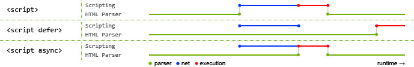
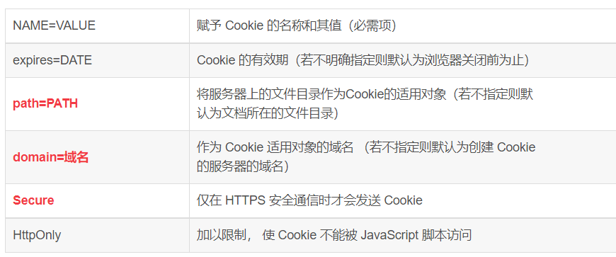
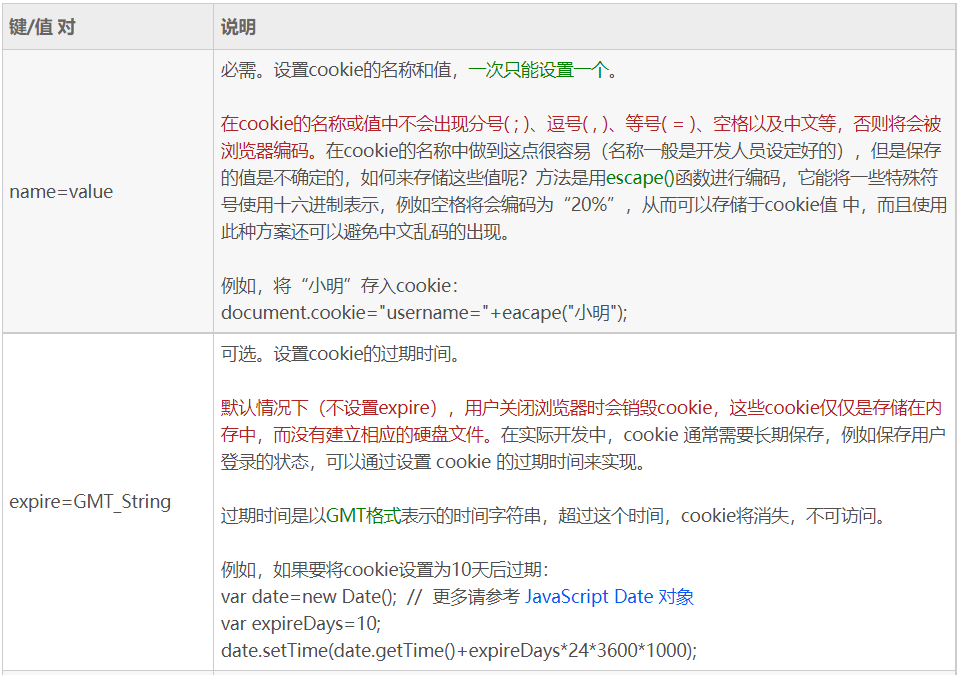
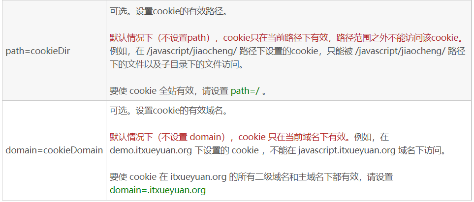
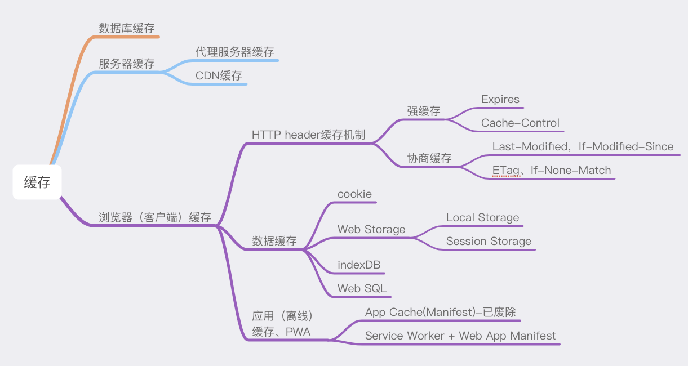
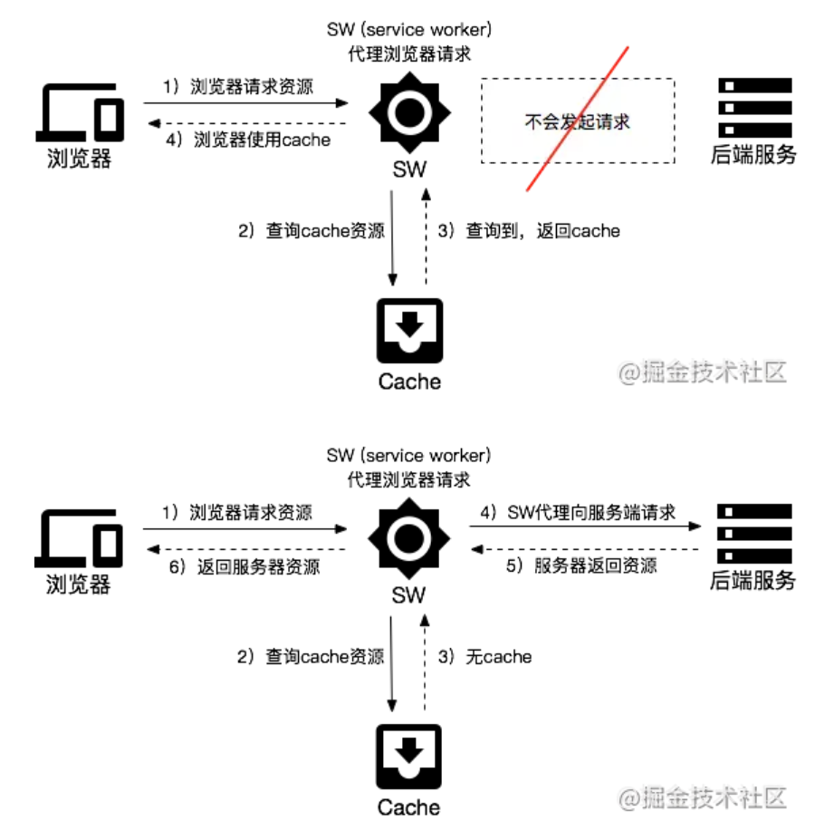
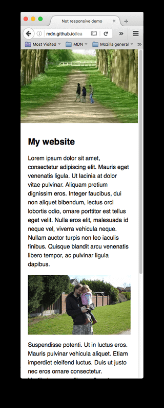

<!-- @import "[TOC]" {cmd="toc" depthFrom=2 depthTo=4 orderedList=false} -->

<!-- code_chunk_output -->

- [1. iframe框架及优缺点](#1-iframe框架及优缺点)
- [2. src和href的区别](#2-src和href的区别)
- [3. HTML语义化](#3-html语义化)
  - [3.1 语义化好处](#31-语义化好处)
  - [3.2 注意语义化编写](#32-注意语义化编写)
  - [3.3 常见的语义化标签](#33-常见的语义化标签)
- [4. DOCTYPE(⽂档类型) 的作⽤](#4-doctype文档类型-的作用)
  - [4.1 为什么HTML5只需要写`<!DOCTYPE HTML>`](#41-为什么html5只需要写doctype-html)
- [5. script标签中defer和async的区别](#5-script标签中defer和async的区别)
  - [load 与 DOMContentLoaded 的区别](#load-与-domcontentloaded-的区别)
- [6. head标签](#6-head标签)
- [6. meta标签](#6-meta标签)
- [7. HTML5有哪些更新](#7-html5有哪些更新)
  - [7.1 语义化标签](#71-语义化标签)
  - [7.2 媒体标签](#72-媒体标签)
  - [7.3 表单](#73-表单)
  - [7.4 进度条、度量器](#74-进度条-度量器)
  - [7.5 Web存储](#75-web存储)
  - [7.6 DOM操作](#76-dom操作)
  - [7.7 Drag API](#77-drag-api)
  - [7.8 web worker](#78-web-worker)
  - [其他](#其他)
  - [7.11 总结](#711-总结)
- [8. HTML5的离线储存](#8-html5的离线储存)
  - [缓存的一些应用场景](#缓存的一些应用场景)
  - [manifest](#manifest)
  - [PWA(Service Worker)](#pwaservice-worker)
- [9. img的srcset属性](#9-img的srcset属性)
- [10. label](#10-label)
- [11. 浏览器乱码的原因是什么？如何解决](#11-浏览器乱码的原因是什么如何解决)
- [12. `` 的 title 和 alt 属性的区别](#12-img-的-title-和-alt-属性的区别)
- [13. 懒加载](#13-懒加载)
- [常见标签](#常见标签)
- [前端优化](#前端优化)
  - [前端有哪些页面优化方法](#前端有哪些页面优化方法)
  - [前端SEO](#前端seo)
  - [单页应用的优缺点](#单页应用的优缺点)
  - [为什么说单页面的SEO不友好](#为什么说单页面的seo不友好)
  - [如何解决单页面SEO不友好的问题](#如何解决单页面seo不友好的问题)

<!-- /code_chunk_output -->

### 1. iframe框架及优缺点
https://github.com/WindrunnerMax/EveryDay/blob/master/HTML/Iframe%E6%A1%86%E6%9E%B6%E5%8F%8A%E4%BC%98%E7%BC%BA%E7%82%B9.md
iframe 元素会创建包含另外一个文档的内联框架（即**行内**框架，其实因为它有src属性，是替换元素）。

优点：
用来加载速度较慢的内容（如广告）
可以使脚本可以并行下载
可以实现跨子域通信

缺点：
iframe 会阻塞主页面的 onload 事件
无法被一些搜索引擎索识别
会产生很多页面，不容易管理

### 2. src和href的区别
关键：src 用于替换当前元素，href 用于在当前文档和引用资源之间确立联系。
1. src
src 是 source 的缩写，指向外部资源的位置，**指向的内容将会嵌入到文档中当前标签所在位置**；在请求 src 资源时会将其指向的资源下载并应用到文档内，例如 js 脚本，img 图片和 frame 等元素。这也是为什么将js脚本放在底部而不是头部。(src引用的外部资源不会阻塞渲染。)
  ``` <script src =”js.js”></script> ```
>img的加载不会阻塞html的解析，但img加载后并不渲染，它需要**等待Render Tree生成完后**才和Render Tree一起渲染出来。未下载完的图片需等下载完后才渲染。、

2. href
href 是 Hypertext Reference 的缩写，指向网络资源所在位置，建立和当前元素（锚点）或当前文档（链接）之间的链接，一般用于超链接. 如果在文档中添加 
  ``` <link href=”common.css” rel=”stylesheet”/> ```
那么浏览器会识别该文档为 css 文件，就会并行下载资源并且不会停止对当前文档的处理。 这也是为什么建议使用 link 方式来加载 css，而不是使用@import 方式。

### 3. HTML语义化
语义化是指根据内容的结构化（内容语义化），选择合适的标签（代码语义化）。通俗来讲就是用正确的标签做正确的事情。
语义化可以总结为 **根据内容选择标签，用最恰当的标签来标记内容**。
例如网页中的标题使用`<h1>~<h6>`这样的标签，而不是使用`<div>+css`。

为什么要进行语义化？
　　1，现在的开发基本上都是一个团队合作进行开发。这种情况下，我们写的代码不仅要让我们自己能看懂，而且也应该让别人也容易理解和阅读，要保证代码的可维护性，这一点很重要。但是在实际开发中，由于HTML的灵活性，以及CSS的强大，以至于实现同一种界面样式，不同的人写出来的代码可能实现方式都不太一样。实现糟糕的，可能全是div套div，这样的代码到时候维护的话可能就是一场灾难。这一点，个人觉得是最主要的因素。
　　2，和搜索引擎建立良好沟通，有助于爬虫抓取更多的有效信息
　　3，考虑到代码的可复用性，可移植性，方便其他设备的解析执行。移动设备、盲人阅读器等。

---
#### 3.1 语义化好处
- **使HTML结构变得清晰**，有利于维护代码和添加样式。
- 通常语义化HTML会使代码变的更少，使页面加载更快。
即使在没有CSS样式的条件下，也能很好地呈现出内容结构、代码结构。
- **便于团队开发和维护，语义化更具可读性**，遵循W3C标准，可以减少差异化。
- **方便其他设备解析**（如屏幕阅读器、盲人阅读器、移动设备）以意义的方式来渲染网页。
- **提升搜索引擎优化(SEO)的效果**。和搜索引擎建立良好沟通，有助于爬虫抓取更多的有效信息，爬虫可以依赖于标签来确定上下文和各个关键字的权重。

#### 3.2 注意语义化编写
- 尽可能少的使用无语义的标签`<div>`和`<span>`。
- 不要使用纯样式标签，如`<b>`是纯样式标签，而`<strong>`的语义为加粗。
- 在`<lable>`标签中设置for来让说明文本和相对应的`<input>`关联起来。
- 表单域要用`<fieldset>`标签包起来，并用`<legend>`标签说明表单的用途。
- 需要强调的文本，可以包含在strong或者em标签中，`<strong>`默认样式是加粗，`<em>`是斜体。
- 使用表格时，标题要用`<caption>`，表头用`<thead>`，主体部分用`<tbody>`包围，尾部用`<tfoot>`包围。表头和一般单元格要区分开，表头用`<th>`，单元格用`<td>`。

#### 3.3 常见的语义化标签
``` html
<header></header>  头部
<nav></nav>  导航栏
<section></section>  区块（有语义化的div）
<main></main>  主要区域
<article></article>  主要内容
<aside></aside>  侧边栏
<footer></footer>  底部
---
上面是H5

<h1>~<h6> 定义页面的标题，<h1>-<h6>元素等级依次降低

<ul> 表示项目的无序列表，通常呈现为项目符号列表。
<ol> 表示项目的有序列表，通常呈现为编号列表。
<li> 表示列表中的项目。

<strong> 表示强调突出重点内容，浏览器通常以粗体显示内容。
<em> 标记强调重点的文本，可以嵌套<em>元素，嵌套的每个级别都表示强调程度更高。
```
本质上新语义标签与`<div>`、`<span>`没有区别，只是其具有表意性，使用时除了在HTML结构上需要注意外，其它和普通标签的使用无任何差别，可以理解成`<div class="nav">` 相当于`<nav>`。
### 4. DOCTYPE(⽂档类型) 的作⽤
DOCTYPE是HTML5中一种标准通用标记语言的文档类型声明，它的目的**是告诉浏览器（解析器）应该以什么样（html或xhtml）的文档类型定义来解析文档**，不同的渲染模式会影响浏览器对 CSS 代码甚⾄ JavaScript 脚本的解析。它必须声明在HTML⽂档的第⼀⾏。

浏览器渲染页面的两种模式（可通过document.compatMode获取，比如，语雀官网的文档类型是CSS1Compat）：
- CSS1Compat：标准模式(严格模式)（Strick mode），默认模式，浏览器使用W3C的标准解析渲染页面。在标准模式中，浏览器以其支持的最高标准呈现页面。
- BackCompat：怪异模式(混杂模式)(Quick mode)，浏览器使用自己的怪异模式解析渲染页面。在怪异模式中，页面以一种比较宽松的**向后兼容**的方式显示。
>见 https://github.com/WindrunnerMax/EveryDay/blob/master/HTML/DOCTYPE.md

---
文档声明的作用：文档声明是为了告诉浏览器，当前HTML文档使用什么版本的HTML来写的，这样浏览器才能按照声明的版本来正确的解析。

`<!Doctype html>`的作用：`<!doctype html>` 的作用就是让浏览器进入标准模式，使用最新的 HTML5 标准来解析渲染页面；如果不写，浏览器就会进入混杂模式，我们需要避免此类情况发生。

严格模式与混杂模式的区分：
- 严格模式： 又称为标准模式，指浏览器按照W3C标准解析代码；
- 混杂模式： 又称怪异模式、兼容模式，是指浏览器用自己的方式解析代码。混杂模式通常模拟老式浏览器的行为，以防止老站点无法工作；

区分：网页中的DTD，直接影响到使用的是严格模式还是浏览模式，可以说DTD的使用与这两种方式的区别息息相关。
- 如果文档包含严格的DOCTYPE ，那么它一般以严格模式呈现（严格 DTD ——严格模式）；
- 包含过渡 DTD 和 URI 的 DOCTYPE ，也以严格模式呈现，但有过渡 DTD 而没有 URI （统一资源标识符，就是声明最后的地址）会导致页面以混杂模式呈现（有 URI 的过渡 DTD ——严格模式；没有 URI 的过渡 DTD ——混杂模式）；
- DOCTYPE 不存在或形式不正确会导致文档以混杂模式呈现（DTD不存在或者格式不正确——混杂模式）；
- HTML5 没有 DTD ，因此也就没有严格模式与混杂模式的区别，HTML5 有相对宽松的 法，实现时，已经尽可能大的实现了向后兼容(HTML5 没有严格和混杂之分)。

总之，严格模式让各个浏览器统一执行一套规范兼容模式保证了旧网站的正常运行。

#### 4.1 为什么HTML5只需要写`<!DOCTYPE HTML>`
HTML5不基于SGML(标准通用标记语言)，因此不需要对DTD进行引用，但是需要doctype来规范浏览器的行为。

### 5. script标签中defer和async的区别
如果没有defer或async属性，浏览器会立即加载并执行相应的脚本。它不会等待后续加载的文档元素，读取到就会开始加载和执行，这样就阻塞了后续文档的加载。

下图可以直观的看出三者之间的区别:

其中蓝色代表js脚本网络加载时间，红色代表js脚本执行时间，绿色代表html解析。

defer 和 async属性都是去异步加载外部的JS脚本文件，它们都不会阻塞页面的解析，其区别如下：
- 执行顺序：多个带async属性的标签，不能保证加载的顺序(谁先下载完了谁加载)；多个带defer属性的标签，按照加载顺序执行(都在最后执行)；
- 脚本是否并行执行：async属性，表示后续文档的加载和执行与js脚本的加载和执行是并行进行的，即异步执行；defer属性，加载后续文档的过程和js脚本的加载(此时仅加载不执行)是并行进行的(异步)，js脚本需要等到文档所有元素解析完成之后才执行，**DOMContentLoaded事件触发执行之前**。

---
- 都在页面 onload 之前执行
- 有 defer 属性的脚本会阻止 DOMContentLoaded 事件，直到脚本被加载并且解析完成。

- async 属性的脚本无法确定是在 DOMContentLoaded 事件触发之前或之后执行。defer 属性的脚本在 DOMContentLoaded 事件触发之前执行。async 属性的脚本并不一定会按照顺序执行（先加载完成先执行），defer 属性的脚本会按照顺序执行。

#### load 与 DOMContentLoaded 的区别
load :
当**整个页面及所有依赖资源如样式表和图片都已完成加载时**，将触发load事件。
它与DOMContentLoaded不同，后者只要页面DOM加载完成就触发，无需等待依赖资源的加载。

DOMContentLoaded :
当**初始的 HTML 文档被完全加载和解析完成之后**，DOMContentLoaded 事件被触发，而无需等待样式表、图像和子框架的完全加载。另一个不同的事件 load 应该仅用于检测一个完全加载的页面。

>**注意**： DOMContentLoaded 事件必须等待其所属 script 之前的样式表加载解析完成才会触发。

>作者：听见下雨声
链接：https://juejin.cn/post/6869314860245745678

### 6. head标签
`<head>` 标签用于定义文档的头部，它是所有头部元素的容器。`<head>` 中的元素可以引用脚本、指示浏览器在哪里找到样式表、提供元信息等。

文档的头部描述了文档的各种属性和信息，包括文档的标题、在 Web 中的位置以及和其他文档的关系等。绝大多数文档头部包含的数据都不会真正作为内容显示给读者。

下面这些标签可用在 head 部分：`<title>, <base>, <link>, <style>, <meta>, <script>, <noscript>, <command>`。 

其中 `<title>` 定义文档的标题，它是 head 部分中**唯一必需**的元素。

### 6. meta标签
meta 标签由 name 和 content 属性定义，用来描述网页文档的属性，比如网页的作者，网页描述，关键词等，除了HTTP标准固定了一些name作为大家使用的共识，开发者还可以自定义name。
提供给机器解读的一些元数据。页面搜索引擎优化，定义页面实用语言等等。

meta 元素定义的元数据的类型包括以下几种：
- 如果设置了 name 属性，meta 元素提供的是文档级别（document-level）的元数据，应用于整个页面。
- 如果设置了 http-equiv 属性，meta 元素则是编译指令，提供的信息与类似命名的HTTP头部相同。(属性定义了一个编译指示指令。这个属性叫做 http-equiv(alent) 是因为所有允许的值都是特定HTTP头部的名称)
- 如果设置了 charset 属性，meta 元素是一个字符集声明，告诉文档使用哪种字符编码。
- 如果设置了 itemprop 属性，meta 元素提供用户定义的元数据。

其中:
- http-equiv的值:
  >expires(过期时间)
  refresh(特定时间内自动刷新跳转)
  pragma(禁止浏览器从本地计算机缓存中访问页面内容no-cache)
  widows-target(设定页面在窗口中以独立页面展示，防止被当成frame页调用)
  set-cookie(自定义cooke)、
  ontent-Type(字符集)

- name的值:
  >keywords(关键字)
  description(主要内容)
  robots(none不被检索)
  author、generator(使用的制作软件)
  copyright
  viewport(适配移动端，可以控制视口的大小和比例)

### 7. HTML5有哪些更新
#### 7.1 语义化标签
header：定义文档的页眉（头部）；
nav：定义导航链接的部分；
footer：定义文档或节的页脚（底部）；
article：定义文章内容；
section：定义文档中的节（section、区段）；
aside：定义其所处内容之外的内容（侧边）；

##### 7.1.1 title与h1的区别、b与strong的区别、i与em的区别
- strong标签有语义，是起到加重语气的效果，而b标签是没有的，b标签只是一个简单加粗标签。b标签之间的字符都设为粗体，strong标签加强字符的语气都是通过粗体来实现的，而搜索引擎更侧重strong标签。
- title属性没有明确意义只表示是个标题，H1则表示层次明确的标题，对页面信息的抓取有很大的影响
- i内容展示为斜体，em表示强调的文本

#### 7.2 媒体标签
1. audio：音频
   ```html
   <audio src="music/yinyue.mp3" controls autoplay loop="true"></audio>
   ```
    我们可以通过附加属性，来更友好地控制音频的播放，如：
    - autoplay 自动播放。写成autoplay 或者 autoplay = ""，都可以。
    - controls 控制条。（建议把这个选项写上，不然都看不到控件在哪里）
    - loop 循环播放。
    - preload 预加载 同时设置 autoplay 时，此属性将失效。
  
    为了做到多浏览器支持，可以采取以下兼容性写法：
    ```html
    <!--推荐的兼容写法：-->
    <audio controls loop>
        <source src="music/yinyue.mp3"/>
        <source src="music/yinyue.ogg"/>
        <source src="music/yinyue.wav"/>
        抱歉，你的浏览器暂不支持此音频格式
    </audio>
    ```
    代码解释：如果识别不出音频格式，就弹出那句“抱歉”。
2. video视频
    ```html
    <video src='a.mp4' poster='imgs/aa.jpg' controls></video>
    ```
    我们可以通过附加属性，来更友好地控制视频的播放，如：
   - autoplay 自动播放。写成autoplay 或者 autoplay = ""，都可以。
   - controls 控制条。（建议把这个选项写上，不然都看不到控件在哪里）
   - loop 循环播放。
   - preload 预加载 同时设置 autoplay 时，此属性将失效。
   - width：设置播放窗口宽度。
   - height：设置播放窗口的高度。

   兼容性写法同上
3. source标签
因为浏览器对视频格式支持程度不一样，为了能够兼容不同的浏览器，可以通过source来指定源(见上面)。

#### 7.3 表单
##### 7.3.1 H5中新增的语义标签
- `email` 只能输入email格式。自动带有验证功能。

- `tel` 手机号码。

- `url` 只能输入url格式。

- `number` 只能输入数字。

- `search` 搜索框

- `range` 滑动条

- `color` 拾色器

- `time`	时间

- `date` 日期

- `datetime` 时间日期

- `month` 月份

- `week` 星期

上面的部分类型是针对移动设备生效的，且具有一定的兼容性，在实际应用当中可选择性的使用。
代码举例：
<form action="">
    <fieldset>
        <legend>表单类型</legend>
        <label for="">
            email: <input type="email" name="email" required placeholder="例如：a@a.com">
        </label>
        <label for="">
            color: <input type="color" name="color">
        </label>
        <label for="">
            url: <input type="url" name='url'>
        </label>
        <label for="">
            number: <input type="number" step="3" name="number">
        </label>
        <label for="">
            range: <input type="range" name="range" value="100">
        </label>
        <label for="">
            search: <input type="search" name="search">
        </label>
        <label for="">
            tel: <input type="tel" name="tel">
        </label>
        <label for="">
            time: <input type="time" name="time">
        </label>
        <label for="">
            date: <input type="date" name="date">
        </label>
        <label for="">
            datetime: <input type="datetime">
        </label>
        <label for="">
            week: <input type="week" name="month">
        </label>
        <label for="">
            month: <input type="month" name="month">
        </label>
        <label for="">
            datetime-local: <input type="datetime-local" name="datetime-local">
        </label>
        <input type="submit">
    </fieldset>
</form>

代码解释：
`<fieldset>` 标签将表单里的内容进行打包，代表一组；而`<legend> `标签的则是 fieldset 里的元素定义标题。

##### 7.3.2 表单属性

- `placeholder` 占位符（背景的灰色提示文字）

- `autofocus` 自动获取焦点

- `multiple` 文件上传多选或多个邮箱地址

- `autocomplete` 自动完成（填充的）。on 开启（默认），off 取消。用于表单元素，也可用于表单自身(on/off)

- `form` 指定表单项属于哪个form，处理复杂表单时会需要

- `novalidate` 关闭默认的验证功能（只能加给form）

- `required` 表示必填项

- `pattern` 自定义正则，验证表单。例如

##### 7.3.3 表单事件

- `oninput()`：用户输入内容时触发，可用于输入字数统计。

- `oninvalid()`：验证不通过时触发。比如，如果验证不通过时，想弹出一段提示文字，就可以用到它。

>https://github.com/qianguyihao/Web/blob/master/01-HTML/08-HTML5%E8%AF%A6%E8%A7%A3.md

#### 7.4 进度条、度量器
- progress标签：用来表示任务的进度（IE、Safari不支持），max用来表示任务的进度，value表示已完成多少
- meter属性：用来显示剩余容量或剩余库存（IE、Safari不支持）
  * high/low：规定被视作高/低的范围
  * max/min：规定最大/小值
  * value：规定当前度量值

设置规则：min < low < high < max

#### 7.5 Web存储
HTML5 提供了两种在客户端存储数据的新方法：
- localStorage - 没有时间限制的数据存储
- sessionStorage - 针对一个 session 的数据存储

使用HTML5可以在本地存储用户的浏览数据，localStorage和sessionStorage是HTML5提供的对于Web存储的解决方案。

``` css {.line-numbers}
// 储存数据
localStorage.setItem('key', 'value');
sessionStorage.setItem('key', 'value');

// 读取数据
localStorage.getItem('key');
sessionStorage.getItem('key');

// 删除数据
localStorage.removeItem('key');
sessionStorage.removeItem('key');

// 清空数据
localStorage.clear();
sessionStorage.clear();
```
>详见 浏览器原理 &
https://github.com/WindrunnerMax/EveryDay/blob/master/HTML/LocalStorage%E4%B8%8ESessionStorage.md

##### 7.5.1 如何设置localStorage的存储时间
- 重写 set(存入) 方法：
存入的值由原本的value改为对象，增加属性：time，对应过期时间。因为localStrorage值不能为对象，所以用json（JSON.stringify）转化。
- 重写 get(获取) 方法：
JSON.parse取出，判断
>http://www.fly63.com/article/detial/1348
>https://blog.csdn.net/weixin_43254766/article/details/83618630

##### 7.5.2 浏览器本地存储方式及使用场景

###### 7.5.2.1 Cookie
Cookie是最早被提出来的本地存储方式，在此之前，服务端是无法判断网络中的两个请求是否是同一用户发起的，为解决这个问题，Cookie就出现了。Cookie的大小只有4kb，它是一种纯文本文件，每次发起HTTP请求都会携带Cookie。

**Cookie的特性：**
- Cookie一旦创建成功，名称就无法修改
- Cookie是无法跨域名的，也就是说a域名和b域名下的- cookie是无法共享的，这也是由Cookie的隐私安全性决定的，这样就能够阻止非法获取其他网站的Cookie
- 每个域名下Cookie的数量不能超过20个，每个Cookie的大小不能超过4kb
- 有安全问题，如果Cookie被拦截了，那就可获得session的所有信息，即使加密也于事无补，无需知道cookie的意义，只要转发cookie就能达到目的
- Cookie在请求一个新的页面的时候都会被发送过去

如果需要域名之间跨域共享Cookie：
1. 使用Nginx反向代理
2. 在一个站点登陆之后，往其他网站写Cookie。服务端的Session存储到一个节点，Cookie存储sessionId

浏览器所持有的 Cookie 分为两种：
- Session Cookie(会话期 Cookie)：会话期 Cookie 是最简单的Cookie，它不需要指定过期时间（Expires）或者有效期（Max-Age），它仅在会话期内有效，浏览器关闭之后它会被自动删除。
- Permanent Cookie(持久性 Cookie)：与会话期 Cookie 不同的是，持久性 Cookie 可以指定一个特定的过期时间（Expires）或有效期（Max-Age）。

**Cookie的使用场景**：
- 最常见的使用场景就是Cookie和session结合使用，我们**将sessionId存储到Cookie中**，每次发请求都会携带这个sessionId，这样服务端就知道是谁发起的请求，从而响应相应的信息。
- 可以用来统计页面的点击次数

**Cookie的跨域问题**

Access-Control-Allow-Credentials 是否允许客户端发送请求时携带cookie

- A客户端写：withCredentials:true;
- B服务器端写：Access-Control-Allow-Credentials:true;

客户端
```js
var xhr = new XMLHttpRequest();
xhr.open("GET", "http://aaa.cn/localserver/api/corsTest");
xhr.withCredentials = true; // 设置跨域 Cookie
xhr.send();
```

服务端
```js
config.cors = {
    // origin: '*',
    // origin: 'http://127.0.0.1:9384',
    origin(ctx) {
      // return "*"; // 允许来自所有域名请求
      // return ctx.header.origin;// 当*无法使用时，使用这句,同样允许所有跨域
      // return 'http://localhost:8080'; //单个跨域请求
      // 允许多个跨域
      const allowCors = [
        'http://localhost:9384',
        'http://127.0.0.1:9384',
        'http://172.16.92.62:9384',
      ];
      return allowCors.indexOf(ctx.header.origin) > -1 ? ctx.header.origin : '';
    },
    credentials: true, // 前台可以携带cookies 无此选项的话，还是上面的跨域
    allowMethods: 'GET,HEAD,PUT,POST,DELETE,PATCH,OPTIONS',
  };
```
---
```js
@Override
public void doFilter(ServletRequest servletRequest, ServletResponse servletResponse, FilterChain filterChain) throws IOException, ServletException {
    System.out.println("work");
    HttpServletResponse response = (HttpServletResponse) servletResponse;
    response.setHeader("Access-Control-Allow-Origin", "*");
    response.setHeader("Access-Control-Allow-Methods", "POST, GET");
    response.setHeader("Access-Control-Max-Age", "3600");
    response.setHeader("Access-Control-Allow-Credentials", "true");
    response.setHeader("Access-Control-Allow-Headers", "Content-Type, Access-Control-Allow-Headers, Authorization, X-Requested-With");
    filterChain.doFilter(servletRequest, servletResponse);
}
```

此外还可能有SameSite问题(Chrome 80之后，该功能默认已开启)

1. 将SameSite属性值改为None, 同时 将secure属性设置为true。且需要将后端服务域名必须使用https协议访问。
2. 由于设置SameSite = None，有CSRF风险，所以，最佳方案是用token代替Cookie方式作验证。

>[COOKIE跨域获取问题](https://segmentfault.com/a/1190000039227924)
[Cookie 的 SameSite 属性](https://www.ruanyifeng.com/blog/2019/09/cookie-samesite.html)

---
1. 讲一下cookie？
  我的理解是 cookie 是服务器提供的一种用于**维护会话状态信息**的数据，通过服务器发送到浏览器，浏览器保存在本地的一种纯文本文件，当下一次有同源的请求时，将保存的 cookie 值添加到请求头部，发送给服务端。这可以用来实现记录用户登录状态等功能。cookie 一般可以存储 4k 大小的数据，并且只能够被同源的网页所共享访问。

    服务器端可以使用 Set-Cookie 的响应头部来配置 cookie 信息。一条cookie 包括了属性值 name、expires、domain、path、secure、HttpOnly、SameSite。其中 expires 指定了 cookie 失效的时间，domain 是域名、path是路径，domain 和 path 一起限制了 cookie 能够被哪些 url 访问。secure 规定了 cookie 只能在确保安全的情况下传输，HttpOnly 规定了这个 cookie 只能被服务器访问，不能在客户端使用js 脚本访问。
    客户端可以通过JS脚本,例如document.cookie="key=value"形式设置cookie

    在发生 xhr 的**跨域**请求的时候，即使是同源下的 cookie，**也不会被自动添加到请求头部**，除非显示地规定。

2. session是什么?
session是服务器为了保存用户状态而创建的一个特殊的对象

    在浏览器第一次访问服务器时,服务器会创建一个session对象,该对象有一个唯一的id,即sessionid,服务器会把sessionid以cookie的形式发送给浏览器,当浏览器再次访问服务器时,会携带cookie在请求头,可以通过cookie中的sessionid来访问session对象
    可以实现在http无状态基础上实现用户状态管理(即**两个页面之间的用户状态**,我可以保存在session中)

>作者：但愿不头疼
链接：https://www.nowcoder.com/discuss/648552?channel=-1&source_id=profile_follow_post_nctrack

**什么情况下会带上cookie**

Set-Cookie响应头字段（Response header）是服务器发送到浏览器或者其他客户端的一些信息，一般用于登陆成功的情况下返回给客户端的凭证信息，然后下次请求时会带上这个cookie，这样服务器端就能知道是来自哪个用户的请求了。

Cookie请求头字段是客户端发送请求到服务器端时发送的信息（满足一定条件下浏览器自动完成，无需前端代码辅助）。

下表为Set-Cookie响应头可以设置的属性



请看上面标红的三个属性，拿一个Http POST请求来说  http://aaa.www.com/xxxxx/list

如果满足下面几个条件：

1. 浏览器端某个Cookie的domain字段等于 aaa.www.com 或者 www.com(包括子域名)

2. 都是http或者https，或者不同的情况下Secure属性为false

3. 要发送请求的路径，即上面的xxxxx跟浏览器端Cookie的path属性必须一致，或者是浏览器端Cookie的path的子目录，比如浏览器端Cookie的path为/test，那么xxxxxxx必须为/test或者/test/xxxx等子目录才可以


注：
上面3个条件**必须同时满足**，否则该Post请求就不能自动带上浏览器端已存在的Cookie

>https://blog.csdn.net/john1337/article/details/104571244

---



**注意**
- 如果不设过期时间，这个cookie称为 Session Cookie ，存在内存（进程）中，将会一直存在直到**关闭浏览器（或关闭页面）**，关闭浏览器进程结束就不存在了.（在不设置过期时间的情况下，这个是默认值）
session在客户端是靠cookie维持的。

- 关于domian前面带不带`.`
  前导点表示Cookie也对子域有效；但是，最近的HTTP规范（RFC 6265）更改了此规则，因此**现代浏览器不应在意前导点**。实施不推荐使用的RFC 2109的旧浏览器可能需要该点。

- 服务器 a.b.com 只能设置domain为 a.b.com 或者 b.com

**设置cookie**

通过JS设置
```js
// 一次只能设置一对键值，但不像传统的JS一般，不会覆盖（设置这个属性可以增加条目而不是覆盖）
document.cookie = 'name=xxx;';

// 也可以一次性设置许多值
 document.cookie=" name=value ; expire=GMT_String ; path=cookieDir ; domain=cookieDomain "
```

e.g.
```js
var username="小明";
var password="123456";
var expire=(new Date()).getTime()+1000*3600*24*30;

// 对 cookie 的值进行编码：
document.cookie = " username=" + encodeURIComponent(username) + " expire=" + expire + " ; path=/ ; domain=.itxueyuan.org ";
document.cookie = " password=" + encodeURIComponent(password) + " expire=" + expire + " ; path=/ ; domain=.itxueyuan.org ";
```

服务端设置（node）
```js
res.setHeader('Set-Cookie', 'name=xxx;');
```

修改cookie
```js
// 修改 cookie 直接覆盖就行
document.cookie = 'name=xxx;';
```

删除cookie
```js
// 直接把 expires 参数设置为过去的日期即可：
document.cookie = "username=; expires=Thu, 01 Jan 1970 00:00:00 UTC; path=/;";
```

###### token (补充)

当用户发送请求，将用户信息带给服务器的时候，服务器不再像过去一样存储在 session 中，而是将浏览器发来的内容通过内部的密钥加上这些信息，使用 sha256 和 RSA 等加密算法生成一个 token 令牌和用户信息一起返回给浏览器，当涉及验证用户的所有请求只需要将这个 token 和用户信息发送给服务器，而服务器将用户信息和自己的密钥通过既定好的算法进行签名，然后将发来的签名和生成的签名比较，严格相等则说明用户信息没被篡改和伪造，验证通过。
JWT 的过程中，服务器**不再需要额外的内存存储用户信息（Session）**，和多个服务器之间只需要共享密钥就可以让多个服务器都有验证能力，同时也解决了 **cookie 不能跨域**的问题。

---
JWT 认证流程：

- 用户输入用户名/密码登录，服务端认证成功后，会返回给客户端一个 JWT(包含用户id 过期时间 权限等信息和签名)
- 客户端将 token 保存到本地（通常使用 localstorage，也可以使用 cookie）
- 当用户希望访问一个受保护的路由或者资源的时候，需要请求头的 Authorization 字段中使用Bearer 模式添加 JWT.

---
作者：刀剑丛中闯
链接：https://www.nowcoder.com/discuss/649717?source_id=profile_create_nctrack&channel=-1

JWT的组成
- header-----加密算法，类型-----进行base64
- payload-----标准声明(签发者-面向用户-接收方-过期时间等等)、公共声明(任意信息，因为可以被解密，不要放敏感信息)、私有声明(JWT提供者添加，可以被解密，不能存放敏感信息。)----通过base64
- Signature----加密算法(header+'.'+payload+secret)
  
验证(我疑惑的点)：解析JWT以后可以知道用户信息，比如能拿到uuid就能通过了？
JWT防止篡改：Signature，再通过Signature的生成一次，对比就能知道，服务器的secret不能泄漏
为了防止csrf就不要放在cookie中，
还有个问题，如果token被截取到了又怎么办（有特殊场景可以把用户的user-agent(干扰码，每个客户端不一样，就不能解析别的token)和ip放进token进行验证？或者https？想不到别的了）
Token - 服务端身份验证的流行方案：这篇有讲上面的问题


>看 [JSON Web Token 入门教程](http://www.ruanyifeng.com/blog/2018/07/json_web_token-tutorial.html)
https://juejin.cn/post/6844903682501246983
https://juejin.cn/post/6844904034181070861#heading-25

###### 7.5.2.2 LocalStorage
LocalStorage是HTML5新引入的特性，由于有的时候我们存储的信息较大，Cookie就不能满足我们的需求，这时候LocalStorage就派上用场了。

**LocalStorage的优点**：
- 在大小方面，LocalStorage的大小一般为5MB，可以储存更多的信息
- LocalStorage是持久储存，并不会随着页面的关闭而消失，除非主动清理，不然会永久存在
- 仅储存在本地，不像Cookie那样每次HTTP请求都会被携带

**LocalStorage的缺点**：
- 存在浏览器兼容问题，IE8以下版本的浏览器不支持
- 如果浏览器设置为隐私模式，那我们将无法读取到LocalStorage
- LocalStorage受到**同源策略**的限制，即端口、协议、主机地址有任何一个不相同，都不会访问
  >和cookie的domain属性不同，LocalStorage中子域名也不可以访问。要想访问要跨域（postMessage）
  
>  稍后 [localstorage的跨域存储方案](https://www.jianshu.com/p/e86d92aeae69)

**LocalStorage的使用场景**：
- 有些网站有换肤的功能，这时候就可以将换肤的信息存储在本地的LocalStorage中，当需要换肤的时候，直接操作LocalStorage即可
- 在网站中的用户浏览信息也会存储在LocalStorage中，还有网站的一些不常变动的个人信息等也可以存储在本地的LocalStorage中
- 购物车？
- 鉴权的token也可以存在localStorage中

###### 7.5.2.3 SessionStorage
SessionStorage和LocalStorage都是在HTML5才提出来的存储方案，SessionStorage 主要用于临时保存同一窗口(或标签页)的数据，**刷新页面时不会删除**，关闭窗口或标签页之后将会删除这些数据。

>注意与vuex的区别，vuex中数据刷新会删除。
因为store里的数据是保存在运行内存中的,当页面刷新时，页面会重新加载vue实例，store里面的数据就会被重新赋值初始化

**SessionStorage与LocalStorage对比**：
- SessionStorage和LocalStorage都在本地进行数据存储；
- SessionStorage也有同源策略的限制，但是SessionStorage有一条更加严格的限制，SessionStorage只有在**同一浏览器的同一窗口下才能够共享**；
  >同一浏览器的相同域名和端口的不同页面间可以共享相同的 localStorage，但是**不同页面间无法共享sessionStorage**的信息。
- LocalStorage和SessionStorage都不能被爬虫爬取；

---
**作用域不同**
不同浏览器无法共享localStorage或sessionStorage中的信息。相同浏览器的**不同页面间可以共享相同的 localStorage**（页面属于相同域名和端口），但是不同页面或标签页间无法共享sessionStorage的信息。这里需要注意的是，页面及标签页仅指顶级窗口，如果一个标签页包含多个iframe标签且他们属于同源页面，那么他们之间是可以共享sessionStorage的。
注：Cookie也可以共享。


**SessionStorage的使用场景**
- 由于SessionStorage具有时效性，所以可以用来存储一些网站的游客登录的信息，还有临时的浏览记录的信息。当关闭网站之后，这些信息也就随之消除了。

#### 7.6 DOM操作
##### 7.6.1 获取元素
- document.querySelector("selector") 通过CSS选择器获取符合条件的第一个元素。
- document.querySelectorAll("selector")  通过CSS选择器获取符合条件的所有元素，以类数组形式存在。

##### 7.6.2 类名操作
- Node.classList.add("class") 添加class
- Node.classList.remove("class") 移除class
- Node.classList.toggle("class") 切换class，有则移除，无则添加
- Node.classList.contains("class") 检测是否存在class

##### 7.6.3 自定义属性
js 里可以通过 `box1.index=100;`  `box1.title` 来自定义属性和获取属性。

H5可以直接在标签里添加自定义属性，**但必须以 `data-` 开头**。

它初衷是数据应与特定的元素相关联，但不需要任何定义。data-* 属性允许我们在标准内于HTML元素中存储额外的信息，而不需要使用类似于 classList，标准外属性，DOM额外属性或是 setUserData 之类的技巧。

举例：

```html
<!DOCTYPE html>
<html>
<head lang="en">
    <meta charset="UTF-8">
    <title></title>
</head>
<body>
<!-- 给标签添加自定义属性 必须以data-开头 -->
<div class="box" title="盒子" data-my-name="smyhvae" data-content="我是一个div">div</div>
<script>
    var box = document.querySelector('.box');

    //自定义的属性 需要通过 dateset[]方式来获取
    console.log(box.dataset["content"]);  //打印结果：我是一个div
    console.log(box.dataset["myName"]);    //打印结果：smyhvae

    //设置自定义属性的值
    var num = 100;
    num.index = 10;
    box.index = 100;
    box.dataset["content"] = "aaaa";

</script>
</body>
</html>
```

#### 7.7 Drag API
拖放是一种常见的特性，即捉取对象以后拖到另一个位置，在`HTML5`中，拖放是标准的一部分，任何元素都能够拖放。

示例:
```html
<!-- 设置元素可拖放： draggable="true" -->
<div draggable="true" ondragstart="drag(event)">Drag</div>
<script type="text/javascript">
    function drag(e){
        console.log(e);
    }
</script>
```

事件:
* `ondrag`: 当拖动元素或选中的文本时触发。
* `ondragend`: 当拖拽操作结束时触发，例如松开鼠标按键或敲`Esc`键。
* `ondragenter`: 当拖动元素或选中的文本到一个可释放目标时触发。
* `ondragexit`: 当元素变得不再是拖动操作的选中目标时触发。
* `ondragleave`: 当拖动元素或选中的文本离开一个可释放目标时触发。
* `ondragover`: 当元素或选中的文本被拖到一个可释放目标上时触发，每`100`毫秒触发一次。
* `ondragstart`: 当用户开始拖动一个元素或选中的文本时触发。
* `ondrop`: 当元素或选中的文本在可释放目标上被释放时触发。

#### 7.8 web worker
在 HTML 页面中，如果在执行脚本时，页面的状态是不可相应的，直到脚本执行完成后，页面才变成可相应。web worker 是运行在后台的 js，独立于其他脚本，不会影响页面的性能。 并且通过 postMessage 将结果回传到主线程。这样在进行复杂操作的时候，就不会阻塞主线程了。 

---
workers和主线程间的数据传递通过这样的消息机制进行——双方都使用postMessage()方法发送各自的消息，
使用onmessage事件处理函数来响应消息（消息被包含在Message事件的data属性中）,
这个过程中数据并不是被共享而是被复制。

创建 web worker： 
` var worker = new Worker('worker.js'); `

**作用**
个人觉得，Web Worker我们可以当做计算器来用，需要用的时候掏出来摁一摁，不用的时候一定要收起来~

- 加密数据
有些加解密的算法比较复杂，或者在加解密很多数据的时候，这会非常耗费计算资源，导致UI线程无响应，因此这是使用Web Worker的好时机，使用Worker线程可以让用户更加无缝的操作UI。
- 预取数据
有时候为了提升数据加载速度，可以提前使用Worker线程获取数据，因为Worker线程是可以是用 XMLHttpRequest 的。
- 预渲染
在某些渲染场景下，比如渲染复杂的canvas的时候需要计算的效果比如反射、折射、光影、材料等，这些计算的逻辑可以使用Worker线程来执行，也可以使用多个Worker线程，这里有个射线追踪的示例。
- 复杂数据处理场景
某些检索、排序、过滤、分析会非常耗费时间，这时可以使用Web Worker来进行，不占用主线程。
- 预加载图片
有时候一个页面有很多图片，或者有几个很大的图片的时候，如果业务限制不考虑懒加载，也可以使用Web Worker来加载图片，可以参考一下这篇文章的探索，这里简单提要一下。

```js
// 主线程
let w = new Worker("js/workers.js");
w.onmessage = function (event) {
  var img = document.createElement("img");
  img.src = window.URL.createObjectURL(event.data);
  document.querySelector('#result').appendChild(img)
}

// worker线程
let arr = [...好多图片路径];
for (let i = 0, len = arr.length; i < len; i++) {
    let req = new XMLHttpRequest();
    req.open('GET', arr[i], true);
    req.responseType = "blob";
    req.setRequestHeader("client_type", "DESKTOP_WEB");
    req.onreadystatechange = () => {
      if (req.readyState == 4) {
      postMessage(req.response);
    }
  }
  req.send(null);
}
```

**注意**
web worker**子线程完全受主线程控制，且不得操作DOM**。所以这个新标准没有改变JS单线程的本质。

>https://zhuanlan.zhihu.com/p/79484282
http://www.ruanyifeng.com/blog/2018/07/web-worker.html

#### 其他
- 画布（canvas ）： canvas 元素使用 JavaScript 在网页上绘制图像。画布是一个矩形区域，可以控制其每一像素。canvas 拥有多种绘制路径、矩形、圆形、字符以及添加图像的方法。
  ```html
  <canvas id="myCanvas" width="200" height="100"></canvas>
  ```
- SVG：SVG 指可伸缩矢量图形，用于定义用于网络的基于矢量的图形，使用 XML 格式定义图形，图像在放大或改变尺寸的情况下其图形质量不会有损失，它是万维网联盟的标准
- 地理定位：Geolocation（地理定位）用于定位用户的位置。

---
Canvas和SVG的区别
（1）SVG：
SVG可缩放矢量图形（Scalable Vector Graphics）是基于可扩展标记语言XML描述的2D图形的语言，SVG基于XML就意味着SVG DOM中的每个元素都是可用的，可以为某个元素附加Javascript事件处理器。在 SVG 中，每个被绘制的图形均被视为对象。如果 SVG 对象的属性发生变化，那么浏览器能够自动重现图形。

其特点如下：
不依赖分辨率
支持事件处理器
最适合带有大型渲染区域的应用程序（比如谷歌地图）
复杂度高会减慢渲染速度（任何过度使用 DOM 的应用都不快）
不适合游戏应用

（2）Canvas：
Canvas是画布，通过Javascript来绘制2D图形，是逐像素进行渲染的。其位置发生改变，就会重新进行绘制。

其特点如下：
依赖分辨率
不支持事件处理器
弱的文本渲染能力
能够以 .png 或 .jpg 格式保存结果图像
最适合图像密集型的游戏，其中的许多对象会被频繁重绘

注：矢量图，也称为面向对象的图像或绘图图像，在数学上定义为一系列由线连接的点。矢量文件中的图形元素称为对象。每个对象都是一个自成一体的实体，它具有颜色、形状、轮廓、大小和屏幕位置等属性。

#### 7.11 总结
总结：
（1）新增语义化标签：nav、header、footer、aside、section、article
（2）音频、视频标签：audio、video
（3）数据存储：localStorage、sessionStorage
（4）canvas（画布）、Geolocation（地理定位）、websocket（通信协议）
（5）input标签新增属性：placeholder、autocomplete、autofocus、required
（6）history API：go、forward、back、pushstate
 (7) DOM 操作：querySelector，classList

移除的元素有：
纯表现的元素：basefont，big，center，font, s，strike，tt，u;
对可用性产生负面影响的元素：frame，frameset，noframes；

### 8. HTML5的离线储存



#### 缓存的一些应用场景
1、每次都加载某个同样的静态文件 => 浪费带宽，重复请求 => 让浏览器使用本地缓存（协商缓存，返回304）
2、协商缓存还是要和服务器通信啊 => 有网络请求，不太舒服，感觉很low => 强制浏览器使用本地强缓存（返回200）
3、缓存要更新啊，兄弟，网络请求都没了，我咋知道啥时候要更新？=> 让请求（header加上ETag）或者url的修改与文件内容关联（文件名加哈希值）=> 开心，感觉自己很牛逼
>注意：强缓存的更新方式
或者通过同步更新文件名（比如，style-v1.css , style-v2.css）

4、CTO大佬说，我们买了阿里还是腾讯的CDN，几百G呢，用起来啊 => 把静态资源和动态网页分集群部署，静态资源部署到CDN节点上，网页中引用的资源变成对应的部署路径 => html中的资源引用和CDN上的静态资源对应的url地址联系起来了 => 问题来了，更新的时候先上线页面，还是先上线静态资源？（蠢，等到半天三四点啊，用户都睡了，随便你先上哪个）
5、老板说：我们的产品将来是国际化的，不存在所谓的半夜三点 => GG，咋办？=> 用非覆盖式发布啊，用文件的摘要信息来对资源文件进行重命名，把摘要信息放到资源文件发布路径中，这样，内容有修改的资源就变成了一个新的文件发布到线上，不会覆盖已有的资源文件。上线过程中，先全量部署静态资源，再灰度部署页面

#### manifest
**（已经被web标准废除）**
离线存储指的是：在用户没有与因特网连接时，可以正常访问站点或应用，在用户与因特网连接时，更新用户机器上的缓存文件。

**原理**：HTML5的离线存储是基于一个新建的 .appcache 文件的缓存机制(不是存储技术)，通过这个文件上的解析清单离线存储资源，这些资源就会像cookie一样被存储了下来。之后当网络在处于离线状态下时，浏览器会通过被离线存储的数据进行页面展示

**使用方法**：
1. 创建一个和 html 同名的 manifest 文件，然后在页面头部加入 manifest 属性：
    ```html
    <html lang="en" manifest="index.manifest">
    ```
2. 在 `cache.manifest `文件中编写需要离线存储的资源： 
     ```
    CACHE MANIFEST
    #v0.11
    CACHE:
    js/app.js
    css/style.css
    NETWORK:
    resourse/logo.png
    FALLBACK:
    / /offline.html
    ```
   - CACHE: 表示需要离线存储的资源列表，由于包含 manifest 文件的页面将被自动离线存储，所以不需要把页面自身也列出来。
   - NETWORK: 表示在它下面列出来的资源只有在在线的情况下才能访问，他们不会被离线存储，所以在离线情况下无法使用这些资源。不过，如果在 CACHE 和 NETWORK 中有一个相同的资源，那么这个资源还是会被离线存储，也就是说 CACHE 的优先级更高。
   - FALLBACK: 表示如果访问第一个资源失败，那么就使用第二个资源来替换他，比如上面这个文件表示的就是如果访问根目录下任何一个资源失败了，那么就去访问 offline.html 。
3. 在离线状态时，操作 `window.applicationCache` 进行离线缓存的操作。

**如何更新缓存**：
 （1）更新 manifest 文件
 （2）通过 javascript 操作
 （3）清除浏览器缓存

**注意事项**：
 （1）浏览器对缓存数据的容量限制可能不太一样（某些浏览器设置的限制是每个站点 5MB）。
 （2）如果 manifest 文件，或者内部列举的某一个文件不能正常下载，整个更新过程都将失败，浏览器继续全部使用老的缓存。
 （3）引用 manifest 的 html 必须与 manifest 文件同源，在同一个域下。
 （4）FALLBACK 中的资源必须和 manifest 文件同源。
 （5）当一个资源被缓存后，该浏览器直接请求这个绝对路径也会访问缓存中的资源。
 （6）站点中的其他页面即使没有设置 manifest 属性，请求的资源如果在缓存中也从缓存中访问。
 （7）当 manifest 文件发生改变时，资源请求本身也会触发更新。

 #### 8.1 浏览器是如何对 HTML5 的离线储存资源进行管理和加载的
 - **在线的情况下**，浏览器发现 html 头部有 manifest 属性，它会请求 manifest 文件，如果是第一次访问页面 ，那么浏览器就会根据 manifest 文件的内容下载相应的资源并且进行离线存储。如果已经访问过页面并且资源已经进行离线存储了，那么浏览器就会使用离线的资源加载页面，然后浏览器会对比新的 manifest 文件与旧的 manifest 文件，如果文件没有发生改变，就不做任何操作，如果文件改变了，就会重新下载文件中的资源并进行离线存储。
- **离线的情况下**，浏览器会直接使用离线存储的资源。

>Manifest被移除是技术发展的必然，请拥抱Service Worker吧

#### PWA(Service Worker)
这位目前是最炙手可热的缓存明星，是官方建议替代Application Cache（Manifest）的方案
作为一个独立的线程，是一段在后台运行的脚本，可使web app也具有类似原生App的离线使用、消息推送、后台自动更新等能力.

PWA，即Progressive Web App, 是提升 Web App 的体验的一种新方法，能给用户原生应用的体验。，PWA并不是某一项特定的技术，而是一系列Web新技术与新标准的集合。通过灵活运用这些标准与技术，可以让我们的用户获得渐进增强的体验。所以，其实PWA本质上依然是一个Web App。

目前有三个限制（不能明说是缺点）

- 不能访问 DOM
- 不能使用同步 API
- 需要HTTPS协议
>https://github.com/amandakelake/blog/issues/43

##### Service Worker

PWA其中一个令人着迷的能力就是离线（offline）可用。

离线只是它的一种功能表现而已，具体说来，它可以：

- 让我们的Web App在无网（offline）情况下可以访问，甚至使用部分功能，而不是展示“无网络连接”的错误页；
- 让我们在弱网的情况下，能使用缓存快速访问我们的应用，提升体验；
- 在正常的网络情况下，也可以通过各种自发控制的缓存方式来节省部分请求带宽；
- ……

而这一切，其实都要归功于PWA背后的英雄 —— Service Worker。
那么，Service Worker是什么呢？你可以把Service Worker简单理解为一个独立于前端页面，在后台运行的进程。因此，它不会阻塞浏览器脚本的运行，同时也无法直接访问浏览器相关的API（例如：DOM、localStorage等）。此外，即使在离开你的Web App，甚至是关闭浏览器后，它仍然可以运行。它就像是一个在Web应用背后默默工作的勤劳小蜜蜂，处理着缓存、推送、通知与同步等工作。所以，要学习PWA，绕不开的就是Service Worker。

---
有了本地的cache还不够，我们还需要能够有效地使用缓存、更新缓存与清除缓存，进一步应用各种个性化的缓存策略。

Service Worker有一个非常重要的特性：你可以在Service Worker中监听所有客户端（Web）发出的请求，然后通过Service Worker来代理，向后端服务发起请求。通过监听用户请求信息，Service Worker可以决定是否使用缓存来作为Web请求的返回。

.png)



>作者：AlienZHOU
链接：https://juejin.cn/post/6844903588691443725

---
Service worker除了针对PWA（推送和消息）以外，对普通web来说，在缓存方面，能比http缓存带来一些额外的好处。
 可以理解为，SW就是浏览器把缓存管理开放一层接口给开发者。

1、改写默认行为。
例如，浏览器默认在刷新时，会对所有资源都重新发起请求，即使缓存还是有效期内，而使用了SW，就可以改写这个行为，直接返回缓存。（**前端可以手动控制缓存**，而不用像http缓存一样全交给后端）

2、缓存和更新并存。
要让网页离线使用，就需要整站使用长缓存，包括HTML。而HTML使用了长缓存，就无法及时更新（浏览器没有开放接口直接删除某个html缓存）。而使用SW就可以，每次先使用缓存部分，然后再发起SW js的请求，这个请求我们可以实施变更，修改HTML版本，重新缓存一份。那么用户下次打开就可以看到新版本了。

3、无侵入式。
无侵入式版本控制。最优的版本控制，一般是HTML中记录所有js css的文件名（HASH），然后按需发起请求。每个资源都长缓存。而这个过程，就需要改变了项目结构，至少多一个js或者一段js控制版本号，发起请求时还需要url中注入冬天的文件名。使用了SW，就可以把这部分非业务逻辑整合到sw js中。
 无侵入式请求统计。例如缓存比例统计、图片404统计。

4、额外缓存。
HTTP缓存空间有限，容易被冲掉。虽然部分浏览器实现SW的存储也有淘汰机制，但多一层缓存，命中的概率就要更高了。

5、离线处理。
当监测到离线，而且又没有缓存某个图片时，可以做特殊处理，返回离线的提示。又或者做一个纯前端的404/断网页面。类似Chrome的小恐龙页面。

6、预加载资源。
这个类似prefetch标签。

7、前置处理。
例如校验html/JS是否被运营商劫持？js文件到了UI进程执行后，就无法删除恶意代码，而在SW中，我们可以当作文本一样，轻松解决。当然，在HTTPS环境下出现劫持的概率是极低的。

### 9. img的srcset属性
响应式页面中经常用到根据屏幕密度设置不同的图片。这时就用到了 img 标签的srcset属性。srcset属性用于设置不同屏幕密度下，img 会自动加载不同的图片。用法如下：
```html

```
使用上面的代码，就能实现在屏幕密度为1x的情况下加载image-128.png, 屏幕密度为2x时加载image-256.png。

按照上面的实现，不同的屏幕密度都要设置图片地址，目前的屏幕密度有1x,2x,3x,4x四种，如果每一个图片都设置4张图片，加载就会很慢。所以就有了新的srcset标准。代码如下：
```html

```
其中srcset指定图片的地址和对应的图片质量。sizes用来设置图片的尺寸零界点。对于 srcset 中的 w 单位，可以理解成图片质量。如果可视区域小于这个质量的值，就可以使用。浏览器会自动选择一个最小的可用图片。

sizes语法如下：
```
sizes="[media query] [length], [media query] [length] ... "
```
sizes就是指默认显示128px, 如果视区宽度大于360px, 则显示340px。

---
为什么要用自适应的图片
1. 美术设计问题
这个网页在宽屏设备上表现良好，例如笔记本电脑或台式机。
然而，当你尝试在一个狭小的屏幕设备上查看本页面时，问题就会产生。网页的页眉看起来还可以，但是页眉这张图片占据了屏幕的一大部分的高度，在这个尺寸下，你很难看到在第一张图片内容里的人。

2. 分辨率切换问题
如果是在小屏手机屏幕上显示网页，那么没有必要在网页上嵌入这样大的图片。
位图有固定数量的像素宽，固定数量的像素高，与 矢量图 外观相同，但本质不同。如果显示尺寸大于原始尺寸，一张自身较小的位图看起来会有颗粒感（矢量图则不会）。
相反，没有必要在比图片实际尺寸小的屏幕上显示一张大图，这样做会浪费带宽——当可以在设备上使用小图像时，手机用户尤其不愿意因为下载用于桌面的大图像而浪费带宽。理想的情况是当访问网站时依靠不同的设备来提供不同的分辨率图片和不同尺寸的图片。
让事情变得复杂的是，有些设备有很高的分辨率，为了显示的更出色，可能需要超出你预料的更大的图像。这从本质上是一样的问题，但在环境上有一些不同。

```html
    
```
所以，有了这些属性，浏览器会：
- 查看设备宽度
- 检查sizes列表中哪个媒体条件是第一个为真
- 查看给予该媒体查询的槽大小
- 加载srcset列表中引用的最接近所选的槽大小的图像
>https://developer.mozilla.org/zh-CN/docs/Learn/HTML/Multimedia_and_embedding/Responsive_images#%E6%80%8E%E6%A0%B7%E5%88%9B%E5%BB%BA%E8%87%AA%E9%80%82%E5%BA%94%E7%9A%84%E5%9B%BE%E7%89%87

### 10. label 
label标签来定义表单控件的关系：当用户选择label标签时，浏览器会自动将焦点转到和label标签相关的表单控件上。

- 使用方法1：
  ```html
  <div class="preference">
      <label for="cheese">Do you like cheese?</label>
      <input type="checkbox" name="cheese" id="cheese">
  </div>
  ```
- 使用方法2：可以将 `<input> `直接放在 `<label>` 里，此时则不需要 for 和 id 属性，因为关联已隐含存在：
  ```html
  <label>Do you like peas?
    <input type="checkbox" name="peas">
  </label>
  ```

其他使用事项：
- 关联标签的表单控件称为这个标签的已关联标签的控件。一个 input 可以与多个标签相关联。
- 点击或者轻触（tap）与表单控件相关联的 <label> 也可以触发关联控件的 click 事件。

### 11. 浏览器乱码的原因是什么？如何解决
产生乱码的原因：
网页源代码是gbk的编码，而内容中的中文字是utf-8编码的，这样浏览器打开即会出现html乱码，反之也会出现乱码；
html网页编码是gbk，而程序从数据库中调出呈现是utf-8编码的内容也会造成编码乱码；
浏览器不能自动检测网页编码，造成网页乱码。

解决办法：
使用软件编辑HTML网页内容；
如果网页设置编码是gbk，而数据库储存数据编码格式是UTF-8，此时需要程序查询数据库数据显示数据前进程序转码；
如果浏览器浏览时候出现网页乱码，在浏览器中找到转换编码的菜单进行转换。

### 12. `` 的 title 和 alt 属性的区别
- **alt**属性，是``的特有属性，是图片内容的等价描述，用于图片无法加载时显示或读屏器阅读图片（帮助盲人了解图片内容）。可提图片高可访问性，除了纯装饰图片外都必须设置有意义的值，搜索引擎会重点分析。
作用是当无法显示文档中的图片是，可以为浏览者提供文字说明，是用来替代图片的，而不是提供额外说明文字的
如果圖片可以正常顯示，則 img alt 就不會有任何的功能。

- **title**属性是global attribute之一，作用是提供建议性的信息，通常是鼠标滑动到元素上是显示。
title属性可以用在除了base，basefont，head，html，meta，param，script和title之外的所有标签。
title属性可以为链接添加描述性文字，来更加清楚的表达链接的目的。

### 13. 懒加载
>https://zhuanlan.zhihu.com/p/25455672 图片懒加载的三种方式
https://segmentfault.com/a/1190000017795499
https://developer.mozilla.org/zh-CN/docs/Web/HTML/Element/img#attr-loading 用loading: lazy属性

### 常见标签
https://www.cnblogs.com/progor/p/8444968.html

### 前端优化

#### 前端有哪些页面优化方法

减小资源（静态资源，后端加载的数据）大小
- 压缩代码HTML/CSS/JS( UglifyJS)
- 压缩图片、音视频大小
- Tree-Sharking 消除无用代码(通过检测源码中不会被使用到的部分，将其删除，从而减小代码的体积。)
  
以上webpack都可以搞定

>此外 Gzip
从HTTP / 1.1开始，客户端可以通过使用HTTP请求中的Accept-Encoding: gzip, deflate来指示对压缩的支持。如果服务器在请求中看到此标头，则可以使用客户端列出的方法之一压缩响应，服务器通过响应中的Content-Encoding: gzip通知客户端采用gzip压缩。

>图片格式
[前端性能优化——图片篇](https://juejin.cn/post/6965761736083243044#heading-15)

避免同一时间的过多次数请求
- CSS 实现雪碧图
  >不同的图标元素都会将 background-url 设置为合并后的雪碧图的 uri；
不同的图标通过设置对应的 background-position 来展示大图中对应的图标部分。
- 图片懒加载：监听滚动后offsetTop,  使用src 替换 src（真实路径）
- 内联 base64 图片
  >当浏览器解析到这个的图片 url 时，就不会去请求并下载图片，直接解析 base64 字符串即可。
  但是这种方式的一个缺点在于相同的图片，相比使用二进制，变成 base64 后体积会增大 33%。
- 列表懒加载（分批加载）：监听滚动后offsetTop， 发送请求加载下一页的数据
- 路由懒加载
- 代码分包分块加载（webpack）
- 预加载技术
- 小程序分包、预下载等。
 
利用缓存（空间换时间）
- CDN 内容分发：获取更近网络节点缓存下来的静态资源
- 浏览器缓存（http缓存 自带）
- 部分资源保存在LocalStorage、sessionStorage、indexedDB或者APP缓存中（手动操作）
  
其他
- SSR 服务端渲染：解决SPA框架带来JS动态渲染页面带来的延迟和白屏问题。
- 骨架屏：减少白屏降低的用户体验。

页面解析
- 注意资源在页面文档中的位置(JavaScript 会阻塞 DOM 构建，而 CSSOM 的构建又回阻塞 JavaScript 的执行。)
-  使用 defer 和 async
-  慎用 @import(会把请求变得串行化)

>作者：天要
链接：https://www.zhihu.com/question/458055934/answer/1954186301

>[前端性能优化之旅](https://alienzhou.com/projects/fe-performance-journey/#%E5%89%8D%E7%AB%AF%E9%9C%80%E8%A6%81%E6%80%A7%E8%83%BD%E4%BC%98%E5%8C%96%E4%B9%88%EF%BC%9F)
https://github.com/WindrunnerMax/EveryDay/blob/master/HTML/%E5%89%8D%E7%AB%AF%E6%80%A7%E8%83%BD%E4%BC%98%E5%8C%96%E6%96%B9%E6%A1%88.md

#### 前端SEO
作者：不拿offer不放弃_
链接：https://www.nowcoder.com/discuss/412972?channel=-1&source_id=profile_follow_post_nctrack
来源：牛客网

合理的title，description，keywords：搜索对着三项的权重逐渐减小，title值强调重点即可，重要关键词出现不要超过两次，而且要靠前。description把页面的内容高度概括，长度合适，不可过分堆砌关键词，不同页面的description有所不同。keywords列举出重要关键词即可。

语义化的html代码，让搜索引擎容易理解网页。

重要内容html代码放在最前面，因为搜索引擎抓取html顺序是从上至下的，有的搜索引擎对抓取长度有限制，保证重要内容一定会被抓取。

重要内容不要用js输出，因为爬虫不会执行js获取内容。

少用iframe，搜索引擎不会抓取iframe中的内容

非装饰性图片必须加alt。

提高网站速度：网站速度是搜索引擎排序的一个重要指标。

#### 单页应用的优缺点

优点

- 有良好的交互体验。能提升页面切换体验，用户在访问应用页面是不会频繁的去切换浏览页面，从而避免了页面的重新加载。
单页面是一次性把web应用的所有代码（HTML，JavaScript和CSS）全部请求过来，有时候考虑到首屏加载太慢会按需加载。这样一来，以后用户的每一个动作都不会重新加载页面（即不用再问服务器要页面的HTML慢，css和js代码），取而代之的是利用 JavaScript **动态的变换HTML的内容**（这不需要和服务器交互，除非数据是动态，那么只需要问服务器要数据（ajax）即可）。

- 减轻服务器压力。服务器只用出数据就可以，不用管展示逻辑和页面合成，吞吐能力会提高几倍；


缺点

- SEO难度较高。SEO差的原因是因为页面中的内容都是靠js渲染出来了，在百度或者goole这样的搜素引擎当中，排名会比较差。

- 首屏加载(初次加载)耗时多。为实现单页Web应用功能及显示效果，需要在加载页面的时候将JavaScript、CSS统一加载，部分页面可以在需要的时候加载。所以必须对JavaScript及CSS代码进行合并压缩处理；

>作者：HMGDCR598
链接：https://juejin.cn/post/6913436819115737102

#### 为什么说单页面的SEO不友好
因为单页面的情况下的页面中的很多内容都是根据匹配到的路由动态生成并展示出来的,而且很多页面内容是通过ajax异步获取的,网络抓取工具并不会等待异步请求完成后再行抓取页面内容,对于网络抓取工来说去准确模拟相关的行为获取复合数据是很困难的,它们更擅长对静态资源的抓取和分析.

#### 如何解决单页面SEO不友好的问题
明白了问题出在哪里,“搜索引擎蜘蛛”或“网络爬虫”程序更擅长对**静态资源**的抓取和更新,那我们就要采取相应策略生成尽可能多的静态资源,来让网络爬虫获取更多的数据,从而提升网站的搜索排名.目前市面上用的比较多的就是以下两种策略: 预渲染和SSR(服务端渲染).

**预渲染**
预渲染指的是打包生成一些主要路由对应的静态html文件,这样有了更多的静态资源,网络爬虫可以抓取到更多的网站信息,提升网站的搜索排名.

**SSR(服务端渲染)**
服务端渲染就是先向后端服务器请求数据,然后生成完整首屏html返回给浏览器, 服务端渲染返回给客户端的是已经获取了异步数据并执行JavaScript脚本的最终HTML,网络爬虫可以抓取到完整的页面信息,SSR另一个很大的作用是加速首屏渲染,因为无需等待所有的JavaScript都完成下载并执行,才显示服务端渲染的标记,所以用户会更快地看到完整渲染的页面.

---
客户端渲染
前端做视图和交互，后端只提供接口数据，前端通过ajax向服务端请求数据，获取到数据后通过js生成DOM插入HTML页面，最终渲染给用户。页面代码在浏览器源代码中看不到

客户端渲染优点：
- 使得服务器计算压力变轻
- 做到了前后端分离，在团队开发中只要负责各自的任务即可，使开发效率有明显提升。
  
客户端渲染缺点：
- 不利于SEO、搜索引擎爬虫看不到完整的程序源码
- 请求增多时用户等待时间变长，导致首屏渲染慢
- 消耗的是用户浏览器的性能

---
服务端渲染

服务端在返回html之前，在特定的区域，符号里用数据填充生成html，再发送给客户端html，客户端解析html最终渲染出页面给用户，页面代码在浏览器源代码中看得到。

服务端渲染优点：
- 响应快，用户体验好，首屏渲染快
- 对搜索引擎友好，搜索引擎爬虫可以看到完整的程序源码，有利于SEO

服务端渲染缺点：
- 增加了服务器的计算压力，消耗服务器性能
- 不容易维护，如果不使用node中间层，前后端分工不明，不能进行良好的并行开发

---
两种渲染对比

本质上两种渲染都是一样的，都是进行的字符串拼接生成html,两者的差别最终体现在时间消耗以及性能消耗上。

客户端在不同网络环境下进行数据请求，客户端需要经历从js加载完成到数据请求再到页面渲染这个时间段。导致了大量时间的消耗以及浏览器性能的消耗。而服务端在内网请求，数据响应快，不需要等待js代码加载，可以先请求数据再渲染可视部分然后返回给客户端，客户端再做二次渲染,这样大部分消耗的是服务端的性能。客户端页面响应时间也更快。