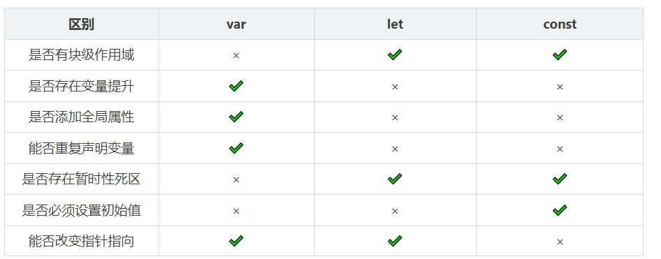
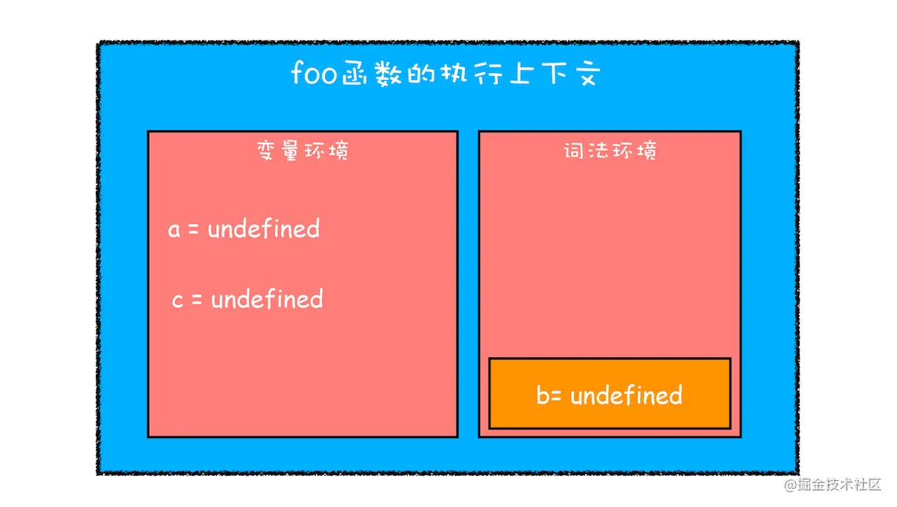
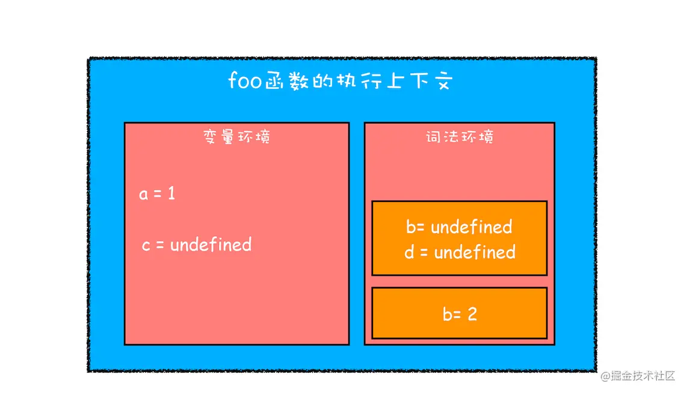
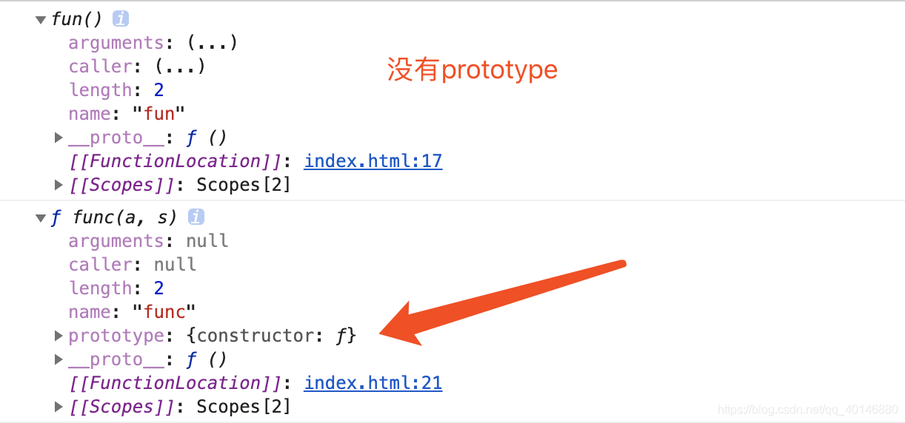

### let、const、var
（1）块级作用域：块作用域由 { }包括，let和const具有块级作用域，var不存在块级作用域。块级作用域解决了ES5中的两个问题：
- 内层变量可能覆盖外层变量
- 用来计数的循环变量泄露为全局变量

（2）(不太对)变量提升：var存在变量提升，let和const不存在变量提升，即在变量只能在声明之后使用，否在会报错。
（3）给全局添加属性：浏览器的全局对象是window，Node的全局对象是global。**var声明的变量为全局变量**，并且会**将该变量添加为全局对象的属性**，但是**let和const不会**。
（4）重复声明：var声明变量时，可以重复声明变量，后声明的同名变量会覆盖之前声明的遍历。const和let不允许重复声明变量。
（5）暂时性死区：在使用let、const命令声明变量之前，该变量都是不可用的。这在语法上，称为暂时性死区。使用var声明的变量不存在暂时性死区。
（6）初始值设置：在变量声明时，var 和 let 可以不用设置初始值。而const声明变量必须设置初始值。
（7）指针指向：let和const都是ES6新增的用于创建变量的语法。 let创建的变量是可以更改指针指向（可以重新赋值）。但const声明的变量是不允许改变指针的指向。



>红宝书的说法是let和const理论上也存在变量提升（应该是执行上下文创建变量对象VO时也会初始化他们）但是因为存在暂时性死区就不能提前调用，判断了。

---
- 函数提升优先于变量提升，函数提升会把整个函数挪到作用域顶部，变量提升只会把声明挪到作用域顶部
- var 存在提升，我们能在声明之前使用。let、const 因为**暂时性死区的原因**，不能在声明前使用，但是js在预编译的时候还是会收集let声明的变量。（来自红宝书）
- var 在全局作用域下声明变量会导致变量挂载在 window 上，**其他两者不会**
- let 和 const 作用基本一致，但是后者声明的变量不能再次赋值

#### const对象的属性可以修改吗
const保证的并不是变量的值不能改动，而是**变量指向的那个内存地址不能改动**。对于基本类型的数据（数值、字符串、布尔值），其值就保存在变量指向的那个内存地址，因此等同于常量。

但对于引用类型的数据（主要是对象和数组）来说，变量指向数据的内存地址，保存的只是一个指针，**const只能保证这个指针是固定不变的**，至于它指向的数据结构是不是可变的，就完全不能控制了。

---
const怎么让引用类型的常量不可更改

**Object.freeze()**. 相当于configurable为false，writable设置成false，但是对深层对象都没有用
```js
let o = {
  a:1,
  b:2
}

Object.freeze(o);

o.c = 3  //无效
o.a = 3  //无效
```

#### 块级作用域的实现

JavaScript 引擎是通过变量环境实现函数级作用域的，那么 ES6 又是如何在函数级作用域的基础之上，实现对块级作用域的支持呢？你可以先看下面这段代码：
```js
function foo(){
    var a = 1
    let b = 2
    {
      let b = 3
      var c = 4
      let d = 5
      console.log(a)
      console.log(b)
    }
    console.log(b) 
    console.log(c)
    console.log(d)
}   
foo()
```

当执行上面这段代码的时候，JavaScript 引擎会先对其进行编译并创建执行上下文，然后再按照顺序执行代码，关于如何创建执行上下文我们在前面的文章中已经分析过了，但是现在的情况有点不一样，我们引入了 let 关键字，let 关键字会创建块级作用域，那么 let 关键字是如何影响执行上下文的呢？
接下来我们就来一步步分析上面这段代码执行流程

第一步是编译并创建执行上下文，你可以参考下图：


通过查看上图，我们可以得出结论：

- 通过var声明的变量，在编译阶段被放在**变量环境**中了
- 通过let声明的变量，在编译过程中会被放到**词法环境**中
- 在函数的作用域块内部，通过 let 声明的变量并没有被存放到词法环境中

继续执行：


从图中可以看出，当进入函数的作用域块时，**作用域块中通过let声明的变量，会被放在词法环境的一个单独区域中**，这个区域中的变量并不影响作用域块外面的变量，比如在作用域外面声明了变量 b，在该作用域块内部也声明了变量 b，当执行到作用域内部时，它们都是独立的存在。

其实，在词法环境内部，**维护了一个小型栈结构**，栈底是函数最外层的变量，进入一个作用域块后，就会把该作用域块内部的变量压到栈顶；当作用域执行完成之后，该作用域的信息就会从栈顶弹出，这就是词法环境的结构。需要注意下，我这里所讲的变量是指通过 let 或者 const 声明的变量。

>作者：王锤锤
链接：https://juejin.cn/post/6968848594459688967


### 箭头函数
#### 箭头函数与普通函数的区别
##### 1. 箭头函数比普通函数更加简洁
>如果函数体不需要返回值，且只有一句话，可以给这个语句前面加一个void关键字。最常见的就是调用一个函数：
>```js
>let fn = () => void doesNotReturn();
>```

##### 2. 箭头函数没有自己的this
箭头函数不会创建自己的this， 所以它没有自己的this，它只会在自己作用域的**上一层继承this**。所以箭头函数中this的指向**在它在定义时已经确定了，之后不会改变**。

```js
var id = 'GLOBAL';
var obj = {
  id: 'OBJ',
  a: function(){
    console.log(this.id);
  },
  b: () => {
    console.log(this.id);
  }
};
obj.a();    // 'OBJ'
obj.b();    // 'GLOBAL'
new obj.a()  // undefined
new obj.b()  // Uncaught TypeError: obj.b is not a constructor
```
对象obj的方法b是使用箭头函数定义的，这个函数中的this就永远指向它定义时所处的全局执行环境中的this，即便这个函数是作为对象obj的方法调用，this依旧指向Window对象。需要注意，**定义对象的大括号{}是无法形成一个单独的执行环境的**，它依旧是处于全局执行环境中。

##### 3. call()、apply()、bind()等方法不能改变箭头函数中this的指向
```js
var id = 'Global';
let fun1 = () => {
    console.log(this.id)
};
fun1();                     // 'Global'
fun1.call({id: 'Obj'});     // 'Global'
fun1.apply({id: 'Obj'});    // 'Global'
fun1.bind({id: 'Obj'})();   // 'Global'
```

##### 4. 箭头函数不能作为构造函数使用
构造函数在new的步骤，实际上第二步就是将函数中的this指向该对象。 但是由于箭头函数时没有自己的this的，且this指向外层的执行环境，且不能改变指向，所以不能当做构造函数使用。

###### 如果new一个箭头函数的会怎么样
箭头函数、没有prototype、没有自己的this指向、不可以使用arguments、自然不可以new。


new操作符的实现步骤如下：
1. 创建一个对象
2. 将构造函数的作用域赋给新对象（也就是将对象的__proto__属性指向构造函数的prototype属性）
3. 指向构造函数中的代码，构造函数中的this指向该对象（也就是为这个对象添加属性和方法）
4. 返回新的对象

所以，上面的第二、三步，箭头函数都是没有办法执行的。
会报错

##### 5. 箭头函数没有自己的arguments、没有prototype

##### 6. 箭头函数不能用作Generator函数，不能使用yeild关键字

### 扩展运算符
扩展运算符内部调用的是数据结构的 **Iterator 接口**，因此只要具有 Iterator 接口的对象，都可以使用扩展运算符，比如 Generator 返回的遍历器对象。
```js
const go = function*(){
  yield 1;
  yield 2;
  yield 3;
};

[...go()] // [1, 2, 3]
```

如果对没有 Iterator 接口的对象，使用扩展运算符，将会报错。

### Class

```js
// 用纯函数重写 class User

// 1. 创建构造器函数
function User(name) {
  this.name = name;
}
// 函数的原型（prototype）默认具有 "constructor" 属性，
// 所以，我们不需要创建它

// 2. 将方法添加到原型
User.prototype.sayHi = function() {
  alert(this.name);
};

// 用法：
let user = new User("John");
user.sayHi();
```

```js
class User {
  constructor(name) { this.name = name; }
  sayHi() { alert(this.name); }
}

// class 是一个函数
alert(typeof User); // function

// ...或者，更确切地说，是 constructor 方法
alert(User === User.prototype.constructor); // true

// 方法在 User.prototype 中，例如：
alert(User.prototype.sayHi); // alert(this.name);

// 在原型中实际上有两个方法
alert(Object.getOwnPropertyNames(User.prototype)); // constructor, sayHi

User.prototype
// {constructor: ƒ, sayHi: ƒ}
```

#### 静态方法
类相当于实例的原型，所有在类中定义的方法，都会被实例继承。如果在一个方法前，加上static关键字，就表示**该方法不会被实例继承，而是直接通过类来调用**，这就称为“静态方法”。

```js
class Foo {
  static classMethod() {
    return 'hello';
  }
}

Foo.classMethod() // 'hello'

var foo = new Foo();
foo.classMethod()
// TypeError: foo.classMethod is not a function
```

注意，如果静态方法包含this关键字，这个this指的是类，而不是实例。

注意：类名后面不写括号()

```js
class Foo {
  static bar() {
    this.baz();
  }
  static baz() {
    console.log('hello');
  }
  baz() {
    console.log('world');
  }
}

Foo.bar() // hello
```
静态方法可以与非静态方法重名。

#### 静态属性

静态属性指的是 Class 本身的属性，即Class.propName，而不是定义在实例对象（this）上的属性。

```js
// 老写法
class Foo {
  // ...
}
Foo.prop = 1;

// 新写法
class Foo {
  static prop = 1;
}

Foo.prop  //1
```

注意使用的时候要用`Foo.prop`

#### 类的 prototype 属性和__proto__属性（extends原理）
大多数浏览器的 ES5 实现之中，每一个对象都有__proto__属性，指向对应的构造函数的prototype属性。Class 作为构造函数的语法糖，同时有prototype属性和__proto__属性，因此同时存在两条继承链。

（1）子类的__proto__属性，表示构造函数的继承，总是指向父类。

（2）子类prototype属性的__proto__属性，表示方法的继承，总是指向父类的prototype属性。

这样的结果是因为，类的继承是按照下面的模式实现的。

```js
class A {
  }

class B {
}

// B 的实例继承 A 的实例
Object.setPrototypeOf(B.prototype, A.prototype);

// B 继承 A 的静态属性
Object.setPrototypeOf(B, A);

const b = new B();
```

《对象的扩展》一章给出过Object.setPrototypeOf方法的实现。

```js
Object.setPrototypeOf = function (obj, proto) {
  obj.__proto__ = proto;
  return obj;
}
```

####  ES5 和 ES6 继承的区别

ES5和ES6的继承有什么区别？

ES6类的继承其实就是基于**寄生组合继承**来实现的

MA:
  1. ES5的继承一般是通过原型链模式或者构造函数模式来实现继承的，比如
  ```js
  // 原型链模式
  function Parent () {}
  function Sub () {}
  Sub.prototype = new Parent()
  Sub.constructor = Sub
  var sub = new Sub();
  Sub.__proto__ === Function.prototype
  // 构造模式
  function Parent () {}
  function Sub () {
     Parent.apply(this, arguments)
  }
  var sub = new Sub();
  Sub.__proto__ === Function.prototype
  ```
  通过上面的举例，可以看到，ES5的的子构造函数的 `prototype` **指向的是 `Function.prototype`**。
  而 ES6 实现的继承，`Sub__proto__` 的会指向 `Parent`。
  ```js
  class Parent {}
  class Sub extends Parent {
    constructor(){
      super()
    }
  }
  
  Sub.__proto__ === Parent
  ```
  
  2. ？this 的构造顺序是不一样的，ES5 的继承是先构造子对象然后再产生父对象，然后将父对象里面的属性复制到子对象中。而 ES6 是先使用 `super()`创建父对象，然后再创建子对象。所以 this 的构造顺序不同。
  3. ES6可以继承静态属性和类
```js
class P {
constructor(p) {
  this.p = p
}
  static pp = '???'
}

 class S extends P {
   constructor(s) {
     super(s)
   }
 }

 let s = new S('name');
 s.P;  //name
 S.pp; //??? 注意是大S，是类的属性
 ```
  
OA:

1. ES5 和 ES6 子类 this 生成顺序不同。ES5 的继承先生成了子类实例，再调用父类的构造函数修饰子类实例，ES6 的继承先生成父类实例，再调用子类的构造函数修饰父类实例。这个差别使得 ES6 可以继承内置对象。
```js
function MyES5Array() {
  Array.call(this, arguments);
}

// it's useless
const arrayES5 = new MyES5Array(3); // arrayES5: MyES5Array {}

class MyES6Array extends Array {}

// it's ok
const arrayES6 = new MyES6Array(3); // arrayES6: MyES6Array(3) []
```

2. 问题是继承的差异。
```js
class Super {}
class Sub extends Super {}

const sub = new Sub();

Sub.__proto__ === Super;
```
子类可以直接通过 `__proto__` 寻址到父类。
```js
function Super() {}
function Sub() {}

Sub.prototype = new Super();
Sub.prototype.constructor = Sub;

var sub = new Sub();

Sub.__proto__ === Function.prototype;
```
而通过 ES5 的方式，`Sub.__proto__ === Function.prototype`

#### ES5 ES6类的区别
ES6中的类只是ES5封装后的**语法糖**而已

- 在ES5中如果不用new，this指向windows全局变量，在ES6如果**不用new关键字则会报错处理**
- 在ES5中类的原型对象的方法是可枚举的，但是**ES6中不可枚举**
- ES6中的类是**不会声明提升的**, ES5可以
- 在ES6中如果不写构造方法
```js
class Es6Person {}

// 等同于
class Es6Person {
  constructor() {}
}
```

- **子类原型继承父类原型**，实现 原型对象上方法的继承。
- 在ES6中类的属性名可以采用表达式
- ES6利用get和set关键字对某属性设置存值函数和取值函数拦截属性的存取行为和ES5一样。
- 类的**静态方法**
- 类总是**使用 use strict**。 在类构造中的所有代码都将自动进入严格模式。
- 利用class定义类，extends实现类的继承；
- 子类constructor里调用super()（父类构造函数）实现 实例属性和方法的继承

>看 https://zh.javascript.info/class

### Generator
是ES6里面的新数据类型，像一个函数，可以返回多次。特点就是函数有个*号。返回一个遍历器(Iterator)对象。

调用的话就是不断调用next() 返回当前的value 值 done的状态

return() 直接忽略所有yield ，返回最终的结果

可以随心所欲的交出和恢复函数的执行权。

### Proxy
Proxy **用于修改某些操作的默认行为**，等同于在语言层面做出修改，所以属于一种“元编程”（meta programming），即对编程语言进行编程。

Proxy 可以理解成，**在目标对象之前架设一层“拦截”**，外界对该对象的访问，都必须先通过这层拦截，因此提供了一种机制，可以对外界的访问进行过滤和改写。Proxy 这个词的原意是代理，用在这里表示由它来“代理”某些操作，可以译为“代理器”。

e.g.
```js
let p = new Proxy(target, handler)
```
target 代表需要添加代理的对象，handler 用来自定义对象中的操作，比如可以用来自定义 set 或者 get 函数。

接下来我们通过 Proxy 来实现一个数据响应式
```js
let onWatch = (obj, setBind, getLogger) => {
  let handler = {
    set(target, property, value, receiver) {
      setBind(value, property)
      return Reflect.set(target, property, value)
    },
    get(target, property, receiver) {
      getLogger(target, property)
      return Reflect.get(target, property, receiver)
    }
  }
  return new Proxy(obj, handler)
}

let obj = { a: 1 }
let p = onWatch(
  obj,
  (v, property) => {
    console.log(`监听到属性${property}改变为${v}`)
  },
  (target, property) => {
    console.log(`'${property}' = ${target[property]}`)
  }
)
p.a = 2 // 监听到属性a改变
p.a // 'a' = 2
```
在上述代码中，我们通过自定义 set 和 get 函数的方式，在原本的逻辑中插入了我们的函数逻辑，实现了在对对象任何属性进行读写时发出通知。

####  Proxy 支持的拦截操作
一共 13 种。

>见 https://es6.ruanyifeng.com/?search=EPSILON#docs/proxy

### BigInt
JS 中的Number类型只能安全地表示-9007199254740991 (-(2^53-1)) 和9007199254740991(2^53-1)之间的整数，任何超出此范围的整数值都可能失去精度。

JS 提供Number.MAX_SAFE_INTEGER常量来表示 最大安全整数，Number.MIN_SAFE_INTEGER常量表示最小安全整数

BigInt 是一种内置对象，它提供了一种方法来表示大于 2^53 - 1 的整数。
BigInt 不能与普通数值进行混合运算。
BigInt 和 Number 不是严格相等的，但是宽松相等的。

对任何 BigInt 值使用 JSON.stringify() 都会引发 TypeError，因为默认情况下 BigInt 值不会在 JSON 中序列化。但是，如果需要，可以实现 toJSON 方法：`BigInt.prototype.toJSON = function() { return this.toString(); }`

#### 范围
- `BigInt.asUintN(width, BigInt)`： 给定的 BigInt 转为 0 到 2width - 1 之间对应的值。
- `BigInt.asIntN(width, BigInt)`：给定的 BigInt 转为 -2width - 1 到 2width - 1 - 1 之间对应的值。
- `BigInt.parseInt(string[, radix])`：近似于Number.parseInt()，将一个字符串转换成指定进制的 BigInt

```js
const max =2n**(64n-1n)-1n;
BigInt.asIntN(64, max)
// 9223372036854775807n
BigInt.asIntN(64, max +1n)
// -9223372036854775808n
BigInt.asUintN(64, max +1n)
// 9223372036854775808n
```
上面代码中，max是64位带符号的 BigInt 所能表示的最大值。如果对这个值加1n，BigInt.asIntN()将会返回一个负值，因为这时新增的一位将被解释为符号位。而BigInt.asUintN()方法由于不存在符号位，所以可以正确返回结果。

下面是BigInt.parseInt()的例子。

```js
// Number.parseInt() 与 BigInt.parseInt() 的对比
Number.parseInt('9007199254740993',10)
// 9007199254740992
BigInt.parseInt('9007199254740993',10)
// 9007199254740993n
```

上面代码中，由于有效数字超出了最大限度，Number.parseInt方法返回的结果是不精确的，而BigInt.parseInt方法**正确**返回了对应的 BigInt。(BigInt.parseInt还是返回BigInt)

### Symbol

它的功能类似于一种标识唯一性的ID，每个Symbol实例都是唯一的。
Symbol类型的key是不能通过Object.keys()或者for...in来枚举的，
它未被包含在对象自身的属性名集合(property names)之中。
所以，利用该特性，我们可以把一些不需要对外操作和访问的属性使用Symbol来定义。
// 使用Object的API
Object.getOwnPropertySymbols(obj) // [Symbol(name)]
// 使用新增的反射API
Reflect.ownKeys(obj) // [Symbol(name), 'age', 'title']
ES6里的set和map
(记得说一下怎么遍历得到symbol属性)
>作者：伊人a
链接：https://juejin.cn/post/6989422484722286600。

---
ES5 的对象属性名都是字符串，这容易造成属性名的冲突。比如，你使用了一个他人提供的对象，但又想为这个对象添加新的方法（mixin 模式），新方法的名字就有可能与现有方法产生冲突。如果有一种机制，保证每个属性的名字都是独一无二的就好了，这样就从根本上**防止属性名的冲突**。这就是 ES6 引入Symbol的原因。

注意，Symbol函数前**不能使用new命令**，否则会报错。这是因为生成的 Symbol 是一个原始类型的值，不是对象。也就是说，由于 Symbol 值不是对象，所以不能添加属性。基本上，**它是一种类似于字符串的数据类型**。

Symbol函数可以接受一个字符串作为参数，表示对 Symbol 实例的描述，**主要是为了在控制台显示**，或者转为字符串时，比较容易区分。(注意，Symbol函数的参数只是表示对当前 Symbol 值的**描述**，因此相同参数的Symbol函数的返回值是不相等的。)

#### description
```js
const sym = Symbol('foo');

String(sym) // "Symbol(foo)"
sym.toString() // "Symbol(foo)"
```
上面的用法不是很方便。ES2019 提供了一个实例属性description，**直接返回 Symbol 的描述**。

```js
const sym = Symbol('foo');
sym.description // "foo"
```

#### 作为属性名的 Symbol
```js
let mySymbol = Symbol();

// 第一种写法
let a = {};
a[mySymbol] = 'Hello!';

// 第二种写法
let a = {
  [mySymbol]: 'Hello!'
};

// 第三种写法
let a = {};
Object.defineProperty(a, mySymbol, { value: 'Hello!' });

// 以上写法都得到同样结果
a[mySymbol] // "Hello!"
```

注意，Symbol 值作为对象属性名时，不能用点运算符

```js
const mySymbol = Symbol();
const a = {};

a.mySymbol = 'Hello!';
a[mySymbol] // undefined
a['mySymbol'] // "Hello!"
```

因为点运算符后面总是**字符串**，所以不会读取mySymbol作为标识名所指代的那个值，导致a的属性名实际上是一个字符串，而不是一个 Symbol 值。

同理，在对象的内部，使用 Symbol 值定义属性时，Symbol 值必须放在**方括号之中**。

```js
let s = Symbol();

let obj = {
  [s]: function (arg) { ... }
};

obj[s](123);
```

上面代码中，如果s不放在方括号中，该属性的键名就是字符串s，而不是s所代表的那个 Symbol 值。

#### 属性名的遍历

Symbol 作为属性名，**遍历对象**的时候，该属性不会出现在for...in、for...of循环中，也不会被Object.keys()、Object.getOwnPropertyNames()、JSON.stringify()返回。

---
但是，它也不是私有属性，有一个**Object.getOwnPropertySymbols()方法**，可以获取指定对象的所有 Symbol 属性名。该方法返回一个数组，成员是当前对象的所有用作属性名的 Symbol 值。

另一个新的 API，**Reflect.ownKeys()方法**可以返回所有类型的键名，包括常规键名和 Symbol 键名。

由于以 Symbol 值作为键名，不会被常规方法遍历得到。我们可以利用这个特性，**为对象定义一些非私有的、但又希望只用于内部的方法**。

### 模块
和commonJS的区别?

### 其他

 rest 参数 模板字符串 Map Set

 ---
 新增symbol类型 表示独一无二的值，用来定义独一无二的对象属性名;
const/let  都是用来声明变量,不可重复声明，具有块级作用域。存在暂时性死区，也就是不存在变量提升。(const一般用于声明常量);
变量的解构赋值(包含数组、对象、字符串、数字及布尔值,函数参数),剩余运算符(...rest);
模板字符串(${data});
扩展运算符(数组、对象);;
箭头函数;
Set和Map数据结构;
Proxy/Reflect;
Promise;
async函数;
Class;
Module语法(import/export)

>见 https://www.yuque.com/cuggz/interview/vgbphi#3fb2aa8bcb617ca0de8bfafd7da899e3
>https://es6.ruanyifeng.com/?search=EPSILON&x=4&y=8

### ES7~
[ES6、ES7、ES8、ES9、ES10新特性一览](https://juejin.cn/post/6844903811622912014#heading-56)

[JS语法 ES6、ES7、ES8、ES9、ES10、ES11、ES12新特性](https://segmentfault.com/a/1190000039272641)