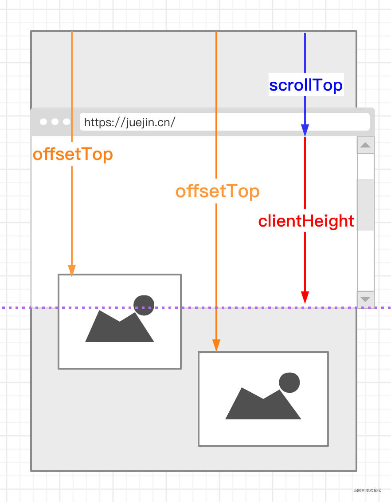
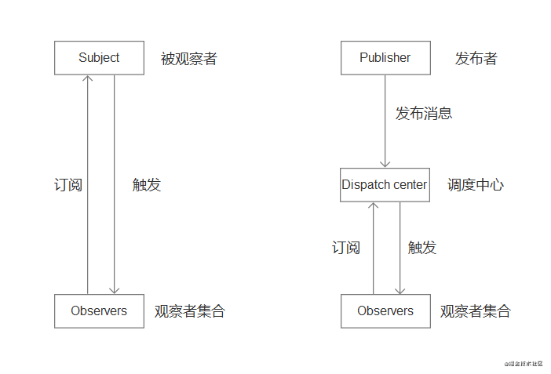

[前端面试常考的手写代码不是背出来的！](https://juejin.cn/post/6844904073351675912#heading-39)

[「中高级前端面试」手写代码合集](https://juejin.cn/post/6902060047388377095#heading-40)
https://juejin.cn/post/6844903911686406158#heading-13
https://juejin.cn/post/6875152247714480136#heading-35
https://www.yuque.com/cuggz/interview/pkg93q#8BKRR

稍后 [手写代码（二）](https://jinjingxuan.github.io/2020/03/20/%E9%9D%A2%E8%AF%95-%E6%89%8B%E5%86%99%E4%BB%A3%E7%A0%81%EF%BC%88%E4%BA%8C%EF%BC%89/)


### 实现搜索框

### 实现有并行限制的Promise调度器
https://juejin.cn/post/6854573217013563405
稍后 https://juejin.cn/post/6916317088521027598#heading-2

```js
class Scheduler {
  constructor() {
    this.queue = [];
    this.maxCount = 2;
    this.runCounts = 0;
  }
  add(promiseCreator) {
    this.queue.push(promiseCreator);
  }
  taskStart() {
    for (let i = 0; i < this.maxCount; i++) {
      this.request();
    }
  }
  request() {
    if (!this.queue || !this.queue.length || this.runCounts >= this.maxCount) {
      return;
    }
    this.runCounts++;

    this.queue.shift()().then(() => {
      this.runCounts--;
      this.request();
    });
  }
}
   
const timeout = time => new Promise(resolve => {
  setTimeout(resolve, time);
})
  
const scheduler = new Scheduler();
  
const addTask = (time,order) => {
  scheduler.add(() => timeout(time).then(()=>console.log(order)))
}
  
  
addTask(1000, '1');
addTask(500, '2');
addTask(300, '3');
addTask(400, '4');
scheduler.taskStart()
// 2
// 3
// 1
// 4
```

#### 并行请求，顺序输出
```js
var promises = function () {
  return [1000, 4000, 2000].map(current => {
    return new Promise(function (resolve, reject) {
      console.log(current+'Start')
      setTimeout(() => {
        console.log(current)
        resolve(current)
      }, current)
    })
  })
}

Promise.all(promises()).then((res) => {
  console.log('end')
  console.log(res);
})
```

Primise.all结果数组是按放进去的顺序而不是回调的顺序。

---
并行请求+串行输出
```js
const p1 = new Promise((resolve, reject) => {
  console.log('p1 Start');
  setTimeout(() => {
    console.log(1000);
    resolve(1000)
  }, 1000);
})
const p2 = new Promise((resolve, reject) => {
  console.log('p2 Start');
  setTimeout(() => {
    console.log(4000);
    resolve(4000)
  }, 4000);
})
const p3 = new Promise((resolve, reject) => {
  console.log('p3 Start');
  setTimeout(() => {
    console.log(2000);
    resolve(2000)
  }, 2000);
})

p1.then(res => {
  console.log('res'+res);
  // 重点
  return p2
}).then(res => {
  console.log('res'+res);
  return p3
}).then(res => {
  console.log('res'+res);
  console.log('end');
})
```
then方法返回的是一个新的Promise实例（注意，不是原来那个Promise实例）。因此可以采用链式写法，即then方法后面再调用另一个then方法。

采用链式的then，可以指定一组按照次序调用的回调函数。这时，前一个回调函数，有可能返回的还是一个Promise对象（即有异步操作），这时后一个回调函数，就会等待该Promise对象的状态发生变化，才会被调用。

### JS基础

#### 手写Promise
[BAT前端经典面试问题：史上最最最详细的手写Promise教程](https://juejin.cn/post/6844903625769091079#heading-9)

or [实现一个简版promise](http://interview.poetries.top/docs/handwritten.html#_7-%E5%AE%9E%E7%8E%B0%E4%B8%80%E4%B8%AA%E7%AE%80%E7%89%88promise)

#### Promise.all

一般来说，Promise.all 用来处理多个并发请求，也是为了页面数据构造的方便，将一个页面所用到的在不同接口的数据一起请求过来，不过，如果其中一个接口失败了，多个请求也就失败了，页面可能啥也出不来，这就看当前页面的耦合程度了

```js
Promise.all = function(promises) {
  return new Promise((resolve, reject) => {
    let result = [],
        index = 0,
        len = promises.length
    if(len === 0) {
      resolve(result)
      return;
    }
   
    for(let i=0; i<len; i++) {
      // 为什么不直接 promise[i].then, 考虑 promise[i] 可能不是一个 promise 对象
      Promise.resolve(promise[i]).then(data => {
        result[i] = data
        index++
        if(index === len) resolve(result)
      }).catch(err => {
        reject(err)
      })
    }
  })
}
```

#### Promise.race

Promise.race 只要有一个 promise 执行完，直接 resolve 并停止执行。

```js
Promise.race = function(promises) {
  return new Promise((resolve, reject) => {
    let len = promises.length
    if(len === 0) return;
    for(let i=0; i<len; i++) {
      // promises[i] 可能不是一个 promise 对象
      Promise.resolve(promises[i]).then(data => {
        resolve(data)
        return;
      }).catch(err => {
        reject(err)
        return;
      })
    }
  })
}
```

简写
```js
Promise.race = function(promiseArr) {
  return new Promise((resolve, reject) => {
    promiseArr.forEach(p => {
      // 如果不是Promise实例需要转化为Promise实例
      Promise.resolve(p).then(
        val => resolve(val),
        err => reject(err),
      )
    })
  })
}
```

#### sleep
```js
function sleep(fn, time) {
    return new Promise((resolve, reject) => {
        setTimeout(() => {
            resolve(fn);
        }, time);
    }); 
}

// 测试用例
let index = 0;

function fn() {
    console.log('我要吃饭了', index++);
}

async function play() {
    let a = await sleep(fn, 1000);
    a();
    let b = await sleep(fn, 2000);
    b()
    let c = await sleep(fn, 3000);
    c()
}

play();
```

#### 防抖

函数防抖是指在事件被触发 n 秒后再执行回调，如果在这 n 秒内事件又被触发，则重新计时。这可以使用在一些点击请求的事件上，避免因为用户的多次点击向后端发送多次请求。

eg. 像仿百度搜索，就应该用防抖，当我连续不断输入时，不会发送请求；当我一段时间内不输入了，才会发送一次请求；如果小于这段时间继续输入的话，时间会重新计算，也不会发送请求。

```js
// func是用户传入需要防抖的函数
// wait是等待时间
const debounce = (func, wait = 50) => {
  // 缓存一个定时器id
  let timer = null
  // 这里返回的函数是每次用户实际调用的防抖函数
  // 如果已经设定过定时器了就清空上一次的定时器
  // 开始一个新的定时器，延迟执行用户传入的方法
  return function(...args) {
    if (timer) clearTimeout(timer)
    timer = setTimeout(() => {
      func.apply(this, args)
    }, wait)
  }
}
```

应用参考 [7分钟理解JS的节流、防抖及使用场景](https://juejin.cn/post/6844903669389885453)

#### 节流

函数节流是指规定一个单位时间，在这个单位时间内，只能有一次触发事件的回调函数执行，如果在同一个单位时间内某事件被触发多次，只有一次能生效。节流可以使用在 scroll 函数的事件监听上，通过事件节流来降低事件调用的频率。

例:（连续不断动都需要调用时用，设一时间间隔），像dom的拖拽，如果用消抖的话，就会出现卡顿的感觉，因为只在停止的时候执行了一次，这个时候就应该用节流，在一定时间内多次执行，会流畅很多

节流常应用于鼠标不断点击触发、监听滚动事件。

```js
// func是用户传入需要防抖的函数
// wait是等待时间
const throttle = (func, wait = 50) => {
  // 上一次执行该函数的时间
  let lastTime = 0
  return function(...args) {
    // 当前时间
    let now = +new Date()
    // 将当前时间和上一次执行函数时间对比
    // 如果差值大于设置的等待时间就执行函数
    if (now - lastTime > wait) {
      lastTime = now
      func.apply(this, args)
    }
  }
}
```

#### 类型判断

```js
function getType(value) {
  // 判断数据是 null 的情况
  if (value === null) {
    return value + "";
  }
  // 判断数据是引用类型的情况
  if (typeof value === "object") {
    // 比如 [object, Array]
    let valueClass = Object.prototype.toString.call(value),
    // 删除字符串最后一位（]）
      type = Array.prototype.slice.call(arr, 0,-1).join("").toLowerCase();
    return type
  } else {
    // 判断数据是基本数据类型的情况和函数的情况
    return typeof value;
  }
}
```

#### instanceof 

```js
function myInstanceof(left, right) {
  let proto = Object.getPrototypeOf(left), // 获取对象的原型
      prototype = right.prototype; // 获取构造函数的 prototype 对象

  // 判断构造函数的 prototype 对象是否在对象的原型链上
  while (true) {
    if (!proto) return false;
    if (proto === prototype) return true;

    proto = Object.getPrototypeOf(proto);
  }
}
```

#### 柯里化

- 柯里化的定义：接收一部分参数，返回一个函数接收剩余参数，接收足够参数后，执行原函数。
- 好处：减少代码冗余，增加可读性，是一种简洁的实现函数委托的方式。

举个简单的 🌰：
```js
function multiFn(x, y, z) {
    return x * y * z
}
function curry() { ... } // 假设有一个 curry 函数可以做到柯里化
let multi = curry(multiFn)
multi(2, 3, 4)
multi(2)(3)(4)
multi(2, 3)(4)
multi(2)(3, 4)   // 以上结果都是 3，柯里化将参数拆开自由绑定，结果不变。
let seniorMulti = multi(2) // seniorMulti 可以多次使用
seniorMulti(3)(4) // 当我们觉得重复传递参数 2 总是冗余时，可以这样。
```

当柯里化函数接收到足够参数后，就会执行原函数，如何去确定何时达到足够的参数呢？

有两种思路：

- 通过函数的 length 属性，获取函数的形参个数，形参的个数就是所需的参数个数
- 在调用柯里化工具函数时，手动指定所需的参数个数
  
将这两点结合一下，实现一个简单 curry 函数

**通用版**
```js
function curry(fn, args = []) {
    var length = fn.length;
    // var args = args || [];
    return function(){
        newArgs = args.concat(Array.prototype.slice.call(arguments));
        if (newArgs.length < length) {
            return curry.call(this,fn,newArgs);
        }else{
            return fn.apply(this,newArgs);
        }
    }
}
```

**ES6写法**
```js
const curry = fn =>
    judge = (...args) =>
        args.length === fn.length
            ? fn(...args)
            : (arg2) => judge(...args, arg2)
```

#### Promise封装AJAX

```js
// promise 封装实现：
function getJSON(url) {
  // 创建一个 promise 对象
  let promise = new Promise(function(resolve, reject) {
    let xhr = new XMLHttpRequest();
    // 新建一个 http 请求
    xhr.open("GET", url, true);
    // 设置状态的监听函数
    xhr.onreadystatechange = function() {
      if (this.readyState !== 4) return;
      // 当请求成功或失败时，改变 promise 的状态
      if (this.status === 200) {
        resolve(this.response);
      } else {
        reject(new Error(this.statusText));
      }
    };
    // 设置错误监听函数
    xhr.onerror = function() {
      reject(new Error(this.statusText));
    };
    // 设置响应的数据类型
    xhr.responseType = "json";
    // 设置请求头信息
    xhr.setRequestHeader("Accept", "application/json");
    // 发送 http 请求
    xhr.send(null);
  });
  return promise;
}
```

#### 浅拷贝

多种方法看这里 [实现浅拷贝](https://www.yuque.com/cuggz/interview/pkg93q#TT8E3)


```js
const shallowClone = (target) => {
  if (typeof target === 'object' && target !== null) {
    // 根据 target 的类型判断是新建一个数组还是对象
    const cloneTarget = Array.isArray(target) ? []: {}
    for (let prop in target) {
      if (target.hasOwnProperty(prop)) { // 是否是自身（非继承）属性
          cloneTarget[prop] = target[prop] // 只考虑一层对象
      }
    }
    return cloneTarget
  } else {
    return target // 基础类型直接返回
  }
}

// 或者你可以
console.log(Object.assign(array, ...sources))
console.log(array.concat())
console.log(array.slice())
console.log([...array])
```

**注意**
浅拷贝，复制来的**基本数据类型**还是真的复制了。改变原值，拷贝来的值不会改变。

```js
let obj1 = {a:1,b:{c:1}}
let obj2 = {...obj1};
obj1.a = 2;
console.log(obj1); //{a:2,b:{c:1}}
console.log(obj2); //{a:1,b:{c:1}}
obj1.b.c = 2;
console.log(obj1); //{a:2,b:{c:2}}
console.log(obj2); //{a:1,b:{c:2}}
```

#### 深拷贝

- 浅拷贝：浅拷贝指的是将一个对象的属性值复制到另一个对象，如果有的属性的值为引用类型的话，那么会将这个引用的地址复制给对象，因此两个对象会有同一个引用类型的引用。浅拷贝可以使用  Object.assign 和展开运算符来实现。
- 深拷贝：深拷贝相对浅拷贝而言，如果遇到属性值为引用类型的时候，它新建一个引用类型并将对应的值复制给它，因此对象获得的一个新的引用类型而不是一个原有类型的引用。深拷贝对于一些对象可以使用 JSON 的两个函数来实现，但是由于 JSON 的对象格式比 js 的对象格式更加严格，所以如果属性值里边出现函数或者 Symbol 类型的值时，会转换失败

1. JSON.stringify()
- JSON.parse(JSON.stringify(obj))是目前比较常用的深拷贝方法之一，它的原理就是利用JSON.stringify 将js对象序列化（JSON字符串），再使用JSON.parse来反序列化(还原)js对象。
- 这个方法可以简单粗暴的实现深拷贝，但是还存在问题，拷贝的对象中如果有函数，undefined，symbol，当使用过JSON.stringify()进行处理之后，都会消失。
- 他无法实现对函数 、RegExp等特殊对象的克隆
- 会抛弃对象的constructor,所有的构造函数会指向Object
- 对象有循环引用,会报错

2. 函数库lodash的_.cloneDeep方法
  ```js
  var _ = require('lodash');
  var obj1 = {
      a: 1,
      b: { f: { g: 1 } },
      c: [1, 2, 3]
  };
  var obj2 = _.cloneDeep(obj1);
  console.log(obj1.b.f === obj2.b.f);// false
  ```

3. 手写实现深拷贝函数
```js
function deepClone(obj) {
    // 如果是 值类型 或 null，则直接return
    if(typeof obj !== 'object' || obj === null) {
        return obj
    }
    
    // 定义结果对象 如果对象是数组，则定义结果数组
    let copy = Array.isArray(obj) ? [] : {};
    
    // 遍历对象的key
    for(let key in obj) {
        // 如果key是对象的自有属性
        if(obj.hasOwnProperty(key)) {
            // 递归调用深拷贝方法
            copy[key] = deepClone(obj[key])
            // typeof copy[key] === "object" ? deepCopy(copy[key]) : copy[key];
        }
    }
    
    return copy
} 
```

---
针对循环引用的实现

```js
// 循环引用
var circle = {}
circle.circle = circle
//或者
var a = {}, b = {}
a.b = b
b.a = a
```

```js
/**
 * js深拷贝(包括 循环引用 的情况)
 * 
 * @param {*} originObj
 * @param {*} [map=new WeakMap()]  使用hash表记录所有的对象的引用关系，初始化为空
 * @returns
 */
function deepClone( originObj, map = new WeakMap() ) {
    if(!originObj || typeof originObj !== 'object') return originObj;  //空或者非对象则返回本身
 
    //如果这个对象已经被记录则直接返回
    if( map.get(originObj) ) {
        return  map.get(originObj);
    }
    //这个对象还没有被记录，将其引用记录在map中，进行拷贝    
    let result = Array.isArray(originObj) ? [] : {};  //拷贝结果
    map.set(originObj, result); //记录引用关系
    let keys = Object.keys(originObj); //originObj的全部key集合
    //拷贝
    for(let i =0,len=keys.length; i<len; i++) {
        let key = keys[i];
        let temp = originObj[key];
        result[key] = deepClone(temp, map);
    }
    return result;
  }
```
————————————————
版权声明：本文为CSDN博主「Tautus」的原创文章，遵循CC 4.0 BY-SA版权协议，转载请附上原文出处链接及本声明。
原文链接：https://blog.csdn.net/Snoopyqiuer/article/details/101106303

>[解决循环引用和相同引用的js深拷贝实现(BFS)](https://segmentfault.com/a/1190000021682472)

#### 静态属性
写一个函数 Foo 要求:
```js
var a = new Foo() // => {id: 1}
var b = new Foo() // => {id: 2}
```

1. 静态属性
```js
class Foo {
  static id = 1

  constructor() {
    this.id = Foo.id++
  }
}

a = new Foo()
b = new Foo()
```

2. 闭包
```js
var Foo = (function (){
  var id = 0
  return function() {
    id++
    return {id}
  }
})()

// 这里就不能用new了
a = Foo()
b = Foo()
```

#### 隐式转换
```js
//实现一个 Cash 类，期望执行下面代码：

const cash1 = new Cash(105);

const cash2 = new Cash(66);

const cash3 = cash1.add(cash2);

const cash4 = Cash.add(cash1, cash2);

const cash5 = new Cash(cash1 + cash2);


console.log(`${cash3}`, `${cash4}`, `${cash5}`);

// 希望输出结果为：

// 1元7角1分，1元7角1分 ，1元7角1分
```
这题主要考察隐式转换，需要自己实现 toString 和 valueOf

注意：**模板字符串调用的是对象的toString方法**

```js
class Cash {
    constructor(num) {
        this.num = num
    }
    add(c1) {
        return new Cash(this + c1)
    }
    static add(c1, c2) {
        return new Cash(c1 + c2)
    }
    // valueOf 用于处理 new Cash(cash1 + cash2)
    valueOf() {
        return this.num
    }
    // toString 用于处理 cash3 => `${cash3}`
    toString() {
        // const sum=`${this.num}`
        // const sum = String(this.num)
        const sum = this.num.toString()
        return `${sum.slice(0, sum.length-2)}元${sum[sum.length-2]}角${sum[sum.length-1]}分`
    }
}
```

### 数组方法

#### map
```js
// context 可选 执行 callback 函数时值被用作this。
Array.prototype.myMap = function(callback, context){
  // 转换类数组
  var arr = Array.prototype.slice.call(this),//由于是ES5所以就不用...展开符了
      mappedArr = [], 
      i = 0;

  for (; i < arr.length; i++ ){
    // 把当前值、索引、当前数组返回去。调用的时候传到函数参数中 [1,2,3,5].myMap((x)=>x*2)

    // [1,2,3,5].myMap((x,y)=>{
    // console.log(x);
    // console.log(y);
    // return x + y
    // }
    // 这里x就是arr[i]， y就是传入的i
})
    mappedArr.push(callback.call(context, arr[i], i, this));
  }
  return mappedArr;
}
```

#### reduce
```js
Array.prototype.myReduce = function(fn, initialValue) {
    // if (this === null || this === undefined) 
    // 	throw new TypeError(`Cannot read property 'reduce' of ${this}`)
    // // 处理回调类型异常
    // if (Object.prototype.toString.call(callbackFn) !== '[object Function]')
    // 	throw new TypeError(`${callbackFn} is not a function`)

  var arr = Array.prototype.slice.call(this);
  var res, startIndex;
  res = initialValue ? initialValue : arr[0]; // 不传默认取数组第一项
  startIndex = initialValue ? 0 : 1;
  for(var i = startIndex; i < arr.length; i++) {
    // 把初始值、当前值、索引、当前数组返回去。调用的时候传到函数参数中 [1,2,3,4].reduce((initVal,curr,index,arr))
    res = fn.call(null, res, arr[i], i, this); 
  }
  return res;
}
```

#### filter
```js
Array.prototype.myFilter=function(callback, context=window){

  let len = this.length
      newArr = [],
      i=0

  for(; i < len; i++){
    if(callback.apply(context, [this[i], i , this])){
      newArr.push(this[i]);
    }
  }
  return newArr;
}
```

### 数组

#### 数组扁平化

##### flat()

直接调用 ES6 中的 flat 方法来实现数组扁平化。flat 方法的语法：`arr.flat([depth])`

其中 depth 是 flat 的参数，depth 是可以传递数组的展开深度（默认不填、数值是 1），即展开一层数组。如果层数不确定，参数可以传进 Infinity，代表不论多少层都要展开

```js
const res1 = arr.flat(Infinity);
```

##### 正则和 JSON 方法
```js
let arr = [1, [2, [3, [4, 5]]], 6];
function flatten(arr) {
  let str = JSON.stringify(arr);
  str = str.replace(/(\[|\])/g, '');
  str = '[' + str + ']';
  return JSON.parse(str); 
}
console.log(flatten(arr)); //  [1, 2, 3, 4，5]
```

##### split 和 toString 
可以通过 split 和 toString 两个方法来共同实现数组扁平化，由于数组会默认带一个 toString 的方法，所以可以把数组直接转换成逗号分隔的字符串，然后再用 split 方法把字符串重新转换为数组，如下面的代码所示：

```js
let arr = [1, [2, [3, 4]]];
function flatten(arr) {
    return arr.toString().split(',');
}
console.log(flatten(arr)); //  [1, 2, 3, 4，5]
```

##### 扩展运算符
```js
let arr = [1, [2, [3, 4]]];
function flatten(arr) {
    while (arr.some(item => Array.isArray(item))) {
        arr = [].concat(...arr);
    }
    return arr;
}
console.log(flatten(arr)); //  [1, 2, 3, 4]
```

>- concat的参数可以是数组或是一堆参数
>- some() 方法测试数组中是不是至少有1个元素通过了被提供的函数测试。它返回的是一个Boolean类型的值。

##### reduce
```js
function flatten(arr) {
    return arr.reduce(function(prev, next){
        return prev.concat(Array.isArray(next) ? flatten(next) : next)
    }, [])
}
```

##### 递归
```js
function flatten(arr) {
  let result = [];

  for(let i = 0; i < arr.length; i++) {
    if(Array.isArray(arr[i])) {
      result = result.concat(flatten(arr[i]));
    } else {
      result.push(arr[i]);
    }
  }
  return result;
}
```

#### 数组去重

##### Set or Map
```js
function unique(arr) {
    return [...new Set(arr)];
    // or
    // Array.from(new Set(array)); 
}

// 或者可以这样，利用 Map
const unique5 = arr => {
  const map = new Map();
  const res = [];
  for (let i = 0; i < arr.length; i++) {
    if (!map.has(arr[i])) {
      map.set(arr[i], true)
      res.push(arr[i]);
    }
  }
  return res;
}
```

##### ES5手动实现Map
```js
const array = [1, 2, 3, 5, 1, 5, 9, 1, 2, 8];

uniqueArray(array); // [1, 2, 3, 5, 9, 8]

function uniqueArray(array) {
  let map = {};
  let res = [];
  for(var i = 0; i < array.length; i++) {
    if(!map.hasOwnProperty([array[i]])) {
      map[array[i]] = 1;
      res.push(array[i]);
    }
  }
  return res;
}
```

##### 排序后去重
```js
function unique(arr) {
    let res = []
    let sortedArray = arr.concat().sort()
    let lastVal
    for (let i=0; i<sortedArray.length; i++) {
        // 如果是第一个元素或者相邻的元素不相同
        if (!i || lastVal !== sortedArray[i])
        	res.push(sortedArray[i])
        lastVal = sortedArray[i]
    }
    return res
}

// 或者可以这样，利用排序 + filter
function unique(arr) {
    return arr.concat().sort().filter(function(item, index, array){
        return !index || item !== arr[index - 1]
    })
}
```

##### Array.filter() 加 indexOf/includes
```js
function distinct(a, b) {
    let arr = a.concat(b);
    return arr.filter((item, index)=> {
        //return arr.indexOf(item) === index
        return arr.includes(item)
    })
}
```

#### 类数组转化为数组
类数组转换为数组的方法有这样几种：
- 通过 call 调用数组的 slice 方法来实现转换
`Array.prototype.slice.call(arrayLike);`

- 通过 call 调用数组的 splice 方法来实现转换
`Array.prototype.splice.call(arrayLike, 0);`

- 通过 apply 调用数组的 concat 方法来实现转换
`Array.prototype.concat.apply([], arrayLike);`

- 通过 Array.from 方法来实现转换
`Array.from(arrayLike);`

#### 对象数组去重
```js
const responseList = [
  { id: 1, a: 1 },
  { id: 2, a: 2 },
  { id: 3, a: 3 },
  { id: 1, a: 4 },
];
const result = responseList.reduce((acc, cur) => {
    const ids = acc.map(item => item.id);
    return ids.includes(cur.id) ? acc : [...acc, cur];
}, []);
console.log(result); // -> [ { id: 1, a: 1}, {id: 2, a: 2}, {id: 3, a: 3} ]
```

### 应用

#### JSONP
利用`<script>`标签不受跨域限制的特点，缺点是只能支持 get 请求

- 创建script标签
- 设置script标签的src属性，以问号传递参数，设置好回调函数callback名称
- 插入到html文本中
- 调用回调函数，res参数就是获取的数据

---
JSONP 是服务器与客户端跨源通信的常用方法。最大特点就是简单易用，没有兼容性问题，老式浏览器全部支持，服务端改造非常小。

它的做法如下。

第一步，网页添加一个`<script>`元素，向服务器请求一个脚本，这不受同源政策限制，可以跨域请求。

```html
<script src="http://api.foo.com?callback=bar"></script>
```

注意，请求的脚本网址有一个`callback`参数（`?callback=bar`），用来告诉服务器，客户端的回调函数名称（`bar`）。

第二步，服务器收到请求后，拼接一个字符串，将 JSON 数据放在函数名里面，作为字符串返回（`bar({...})`）。

第三步，客户端会将服务器返回的字符串，作为代码解析，因为浏览器认为，这是`<script>`标签请求的脚本内容。这时，客户端只要定义了`bar()`函数，就能在该函数体内，拿到服务器返回的 JSON 数据。

下面看一个实例。首先，网页动态插入`<script>`元素，由它向跨域网址发出请求。

```javascript
function addScriptTag(src) {
  var script = document.createElement('script');
  script.setAttribute('type', 'text/javascript');
  script.src = src;
  document.body.appendChild(script);
}

window.onload = function () {
  addScriptTag('http://example.com/ip?callback=foo');
}

function foo(data) {
  console.log('Your public IP address is: ' + data.ip);
};
```

上面代码通过动态添加`<script>`元素，向服务器`example.com`发出请求。注意，该请求的查询字符串有一个`callback`参数，用来指定回调函数的名字，这对于 JSONP 是必需的。

服务器收到这个请求以后，会将数据放在回调函数的参数位置返回。

```javascript
foo({
  'ip': '8.8.8.8'
});
```

由于`<script>`元素请求的脚本，直接作为代码运行。这时，只要浏览器定义了`foo`函数，该函数就会立即调用。作为参数的 JSON 数据被视为 JavaScript 对象，而不是字符串，因此避免了使用`JSON.parse`的步骤。

---
```js
const jsonp = (opts = {}) => {
    // 通过一个callback参数所对应的函数名来把数据进行写入
    opts.url = `${opts.url}?callback=${opts.callback}`;
    // 在你需要传递其他参数(param)时，需要遍历后拼接到url上
    for (let key in opts.data) {
        if (opts.data.hasOwnProperty(key)) {
            opts.url += `&${key}=${opts.data[key]}`;
        }
    }
    // 主要是依靠script的src属性加载内容没有跨域情况
    const script = document.createElement('script');
    script.src = opts.url;
    // 在script脚本执行完毕后，再删除此脚本
    script.onload = () => {
        document.body.removeChild(script);
    }
    // 把创建好的script脚本添加到body中
    document.body.appendChild(script);
};

// 测试用例
jsonp({
    url: 'http://localhost:8888/cors',
    data: {
        wd: 'nba',
        from: 'home'
    },
    // 接收数据的函数
    callback: 'getData'
});

function getData(data) {
    // 通过jsonp拿到的真实数据
    console.log(data);
}
```

#### 解析 URL
```js
function parseUrl(url) {
    // scheme://user:passwd@ 部分
    let schemeStr = '(?:([^/?#]+))?//(?:([^:]*)(?::?(.*))@)?',
    	// host:port path?query 部分
        urlStr = '(?:([^/?#:]*):?([0-9]+)?)?([^?#]*)(\\?(?:[^#]*))?',
    	// #fragment 部分
    	fragmentStr = '(#(?:.*))'
        
    let pattern = RegExp(`^${schemeStr}${urlStr}${fragmentStr}?`)
    let matched = url.match(pattern) || []
    return {
    	protocol: matched[1], // 协议
    	username: matched[2], // 用户名
    	password: matched[3], // 密码
    	hostname: matched[4], // 主机
    	port: matched[5],     // 端口
    	pathname: matched[6], // 路径
    	search: matched[7],   // 查询字符串 queryString
    	hash: matched[8],     // 锚点
    }
}

// 或者你可以这样
function parseUrl(url) {
    const urlObj = new URL(url)
    return {
    	protocol: urlObj.protocol,
        username: urlObj.username,
        password: urlObj.password,
        hostname: urlObj.hostname,
        port: urlObj.port,
        pathname: urlObj.pathname,
        search: urlObj.search,
        hash: urlObj.hash
    }
}
```

##### 单独解析查询字符串 queryString：
```js
function parseQueryString(query) {
    if (!query) return {}
    query = query.replace(/^\?/, '')
    const queryArr = query.split('&')
    const result = {}
    queryArr.forEach(query => {
    	let [key, value] = query.split('=')
        try {
            key = decodeURLComponent(key || '').replace(/\+/g, ' ')
            value = decodeURLComponent(value || '').replace(/\+/g, ' ')
        } catch(e) {
            return console.log(e) // 非法字符不处理
        }
        const type = getQueryType(key)
        switch(type) {
            case 'ARRAY':
            	key = key.replace(/\[\]$/, '') // 对于形如 `list[]` 的解析成数组
                if (!result[key]) {
                    result[key] = [value]
                } else {
                    result[key].push(value)
                }
                break;
            case 'JSON':
            	key = key.replace(/\{\}$/, '') // 对于形如 obj{} 的解析为对象
                value = JSON.parse(value)
                result.json = value
                break;
            default:
                result[key] = value
        }
    })
    return result
}
function getQueryType (key) {
    if (key.endsWith('[]')) return 'ARRAY'
    if (key.endsWith('{}')) return 'JSON'
    return 'DEFAULT'
}

// 或者你可以这样，如果你做好了被面试官打si的准备...
// 简易版
function getUrlQuery(search) {
    let searchObj = {};
    for (let [key, value] of new URLSearchParams(search)) {
        searchObj[key] = value
    }
    return searchObj
}
```

#### 图片懒加载
图片懒加载 实现的方式一般有三种：

- clientHeight、scrollTop 和 offsetTop
- getBoundingClientRect
- IntersectionObserver

##### clientHeight、scrollTop 和 offsetTop


可以看到图片的 offsetTop 小于 紫色 的线（scrollHeight + clientHeight）就会显示在窗口中。

当前可视区域的高度，在现代浏览器及 IE9 以上的浏览器中，可以使用window.innerHeight属性获取，在低版本的 IE 中使用document.documentElment.clientHeight 获取


可以给img标签统一自定义属性data-src='default.png'，当检测到图片出现在窗口之后再补充src属性，此时才会进行图片资源加载。

```js
let imgs = document.getElementsByTagName("img"), count = 0
// 首次加载
lazyLoad()
// 通过监听 scroll 事件来判断图片是否到达视口，别忘了防抖节流
window.addEventListener('scroll', throttle(lazyLoad, 160))
function lazyLoad() {
    let viewHeight = window.innerHeight || document.documentElement.clientHeight //视口高度
    //滚动条卷去的高度
    let scrollTop = document.documentElement.scrollTop || document.body.scrollTop
    for(let i=count; i<imgs.length; i++) {
    	// 元素现在已经出现在视口中
    	if(imgs[i].offsetTop < scrollTop + viewHeight) {
      	    if(imgs[i].getAttribute("src") !== "default.jpg") continue;
      	    imgs[i].src = imgs[i].getAttribute("data-src")
      	    count ++
    	}
    }
}
```

#####  getBoundingClientRect
dom 元素的 getBoundingClientRect().top 属性可以直接判断图片是否出现在了当前视口。
>getClientRects() 返回的值是相对于**视图窗口**的左上角来计算的。
>如果你需要获得相对于整个网页左上角定位的属性值，那么只要给top、left属性值加上当前的滚动位置（通过 window.scrollX 和 window.scrollY），这样就可以获取与当前的滚动位置无关的值。
>https://developer.mozilla.org/zh-CN/docs/Web/API/Element/getBoundingClientRect

```js
// 只修改一下 lazyLoad 函数
function lazyLoad() {
    for(let i=count; i<imgs.length; i++) {
        if(imgs[i].getBoundingClientRect().top < document.documentElement.clientHeight) {
      	    if(imgs[i].getAttribute("src") !== "default.jpg") continue;
      	    imgs[i].src = imgs[i].getAttribute("data-src")
            count ++
    	}
    }
}
```

##### IntersectionObserver (略)
IntersectionObserver 浏览器内置的 API，实现了监听 window 的 scroll 事件、判断是否在视口中 以及 节流 三大功能。该 API 需要 polyfill。

```js
let imgs = document.getElementsByTagName("img")
const observer = new IntersectionObserver(changes => {
    for(let i=0, len=imgs.length; i<len; i++) {
        let img = imgs[i]
        // 通过这个属性判断是否在视口中，返回 boolean 值
        if(img.isIntersecting) {
            const imgElement = img.target
            imgElement.src = imgElement.getAttribute("data-src")
            observer.unobserve(imgElement) // 解除观察
        }
    }
})
Array.from(imgs).forEach(item => observer.observe(item)) // 调用
```

#### 渲染几万条数据不卡住页面
渲染大数据时，合理使用createDocumentFragment和requestAnimationFrame，将操作切分为一小段一小段执行。

```js
setTimeout(() => {
  // 插入十万条数据
  const total = 100000;
  // 一次插入的数据
  const once = 20;
  // 插入数据需要的次数
  const loopCount = Math.ceil(total / once);
  let countOfRender = 0;
  const ul = document.querySelector('ul');
  // 添加数据的方法
  function add() {
    const fragment = document.createDocumentFragment();
    for(let i = 0; i < once; i++) {
      const li = document.createElement('li');
      li.innerText = Math.floor(Math.random() * total);
      fragment.appendChild(li);
    }
    ul.appendChild(fragment);
    countOfRender += 1;
    loop();
  }
  function loop() {
    if(countOfRender < loopCount) {
      window.requestAnimationFrame(add);
    }
  }
  loop();
}, 0)
```

#### rem的实现原理
```js
function setRem(){
    let doc=document.documentElement;
    let width=doc.getBoundingClientRect().width;
    let rem=width/75
    doc.style.fontsize=rem+'px';
}
addEventListener("resize",setRem);
```

### 设计模式

> [「中高级前端面试」手写代码合集(二)](https://juejin.cn/post/6904079136299024398/#heading-1)
> [观察者模式/发布-订阅模式](https://www.yuque.com/cuggz/feplus/qu6lup#gLzlo)

#### 观察者模式


```js
class Subject {
    constructor() {
        this.observers = [] // 观察者队列
    }
    add(observer) { // 没有事件通道
        this.observers.push(observer) // 必须将自己 observer 添加到观察者队列
        // this.observers = [...new Set(this.observers)]
    }
    notify(...args) { // 亲自通知观察者
        this.observers.forEach(observer => observer.update(...args))
    }
    remove(observer) {
        let observers = this.observers
    	for (let i=0, len=observers.length; i<len; i++) {
            if (observers[i] === observer) observers.splice(i, 1)
        }
    }
}

class Observer {
    update(...args) {
    	console.log(...args)
    }
}

let observer_1 = new Observer() // 创建观察者1
let observer_2 = new Observer()
let sub = new Subject() // 创建目标对象
sub.add(observer_1) // 添加观察者1
sub.add(observer_2)
sub.notify('I changed !')
```

#### 发布订阅模式(实现一个Event类)

>[「中高级前端面试」手写代码合集(二)](https://juejin.cn/post/6904079136299024398/#heading-3)
>[从一道面试题简单谈谈发布订阅和观察者模式](https://juejin.cn/post/6844904018964119566#heading-0)

**补充**：once

```js
class EventEmitter {
    constructor() {
        // 维护事件及监听者
        this.listeners = {}
    }
    /**
     * 注册事件监听者
     * @param {String} type 事件类型
     * @param {Function} cb 回调函数
     */
    on(type, cb) {
        if (!this.listeners[type]) {
            this.listeners[type] = []
        }
        this.listeners[type].push(cb)
    }
    /**
     * 发布事件
     * @param {String} type 事件类型
     * @param  {...any} args 参数列表，把emit传递的参数赋给回调函数
     */
    emit(type, ...args) {
        if (this.listeners[type]) {
            this.listeners[type].forEach(cb => {
                cb(...args)
            })
        }
    }

    // // 消息退订 可替换下面的off
    // unsubscribe(type, cb) {
    //     if (!this._subsMap[type] ||
    //         !this._subsMap[type].includes(cb)) return
    //     const idx = this._subsMap[type].indexOf(cb)
    //     this._subsMap[type].splice(idx, 1)
    // } 

    /**
     * 移除某个事件的一个监听者
     * @param {String} type 事件类型
     * @param {Function} cb 回调函数
     */
    off(type, cb) {
        if (this.listeners[type]) {
            const targetIndex = this.listeners[type].findIndex(item => item === cb)
            if (targetIndex !== -1) {
                this.listeners[type].splice(targetIndex, 1)
            }
            if (this.listeners[type].length === 0) {
                delete this.listeners[type]
            }
        }
    }
    /**
     * 移除某个事件的所有监听者
     * @param {String} type 事件类型
     */
    offAll(type) {
        if (this.listeners[type]) {
            delete this.listeners[type]
        }
    }
}
// 创建事件管理器实例
const ee = new EventEmitter()
// 注册一个chifan事件监听者
ee.on('chifan', function() { console.log('吃饭了，我们走！') })
// 发布事件chifan
ee.emit('chifan')
// 也可以emit传递参数
ee.on('chifan', function(address, food) { console.log(`吃饭了，我们去${address}吃${food}！`) })
ee.emit('chifan', '三食堂', '铁板饭') // 此时会打印两条信息，因为前面注册了两个chifan事件的监听者

// 测试移除事件监听
const toBeRemovedListener = function() { console.log('我是一个可以被移除的监听者') }
ee.on('testoff', toBeRemovedListener)
ee.emit('testoff')
ee.off('testoff', toBeRemovedListener)
ee.emit('testoff') // 此时事件监听已经被移除，不会再有console.log打印出来了

// 测试移除chifan的所有事件监听
ee.offAll('chifan')
console.log(ee) // 此时可以看到ee.listeners已经变成空对象了，再emit发送chifan事件也不会有反应了
```

### 算法

#### 斐波那契数列

```js
// 返回数列第n个数，
// 递归
function fn (n){
    if(n==0 || n == 1)
        return n;
    return fn(n-2)+fn(n-1)
}

// 尾递归
function fibonacci(n, n1, n2) {
    if(n <= 1) {
        return n2
    }
    return fibonacci(n - 1, n2, n1 + n2)
}

// 或者使用迭代（动态规划），时间复杂度为 O(n)，推荐！
function fibonacci(n) {
    let n1 = 1,
        n2 = 1,
        sum = 1
    for(let i = 3; i <= n; i += 1) {
        sum = n1 + n2
        // n1为上一个sum，n2为新的sum
        n1 = n2
        n2 = sum
    }
    return sum
}
```

#### 将数字每千分位用逗号隔开
```js
let format = n => {
    let num = n.toString() // 转成字符串
    let decimals = ''
        // 判断是否有小数
    num.indexOf('.') > -1 ? decimals = num.split('.')[1] : decimals
    let len = num.length
    if (len <= 3) {
        return num
    } else {
        let temp = ''
        let remainder = len % 3
        // 判断decimals是否是空字符串，相当于当作布尔值
        decimals ? temp = '.' + decimals : temp
        if (remainder > 0) { // 不是3的整数倍
        // 这里slice() 方法是String.protype的方法不是数组的。 
        // 提取某个字符串的一部分，并返回一个新的字符串，且不会改动原字符串。
        // 先把不是三的倍数的余数部分单独提出来，不然match会自动把三的倍数外多余的部分忽略掉。
            return num.slice(0, remainder) + ',' + num.slice(remainder, len).match(/\d{3}/g).join(',') + temp
        } else { // 是3的整数倍
        // 感觉不用slice也行
            return num.slice(0, len).match(/\d{3}/g).join(',') + temp 
        }
    }
}
format(12323.33)  // '12,323.33'
```

#### 大数相加
```js
function sumBigNumber(a, b) {
  let res = '';
  let temp = 0;
  
  a = a.split('');
  b = b.split('');
  
  while (a.length || b.length || temp) {
    // ~~相当于取整，等于Math.floor
    // 这里主要是转为数字
    // 注意这里用parseInt的话条件会比较苛刻，因为
    // 如果a.pop或b.pop其中一个为空时，parseInt就会输出NAN了，而~~输出0
    temp += ~~a.pop() + ~~b.pop();
    res = (temp % 10) + res;
    temp  = temp > 9
  }
  return res.replace(/^0+/, '');
}
```

>补充 ~~undefined 输出 0
> +undefined和parseInt（undefined）输出NAN

#### 排序
https://segmentfault.com/a/1190000021638663

#### 二叉树遍历
https://www.jianshu.com/p/456af5480cee

#### 最长上升子序列
动归 https://leetcode-cn.com/problems/longest-increasing-subsequence/solution/zui-chang-shang-sheng-zi-xu-lie-by-leetcode-soluti/

#### 买卖股票
单调栈 https://leetcode-cn.com/problems/best-time-to-buy-and-sell-stock/solution/c-li-yong-shao-bing-wei-hu-yi-ge-dan-diao-zhan-tu-/

动归 https://leetcode-cn.com/problems/best-time-to-buy-and-sell-stock/solution/gu-piao-wen-ti-python3-c-by-z1m/

#### 海量数据处理
https://blog.csdn.net/zyq522376829/article/details/47686867
https://blog.csdn.net/v_JULY_v/article/details/6279498

#### 补充

### 正则

#### 驼峰

#### 模板字符串

#### 补充
