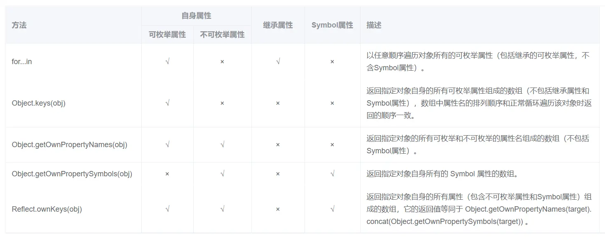

https://github.com/pengpeng1020/front-end-interview/tree/master/%E5%89%8D%E7%AB%AF%E9%9D%A2%E8%AF%95

### 1. 创建对象的方法
#### 1. new操作符的实现原理
new操作符的执行过程：
1. 创建一个空对象，作为将要返回的对象实例。
2. 将这个空对象的原型，指向构造函数的prototype属性。
3. 将这个空对象赋值给函数内部的this关键字。/让函数的 this 指向这个对象，执行构造函数的代码（为这个新对象添加属性）
4. 开始执行构造函数内部的代码。

也就是说，构造函数内部，this指的是一个新生成的空对象，所有针对this的操作，都会发生在这个空对象上。构造函数之所以叫“构造函数”，就是说这个函数的目的，就是操作一个空对象（即this对象），将其“构造”为需要的样子。

如果构造函数内部有return语句，而且return后面跟着一个对象(**必须是对象**)，new命令会返回return语句指定的对象；否则，就会不管return语句，返回this对象。

另一方面，如果对**普通函数**（内部没有this关键字的函数）使用new命令，则会返回一个空对象。但还是照样执行函数中的代码。

---
new 是对一个函数进行构造调用,它直接**找到离它最近的函数**
```js
new foo().getName (); 

等价于
var obj = new foo();
obj.getName();
```

new命令简化的内部流程，可以用下面的代码表示。
```js
function _new(/* 构造函数 */ constructor, /* 构造函数参数 */ params) {
  // 将 arguments 对象转为数组
  var args = [].slice.call(arguments);
  // 取出构造函数
  var constructor = args.shift();
  // 创建一个空对象，继承构造函数的 prototype 属性
  var context = Object.create(constructor.prototype);
  // 执行构造函数
  var result = constructor.apply(context, args);
  // 如果返回结果是对象，就直接返回，否则返回 context 对象
  return (typeof result === 'object' && result != null) ? result : context;
}

// 实例
var actor = _new(Person, '张三', 28);
```

#### 1.2 Object.create()
生成实例对象的常用方法是，使用new命令让构造函数返回一个实例。但是很多时候，只能拿到一个实例对象，它可能根本不是由构建函数生成的，那么能不能从一个实例对象，生成另一个实例对象呢？

JavaScript 提供了Object.create()方法，用来满足这种需求。该方法接受一个对象作为参数，然后以它为原型，返回一个实例对象。该实例完全继承原型对象的属性。

Object.create()方法生成的新对象，动态继承了原型。在原型上添加或修改任何方法，会立刻反映在新对象之上。
```js
var obj1 = { p: 1 };
var obj2 = Object.create(obj1);

obj1.p = 2;
obj2.p // 2
```

实际上，Object.create()方法可以用下面的代码代替。
```js

if (typeof Object.create !== 'function') {
  Object.create = function (obj) {
    function F() {}
    F.prototype = obj;
    return new F();
  };
}

function Person(name) {
  this.name = name
  if(typeof this.say != 'function') {
    Person.prototype.say = function(){
    alert(this.name)}
  }
}
const p1 = new Person('hnk')
const p2 = new Person('zha')
p1.say = function(){
    alert('as')}
p1.say()    
```
上面代码表明，Object.create()方法的实质是新建一个空的构造函数F，然后让F.prototype属性指向参数对象obj，最后返回一个F的实例，从而实现让该实例继承obj的属性。

#### 1.3 创建对象的方法
>https://juejin.cn/post/6844903450614956039 JavaScript 创建对象的 7 种方法
>[JavaScript的几种创建对象的方式](https://github.com/funnycoderstar/blog/blob/master/docs/interview/JavaScript/JavaScript%E7%9A%84%E5%87%A0%E7%A7%8D%E5%88%9B%E5%BB%BA%E5%AF%B9%E8%B1%A1%E7%9A%84%E6%96%B9%E5%BC%8F.md)


### 2. Map
#### 2.1 Map和Object的区别


#### 2.1 Map和weakMap的区别
**Map**
map本质上就是键值对的集合，但是普通的Object中的键值对中的键只能是字符串。而ES6提供的Map数据结构类似于对象，但是它的键不限制范围，可以是任意类型，是一种更加完善的Hash结构。如果Map的键是一个原始数据类型，只要两个键严格相同，就视为是同一个键。

Map数据结构有以下操作方法：
- size： map.size 返回Map结构的成员总数。
- set(key,value)：设置键名key对应的键值value，然后返回整个Map结构，如果key已经有值，则键值会被更新，否则就新生成该键。（因为返回的是当前Map对象，所以可以链式调用）
- get(key)：该方法读取key对应的键值，如果找不到key，返回undefined。
- has(key)：该方法返回一个布尔值，表示某个键是否在当前Map对象中。
- delete(key)：该方法删除某个键，返回true，如果删除失败，返回false。
- clear()：map.clear()清除所有成员，没有返回值。

Map结构原生提供是三个遍历器生成函数和一个遍历方法
- keys()：返回键名的遍历器。
- values()：返回键值的遍历器。
- entries()：返回所有成员的遍历器。
- forEach()：遍历Map的所有成员。
```js
const map = new Map([
     ["foo",1],
     ["bar",2],
])
for(let key of map.keys()){
    console.log(key);  // foo bar
}
for(let value of map.values()){
     console.log(value); // 1 2
}
for(let items of map.entries()){
    console.log(items);  // ["foo",1]  ["bar",2]
}
map.forEach( (value,key,map) => {
     console.log(key,value); // foo 1    bar 2
})
```

**WeakMap**
WeakMap 对象也是一组键值对的集合，其中的键是弱引用的。**其键必须是对象**，原始数据类型不能作为key值，而值可以是任意的。

该对象也有以下几种方法：
- set(key,value)：设置键名key对应的键值value，然后返回整个Map结构，如果key已经有值，则键值会被更新，否则就新生成该键。（因为返回的是当前Map对象，所以可以链式调用）
- get(key)：该方法读取key对应的键值，如果找不到key，返回undefined。
- has(key)：该方法返回一个布尔值，表示某个键是否在当前Map对象中。
- delete(key)：该方法删除某个键，返回true，如果删除失败，返回false。
- 其clear()方法已经被弃用，所以可以通过创建一个空的WeakMap并替换原对象来实现清除。

**区别**
WeakMap 与 Map 在 API 上的区别主要是两个，一是没有遍历操作（即没有keys()、values()和entries()方法），也没有size属性。因为没有办法列出所有键名，**某个键名是否存在完全不可预测**，跟垃圾回收机制是否运行相关。这一刻可以取到键名，下一刻垃圾回收机制突然运行了，这个键名就没了，为了防止出现不确定性，就统一规定不能取到键名。二是无法清空，即不支持clear方法。因此，WeakMap只有四个方法可用：get()、set()、has()、delete()。

WeakMap的设计目的在于，有时想在某个对象上面存放一些数据，但是这会形成对于这个对象的引用。一旦不再需要这两个对象，就必须手动删除这个引用，否则垃圾回收机制就不会释放对象占用的内存。

而WeakMap的**键名所引用的对象都是弱引用**，即垃圾回收机制不将该引用考虑在内。因此，只要所引用的对象的其他引用都被清除，垃圾回收机制就会释放该对象所占用的内存。也就是说，**一旦不再需要，WeakMap 里面的键名对象和所对应的键值对会自动消失**，不用手动删除引用。

基本上，如果你要往对象上添加数据，又不想干扰垃圾回收机制，就可以使用 WeakMap。一个典型应用场景是，在网页的 DOM 元素上添加数据，就可以使用WeakMap结构。当该 DOM 元素被清除，其所对应的WeakMap记录就会自动被移除。

**总结：**
- Map 数据结构。它类似于对象，也是键值对的集合，但是“键”的范围不限于字符串，各种类型的值（包括对象）都可以当作键。
- WeakMap 结构与 Map 结构类似，也是用于生成键值对的集合。但是 WeakMap 只接受对象作为键名（ null 不可），不接受其他类型的值作为键名。而且 WeakMap 的键名所指向的对象，不计入垃圾回收机制。

### DOM和BOM
- DOM 指的是文档对象模型，（操作网页上的元素的API。比如让盒子移动、变色、轮播图等。）它指的是把文档当做一个对象，这个对象主要定义了处理网页内容的方法和接口。
- BOM 指的是浏览器对象模型，（操作浏览器部分功能的API。比如让浏览器自动滚动。）它指的是把浏览器当做一个对象来对待，这个对象主要定义了与浏览器进行交互的法和接口。BOM的核心是 window，而 window 对象具有双重角色，它既是通过 js 访问浏览器窗口的一个接口，又是一个 Global（全局）对象。这意味着在网页中定义的任何对象，变量和函数，都作为全局对象的一个属性或者方法存在。window 对象含有 location 对象、navigator 对象、screen 对象等子对象，并且 DOM 的最根本的对象 document 对象也是 BOM 的 window 对象的子对象。

#### 常见的DOM操作有哪些
- DOM 节点的获取
DOM 节点的获取的API及使用：
```js
getElementById // 按照 id 查询
getElementsByTagName // 按照标签名查询
getElementsByClassName // 按照类名查询
querySelectorAll // 按照 css 选择器查询 返回一个NodeList对象，包含所有匹配给定选择器的节点。

// 按照 id 查询
var imooc = document.getElementById('imooc') // 查询到 id 为 imooc 的元素
// 按照标签名查询
var pList = document.getElementsByTagName('p')  // 查询到标签为 p 的集合
console.log(divList.length)
console.log(divList[0])
// 按照类名查询
var moocList = document.getElementsByClassName('mooc') // 查询到类名为 mooc 的集合
// 按照 css 选择器查询
var pList = document.querySelectorAll('.mooc') // 查询到类名为 mooc 的集合
```

- DOM 节点的创建
创建一个新节点，并把它添加到指定节点的后面。：
```js
// 首先获取父节点
var container = document.getElementById('container')
// 创建新节点
var targetSpan = document.createElement('span')
// 设置 span 节点的内容
targetSpan.innerHTML = 'hello world'
// 把新创建的元素塞进父节点里去
container.appendChild(targetSpan)
```

>innerHTML指的是从对象的起始位置到终止位置的全部内容,包括Html标签。
innerText   指的是从起始位置到终止位置的内容,但它去除Html标签(但包括其中的文字内容)。可用来防止xss攻击。z

- DOM 节点的删除
删除指定的 DOM 节点：
```js
// 获取目标元素的父元素
var container = document.getElementById('container')
// 获取目标元素
var targetNode = document.getElementById('title')
// 删除目标元素
container.removeChild(targetNode)
```
或者通过子节点数组来完成删除：
```js
// 获取目标元素的父元素
var container = document.getElementById('container')
// 获取目标元素
var targetNode = container.childNodes[1]
// 删除目标元素
container.removeChild(targetNode)
```

- 修改 DOM 元素
修改 DOM 元素这个动作可以分很多维度，比如说移动 DOM 元素的位置，修改 DOM 元素的属性等。
将指定的两个 DOM 元素交换位置:
```js
// 获取父元素
var container = document.getElementById('container')   
 
// 获取两个需要被交换的元素
var title = document.getElementById('title')
var content = document.getElementById('content')
// 交换两个元素，把 content 置于 title 前面
container.insertBefore(content, title)
```

#### children和 childNodes
childNodes返回的是节点的所有子节点集合（NodeLists),包括元素节点、**文本节点、注释节点还有属性节点**。（来自Node接口）

children返回的只是节点的**元素节点**集合（返回HTMLCollection实例)（来自ParentNode接口）

不过两者都是即时的LIVE类型，改变子节点或子元素个数，`.length` 会及时的改变。

e.g.
我们都知道，当我们想要知道一个标签里面有多少子节点的时候，都是使用childNodes来查看。如下面代码（查看ul的子节点）：
```html
<script>
window.onload = function(){
    var oUl = document.getElementsByTagName('ul')[0];
        alert(oUl.childNodes.length);
    //上面弹出语句的结果为：在IE 6-8 浏览器中是2，但在ie9以上或者其他浏览器，如谷歌，火狐等结果都是5，因为这些浏览器都把ul到li之间的空白节点也算上了，所以结果为5。
}
</script>
<body>
    <ul>
        <li></li>
        <li></li>
    </ul>
</body>
```

这就是使用childNodes带来的问题，当然了，我们可以借助nodeType来解决这个问题。通过判断节点的nodeType来得到我们想要的结果，(**因为文本节点的nodeType值等于3，而元素节点的nodeType值等于1**)，代码如下：
```html
<script>
window.onload = function(){
    var oUl = document.getElementsByTagName('ul')[0];
    for(var i=0;i<oUl.childNodes.length;i++){
        if(oUl.childNodes[i].nodeType == 1){
            oUl.childNodes[i].style.backgroundColor = 'red';
        }
    }
}
</script>
<body>
    <ul>
        <li></li>
        <li></li>
    </ul>
</body>
```

上面，我们了解到了childNodes因为浏览器版本的不同，给我们带来的麻烦。虽然借助nodeType可以解决我们的麻烦。但是，有更方便的方法吗？答案是：当然有。它就是children。children和childNodes**最大的区别是，无论什么浏览器使用，都不会把空白节点算进去，也不需要nodeType来帮助判断，直接使用**。当我们要实现上面的效果时，使用children，不需要借助nodeType来做判断，代码如下：
```html
<script>
window.onload = function(){
    var oUl = document.getElementsByTagName('ul')[0];
    for(var i=0;i<oUl.children.length;i++){
        //alert(oUl.children.length) 结果为2；
        oUl.children[i].style.backgroundColor = 'yellow';
    }
}
</script>
<body>
    <ul>
        <li></li>
        <li></li>
    </ul>
</body>
```
他们的区别就是childNodes包括元素节点和文本节点，而**children只包括元素节点**。

>**补充** 在HTML element內的text內容也是text node

#### HTMLCollection和 NodeList
共同点
- 都是类数组对象，都有length属性
- 都有共同的方法：item,可以通过item(index)获取返回结果的元素
- 都是实时变动的，document上面的更改会反映到相关的对象上
    >注：querySeletorAll返回的NodeList是个浅拷贝的类数组对象，**在节点数目上是非实时的**，不过对节点属性进行修改，还是实时反映的。

区别
- **NodeList可以包含任何节点类型，HTMLCollection只包含元素节点**。elementNode就是HTML中的标签。
- HTMLCollection比NodeList多一个方法：nameitem(),除了可以用id，还可以用name来获取节点信息。
- HTMLCollection是比较早期的模型，只能包含HTML元素，早期就有的接口如`document.getElementsByClassName, document.getElementsByTagName`返回的就是HTMLCollection。NodeList是比较新的模型，相比HTMLCollection更加完善，不光有HTML元素，还有text节点和comment。比较新的接口如`document.querySelectorAll`返回的就是NodeList。

>注意，**NodeList 实例可能是动态集合，也可能是静态集合**。所谓动态集合就是一个活的集合，DOM 删除或新增一个相关节点，都会立刻反映在 NodeList 实例。目前，只有Node.childNodes返回的是一个动态集合，其他的 NodeList 都是静态集合。
>```js
>var children = document.body.childNodes;
>children.length // 18
>document.body.appendChild(document.>createElement('p'));
>children.length // 19
>```

>HTMLCollection实例**都是动态集合**，节点的变化会实时反映在集合中。

e.g.
```js
p = document.querySelectorAll('div')  //querySelectorAll返回NodeList 实例
d = document.createElement('div')
document.body.appendChild(d)

p
// NodeList [div#oneGoogleBarEndOfBody]
//   0: div#oneGoogleBarEndOfBody
//   length: 1
//   __proto__: NodeList

p = document.querySelectorAll('div')
// NodeList(2) [div#oneGoogleBarEndOfBody, div]
//   0: div#oneGoogleBarEndOfBody
//   1: div
//   length: 2
//   __proto__: NodeList

// 只是增删节点不实时反应
// 但是修改属性还是实时的
d = document.body.children[12]  //找到刚才添加到节点
d.innerText = 'hello'
p[1].innerText
// "hello"
```

#### 获取DOM节点get系列和query系列哪种性能好
1. 从性能上说get系列的性能都比query系列好，get系列里面各有差异，这些差异可以结合算法如何遍历搜索去理解，都解释得通。

2. getElementsByTagName比querySelectorAll快的原因在于：getElementsByTagName创建的过程不需要做任何操作，只需要返回一个指针即可。而querySelectorAll会循环遍历所有的的结果，然后创建一个新的NodeList。
   >原因：GEBT只能选择固定id或者固定类名。而QS/QSA 均支持CSS的选择器，也就是说你可以这么写
   >```js
   >querySelector('div img .test') //找到div下面的img下面类名为test的元素
   >```

3. 实际在用的过程中取决于要获取的是什么，再进行选择。

4. get系列返回HTMLCollection，是动态的；而querySelector返回NodeLsit，是静态的。

#### 创建带有id属性的DOM元素有什么副作用

如果一个元素拥有ID属性,那么ID属性的属性值就会成为window对象的属性名.

**带有id的DOM树元素会成为全局变量！**
对于DOM树中具有ID的给定HTMLElement，可以使用其ID作为变量名来检索div。所以对于一个div

```html
<div id="example">some text</div>
```
在Internet Explorer 8和Chrome中，可以执行以下操作：
```js
alert(example.innerHTML); //=> 'some text'
```
要么
```js
alert(window['example'].innerHTML); //=> 'some text'
```

#### JS获取元素宽高

dom元素.style.height/width 取得是元素**行内样式**的height值（如果没有行内样式则为空）

getComputedStyle()方法获取计算后的宽高。这个方法取得值是内容content区域的值，与padding、margin和边框无关。

>[原生JS获取元素宽高实践详解](https://juejin.cn/post/6844903687043727368#heading-4)

### 4. 严格模式
use strict 是一种 ECMAscript5 添加的（严格模式）运行模式，这种模式使得 Javascript 在更严格的条件下运行。设立严格模式的目的如下：
- 消除 Javascript 语法的不合理、不严谨之处，减少怪异行为;
- 消除代码运行的不安全之处，保证代码运行的安全；
- 提高编译器效率，增加运行速度；
- 为未来新版本的 Javascript 做好铺垫。

区别：
- 禁止使用 with 语句。
- 禁止 this 关键字指向全局对象。(指向undefined)
- 对象不能有重名的属性，否则报错。
- 变量必须声明后再使用
- 不能使用fn.caller和fn.arguments获取函数调用的堆栈
- 不能对只读属性赋值，否则报错
- 不能删除不可删除的属性，否则报错

>详见
https://github.com/ruanyf/es6tutorial/blob/3929f4f21148dcd2a10d2ebc722323a5dbd473f4/docs/module.md#%E4%B8%A5%E6%A0%BC%E6%A8%A1%E5%BC%8F

### 5. 遍历方法
#### 5.1 for ... of
一个数据结构只要部署了Symbol.iterator属性，就被视为**具有 iterator 接口**，就可以用for...of循环遍历它的成员。也就是说，for...of循环内部调用的是数据结构的Symbol.iterator方法。

for...of循环可以使用的范围包括数组、Set 和 Map 结构、**某些**类似数组的对象（比如arguments对象、DOM NodeList 对象）、后文的 Generator 对象，以及字符串。(普通的对象不可)

##### 5.1.1 使用for...of遍历对象
- 如果需要遍历的对象是类数组对象(不含有iterator接口的，比如自己写出来的类数组对象)，用Array.from转成数组即可。
- 如果不是类数组对象，就给对象添加一个`[Symbol.iterator]`属性，并指向一个迭代器(Generator)即可。
```js
//方法一：
var obj = {
    a:1,
    b:2,
    c:3
};

obj[Symbol.iterator] = function(){
	var keys = Object.keys(this);
	var count = 0;
	return {
		next(){
			if(count<keys.length){
				return {value: obj[keys[count++]],done:false};
			}else{
				return {value:undefined,done:true};
			}
		}
	}
};

for(var k of obj){
	console.log(k);
}


// 方法二
var obj = {
    a:1,
    b:2,
    c:3
};
obj[Symbol.iterator] = function*(){
    var keys = Object.keys(obj);
    for(var k of keys){
        yield [k,obj[k]]
    }
};

for(var [k,v] of obj){
    console.log(k,v);
}
```

**注意：**
**for...of 默认遍历的是值（不包括键名）**， 如果用`for(var [k,v] of obj)`这种方式才可以访问键名

for...in遍历的是键名

#### 5.2 比较
##### `for`循环。
以数组为例，JavaScript 提供多种遍历语法。最原始的写法就是`for`循环。

```javascript
for (var index = 0; index < myArray.length; index++) {
  console.log(myArray[index]);
}
```

##### `forEach`方法
这种写法比较麻烦，因此数组提供内置的`forEach`方法。

```javascript
myArray.forEach(function (value) {
  console.log(value);
});
```

这种写法的问题在于，**无法中途跳出**`forEach`循环，`break`命令或`return`命令都不能奏效。

##### `for...in`循环
`for...in`循环可以遍历数组的键名。

```javascript
for (var index in myArray) {
  console.log(myArray[index]);
}
```

`for...in`循环**有几个缺点**。

- 数组的键名本来是数字，但是`for...in`循环是**以字符串作为键名**“0”、“1”、“2”等等。
  >for…of 遍历获取的是对象的键值，for…in 获取的是对象的键名
- `for...in`循环不仅遍历数字键名，还会遍历手动添加的其他键，甚至包括原型链上的键。
  >for… in 会遍历对象的整个原型链，性能非常差不推荐使用，而 for … of 只遍历当前对象不会遍历原型链
- 某些情况下，`for...in`循环会以任意顺序遍历键名。

总之，`for...in`循环**主要是为遍历对象而设计的**，不适用于遍历数组。

##### `for...of`循环
`for...of`循环相比上面几种做法，有一些显著的优点。

```javascript
for (let value of myArray) {
  console.log(value);
}
```

- 有着同`for...in`一样的简洁语法，但是没有`for...in`那些缺点。
- 不同于`forEach`方法，它可以与`break`、`continue`和`return`配合使用。
- 提供了遍历所有数据结构的统一操作接口。

#### 5.3 数组的遍历方法


**forEach会改变数组吗**
原始数据类型不会改变，引用也不会改变，但是可以改变引用对象的属性(MDN说法是不改变原数组)

**ES6 提供三个新的方法** —— entries()，keys()和values() —— 用于遍历数组。它们都返回一个遍历器对象，可以用for...of循环进行遍历，唯一的区别是keys()是对键名的遍历、values()是对键值的遍历，entries()是对键值对的遍历

#### 5.4 对象的遍历方法

>https://segmentfault.com/a/1190000039142445

##### 对象属性的顺序问题

```js
var obj = {
  '-1': '全部',
  '0' : '正常',
  '1' : '失效'
};

for (let key in obj) {
   console.log(key, obj[key]);
};

Object.keys(obj)    //['0', '1', '-1']

// 0 正常
// 1 失效
// -1 全部
```

Object的key的排序规则:

- 如果key是整数（如：123）或者整数类型的字符串（如：“123”），那么会按照从小到大的排序。
- 除此之外，其它数据类型，都按照对象key的实际创建顺序排序。

另外，如果key中除了整数或者整数类型的字符串外，还含有其它数据类型，则整数放在最前面，比如：

```js
var obj = {
  'a': 111,
  '我' : 222,
  '1' : 333,
  '1.3': 444,
  '3': 555

for (let key in obj) {
   console.log(key, obj[key]);
};

// 1 333
// 3 555
// a 111
// 我 222
// 1.3 444
```


### 6. AJAX
AJAX是 Asynchronous JavaScript and XML 的缩写，指的是通过 JavaScript 的 异步通信，从服务器获取 XML 文档从中提取数据，再更新当前网页的对应部分，而不用刷新整个网页。

创建AJAX请求的步骤：
- **创建一个 XMLHttpRequest 对象**。
- 在这个对象上**使用 open 方法创建一个 HTTP 请求**，open 方法所需要的参数是请求的方法、请求的地址、是否异步和用户的认证信息。
  >可以在open中拦截请求,onreadystatechange 中拦截相应
- 在发起请求前，可以**为这个对象添加一些信息和监听函数**。比如说可以通过 setRequestHeader 方法来为请求添加头信息。还可以为这个对象添加一个状态监听函数。一个 XMLHttpRequest 对象一共有 5 个状态，当它的状态变化时会触发onreadystatechange 事件，可以通过设置监听函数，来处理请求成功后的结果。当对象的 readyState 变为 4 的时候，代表服务器返回的数据接收完成，这个时候可以通过判断请求的状态，如果状态是 2xx 或者 304 的话则代表返回正常。这个时候就可以通过 response 中的数据来对页面进行更新了。
- 当对象的属性和监听函数设置完成后，最后**调用 sent 方法来向服务器发起请求**，可以传入参数作为发送的数据体。

```js
const SERVER_URL = "/server";
let xhr = new XMLHttpRequest();
// 创建 Http 请求(第三个参数`true`，表示请求是异步的。)
xhr.open("GET", url, true);
// 设置状态监听函数(指定回调函数，监听通信状态（`readyState`属性）的变化。)
xhr.onreadystatechange = function() {
  if (this.readyState !== 4) return;
  // 当请求成功时
  if (this.status === 200) {
    handle(this.response);
  } else {
    console.error(this.statusText);
  }
};
// 设置请求失败时的监听函数
xhr.onerror = function() {
  console.error(this.statusText);
};
// 设置请求头信息
xhr.responseType = "json";
xhr.setRequestHeader("Accept", "application/json");
// 发送 Http 请求
xhr.send(null);
```
上面代码中，`send()`的参数为`null`，表示发送请求的时候，不带有数据体。如果发送的是 POST 请求，这里就需要指定数据体。
`xhr.send('foo=bar');`

一旦拿到服务器返回的数据，AJAX 不会刷新整个网页，而是只更新网页里面的相关部分，从而不打断用户正在做的事情。

注意，AJAX 只能向**同源**网址（协议、域名、端口都相同）发出 HTTP 请求，如果发出跨域请求，就会报错。


#### ajax中post提交对象问题

send方法的参数就是发送的数据。多种格式的数据，都可以作为它的参数。

```js
void send();
void send(ArrayBufferView data);
void send(Blob data);
void send(Document data);
void send(String data);
void send(FormData data);
```
如果send()发送 DOM 对象，在发送之前，数据会先被串行化。如果发送二进制数据，最好是发送ArrayBufferView或Blob对象，这使得通过 Ajax 上传文件成为可能。

>https://wangdoc.com/javascript/bom/xmlhttprequest.html#xmlhttprequestopen

---
json格式发送对象

axios默认的contentType是application/json

```js
data = (method != 'GET' && typeof data=='object')?JSON.stringify(data):null;

xhr.setRequestHeader("Content-type", "application/json");

xhr.send(data);
```

#### XMLHttpRequest.readyState

`XMLHttpRequest.readyState`返回一个整数，表示实例对象的当前状态。该属性只读。它可能返回以下值。

- 0，表示 XMLHttpRequest 实例已经生成，但是实例的`open()`方法还没有被调用。
- 1，表示`open()`方法已经调用，但是实例的`send()`方法还没有调用，仍然可以使用实例的`setRequestHeader()`方法，设定 HTTP 请求的头信息。
- 2，表示实例的`send()`方法已经调用，并且服务器返回的头信息和状态码已经收到。
- 3，表示正在接收服务器传来的数据体（body 部分）。这时，如果实例的`responseType`属性等于`text`或者空字符串，`responseText`属性就会包含已经收到的部分信息。
- 4，表示服务器返回的数据已经完全接收，或者本次接收已经失败。

通信过程中，每当实例对象发生状态变化，它的`readyState`属性的值就会改变。这个值每一次变化，都会触发`readyStateChange`事件。

>https://wangdoc.com/javascript/bom/xmlhttprequest.html#xmlhttprequestopen

#### 6.1 ajax、axios、fetch的区别
（1）AJAX
Ajax 即“AsynchronousJavascriptAndXML”（异步 JavaScript 和 XML），是指一种创建交互式网页应用的网页开发技术。它是一种在无需重新加载整个网页的情况下，能够更新部分网页的技术。通过在后台与服务器进行少量数据交换，Ajax 可以使网页实现异步更新。这意味着可以在不重新加载整个网页的情况下，对网页的某部分进行更新。传统的网页（不使用 Ajax）如果需要更新内容，必须重载整个网页页面。其缺点如下：
- 本身是针对MVC编程，不符合前端MVVM的浪潮
- 基于原生XHR开发，XHR本身的架构不清晰
- 不符合关注分离（Separation of Concerns）的原则
- 配置和调用方式非常混乱，而且基于事件的异步模型不友好。

（2）Fetch
fetch号称是AJAX的替代品，是在ES6出现的，使用了ES6中的promise对象。Fetch是基于promise设计的。Fetch的代码结构比起ajax简单多。fetch不是ajax的进一步封装，而是原生js，没有使用XMLHttpRequest对象。

fetch的优点：
- 语法简洁，更加语义化
- 基于标准 Promise 实现，支持 async/await
- 更加底层，提供的API丰富（request, response）
- 脱离了XHR，是ES规范里新的实现方式
  
fetch的缺点：
- fetch只对网络请求报错，对400，500都当做成功的请求，服务器返回 400，500 错误码时并不会 reject，只有网络错误这些导致请求不能完成时，fetch 才会被 reject。
- fetch默认不会带cookie，需要添加配置项： fetch(url, {credentials: 'include'})
- fetch不支持abort，不支持超时控制，使用setTimeout及Promise.reject的实现的超时控制并不能阻止请求过程继续在后台运行，造成了流量的浪费
- fetch没有办法原生监测请求的进度，而XHR可以

（3）Axios
Axios 是一种基于Promise封装的HTTP客户端，其特点如下：
- 浏览器端发起XMLHttpRequests请求
- node端发起http请求
- 支持Promise API
- 监听请求和返回
- 对请求和返回进行转化
- 取消请求
- 自动转换json数据
- 客户端支持抵御XSRF攻击(其实Axios，就是利用双重Cookie来防御CSRF攻击的。 Axios 提供了 xsrfCookieName 和 xsrfHeaderName 两个属性来分别设置 CSRF 的 Cookie 名称和 HTTP 请求头的名称)

---
双重cookie就是将 token 设置在 cookie 中。在提交(put,post)等请求的时候，提交cookie。并通过请求头或请求体中携带上的 Cookie 中已设置的 token，服务器接收到请求后，再进行对比校验。

>axios的好处 [Axios or fetch()：你更中意哪一个？](https://juejin.cn/post/6844904078284177422)

### 变量提升

执行上下文创建阶段：在这个阶段中，执行上下文会分别创建变量对象，建立作用域链，以及确定this的指向。
其中变量会被先赋值为undefined。

>看 [变量对象（真正理解何为提升）](https://github.com/amandakelake/blog/issues/7)  --amandakelake

**注意**
- 函数是一等公民。使用function关键字声明的函数。在变量对象中以函数名建立一个属性，属性值为指向该函数所在**内存地址的引用**。即会把整段函数代码都初始化。可以直接使用。
  >这里要清楚理解，函数声明才会被提升，**函数表达式(`const f = function (){}`)不会被提升**，**函数表达式就相当于变量声明**
  >注意：**这里说的只是声明阶段**，执行阶段函数还是会被覆盖
- 每找到一个变量声明，就在变量对象中以变量名建立一个属性，属性值为undefined。**如果该变量名的属性已经存在**，为了防止同名的函数被修改为undefined，**则会直接跳过**，原属性值不会被修改。
也就是同一个执行上下文中，变量对象是唯一的，但有可能在下个阶段（代码执行阶段）被修改赋值
>e.g.
>```js
>  function testOrder(arg) {
>      console.log(arg); // arg是形参，不会被重新定义
>      console.log(a); // 因为函数声明比变量声明优先级高，所以这里a是函数
>      var arg = 'hello'; // var arg;变量声明被忽略， arg = 'hello'被执行
>      var a = 10; // var a;被忽视; a = 10被执行，a变成number
>      function a() {
>          console.log('fun');
>      } // 被提升到作用域顶部
>      console.log(a); // 输出10
>      console.log(arg); // 输出hello
>   }; 
>   testOrder('hi');
> ---
> hi 
>function a() {
>    console.log('fun');
> }
>10 
>hello 
>```

### 事件

**事件**：就是文档或浏览器窗口中发生的一些特定的交互瞬间。对于 Web 应用来说，有下面这些代表性的事件：点击某个元素、将鼠标移动至某个元素上方、关闭弹窗等等。

**事件的三要素**：事件源、事件、事件驱动程序。

#### 绑定事件的方式
##### DOM0的写法：onclick
1. 获取事件源：document.getElementById(“box”); 
>获取事件源的方式
>```js
>var div1 = document.getElementById("box1");      //方式一：通过id获取单个标签
>var arr1 = document.getElementsByTagName("div");     //方式二：通过 标签名 获得 标签数组，所以有s
>var arr2 = document.getElementsByClassName("hehe");  //方式三：通过 类名 获得 标签数组，所以有s

2. 绑定事件： 事件源box.onclick = function(){ 事件驱动程序 };
>绑定事件的方式
>方式一：直接绑定匿名函数
>方式二：先单独定义函数，再绑定
>方式三：行内绑定
```js
<!--行内绑定-->
<div id="box1" onclick="fn()"></div>

<script type="text/javascript">

    function fn() {
        alert("我是弹出的内容");
    }

</script>
```

3. 书写事件驱动程序：关于DOM的操作。

```js
<body>
<button>点我</button>
<script>
    var btn = document.getElementsByTagName("button")[0];

    //这种事件绑定的方式，如果绑定多个，则后面的会覆盖掉前面的
    btn.onclick = function () {
        console.log("事件1");
    }

    btn.onclick = function () {
        console.log("事件2");
    }

</script>
</body>
// 事件2
```
我们可以看到，DOM对象.事件 = 函数的这种绑定事件的方式：**一个元素的一个事件只能绑定一个响应函数**。如果绑定了多个响应函数，则后者会覆盖前者。

##### DOM2的写法：addEventListener（高版本浏览器）
addEventListener() ---添加事件侦听器
removeEventListener() ---删除事件侦听器

```javascript
    element.addEventListener('click', function () {

    }, false);
```


参数解释：

- 参数1：事件名的字符串(注意，没有on)

- 参数2：回调函数：当事件触发时，该函数会被执行

- 参数3：**true表示捕获阶段触发，false表示冒泡阶段触发（默认）**。如果不写，则默认为false。
  
举例：

```html
<body>
<button>按钮</button>
<script>
    var btn = document.getElementsByTagName("button")[0];

    // addEventListener: 事件监听器。 原事件被执行的时候，后面绑定的事件照样被执行
    // 这种写法不存在响应函数被覆盖的情况。（更适合团队开发）
    btn.addEventListener("click", fn1);
    btn.addEventListener("click", fn2);

    function fn1() {
        console.log("事件1");
    }

    function fn2() {
        console.log("事件2");
    }

</script>
</body>
```

点击按钮后，上方代码的打印结果：


```html
    事件1
    事件2
```

我们可以看到，`addEventListener()`这种绑定事件的方式：

- 一个元素的一个事件，可以绑定多个响应函数。不存在响应函数被覆盖的情况。**执行顺序是**：事件被触发时，响应函数会按照函数的绑定顺序执行。

- addEventListener()中的**this**，**是绑定事件的对象**。

- `addEventListener()`不支持 IE8 及以下的浏览器。在IE8中可以使用`attachEvent`来绑定事件。
-  普通方式绑定事件后，不可以取消。`addEventListener`绑定后则可以用 `removeEvenListener` 取消。

#### 事件对象

当事件的响应函数被触发时，会产生一个事件对象`event`。浏览器每次都会将这个事件`event`作为实参传进之前的响应函数。

这个对象中包含了与当前事件相关的一切信息。比如鼠标的坐标、键盘的哪个按键被按下、鼠标滚轮滚动的方向等。

##### 获取触发事件的对象

event.target

event.currentTarget 标识是当事件沿着 DOM 触发时事件的**当前目标**。它总是指向事件绑定的元素，而 Event.target 则是事件**触发的元素**。

**获取事件传播路径**
Event.composedPath() 返回一个 EventTarget对象数组，表示将在其上调用事件侦听器的对象。

e.g.
```js
Array [ p, ShadowRoot, open-shadow, body, html, HTMLDocument https://mdn.github.io/web-components-examples/composed-composed-path/, Window ]
```

##### 获取 event 对象

写法是 `event`。比如：


##### event 属性

event 有很多属性，比如：


由于pageX 和 pageY的兼容性不好，我们可以这样做：

- 鼠标在页面的位置 = 滚动条滚动的距离 + 可视区域的坐标。


#### DOM事件流
>看 [对JS事件流的深入理解](https://zhuanlan.zhihu.com/p/114276880)
>https://github.com/qianguyihao/Web/edit/master/04-JavaScript%E5%9F%BA%E7%A1%80/40-%E4%BA%8B%E4%BB%B6%E7%9A%84%E4%BC%A0%E6%92%AD%E5%92%8C%E4%BA%8B%E4%BB%B6%E5%86%92%E6%B3%A1.md

事件传播的三个阶段是：事件捕获、目标和事件冒泡。

- 事件捕获阶段：事件从祖先元素往子元素查找（DOM树结构），直到捕获到事件目标 target。在这个过程中，默认情况下，事件相应的监听函数是不会被触发的。

- 事件目标：当到达目标元素之后，执行目标元素该事件相应的处理函数。如果没有绑定监听函数，那就不执行。

- 事件冒泡阶段：事件从事件目标 target 开始，从子元素往冒泡祖先元素冒泡，直到页面的最上一级标签。

如下图所示：


##### 事件捕获

addEventListener可以捕获事件：

```javascript
    box1.addEventListener("click", function () {
        alert("捕获 box3");
    }, true);
```

上面的方法中，参数为true，代表事件在捕获阶段执行。

代码演示：

```javascript
    //参数为true，代表事件在「捕获」阶段触发；参数为false或者不写参数，代表事件在「冒泡」阶段触发
    box3.addEventListener("click", function () {
        alert("捕获 child");
    }, true);

    box2.addEventListener("click", function () {
        alert("捕获 father");
    }, true);

    box1.addEventListener("click", function () {
        alert("捕获 grandfather");
    }, true);

    document.addEventListener("click", function () {
        alert("捕获 body");
    }, true);
```

效果演示：


（如果上面的图片打不开，请点击：<http://img.smyhvae.com/20180204_1101.gif>）

**重点**：捕获阶段，事件依次传递的顺序是：window --> document --> html--> body --> 父元素、子元素、目标元素。

说明：

（1）第一个接收到事件的对象是 **window**（有人会说body，有人会说html，这都是错误的）。

（2）JS中涉及到DOM对象时，有两个对象最常用：window、doucument。它们俩是最先获取到事件的。

**补充一个知识点：**

在 js中：

- 如果想获取 `html`节点，方法是`document.documentElement`。

- 如果想获取 `body` 节点，方法是：`document.body`。

二者不要混淆了。

##### 事件冒泡

**事件冒泡**: 当一个元素上的事件被触发的时候（比如说鼠标点击了一个按钮），同样的事件将会在那个元素的所有**祖先元素**中被触发。这一过程被称为事件冒泡；这个事件从原始元素开始一直冒泡到DOM树的最上层。

通俗来讲，冒泡指的是：**子元素的事件被触发时，父元素的同样的事件也会被触发**。取消冒泡就是取消这种机制。

代码演示：

```javascript
    //事件冒泡
    box3.onclick = function () {
        alert("child");
    }

    box2.onclick = function () {
        alert("father");
    }

    box1.onclick = function () {
        alert("grandfather");
    }

    document.onclick = function () {
        alert("body");
    }

```


（如果上面的图片打不开，请点击：<http://img.smyhvae.com/20180204_1028.gif>）

上图显示，当我点击子元素 box3 的时候，它的父元素box2、box1、body都依次被触发了。即使我改变代码的顺序，也不会影响效果的顺序。

当然，上面的代码中，我们用 addEventListener 这种 DOM2的写法也是可以的，但是第三个参数要写 false，或者不写。

**冒泡顺序**：

一般的浏览器: （除IE6.0之外的浏览器）

- div -> body -> html -> document -> window

IE6.0：

- div -> body -> html -> document

**不是所有的事件都能冒泡**

以下事件不冒泡：blur、focus、load、unload、mouseenter、mouseleave。意思是，事件不会往父元素那里传递。

我们检查一个元素是否会冒泡，可以通过事件的以下参数：

```javascript
    event.bubbles
```

如果返回值为true，说明该事件会冒泡；反之则相反。

举例：

```javascript
    box1.onclick = function (event) {
        alert("冒泡 child");

        event = event || window.event;
        console.log(event.bubbles); //打印结果：true。说明 onclick 事件是可以冒泡的
    }
```

##### 阻止冒泡

大部分情况下，冒泡都是有益的。当然，如果你想阻止冒泡，也是可以的。可以按下面的方法阻止冒泡。

**阻止冒泡的方法**

**w3c的方法**：（火狐、谷歌、IE11）

```javascript
event.stopPropagation();
```

IE10以下则是：

```javascript
event.cancelBubble = true
```

兼容代码如下：

```javascript
   box3.onclick = function (event) {

        alert("child");

        //阻止冒泡
        event = event || window.event;

        if (event && event.stopPropagation) {
            event.stopPropagation();
        } else {
            event.cancelBubble = true;
        }
    }
```

上方代码中，我们对box3进行了阻止冒泡，产生的效果是：事件不会继续传递到 father、grandfather、body了。

**阻止冒泡的举例**

```html
<!DOCTYPE html>
<html>
    <head>
        <meta charset="UTF-8" />
        <title></title>
        <style type="text/css">
            #box1 {
                width: 100px;
                height: 100px;
                background-color: red;
                /*
        * 开启box1的绝对定位
        */
                position: absolute;
            }
        </style>

        <script type="text/javascript">
            window.onload = function() {
                /*
                 * 使div可以跟随鼠标移动
                 */

                //获取box1
                var box1 = document.getElementById('box1');

                //给整个页面绑定：鼠标移动事件
                document.onmousemove = function(event) {
                    //兼容的方式获取event对象
                    event = event || window.event;

                    // 鼠标在页面的位置 = 滚动条滚动的距离 + 可视区域的坐标。
                    var pagex = event.pageX || scroll().left + event.clientX;
                    var pagey = event.pageY || scroll().top + event.clientY;

                    //   设置div的偏移量（相对于整个页面）
                    // 注意，如果想通过 style.left 来设置属性，一定要给 box1 开启绝对定位。
                    box1.style.left = pagex + 'px';
                    box1.style.top = pagey + 'px';
                };

                // 【重要注释】
                // 当 document.onmousemove 和 box2.onmousemove 同时触发时，通过  box2 阻止事件向 document 冒泡。
                // 也就是说，只要是在 box2 的区域，就只触发 document.onmousemove 事件
                var box2 = document.getElementById('box2');
                box2.onmousemove = function(event) {
                    //阻止冒泡
                    event = event || window.event;

                    if (event && event.stopPropagation) {
                        event.stopPropagation();
                    } else {
                        event.cancelBubble = true;
                    }
                };
            };

            // scroll 函数封装
            function scroll() {
                return {
                    //此函数的返回值是对象
                    left: window.pageYOffset || document.body.scrollTop || document.documentElement.scrollTop,
                    right: window.pageXOffset || document.body.scrollLeft || document.documentElement.scrollLeft,
                };
            }
        </script>
    </head>
    <body style="height: 1000px;width: 2000px;">
        <div id="box2" style="width: 300px; height: 300px; background-color: #bfa;"></div>
        <div id="box1"></div>
    </body>
</html>
```

关键地方可以看代码中的注释。

效果演示：


>使用stopPropagation()取消事件传播时，事件不会被传播给下一个节点，但是，同一节点上的**其他listener还是会被执行**
>
>stopPropagation方法只能阻止这个事件的传播，不能取消这个事件。
>如果想要彻底取消该事件，不再触发后面所有click的监听函数，可以使用**stopImmediatePropagation方法**(取消事件)。
```js
p.addEventListener('click', function (event) {
  event.stopImmediatePropagation();
  console.log(1);
});

p.addEventListener('click', function(event) {
  // 不会被触发
  console.log(2);
});
```
上面代码中，**stopImmediatePropagation方法**可以**彻底取消这个事件**，使得后面绑定的所有click监听函数都不再触发。所以，只会输出1，不会输出2。

##### 如何取消默认事件？如何阻止事件的默认行为？
- 取消默认事件

  W3C：preventDefault()

  IE: e.returnValue:false;

- 阻止默认行为：

  return false

  原生的js会阻止默认行为，但会继续冒泡；

  jquery会阻止默认行为，并停止冒泡。

preventDefault()只是阻止默认行为，跟JS的事件传播一点关系都没有

一旦发起了preventDefault()，在之后传递下去的事件里面也會有效果

```js
document.querySelector("#id-checkbox").addEventListener("click", function(event) {
         document.getElementById("output-box").innerHTML += "Sorry! <code>preventDefault()</code> won't let you check this!<br>";
         event.preventDefault();
}, false);
```

>https://developer.mozilla.org/zh-CN/docs/Web/API/Event/preventDefault


#### 事件委托

事件委托，通俗地来讲，就是把一个元素响应事件（click、keydown......）的函数**委托到另一个元素**。

比如说有一个列表 ul，列表之中有大量的列表项 `<a>`标签：

```html
<ul id="parent-list">
    <li><a href="javascript:;" class="my_link">超链接一</a></li>
    <li><a href="javascript:;" class="my_link">超链接二</a></li>
    <li><a href="javascript:;" class="my_link">超链接三</a></li>
</ul>
```

当我们的鼠标移到`<a>`标签上的时候，需要获取此`<a>`的相关信息并飘出悬浮窗以显示详细信息，或者当某个`<a>`被点击的时候需要触发相应的处理事件。我们通常的写法，是为每个`<a>`都绑定类似onMouseOver或者onClick之类的事件监听：

```javascript
    window.onload = function(){
        var parentNode = document.getElementById("parent-list");
        var aNodes = parentNode.getElementByTagName("a");
        for(var i=0, l = aNodes.length; i < l; i++){

            aNodes[i].onclick = function() {
                console.log('我是超链接 a 的单击相应函数');
            }
        }
    }
```

但是，上面的做法过于消耗内存和性能。**我们希望，只绑定一次事件，即可应用到多个元素上**，即使元素是后来添加的。

因此，比较好的方法就是把这个点击事件绑定到他的父层，也就是 `ul` 上，然后在执行事件函数的时候再去匹配判断目标元素。如下：

```html
    <!DOCTYPE html>
<html>
    <head>
        <meta charset="utf-8" />
        <title></title>
        <script type="text/javascript">
            window.onload = function() {

                // 获取父节点，并为它绑定click单击事件。 false 表示事件在冒泡阶段触发（默认）
                document.getElementById('parent-list').addEventListener('click', function(event) {
                    event = event || window.event;

                    // e.target 表示：触发事件的对象
                    //如果触发事件的对象是我们期望的元素，则执行否则不执行
                    if (event.target && event.target.className == 'link') {
                    // 或者写成 if (event.target && event.target.nodeName.toUpperCase() == 'A') {
                        console.log('我是ul的单击响应函数');
                    }
                }, false);
            };
        </script>
    </head>
    <body>
        <ul id="parent-list" style="background-color: #bfa;">
            <li>
                <p>我是p元素</p>
            </li>
            <li><a href="javascript:;" class="link">超链接一</a></li>
            <li><a href="javascript:;" class="link">超链接二</a></li>
            <li><a href="javascript:;" class="link">超链接三</a></li>
        </ul>
    </body>
```

上方代码，为父节点注册 click 事件，当子节点被点击的时候，click事件会从子节点开始**向父节点冒泡**。**父节点捕获到事件**之后，开始执行方法体里的内容：通过判断 event.target 拿到了被点击的子节点`<a>`。从而可以获取到相应的信息，并作处理。

换而言之，参数为false，说明事件是在冒泡阶段触发（子元素向父元素传递事件）。而父节点注册了事件函数，子节点没有注册事件函数，此时，会在父节点中执行函数体里的代码。

> 注：
判断类名用`event.target.className == 'link'`
判断标签名用`event.target.nodeName == 'DIV'`

**总结**：事件委托是利用了冒泡机制（不一定），减少了事件绑定的次数，减少内存消耗，提高性能。

---
对于事件代理来说，**在事件捕获或者事件冒泡阶段处理并没有明显的优劣之分**，但是由于事件冒泡的事件流模型被所有主流的浏览器兼容，从兼容性角度来说还是建议大家使用事件冒泡模型。

##### 优缺点

优点：
1. 减少事件注册，节省内存，如：

- table可以代理所有td的click事件
- ul代理所有li的click事件
2. 减少了dom节点更新的操作，处理逻辑只需在委托元素上进行，如：

- 新添加的li不用绑定事件
- 删除li时，不需要进行元素与处理函数的解绑

缺点：
- 事件委托基于冒泡，对于不冒泡的事件（onfoucs和onblur等事件）不支持。
- 层级过多，冒泡过程中，可能会被某层阻止掉。（建议就近委托）
- 把所有事件都用代理就可能会出现事件误判

---
事件委托的参考链接：

- [荐 | JavaScript事件代理和委托（Delegation）](https://www.cnblogs.com/owenChen/archive/2013/02/18/2915521.html)

- [JavaScript 事件委托详解](https://zhuanlan.zhihu.com/p/26536815)

#### 窗口关闭事件

onbeforeunload 事件

触发于：
- 关闭浏览器窗口
- 通过地址栏或收藏夹前往其他页面的时候
- 点击返回，前进，刷新，主页其中一个的时候
- 点击 一个前往其他页面的url连接的时候
- 调用以下任意一个事件的时候：click，document write，document open，document close，window close ，window navigate ，window NavigateAndFind,location replace,location reload,form submit.
- 当用window open打开一个页面，并把本页的window的名字传给要打开的页面的时候。
- 重新赋予location.href的值的时候。
- 通过input type=”submit”按钮提交一个具有指定action的表单的时候。
  
可以用在以下元素：
- BODY, FRAMESET, window

e.g.
```js
window.onbeforeunload = function (e) {
  e = e || window.event;

  // 兼容IE8和Firefox 4之前的版本
  if (e) {
    e.returnValue = '关闭提示';
  }

  // Chrome, Safari, Firefox 4+, Opera 12+ , IE 9+
  return '关闭提示';
};
```

### 正则

>https://wangdoc.com/javascript/stdlib/regexp.html


#### match方法 exec方法
字符串的match方法与正则对象的exec方法非常类似：匹配成功返回一个数组，匹配失败返回null。

如果正则表达式带有g修饰符，则该方法与正则对象的exec方法行为不同，**会一次性返回所有匹配成功的结果**。

```js
var s = 'abba';
var r = /a/g;

s.match(r) // ["a", "a"]
r.exec(s) // ["a"]
```

#### String.prototype.replace()
正则表达式如果不加g修饰符，就替换第一个匹配成功的值，否则替换所有匹配成功的值。

```js
'aaa'.replace('a', 'b') // "baa"
'aaa'.replace(/a/, 'b') // "baa"
'aaa'.replace(/a/g, 'b') // "bbb"
```

replace方法的一个应用，就是**消除字符串首尾两端的空格**。

```js
var str = '  #id div.class  ';

str.replace(/^\s+|\s+$/g, '')
// "#id div.class"
```

replace方法的第二个参数可以使用美元符号$，用来**指代所替换的内容**。

```js
$&：匹配的子字符串。
$`：匹配结果前面的文本。
$'：匹配结果后面的文本。
$n：匹配成功的第n组内容，n是从1开始的自然数。
$$：指代美元符号$。
```

replace方法的第二个参数还可以是一个函数，将每一个匹配内容替换为函数返回值。

作为replace方法第二个参数的替换函数，可以接受多个参数。其中，**第一个参数是捕捉到的内容**，第二个参数是捕捉到的组匹配（有多少个组匹配，就有多少个对应的参数）。此外，最后还可以添加两个参数，倒数第二个参数是捕捉到的内容在整个字符串中的位置（比如从第五个位置开始），最后一个参数是原字符串。

#### String.prototype.split()

该方法接受两个参数，第一个参数是正则表达式，表示分隔规则，第二个参数是返回数组的最大成员数。

```js
// 非正则分隔
'a,  b,c, d'.split(',')
// [ 'a', '  b', 'c', ' d' ]

// 正则分隔，去除多余的空格
'a,  b,c, d'.split(/, */)
// [ 'a', 'b', 'c', 'd' ]

// 指定返回数组的最大成员
'a,  b,c, d'.split(/, */, 2)
[ 'a', 'b' ]
```
上面代码使用正则表达式，去除了子字符串的逗号后面的空格。

#### 字符
**点字符（.)**

点字符（.）匹配除回车（\r）、换行(\n) 、行分隔符（\u2028）和段分隔符（\u2029）以外的所有字符。注意，对于码点大于0xFFFF字符，点字符不能正确匹配，会认为这是两个字符。

**位置字符**
```js
// 从开始位置到结束位置只有test
/^test$/.test('test') // true
/^test$/.test('test test') // false
```

**量词符**
用来设定某个模式出现的次数。

```
? 问号表示某个模式出现0次或1次，等同于{0, 1}。
* 星号表示某个模式出现0次或多次，等同于{0,}。
+ 加号表示某个模式出现1次或多次，等同于{1,}。
```

**非贪婪模式**
即最小可能匹配。只要一发现匹配（匹配最少的次数），就返回结果，不要往下检查。如果想将贪婪模式改为非贪婪模式，可以在量词符后面加一个问号。

```js
var s = 'aaa';
s.match(/a+?/) // ["a"]
```

除了非贪婪模式的加号（+?），还有非贪婪模式的星号（*?）和非贪婪模式的问号（??）。

```
+?：表示某个模式出现1次或多次，匹配时采用非贪婪模式。
*?：表示某个模式出现0次或多次，匹配时采用非贪婪模式。
??：表格某个模式出现0次或1次，匹配时采用非贪婪模式。
```
```js
'abb'.match(/ab*/) // ["abb"]
'abb'.match(/ab*?/) // ["a"]    b匹配0次

'abb'.match(/ab?/) // ["ab"]    b匹配1次
'abb'.match(/ab??/) // ["a"]    b匹配0次
```

#### 字符类（class）
表示有一系列字符可供选择，只要匹配其中一个就可以了。所有可供选择的字符都放在方括号内，比如[xyz] 表示x、y、z之中任选一个匹配。

```js
/[abc]/.test('hello world') // false
/[abc]/.test('apple') // true
```

如果方括号内的第一个字符是`[^]`，则表示除了字符类之中的字符，其他字符都可以匹配。比如，`[^xyz]`表示除了x、y、z之外都可以匹配。

某些情况下，对于连续序列的字符，连字符（-）用来提供简写形式，表示字符的连续范围。比如，`[abc]`可以写成`[a-c]，[0123456789]`可以写成`[0-9]`，同理`[A-Z]`表示26个大写字母。

#### 预定义模式
预定义模式指的是某些常见模式的简写方式。

```
\d 匹配0-9之间的任一数字，相当于[0-9]。
\D 匹配所有0-9以外的字符，相当于[^0-9]。
\w 匹配任意的字母、数字和下划线，相当于[A-Za-z0-9_]。
\W 除所有字母、数字和下划线以外的字符，相当于[^A-Za-z0-9_]。
\s 匹配空格（包括换行符、制表符、空格符等），相等于[ \t\r\n\v\f]。
\S 匹配非空格的字符，相当于[^ \t\r\n\v\f]。
\b 匹配词的边界。
\B 匹配非词边界，即在词的内部。
```

```js
// \s 的例子
/\s\w*/.exec('hello world') // [" world"]

// \b 的例子
/\bworld/.test('hello world') // true
/\bworld/.test('hello-world') // true
/\bworld/.test('helloworld') // false

// \B 的例子
/\Bworld/.test('hello-world') // false
/\Bworld/.test('helloworld') // true
```

#### 组匹配
https://wangdoc.com/javascript/stdlib/regexp.html#%E7%BB%84%E5%8C%B9%E9%85%8D

### 垃圾回收
>看 [V8 引擎垃圾内存回收原理解析](https://juejin.cn/post/6844903993420840967)
> [V8内存管理及垃圾回收机制](https://mp.weixin.qq.com/s/_ZXIRaV1InOyMt3Xe5irDw)
> 看 [前端面试：谈谈 JS 垃圾回收机制](https://segmentfault.com/a/1190000018605776)

我们知道对于栈内存而言，当ESP指针下移，也就是**上下文切换之后，栈顶的空间会自动被回收**。但对于堆内存而言就比较复杂了，我们下面着重分析 堆内存的垃圾回收。

#### 减少垃圾回收
虽然浏览器可以进行垃圾自动回收，但是当代码比较复杂时，垃圾回收所带来的代价比较大，所以应该尽量减少垃圾回收。
- 对数组进行优化：在清空一个数组时，最简单的方法就是给其赋值为[ ]，但是与此同时会创建一个新的空对象，可以将数组的长度设置为0，以此来达到清空数组的目的。
- 对object进行优化：对象尽量复用，对于不再使用的对象，就将其设置为null，尽快被回收。
- 对函数进行优化：在循环中的函数表达式，如果可以复用，尽量放在函数的外面。

#### 哪些情况会导致内存泄漏
以下四种情况会造成内存的泄漏：
- 意外的全局变量：由于使用未声明的变量，而意外的创建了一个全局变量，而使这个变量一直留在内存中无法被回收。
- 被遗忘的计时器或回调函数：设置了 setInterval 定时器，而忘记取消它，如果循环函数有对外部变量的引用的话，那么这个变量会被一直留在内存中，而无法被回收。
- 脱离 DOM 的引用：获取一个 DOM 元素的引用，而后面这个元素被删除，由于一直保留了对这个元素的引用，所以它也无法被回收。
- 闭包：不合理的使用闭包，从而导致某些变量一直被留在内存当中。

>https://segmentfault.com/a/1190000038816646?utm_source=sf-similar-article
[js 内存泄漏场景、如何监控以及分析](https://juejin.cn/post/6844904048961781774#heading-6) 内存泄漏的监控

### 堆和栈
JavaScript引擎需要用栈来维护程序执行期间的上下文的状态，**如果栈空间大了的话**，所有数据都存放在栈空间里面，**会影响到上下文切换的效率**，进而影响整个程序的执行效率。
>见 [V8内存管理及垃圾回收机制](https://mp.weixin.qq.com/s/_ZXIRaV1InOyMt3Xe5irDw)

闭包中的变量们整体被放进一个对象存在堆中

**数据结构中的堆：完全二叉树**
> 见 [JS 变量存储？栈 & 堆？NONONO!](https://juejin.cn/post/6844903997615128583#heading-21)
> [数据结构：堆（Heap）](https://www.jianshu.com/p/6b526aa481b1)
> https://www.ruanyifeng.com/blog/2013/11/stack.html

### 尾调用
什么是尾调用，使用尾调用有什么好处？
尾调用指的是函数的最后一步调用另一个函数。代码执行是基于执行栈的，所以当在一个函数里调用另一个函数时，会保留当前的执行上下文，然后再新建另外一个执行上下文加入栈中。使用尾调用的话，因为已经是函数的**最后一步**，所以这时可以不必再保留当前的执行上下文，从而节省了内存，这就是尾调用优化。但是 ES6 的尾调用优化只在严格模式下开启，正常模式是无效的。

### 解释性语言和编译型语言的区别
（1）解释型语言
使用专门的解释器对源程序逐行解释成特定平台的机器码并立即执行。是代码在执行时才被解释器**一行行动态翻译和执行**，**而不是在执行之前就完成翻译**。解释型语言不需要事先编译，其直接将源代码解释成机器码并立即执行，所以只要某一平台提供了**相应的解释器**即可运行该程序。其特点总结如下
- 解释型语言每次运行都需要将源代码解释称机器码并执行，效率较低；
- 只要平台提供相应的解释器，就可以运行源代码，所以可以方便源程序移植；
  
JavaScript、Python等属于解释型语言。

（2）编译型语言
使用专门的编译器，针对特定的平台，将高级语言源代码一次性的编译成可被该平台硬件执行的机器码，并包装成该平台所能识别的**可执行性程序的格式**。在编译型语言写的程序执行之前，需要一个专门的编译过程，**把源代码编译成机器语言的文件，如exe格式的文件**，以后要再运行时，**直接使用编译结果即可(结果可移植)**，如直接运行exe文件。因为只需编译一次，以后运行时不需要编译，所以编译型语言执行效率高。其特点总结如下：
- 一次性的编译成平台相关的机器语言文件，运行时脱离开发环境，运行效率高；
- 与特定平台相关，一般无法移植到其他平台；
  
C、C++等属于编译型语言。

>https://segmentfault.com/a/1190000013126460

### Function.length

length 属性指明函数的形参个数。 

length 是函数对象的一个属性值，**指该函数有多少个必须要传入的参数**，即形参的个数。

形参的数量**不包括剩余参数个数**，仅包括第一个具有默认值之前的参数个数。

**默认参数不会计入**，默认参数后面的参数也不会计入

与之对比的是，  **arguments.length 是函数被调用时实际传参的个数**。


```js
console.log((function(a, d, b = 1, c) {}).length);  //2
```

### JS动画

1. 使用 setInterval
```js
train.onclick = function() {
      let start = Date.now();

      let timer = setInterval(function() {
        let timePassed = Date.now() - start;

        train.style.left = timePassed / 5 + 'px';

        if (timePassed > 2000) clearInterval(timer);

// 20=1000 / 50; // 每秒 50 帧
      }, 20);
    }
```

2. requestAnimationFrame
```js
function animate({timing, draw, duration}) {

  let start = performance.now();

  requestAnimationFrame(function animate(time) {
    // timeFraction 从 0 增加到 1
    let timeFraction = (time - start) / duration;
    if (timeFraction > 1) timeFraction = 1;

    // 计算当前动画状态
    let progress = timing(timeFraction);

    draw(progress); // 绘制

    if (timeFraction < 1) {
      requestAnimationFrame(animate);
    }

  });
}
```
取消用cancelAnimationFrame

#### requestAnimationFrame是宏任务还是微任务


- 事件循环并不是每一次都会在JS 线程执行完之后唤起GUI 线程
- requestAnimationFrame 的回调出现在哪似乎只和GUI 线程的执行有关
- requestAnimationFrame 表现得既不像宏任务，也不像微任务
- GUI 线程的唤起大概间隔 15ms 以上，与刷新周期60Hz 相对应

>作者：子瞻Luci
链接：https://juejin.cn/post/6844904083392839688

---
requestAnimationFrame的触发是在浏览器重绘之前，MDN文档介绍如下：
>window.requestAnimationFrame() 告诉浏览器——你希望执行一个动画，并且要求浏览器在下次重绘之前调用指定的回调函数更新动画。该方法需要传入一个回调函数作为参数，该回调函数会**在浏览器下一次重绘之前执行**

所以，requestAnimationFrame的回调时机也是在当前的tick中，所以不属于宏任务，但也不是微任务，排在微任务之后。

#### 区别
（1）requestanimationframe会把每一帧中的所有dom操作集中起来，**在一次重绘或回流中就完成**，并且重绘或回流的时间间隔紧紧跟随浏览器的刷新频率

（2）在隐藏或不可见的元素中，requestanimationframe将不会进行重绘或回流，这当然就意味着更少的cpu、gpu和内存使用量

（3）requestanimationframe是由浏览器专门为动画提供的api，在运行时浏览器会自动优化方法的调用，并且**如果页面不是激活状态下的话，动画会自动暂停**，有效节省了cpu开销

---
setTimeout 和 setInterval 的问题是，它们不够精确。它们的内在运行机制决定了 时间间隔参数 实际上只是指定了把动画代码添加到 浏览器UI线程队列 中以等待执行的时间。如果队列前面已经加入了其它任务，那动画代码就要等前面的 任务完成后 再执行，并且如果时间间隔过短（小于16.7ms）会造成丢帧，所以就会导致动画可能不会按照预设的去执行，降低用户体验。

requestAnimationFrame 采用 浏览器时间间隔 ，保持最佳绘制效率，不会因为间隔时间过短，造成过度绘制，消耗性能；也不会因为间隔时间太长，使用动画卡顿不流畅，让各种网页动画效果能够有一个 统一 的刷新机制，从而节省系统资源，提高系统性能，改善视觉效果。

>作者：一尾流莺
链接：https://juejin.cn/post/6991297852462858277