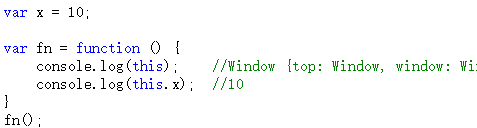
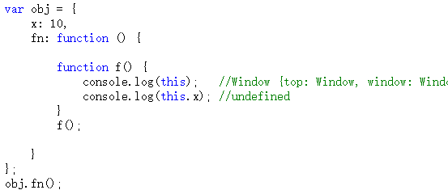
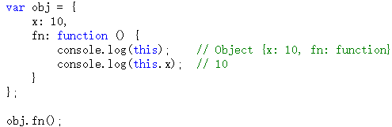
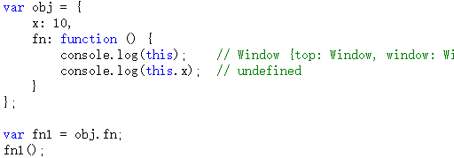

### 1. 作用域
通俗来讲，作用域是一个变量或函数的作用范围。作用域在**函数定义时**，就已经确定了。
**1）全局作用域和函数作用域**
（1）全局作用域
- 最外层函数和最外层函数外面定义的变量拥有全局作用域
- 所有未定义直接赋值的变量自动声明为全局作用域
- 所有window对象的属性拥有全局作用域
- 特殊情况：**在函数内不使用 var 声明的变量也是全局变量**（不建议这么用）。
- 全局作用域有很大的弊端，过多的全局作用域变量会污染全局命名空间，容易引起命名冲突。
  
（2）函数作用域
- 函数作用域声明在函数内部的变量，一般只有固定的代码片段可以访问到。定义在函数作用域的变量，叫「局部变量」。
- 作用域是分层的，内层作用域可以访问外层作用域，反之不行
- 在函数内部，使用 var 声明的变量是局部变量。
- 函数的**形参**也是属于局部变量。

从执行效率来看全局变量和局部变量：
- 全局变量：只有浏览器关闭时才会被销毁，比较占内存。
- 局部变量：当其所在的代码块运行结束后，就会被销毁，比较节约内存空间。

**2）块级作用域**
- 使用ES6中新增的let和const指令可以声明块级作用域，块级作用域可以在函数中创建也可以在一个代码块中的创建（由{ }包裹的代码片段）
- let和const声明的变量不会有变量提升，也不可以重复声明
- 在循环中比较适合绑定块级作用域，这样就可以把声明的计数器变量限制在循环内部。

>[作用域和变量提升](https://github.com/qianguyihao/Web/blob/master/04-JavaScript%E5%9F%BA%E7%A1%80/19-%E4%BD%9C%E7%94%A8%E5%9F%9F%E5%92%8C%E5%8F%98%E9%87%8F%E6%8F%90%E5%8D%87.md)

### 2. 作用域链
在当前作用域中查找所需变量，但是该作用域没有这个变量，那这个变量就是自由变量。如果在自己作用域找不到该变量就去父级（外层）作用域查找，依次向上级作用域查找，直到访问到window对象就被终止，如果全局作用域中依然没有找到，则会报错 ReferenceError。这一层层的关系就是作用域链。
>要到**创建**这个函数的那个作用域中取值——是“创建”，而不是“调用”，切记切记——其实这就是所谓的“**静态作用域**”。

在函数中要访问全局变量可以使用window对象。（比如说，全局作用域和函数作用域都定义了变量a，如果想访问全局变量，可以使用window.a）

作用域链的作用是**保证对执行环境有权访问的所有变量和函数的有序访问，通过作用域链，可以访问到外层环境的变量和函数**。

作用域链的本质上是一个指向变量对象的指针列表。变量对象是一个包含了执行环境中所有变量和函数的对象。作用域链的前端始终都是当前执行上下文的变量对象。全局执行上下文的变量对象（也就是全局对象）始终是作用域链的最后一个对象。

当查找一个变量时，如果当前执行环境中没有找到，可以沿着作用域链向后查找。

>看
[深入理解javascript原型和闭包（完结）](https://www.cnblogs.com/wangfupeng1988/p/3977924.html)

### 3. 执行上下文
#### 3.1 执行上下文
执行上下文是当前代码的执行环境。(**调用的时候才产生**)处于活动状态的执行上下文环境只有一个。
在执行一点JS代码之前，需要先解析代码。解析的时候会先创建一个全局执行上下文环境，先把代码中即将执行的变量、函数声明（称作变量对象）都拿出来，变量先赋值为undefined，函数先声明好可使用。这一步执行完了，才开始正式的执行程序。

在一个函数执行之前，也会创建一个函数执行上下文环境，跟全局执行上下文类似，不过函数执行上下文会多出this、arguments和函数的参数。
- 全局上下文：变量定义，函数声明
- 函数上下文：变量定义，函数声明，this，arguments

#### 3.2 执行上下文类型
（1）全局执行上下文
任何不在函数内部的都是全局执行上下文，它首先会创建一个全局的window对象，并且设置this的值等于这个全局对象，一个程序中只有一个全局执行上下文。
（2）函数执行上下文
当一个函数被调用时，就会为该函数创建一个新的执行上下文，函数的上下文可以有任意多个。
（3）eval函数执行上下文
执行在eval函数中的代码会有属于他自己的执行上下文，不过eval函数不常使用，不做介绍。

#### 3.4 每个执行上下文，都有三个重要属性：
1. 变量对象 (variable object, VO): 每个执行环境都有一个与之关联的变量对象，环境中定义的所有变量和函数都保存在这个对象中。虽然我们编写的代码无法访问这个对象，但解析器在处理数据时会在后台使用它。
在函数上下文中，使用活动对象 (activation object, VO) 来表示变量对象。活动对象和变量对象其实是一个东西，只有当进入一个执行环境时，这个执行上下文的变量对象才会被激活，此时称为 活动对象（VO），只有活动对象上的属性才能被访问。

2. 作用域链（scope chain）：当代码在一个环境中执行时，会创建变量对象的一个作用域链。作用域链的用途，是保证对执行环境有权访问的所有变量和函数的有序访问。

3. this

#### 3.5 执行上下文栈
- JavaScript引擎使用执行上下文栈来管理执行上下文
- 当JavaScript执行代码时，首先遇到全局代码，会创建一个全局执行上下文并且压入执行栈中，每当遇到一个函数调用，就会为该函数创建一个新的执行上下文并压入栈顶，引擎会执行位于执行上下文栈顶的函数，当函数执行完成之后，执行上下文从栈中弹出，继续执行下一个上下文。当所有的代码都执行完毕之后，从栈中弹出全局执行上下文。

#### 3.6 创建执行上下文
创建执行上下文有两个阶段：创建阶段和执行阶段
1）创建阶段
（1）this绑定
在全局执行上下文中，this指向全局对象（window对象）
在函数执行上下文中，this指向取决于函数如何调用。如果它被一个引用对象调用，那么 this 会被设置成那个对象，否则 this 的值被设置为全局对象或者 undefined
（2）创建词法环境组件
词法环境是一种有标识符——变量映射的数据结构，标识符是指变量/函数名，变量是对实际对象或原始数据的引用。
词法环境的内部有两个组件：加粗样式：环境记录器:用来储存变量个函数声明的实际位置外部环境的引用：可以访问父级作用域
（3）创建变量环境组件
变量环境也是一个词法环境，其环境记录器持有变量声明语句在执行上下文中创建的绑定关系。
2）执行阶段
此阶段会完成对变量的分配，最后执行完代码。

---
执行上下文的生命周期：创建 -> 执行 -> 回收
> #### 1. 创建阶段：
> ##### 1.1 创建变量对象：
> * 初始化函数的参数 arguments
> * 函数声明
> * 变量声明
> 
> 举个简单的例子来理解变量对象
> 
> ```js
> function getName(name) {
>     var b = 2;
>     function foo() {};
>     var bar = function() {};
> 
> }
> getName('lucystar')
> ```
> 
> 此时的 VO 大致如下
> 
> ```js
> AO = {
>     arguments: {
>         0: 'lucystar',
>         length: 1
>     },
>     name: 'lucystar',
>     b: undefined,
>     foo: reference to function foo(){},
>     bar: undefined
> }
> ```
> 
> > 上面例子中涉及到了变量提升和函数提升，之前在 [从JS底层理解var、let、const](https://mp.weixin.qq.com/s/_ZXIRaV1InOyMt3Xe5irDw)这边文章中也介绍过
> 
> ##### 1.2 创建作用域链
> 函数的作用域在函数定义的时候就确定了。作用域链本身包含变量对象，当查找变量时，会先从当前上下文中的变量对象中查找，如果没有找到，就会从父级执行上下文的变量对象中查找，一直找到全局执行上下文的变量对象
> 
> ##### 1.3 确定this的指向
> 这部分又分为多种情况，具体的可以查看另一篇文章 [一文理解this&call&apply&bind](https://mp.weixin.qq.com/s/_ZXIRaV1InOyMt3Xe5irDw)
> 
> #### 2. 执行阶段
> 执行变量赋值，代码执行
> 
> #### 3. 回收阶段
> 执行上下文出栈被垃圾回收机制进行回收。关于内存回收的内容，可以查看 [V8内存管理及垃圾回收机制](https://mp.weixin.qq.com/s/_ZXIRaV1InOyMt3Xe5irDw)

> [深入理解JavaScript执行上下文](https://github.com/funnycoderstar/blog/issues/150)

>看
[深入理解javascript原型和闭包（完结）](https://www.cnblogs.com/wangfupeng1988/p/3977924.html)

### 4. 闭包
闭包（closure）：**指有权访问另一个函数作用域中变量的函数**。
>函数调用完成之后，其执行上下文环境不会接着被销毁。

上面这个概念，出自《JavaScript 高级程序设计（第 3 版）》这本书。上面的概念中指出，闭包是一种函数；当然，你可以把闭包理解成是一种现象。具体解释如下。

简单理解就是：如果**这个作用域可以访问另外一个函数内部的局部变量**，那就产生了闭包（此时，你可以把闭包理解成是一种现象）；而另外那个作用域所在的函数称之为**闭包函数**。注意，这里强调的是访问**局部变量**哦。

创建闭包的最常见的方式就是在一个函数内创建另一个函数，创建的函数可以访问到当前函数的局部变量。

闭包有两个常用的用途；（延伸变量的作用范围）
- 闭包的第一个用途是使我们在函数外部能够访问到函数内部的变量。通过使用闭包，可以通过在外部调用闭包函数，从而在外部访问到函数内部的变量，可以使用这种方法来创建私有变量。
- 闭包的另一个用途是使已经运行结束的函数上下文中的变量对象继续留在内存中，因为闭包函数保留了这个变量对象的引用，所以这个变量对象不会被回收。

比如，函数 A 内部有一个函数 B，函数 B 可以访问到函数 A 中的变量，那么**函数 B**就是闭包。
```js
例一
function A() {
  let a = 1
  window.B = function () {
      console.log(a)
  }
}
A()
B() // 1

例二
function fn1() {
    let a = 20;

    return function () {
        console.log(a);
    };
}

const foo = fn1(); // 执行 fn1() 之后，会得到一个返回值。这个返回值是函数
foo();
```

闭包解决循环中var定义变量的问题
https://www.yuque.com/cuggz/interview/vgbphi#23c9abe7635a9a1228d9001d34e8da61

>看
[深入理解javascript原型和闭包（完结）](https://www.cnblogs.com/wangfupeng1988/p/3977924.html)

### 5. this
关于this指向
- 普通函数的this指向函数的调用者
- 箭头函数的this指向所在作用域的this

在函数中this到底取何值，是在函数真正被**调用执行**的时候确定的，**函数定义的时候确定不了**。

#### 全局 & 调用普通函数时
在全局环境下，this永远是window。
普通函数在调用时，其中的this也都是window。


不过下面的情况你需要注意一下：

函数f虽然是在obj.fn内部定义的，但是**它仍然是一个普通的函数**，this仍然指向window。
>？？见下文
可能是这种直接执行函数的情况（f()）都指向window。
而定义之后不调用的情况，后面再用obj.f()才指向obj

#### 函数作为对象的一个属性
如果函数作为对象的一个属性时，并且作为对象的一个属性被调用时，函数中的this指向该对象。


注意，如果fn函数不作为obj的一个属性被调用，会是什么结果呢？

如上代码，如果fn函数被赋值到了另一个变量中，**并没有作为obj的一个属性**被调用（只是相当于返回了这个函数，但他的上下文都没了），那么this的值就是window，this.x为undefined。

---
#### 默认绑定
当一个函数不是一个对象的属性时，直接作为函数来调用时，this 指向全局对象。
考虑下面代码:
```js
function foo(){
    var a = 1 ;
    console.log(this.a);    // 10
}
var a = 10;
foo();
```
这种就是典型的默认绑定，我们看看foo调用的位置，”光杆司令“，像 这种**直接使用而不带任何修饰的函数调用**(比如obj.fn()中的'.') ，就 默认且只能 应用 默认绑定。

那默认绑定到哪呢，一般是window上，严格模式下 是undefined。

e.g.
```js
var x = 10;
var obj = {
    x: 20,
    f: function(){
        console.log(this.x);    // 20
                                // 典型的隐性绑定,这里 f 的this指向上下文 obj ,即输出 20
        function foo(){ 
            console.log(this.x); 
            }
        foo();       // 10
                     //有些人在这个地方就想当然的觉得 foo 在函数 f 里,也在 f 里执行，
                     //那 this 肯定是指向obj 啊 , 仔细看看我们说的this绑定规则 , 对应一下很容易
                     //发现这种'光杆司令'，是我们一开始就示范的默认绑定,这里this绑定的是window
    }
};
obj.f();    
```         

>看
[深入理解 js this 绑定 ( 无需死记硬背，尾部有总结和面试题解析 )](https://segmentfault.com/a/1190000011194676?utm_medium=hao.caibaojian.com&utm_source=hao.caibaojian.com&share_user=1030000000178452)

```js
function foo() {
    getName = function () { console.log (1); }; 
            //这里的getName 将创建到全局window上
    return this;
}
foo.getName = function () { console.log(2);};   
        //这个getName和上面的不同，是直接添加到foo上的
foo.prototype.getName = function () { console.log(3);}; 
        // 这个getName直接添加到foo的原型上，在用new创建新对象时将直接添加到新对象的__proto__上 
var getName = function () { console.log(4);}; 
        // 和foo函数里的getName一样, 将创建到全局window上
function getName () { console.log(5);}    
        // 同上，但是这个函数不会被使用，因为函数声明的提升优先级最高，所以上面的函数表达式将永远替换
        // 这个同名函数，除非在函数表达式赋值前去调用getName()，但是在本题中，函数调用都在函数表达式
        // 之后，所以这个函数可以忽略了
        
        // 通过上面对 getName的分析基本上答案已经出来了

foo.getName ();                // 2
                               // 下面为了方便，我就使用输出值来简称每个getName函数
                               // 这里有小伙伴疑惑是在 2 和 3 之间，觉得应该是3 , 但其实直接设置
                               // foo.prototype上的属性，对当前这个对象的属性是没有影响的,如果要使
                               // 用的话，可以foo.prototype.getName() 这样调用 ，这里需要知道的是
                               // 3 并不会覆盖 2，两者不冲突 ( 当你使用new 创建对象时，这里的
                               // Prototype 将自动绑定到新对象上，即用new 构造调用的第二个作用)
                               
getName ();                    // 4 
                               // 这里涉及到函数提升的问题，不知道的小伙伴只需要知道 5 会被 4 覆盖，
                               // 虽然 5 在 4 的下面，其实 js 并不是完全的自上而下，想要深入了解的
                               // 小伙伴可以看文章最后的链接
                               
foo().getName ();              // 1 
                               // 注意，前面都没调用foo()
                               // 这里的foo函数执行完成了两件事, 1. 将window.getName设置为1,
                               // 2. 返回window , 故等价于 window.getName(); 输出 1
getName ();                    // 1
                               // 刚刚上面的函数刚把window.getName设置为1,故同上 输出 1
                               
new foo.getName ();            // 2
                               // new 对一个函数进行构造调用 , 即 foo.getName ,构造调用也是调用啊
                               // 该执行还是执行，然后返回一个新对象，输出 2 (虽然这里没有接收新
                               // 创建的对象但是我们可以猜到，是一个函数名为 foo.getName 的对象
                               // 且__proto__属性里有一个getName函数，是上面设置的 3 函数)
                               
new foo().getName ();          // 3
                               // 这里特别的地方就来了,new 是对一个函数进行构造调用,它直接找到了离它
                               // 最近的函数,foo(),并返回了应该新对象,等价于 var obj = new foo();（返回空对象，但是带有__proto__）
                               // obj.getName(); 这样就很清晰了,输出的是之前绑定到prototype上的
                               // 那个getName  3 ,因为使用new后会将函数的prototype继承给 新对象
                               
new new foo().getName ();      // 3
                               // 哈哈，这个看上去很吓人，让我们来分解一下：
                               // var obj = new foo();
                               // var obj1 = new obj.getName();
                               // 或者new ((new foo()).getName)();
                               // 好了，仔细看看, 这不就是上两题的合体吗,obj 有getName 3, 即输出3
                               // obj 是一个函数名为 foo的对象,obj1是一个函数名为obj.getName的对象

```

#### 箭头函数的this
箭头函数，一种特殊的函数，不使用function关键字，而是使用=>，学名 胖箭头(2333),它和普通函数的区别：
- 箭头函数不使用我们上面介绍的四种绑定，而是完全**根据外部作用域来决定this**。(它的父级是使用我们的规则的哦)
- 箭头函数的this绑定无法被修改 (这个特性非常爽（滑稽）)

```js
function foo(){
    return ()=>{
        console.log(this.a);
    }
}
foo.a = 10;

// 1. 箭头函数关联父级作用域this

var bar = foo();            // foo默认绑定
bar();                      // undefined 哈哈，是不是有小伙伴想当然了

var baz = foo.call(foo);    // foo 显性绑定
baz();                      // 10 

// 2. 箭头函数this不可修改
//这里我们使用上面的已经绑定了foo 的 baz
var obj = {
    a : 999
}
baz.call(obj);              // 10
```

可能会有人不解为什么在箭头函数外面再套一层，直接写不就行了吗，搞这么麻烦干嘛，其实这也是箭头函数很多人用不好的地方
```js
var obj= {
    that : this,
    bar : function(){
        return ()=>{
            console.log(this);
        }
    },
    baz : ()=>{
        console.log(this);
    }
}
console.log(obj.that);  // window
obj.bar()();            // obj
obj.baz();              // window
```
- 我们先要搞清楚一点，obj的当前作用域是window,如 obj.that === window。
- 如果不用function（function有自己的函数作用域）将其包裹起来，那么**默认绑定的父级作用域就是window**。
- **用function包裹的目的就是将箭头函数绑定到当前的对象上**。函数的作用域是当前这个对象，然后箭头函数会自动绑定函数所在作用域的this，即obj。

>[深入理解 js this 绑定 ( 无需死记硬背，尾部有总结和面试题解析 )](https://segmentfault.com/a/1190000011194676?utm_medium=hao.caibaojian.com&utm_source=hao.caibaojian.com&share_user=1030000000178452)

### 6. call/apply/bind
#### call
```js
Function.prototype.myCall = function(context = window) {
  // 不传第一个参数，默认是window,
  // 判断调用对象
  if (typeof this !== "function") {
    console.error("type error");
  }
  // 给context添加一个属性，这时的this指向调用call的函数，比如上文的bar
  context.fn = this;
  // 第一个参数为 this，所以要取剩下的参数.通过展开运算符和解构赋值取出context后面的参数
  var args = [...arguments].slice(1);
  // 执行函数
  var result = context.fn(...args);
  // 删除函数
  delete context.fn;
  return result;
};

function foo() {
    console.log(this.name);
}
const obj = {
    name: 'litterStar'
}
const bar = function() {
    foo.myCall(obj);
}
bar();
// litterStar
```

#### apply
```js
Function.prototype.myApply = function(context) {
  var context = context || window;
  // 判断调用对象
  if (typeof this !== "function") {
    console.error("type error");
  }
  context.fn = this;
  var result;

  // 判断第二个参数是否存在，是一个数组
  // 如果存在，则需要展开第二个参数
  if (arguments[1]) {
    result = context.fn(...arguments[1]);
  } else {
    result = context.fn();
  }

  delete context.fn;
  return result;
}
```

#### bind
bind() 方法**不会调用函数**，但是可以改变函数内部的 this 指向。

把call()、apply()、bind()这三个方法做一下对比，你会发现：实际开发中， bind() 方法使用得最为频繁。如果有些函数，我们不需要立即调用，但是又想改变这个函数内部的this指向，此时用 bind() 是最为合适的。


语法：

```js
新函数 = fn1.bind(想要将this指向哪里, 函数实参1, 函数实参2);
```

参数：

- 第一个参数：在 fn1 函数运行时，指定 fn1 函数的this 指向。如果不需要改变 this 指向，则传 null。

- 其他参数：fn1 函数的实参。

解释：它不会调用 fn1 函数，但会返回 由指定this 和指定实参的**原函数拷贝**。可以看出， bind() 方法是有返回值的。

**实现一个bind**
MDN上的解释：**bind() 方法创建一个新的函数**，在 bind() 被调用时，这个新函数的 this 被指定为 bind() 的第一个参数，而其余参数将作为新函数的参数，供调用时使用。

```js
Function.prototype.myBind = function(thisArg) {
    // 判断调用对象
    if (typeof this !== "function") {
      console.error("type error");
    }
    // 保存当前函数的this
    const fn = this;
    // 保存原先的参数
    const args = Array.prototype.slice.call(arguments, 1);
    // 返回一个新的函数
    return function() {
        // 再次获取新的参数(再次调用的时候获取)
        const newArgs = [...arguments];
        /**
         * 1.修改当前函数的this为thisArg
         * 2.将多次传入的参数一次性传入函数中
        */
        return fn.apply(thisArg, args.concat(newArgs))
    }
}

const obj1 = {
    name: 'litterStar',
    getName() {
        console.log(this.name)
    }
}
const obj2 = {
    name: 'luckyStar'
}

const fn = obj1.getName.myBind(obj2)
fn(); // luckyStar
```
>[JavaScript深入之bind的模拟实现](https://github.com/mqyqingfeng/Blog/issues/12)

#### call() 和 apply() 的区别？
它们的作用一模一样，区别仅在于传入参数的形式的不同。
- apply 接受两个参数，第一个参数指定了函数体内 this 对象的指向，第二个参数为一个带下标的集合，这个集合可以为数组，也可以为类数组，apply 方法把这个集合中的元素作为参数传递给被调用的函数。
- call 传入的参数数量不固定，跟 apply 相同的是，第一个参数也是代表函数体内的 this 指向，从第二个参数开始往后，每个参数被依次传入函数。