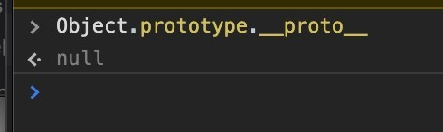

### 1. 对原型、原型链的理解
1. 在JavaScript中是使用构造函数来新建一个对象的，每一个构造函数的内部都有一个 prototype 属性，它的属性值是一个对象，这个对象包含了可以由该构造函数的所有实例共享的属性和方法。
   >(对于普通函数来说，prototype基本无用。但是，对于构造函数来说，生成实例的时候，该属性会自动成为实例对象的原型。**注意函数的prototype是一个Object,是一个新建的只有constructor属性的对象**)
2. 当使用构造函数新建一个对象后，在这个对象的内部将包含一个指针，这个指针指向构造函数的 prototype 属性对应的值，在 ES5 中这个指针被称为对象的原型。一般来说不应该能够获取到这个值的，但是现在浏览器中都实现了 `__proto__` 属性来访问这个属性，但是最好不要使用这个属性，因为它不是规范中规定的。ES5 中新增了一个 Object.getPrototypeOf() 方法，可以通过这个方法来获取对象的原型。同时它带有constructor属性，指向构造函数。
3. 当访问一个对象的属性时，如果这个对象内部不存在这个属性，那么它就会去它的原型对象里找这个属性，这个原型对象又会有自己的原型，于是就这样一直找下去，也就是原型链的概念。
   >- 注意这里的原型应该指的是`__proto__`而不是函数的`prototype`。
   >- 所以`Object.constrctor`应该是`Object.__proto__.constructor` = Function. 而不是`Object.prototype.constructor`
   >- **函数的`.prototype`不在原型链上**，只是一个属性。
   >
4. 原型链的尽头一般来说都是 Object.prototype 所以这就是新建的对象为什么能够使用 toString() 等方法的原因。

特点：JavaScript 对象是通过引用来传递的，创建的每个新对象实体中并没有一份属于自己的原型副本。当修改原型时，与之相关的对象也会继承这一改变。


注意：
```js
console.log(Object.constructor)
// ƒ Function() { [native code] }

console.log(Function.constructor)
// ƒ Function() { [native code] }
```

>看！
https://www.cnblogs.com/wangfupeng1988/p/3977924.html

### 2. 怎么判断一个属性是对象上的属性还是其原型对象上的属性
使用hasOwnProperty()返回true，说明是这个对象上的；如果返回false，但是属性`in `这个对象返回了true，说明是原型对象上的属性。如果都是false，那么不存在这个属性。

### 3. 原型修改、重写
`constructor`属性表示原型对象与构造函数之间的关联关系，如果修改了原型对象，一般会同时修改`constructor`属性，防止引用的时候出错。

```javascript
function Person(name) {
  this.name = name;
}

Person.prototype.constructor === Person // true

Person.prototype = {
  method: function () {}
};

Person.prototype.constructor === Person // false
Person.prototype.constructor === Object // true
```

上面代码中，构造函数`Person`的原型对象改掉了，但是没有修改`constructor`属性，导致这个属性不再指向`Person`。由于`Person`的**新原型是一个普通对象**，而普通对象的`constructor`属性指向`Object`构造函数，导致`Person.prototype.constructor`变成了`Object`。

所以，**修改原型对象时，一般要同时修改`constructor`属性的指向。**

```javascript
// 坏的写法
C.prototype = {
  method1: function (...) { ... },
  // ...
};

// 好的写法
C.prototype = {
  constructor: C,
  method1: function (...) { ... },
  // ...
};

// 更好的写法
C.prototype.method1 = function (...) { ... };
```

上面代码中，要么将`constructor`属性重新指向原来的构造函数，要么只在原型对象上添加方法，这样可以保证`instanceof`运算符不会失真。

如果不能确定`constructor`属性是什么函数，还有一个办法：通过`name`属性，从实例得到构造函数的名称。

```javascript
function Foo() {}
var f = new Foo();
f.constructor.name // "Foo"
```

### 4. 原型链的终点是什么？如何打印出原型链的终点？
由于Object是构造函数，原型链终点是`Object.prototype`.`__proto__`，而`Object.prototype.__proto__=== null` // true，所以，原型链的终点是null。原型链上的所有原型都是对象，所有的对象最终都是由Object构造的，而`Object.prototype`的下一级是`Object.prototype.__proto__`。


### 5. 继承的方法
这篇文章称为笔记更为合适一些，内容来源于 《JavaScript高级程序设计 (第三版)》第六章 6.3 继承

**JavaScript的几种继承方式**
1. 原型链继承
2. 借助构造函数继承（经典继承）
3. 组合继承：原型链 + 借用构造函数（最常用）
4. 原型式继承 （Object.create）
5. 寄生式继承
6. 寄生组合式继承（最理想）
 1. ES6中的继承

#### 5.1 原型链继承
子类型的原型为父类型的一个实例对象

```js
function Parent() {
    this.name = 'bigStar';
    this.colors = ['red', 'blue', 'yellow'];
}
Parent.prototype.getName = function() {
    console.log(this.name)
}

function Child() {
    this.subName = 'litterStar';
}
// 核心代码: 子类型的原型为父类型的一个实例对象
Child.prototype = new Parent();

let child1 = new Child();
let child2 = new Child();
child1.getName(); // bigStar


child1.colors.push('pink');
// 修改 child1.colors 会影响 child2.colors
console.log(child1.colors); // [ 'red', 'blue', 'yellow', 'pink' ]
console.log(child2.colors); // [ 'red', 'blue', 'yellow', 'pink' ]

```
> 注意核心代码： `Child.prototype = new Parent();`

**特点**：
1. 父类新增在构造函数上面的方法，子类都能访问到

**缺点**：
1. 来自原型对象的所有属性被所有实例共享，child1修改 colors 会影响child2的 colors
2. 创建子类实例时，无法向父类的构造函数传参

#### 5.2 借助构造函数继承（经典继承）

在子类的构造函数中使用 call()或者 apply() 调用父类型构造函数
 
```js
function Parent(name) {
    this.name = name;
    this.colors = ['red', 'blue', 'yellow'];
}
Parent.prototype.getName = function() {
    console.log(this.name)
}

function Child(name, age) {
    // 核心代码：“借调”父类型的构造函数
    Parent.call(this, name);
    this.age = age;
}

let child1 = new Child('litterStar');
let child2 = new Child('luckyStar');
console.log(child1.name); // litterStar
console.log(child2.name); // luckyStar

// 这种方式只是实现部分的继承，如果父类的原型还有方法和属性，子类是拿不到这些方法和属性的。
child1.getName(); // TypeError: child1.getName is not a function
```
> 注意核心代码： `Parent.call(this, name);`

**特点**：
- 避免引用类型的属性被所有实例共享
- 创建子类实例时，可以向父类传递参数

**缺点**
- 实例并不是父类的实例，只是子类的实例
- 只能继承父类的实例属性和方法，不能继承原型属性和方法
- 无法实现函数复用，每次创建实例都会创建一遍方法，影响性能

#### 5.3 组合继承：原型链 + 借用构造函数（最常用）
```js
function Parent(name) {
    this.name = name;
    this.colors = ['red', 'blue', 'yellow'];
}
Parent.prototype.getName = function() {
    console.log(this.name)
}

function Child(name, age) {
    // 核心代码①
    Parent.call(this, name);

    this.age = age;
}
// 核心代码②: 子类型的原型为父类型的一个实例对象
Child.prototype = new Parent();
Child.prototype.constructor = Child;


// 可以通过子类给父类的构造函数传参
let child1 = new Child('litterStar');
let child2 = new Child('luckyStar');
child1.getName(); // litterStar
child2.getName(); // luckyStar

child1.colors.push('pink');
// 修改 child1.colors 不会影响 child2.colors
console.log(child1.colors); // [ 'red', 'blue', 'yellow', 'pink' ]
console.log(child2.colors); // [ 'red', 'blue', 'yellow' ]
```
> 注意核心代码： `Parent.call(this, name);`和 `Child.prototype = new Parent();`

**特点**
- 融合了原型链继承和借用构造函数的优点，称为JavaScript中最常用的继承模式。

**缺点**
- 调用了两次父类构造函数，生成了两份实例
  - 一次是设置子类型实例的原型的时候 `Child.prototype = new Parent();`
  - 一次是创建子类型实例的时候 `let child1 = new Child('litterStar');`, 调用 new 会执行 ` Parent.call(this, name);`,此时会再次调用一次  `Parent`构造函数

#### 5.4 原型式继承 （Object.create）

借助原型可以基于现有方法来创建对象，var B = Object.create(A) 以A对象为原型，生成A对象，B继承了A的所有属性和方法。

```js
const person = {
    name: 'star',
    colors: ['red', 'blue'],
}

// 核心代码：Object.create
const person1 = Object.create(person);
const person2= Object.create(person);

person1.name = 'litterstar';
person2.name = 'luckystar';

person1.colors.push('yellow');

console.log(person1.colors); // [ 'red', 'blue', 'yellow' ]
console.log(person2.colors); // [ 'red', 'blue', 'yellow' ]
console.log(person1.name);    //litterstar
console.log(person2.name);    //luckystar
```
> 注意核心代码： `const person1 = Object.create(person);`

**特点**
- 没有严格意义上的构造函数，借助原型可以基于已有对象创建新对象

**缺点**
- 来自原型对象的所有属性被所有实例共享，person1修改 colors 会影响person2的 colors，这点跟原型链继承一样。


#### 5.5 寄生式继承
创建一个用于封装继承过程的函数，该函数在内部以某种方式来增强对象

寄生式继承的思路是创建一个用于封装继承过程的函数，通过传入一个对象，然后复制一个对象的副本，然后对象进行扩展，最后返回这个对象。这个扩展的过程就可以理解是一种继承。这种继承的优点就是对一个简单对象实现继承，如果这个对象不是自定义类型时。缺点是**没有办法实现函数的复用**。
```js
function createObj (original) {
    // 通过调用函数创新一个新对象
    var clone = Object.create(original);
    // 以某种方式来增强这个对象
    clone.sayName = function () {
        console.log('hi');
    }
    // 返回这个对象
    return clone;
}
---
const person = {
    name: 'star',
    colors: ['red', 'blue'],
}
const person1 = createObj(person);
const person2= createObj(person);
person1.name = 'litterstar';
person2.name = 'luckystar';
person1.colors.push('yellow');
person2.sayName = () => (console.log('11'))

console.log(person1.colors); // [ 'red', 'blue', 'yellow' ]
console.log(person2.colors); // [ 'red', 'blue', 'yellow' ]
person1.sayName()   //hi
person2.sayName()   //11
```
**缺点**： 每次创建对象都会创建一遍方法，跟借助构造函数模式一样

#### 5.6 寄生组合式继承（最理想的）

我们可以先回忆一下JavaScript最常用的继承模式： 组合继承（原型链 + 借用构造函数），它的最大缺点是会调用两次父构造函数（`Child.prototype = new Parent();`和 `let child1 = new Child('litterStar');`）。

我们是否可以想办法是调用一次？可以让  Child.prototype 访问到 Parent.prototype。

我们不能直接使用 `Child.prototype = Parent.prototype`来实现，因为会出现一些副作用，你可能在修改 `Child.prototype` 的时候会修改`Parent.prototype`。

可以使用 `Object.create(...)`来实现

> `Object.create` MDN上的解释：它会创建一个新对象，使用现有的对象来提供新创建的对象的`__proto__`

```js
function Parent(name) {
    this.name = name;
    this.colors = ['red', 'blue', 'yellow'];
}
Parent.prototype.getName = function() {
    console.log(this.name)
}

function Child(name, age) {
    // 核心代码①
    Parent.call(this, name);

    this.age = age;
}
// 核心代码②
Child.prototype = Object.create(Parent.prototype);
Child.prototype.constructor = Child;
```
> 注意核心代码： `Parent.call(this, name);`和 `Child.prototype = Object.create(Parent.prototype);`

寄生组合式继承，集寄生式继承和组合式继承的优点，是引用类型**最理想的继承范式**。 

#### 5.7 ES6 中class的继承
ES6中引入了class关键字，可以通过extends关键字实现继承。
```js
class Parent {}
class Child extends Parent {
    constructor(name, age, color) {
        // 调用父类的constructor(name, age)
        super(name, age);
        this.color = color;
    }
    toString() {
        return this.color + ' ' + super.toString(); // 调用父类的toString()
    }
}
```
class关键字只是原型的语法糖，JavaScript继承仍然是基于原型实现的。

**Class中的箭头函数和普通函数有何区别**
箭头函数相当于绑定上了this，类似构造函数内的一个值。

this的本质就是：this跟作用域无关的，只跟执行上下文有关。

箭头函数会绑定在实例对象上，普通函数最后会绑定在原型上。
>[曾经我以为我很懂箭头函数](https://juejin.cn/post/6844904152640782343)
[ES6 Class Methods 定义方式的差异](https://github.com/dwqs/blog/issues/67 )


>https://github.com/funnycoderstar/blog/blob/master/docs/interview/JavaScript/JavaScript%E7%9A%84%E5%87%A0%E7%A7%8D%E7%BB%A7%E6%89%BF%E6%96%B9%E5%BC%8F.md

**参考**
- [JavaScript常见的六种继承方式](https://segmentfault.com/a/1190000016708006)
- [JS继承的几种方式](https://juejin.im/post/5b654e88f265da0f4a4e914c)
- [JavaScript深入之继承的多种方式和优缺点](https://github.com/mqyqingfeng/Blog/issues/16)
- [ECMAScript6入门之 Class的继承](https://es6.ruanyifeng.com/#docs/class-extends)