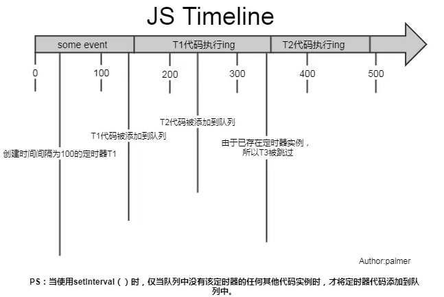
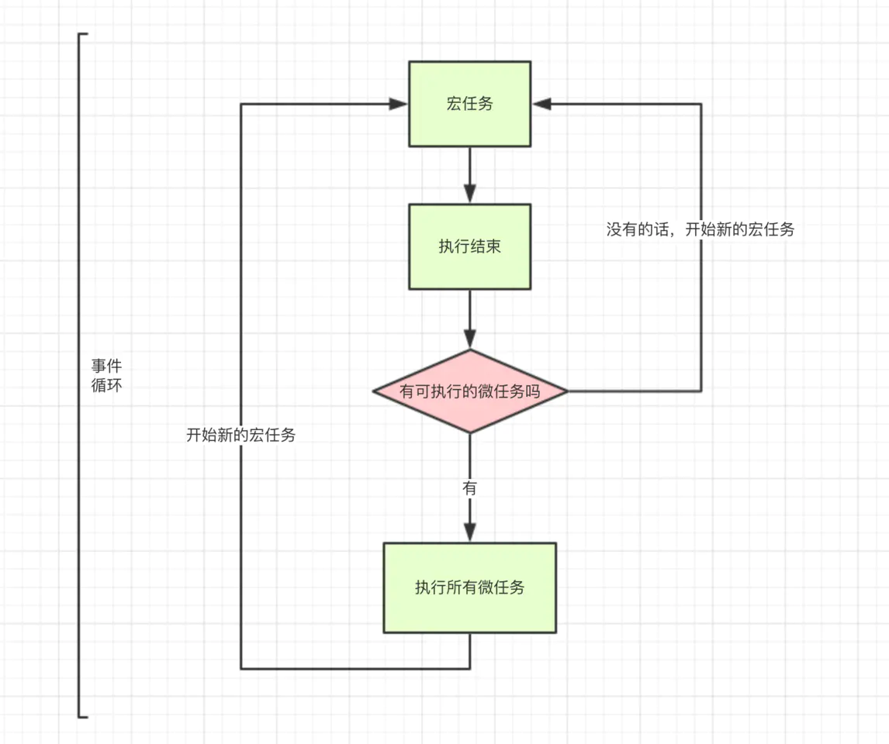

之后看 https://github.com/wangfupeng1988/js-async-tutorial
### 异步编程的实现方式？
JavaScript中的异步机制可以分为以下几种：
- 回调函数 的方式，使用回调函数的方式有一个缺点是，多个回调函数嵌套的时候会造成回调函数地狱，上下两层的回调函数间的代码耦合度太高，不利于代码的可维护。
- Promise 的方式，使用 Promise 的方式可以将嵌套的回调函数作为链式调用。但是使用这种方法，有时会造成多个 then 的链式调用，可能会造成代码的语义不够明确。
- generator 的方式，它可以在函数的执行过程中，将函数的执行权转移出去，在函数外部还可以将执行权转移回来。当遇到异步函数执行的时候，将函数执行权转移出去，当异步函数执行完毕时再将执行权给转移回来。因此在 generator 内部对于异步操作的方式，可以以同步的顺序来书写。使用这种方式需要考虑的问题是何时将函数的控制权转移回来，因此需要有一个自动执行 generator 的机制，比如说 co 模块等方式来实现 generator 的自动执行。
- async 函数 的方式，async 函数是 generator 和 promise 实现的一个自动执行的语法糖，它内部自带执行器，当函数内部执行到一个 await 语句的时候，如果语句返回一个 promise 对象，那么函数将会等待 promise 对象的状态变为 resolve 后再继续向下执行。因此可以将异步逻辑，转化为同步的顺序来书写，并且这个函数可以自动执行。

>[深入理解 JavaScript 异步](https://github.com/wangfupeng1988/js-async-tutorial)

### Promise
>[Promise入门详解](https://github.com/qianguyihao/Web/blob/master/06-JavaScript%E5%BC%82%E6%AD%A5%E7%BC%96%E7%A8%8B%EF%BC%9AAjax%E5%92%8CPromise/05-Promise%E5%85%A5%E9%97%A8%E8%AF%A6%E8%A7%A3.md)
>《红宝书》
>https://github.com/amandakelake/blog/issues/30

```js
// 创建 promise 实例
let promise = new Promise((resolve, reject) => {
    //进来之后，状态为pending
    console.log('同步代码'); //这行代码是同步的
    //开始执行异步操作（这里开始，写异步的代码，比如ajax请求 or 开启定时器）
    if (异步的ajax请求成功) {
        console.log('333');
        resolve('请求成功，并传参'); //如果请求成功了，请写resolve()，此时，promise的状态会被自动修改为fulfilled（成功状态）同时把结果保存下来
    } else {
        reject('请求失败，并传参'); //如果请求失败了，请写reject()，此时，promise的状态会被自动修改为rejected（失败状态）
    }
});
console.log('222');

//调用promise的then()：开始处理成功和失败
// then相当于判断当前promise 的状态在执行，他不改变promise的状态。此时的promise的状态已经确定了
// 改变状态的是上面的resolve.
// then是微任务，遇到会马上放入微任务队列
promise.then(
    (successMsg) => {
        // 处理 promise 的成功状态：如果promise的状态为fulfilled，则执行这里的代码
        console.log(successMsg, '成功了'); // 这里的 successMsg 是前面的 resolve('请求成功，并传参')  传过来的参数
    },
    (errorMsg) => {
        //处理 promise 的失败状态：如果promise的状态为rejected，则执行这里的代码
        console.log(errorMsg, '失败了'); // 这里的 errorMsg 是前面的 reject('请求失败，并传参') 传过来的参数
    }
);
```

---
代码输出：
```js
const promise1 = new Promise((resolve, reject) => {
  console.log('promise1')
  resolve('resolve1')
})
const promise2 = promise1.then(res => { //这里只要调用了.then就会加入微任务队列，不管这个变量使不使用.注意then返回的也是Promise
  console.log(res)
})
console.log('1', promise1);
console.log('2', promise2);
setTimeout(() => console.log(promise2), 10)

---
promise1
1 Promise{<resolved>: resolve1}
2 Promise{<pending>}   //同步任务时promise2还是pending（微任务还没执行）
resolve1
Promise {<fulfilled>: undefined}  //下次事件循环promise2 fulfilled
```
代码执行过程如下：
  script是一个宏任务，按照顺序执行这些代码；
  首先进入Promise，执行该构造函数中的代码，打印promise1；
  碰到resolve函数, 将promise1的状态改变为resolved, 并将结果保存下来；
  碰到promise1.then这个微任务，将它放入微任务队列；
  promise2是一个新的状态为pending的Promise；
  执行同步代码1， 同时打印出promise1的状态是resolved；
  执行同步代码2，同时打印出promise2的状态是pending；
  宏任务执行完毕，查找微任务队列，发现promise1.then这个微任务且状态为resolved，执行它。

**注意**，调用resolve或reject并不会终结 Promise 的参数函数的执行。
```js
new Promise((resolve, reject) => {
  resolve(1);
  console.log(2);
}).then(r => {
  console.log(r);
});
// 2
// 1
```
上面代码中，调用resolve(1)以后，后面的console.log(2)还是会执行，并且会首先打印出来。这是因为立即 resolved 的 Promise 是在本轮事件循环的末尾执行，总是晚于本轮循环的同步任务。

一般来说，调用resolve或reject以后，Promise 的使命就完成了，后继操作应该放到then方法里面，而不应该直接写在resolve或reject的后面。所以，最好在它们前面加上return语句，这样就不会有意外。
```js
new Promise((resolve, reject) => {
  return resolve(1);
  // 后面的语句不会执行
  console.log(2);
})
```

#### promise.then()方法：
then方法返回的是一个**新的Promise实例**（注意，不是原来那个Promise实例）。因此可以采用链式写法，即then方法后面再调用另一个then方法。

**！！！关键！！！**
then相当于**判断**当前promise 的状态在执行，**他不改变promise的状态。此时的promise的状态已经确定了**

>返回值
>当一个 Promise 完成（fulfilled）或者失败（rejected）时，返回函数将被异步调用（由当前的线程循环来调度完成）。具体的返回值依据以下规则返回。如果 then 中的回调函数：
>
>返回了一个值，那么 then 返回的 Promise **将会成为接受状态**，并且将返回的值作为接受状态的回调函数的参数值。(相当于用Promise.resolve包装了)
没有返回任何值，那么 then 返回的 Promise **将会成为接受状态**，并且该接受状态的回调函数的参数值为 undefined。
抛出一个错误，那么 then 返回的 Promise **将会成为拒绝状态**，并且将抛出的错误作为拒绝状态的回调函数的参数值。
返回一个已经是接受状态的 Promise，那么 then 返回的 Promise 也会成为接受状态，并且将那个 Promise 的接受状态的回调函数的参数值作为该被返回的Promise的接受状态回调函数的参数值。
返回一个已经是拒绝状态的 Promise，那么 then 返回的 Promise 也会成为拒绝状态，并且将那个 Promise 的拒绝状态的回调函数的参数值作为该被返回的Promise的拒绝状态回调函数的参数值。
返回一个未定状态（pending）的 Promise，那么 then 返回 Promise 的状态也是未定的，并且它的终态与那个 Promise 的终态相同；同时，它变为终态时调用的回调函数参数与那个 Promise 变为终态时的回调函数的参数是相同的。
>https://developer.mozilla.org/zh-CN/docs/Web/JavaScript/Reference/Global_Objects/Promise/then#%E8%BF%94%E5%9B%9E%E5%80%BC

**只有 promise 的状态被改变之后，才会走到 then 或者 catch**。也就是说，在 new Promise()的时候，如果没有写 resolve()，则 promise.then() 不执行；如果没有写 reject()，则 promise.catch() 不执行。

**链式调用**
采用链式的then，可以指定一组按照次序调用的回调函数。这时，前一个回调函数，有可能返回的还是一个Promise对象（即有异步操作），这时后一个回调函数，就会等待该Promise对象的状态发生变化，才会被调用。
```js
getJSON("/post/1.json").then(
  post => getJSON(post.commentURL)
).then(
  comments => console.log("resolved: ", comments),
  err => console.log("rejected: ", err)
);
```
上面代码中，第一个then方法指定的回调函数，返回的是另一个Promise对象。这时，第二个then方法指定的回调函数，就会等待这个新的Promise对象状态发生变化。如果变为resolved，就调用第一个回调函数，如果状态变为rejected，就调用第二个回调函数。

注意：如果前一个then没有return的话，默认下面的then接收的参数是**undefined**（即函数没有返回值）

>**注意**，resolve**立即改变**promise的状态,是同步的不是微任务。`.then`**里面才是微任务**。

>**注意**，**p.then()不会改变p的指向**，p = p.then()才会。链式调用也会改变因为传递的是p.then()的返回值

```js
a = Promise.resolve(1)

a.then((res)=>console.log(res)) //1
a.then((res)=>console.log(res)) //1

a = a.then((res)=>console.log(res))
a.then((res)=>console.log(res)) //undefined
```

>**then方法接受的参数是函数**，而如果传递的并非是一个函数，它实际上会将其解释为then(null)，这就会导致前一个Promise的结果会传递下面。(**穿透**)
>
>注意和then接收函数但是没有返回值的**区别**，只有then接收的参数不是函数的时候才会穿透；不然如果单纯是没有返回值，则下面的then中的resolve接收的参数是undefined，不会穿透

#### new Promise() 是同步代码
  promise函数体内的`resolove();`前面和后面的代码都是同步的，都会同步执行

#### Promise 的状态一旦改变，就不能再变
```js
const p = new Promise((resolve, reject) => {
  resolve(1); // 代码执行到这里时， promise状态是 fulfilled
  reject(2); // 尝试修改状态为 rejected，是不行的。因为状态执行到上一行时，已经被改变了。
});

p.then((res) => {
    console.log(res);
}).catch((err) => {
    console.log(err);
}
// 1
```

---
```js
var p2 = new Promise(function(resolve,reject){
  setTimeout(function(){
    console.log('p2');
    resolve(2);  
  }, 500);      
});

// 同理，2
p2.then(function(value){
  console.log(p2);
  console.log(value);
});
```
**注意*：*

- **then会等到Promise变为resolved之后在调用**
- 本例在下轮事件循环再调用
- 由于Promise的状态此时还是pending，所以promise.then先不执行
- **每轮事件循环**（**一个**setTimeout任务）**都会执行自己的微任务**

```js

Promise.resolve().then(() => {
  console.log('promise1');
  const timer2 = setTimeout(() => {
    console.log('timer2')
  }, 0)
});
const timer1 = setTimeout(() => {
  console.log('timer1')
  Promise.resolve().then(() => {
    console.log('promise2')
  })
}, 0)
const timer3 = setTimeout(() => {
  console.log('timer3')
  Promise.resolve().then(() => {
    console.log('promise3')
  })
}, 0)
console.log('start');

---
start
VM34:2 promise1
VM34:8 timer1
VM34:10 promise2
VM34:14 timer3
VM34:16 promise3
VM34:4 timer2
```


>看! [「2021」前端面试题之代码输出篇
](https://www.yuque.com/cuggz/interview/wm7x19)
>这道 https://www.yuque.com/cuggz/interview/wm7x19#h5fag 

---
见mdn这个例子
```js
Promise.resolve("foo")
  // 1. 接收 "foo" 并与 "bar" 拼接，并将其结果做为下一个 resolve 返回。
  .then(function(string) {
    return new Promise(function(resolve, reject) {
      setTimeout(function() {
        string += 'bar';
        resolve(string);
      }, 10000);
    });
  })
  // 2. 接收 "foobar", 放入一个异步函数中处理该字符串
  // 并将其打印到控制台中, 但是不将处理后的字符串返回到下一个。
  .then(function(string) {
    setTimeout(function() {
      string += 'baz';
      console.log(string);
    }, 10000)
    // 注意这里return是同步的
    return string;
  })
  // 3. 打印本节中代码将如何运行的帮助消息，
  // 字符串实际上是由上一个回调函数之前的那块异步代码处理的。
  .then(function(string) {
    console.log("Last Then:  oops... didn't bother to instantiate and return " +
                "a promise in the prior then so the sequence may be a bit " +
                "surprising");

    // 注意 `string` 这时不会存在 'baz'。
    // 因为这是发生在我们通过setTimeout模拟的异步函数中。
    console.log(string);
  });

// logs, in order:
// Last Then: oops... didn't bother to instantiate and return a promise in the prior then so the sequence may be a bit surprising
// foobar
// foobarbaz
```
>https://developer.mozilla.org/zh-CN/docs/Web/JavaScript/Reference/Global_Objects/Promise/then

#### 异常处理
```js {.line-numbers}
let p1 = new Promise((resolve, reject) => {
  foo();   //错误
  resolve(1)
})
p1.then((v) => {
  console.log('1不会到这里')
},(err) => {
  console.log('p1的第一次错误来了这里',err)
}).then((v) => {
  console.log('p1第二次，在这里拿到了underfined',v)
},(err) => {
  console.log('第二次，没有错误，这里不会出现',err)
})

let p2 = new Promise((resolve,reject) => {
  resolve(2);
})
p2.then((v) => {
  console.log('p2第一次的值2来这里了',2);
  foo()
},(err) => {
  console.log('p2这里不会拿到第一次的错误',err)
}).then((v) => {
  console.log('p2上面第一次有错误，这里不会有值',v)
},(err) => {
  console.log('这里拿到了p2上一次的错误',err);
  return '即使错误，也能继续传值'
}).then((v) => {
  console.log('到这里应该很清晰了吧',v)
},(err) => {
  console.log('这里已经没有错误了',err)
})
```

**注意**：
- 第8行这种捕获错误的语句，因为没有返回值，所以返回undefined。
- 27行这里，即使出错，也能继续传值
- err**只会传递给下一层**。之后就不会传错误了

---
```js {.line-numbers}
getPromise('a.json')
    .then(
        (res) => {
            console.log(res);
            return getPromise('b.json'); // 继续请求 b
        },
        (err) => {
            // a 请求失败
            console.log('a: err');
        }
    )
    .then((res) => {
        // b 请求成功
        console.log(res);
        return getPromise('c.json'); // 继续请求 c
    })
    .then((res) => {
        // c 请求成功
        console.log('c：success');
    });
```

上面的代码中，假设 a 请求失败，那么，后面的代码会怎么走呢？

打印结果：

```
a: err
undefined
c：success
```

##### Promise.catch
Promise.prototype.catch()方法**是.then(null, rejection)或 .then(undefined, rejection)的别名**，用于指定发生错误时的回调函数。


```js
p = Promise.all([
  Promise.reject('1'),
  Promise.resolve('2'),
  Promise.resolve('3')
])

---
Promise {<rejected>: "1"}
```

```js
p = Promise.all([
  Promise.reject('1'),
  Promise.resolve('2'),
  Promise.resolve('3')
]).catch((err) => {
  console.log(err);
})

**等价于**
p = p.catch((err) => {
  console.log(err);
})

---
Promise {<fulfilled>: undefined}
```

注意p.catch并不会影响promise的拒绝操作，相当于p**已经拒绝过**了，catch只是在之后让指针后移一步。

#### Promise.all
```js
const promise1 = new Promise((resolve, reject) => {
    setTimeout(() => {
        console.log('执行 promise1');
        resolve('promise 1 成功');
    }, 1000);
});

const promise2 = new Promise((resolve, reject) => {
    setTimeout(() => {
        console.log('执行 promise2');
        // 这里通过 reject() 的方式，表示任务执行失败
        reject('promise 2 失败');
    }, 2000);
});

const promise3 = new Promise((resolve, reject) => {
    setTimeout(() => {
        console.log('执行 promise3');
        resolve('promise 3 成功');
    }, 3000);
});

Promise.all([promise1, promise2, promise3])
    .then((res) => {
        // 三个异步任务都执行成功，才会走到这里
        console.log('走到 then:' + JSON.stringify(res));
    })
    .catch((err) => {
        // 只要有一个异步任务执行失败，就会马上走到这里
        console.log('走到 catch:' + err);
    });

---
// 1秒后
执行 promise1

// 2秒后
执行 promise2
走到 catch:promise 2 失败

// 3秒后
执行 promise3
```
可以看到，当 promise2 执行失败之后，**马上就走到了 catch**，而且 **promise3 里的 resolve 并没有执行**。

---
all和race传入的数组中如果有会抛出异常的异步任务，那么只有最先抛出的错误会被捕获，并且是被then的第二个参数或者后面的catch捕获；**但并不会影响数组中其它的异步任务的执行**（参数数组里的任务已经并发发送了（加入任务队列了），只是还没回调得到结果）。
不会等待promise的状态变化了。

注意区别：
<!-- 是**其他任务不能resolve了**，但是除resolve外其他的代码还是照常执行。 -->
**其他任务还是照常resolve**，但是promise.all不处理他的结果了而已。

```js
p1 = new Promise((resolve) => {
  setTimeout(() => {
    console.log('hello');
    resolve('2');
  }, 3000)
}),

p2 = new Promise((resolve) => {
  setTimeout(() => {
    console.log('world');
    resolve('3');
  }, 3000)
}),

p = Promise.all([
  Promise.reject('1'),p1,p2])
    .catch((err) => {
      console.log(err);
    })

setTimeout(()=>{
  console.log(p1);
  console.log(p2);
}, 4000)

---
1
hello
world
Promise {<fulfilled>: "2"}
Promise {<fulfilled>: "3"}
```

>见 https://www.yuque.com/cuggz/interview/wm7x19#QOpSF

##### 如何让他不管是否reject都处理结果

1. 对每个promise都写一个catch。p.catch后相当于指针后移向新的Promise，不再是原来的p了。

>如果作为参数的 Promise 实例，自己定义了catch方法，那么它一旦被rejected，**并不会触发**Promise.all()的catch方法。（且fullfilled状态的promise用.catch不会改变他本身的状态， 而.then会）

```js
p = Promise.resolve(1)
// Promise {<fulfilled>: 1}
p = p.catch((err)=>console.log(Error))
// Promise {<fulfilled>: 1}
p = p.then((res)=>console.log(res))
// 1
// Promise {<fulfilled>: undefined}
```

2. 用Promise.allSettled

>该方法返回的新的 Promise 实例，一旦结束，状态**总是fulfilled**，不会变成rejected。状态变成fulfilled后，Promise 的监听函数接收到的参数是一个数组，每个成员对应一个传入Promise.allSettled()的 Promise 实例。

```js
const resolved = Promise.resolve(42);
const rejected = Promise.reject(-1);

const allSettledPromise = Promise.allSettled([resolved, rejected]);

allSettledPromise.then(function (results) {
  console.log(results);
});
// 数组成员是对象
// [
//    { status: 'fulfilled', value: 42 },
//    { status: 'rejected', reason: -1 }
// ]
```

##### 传入参数

Promise.all()方法接受一个数组作为参数，p1、p2、p3都是 Promise 实例，如果不是，就会**先调用Promise.resolve方法**，将参数转为 Promise 实例，再进一步处理。

Promise.all()方法的参数可以不是数组，但必须具有 Iterator 接口，且返回的每个成员都是 Promise 实例。

#### Promise.race
那么race方法有什么实际作用呢？当要做一件事，超过多长时间就不做了，可以用这个方法来解决：
```js
Promise.race([promise1,timeOutPromise(5000)]).then(res=>{})
```

e.g.
```js
const uploadFile = (url, params) => {
  return Promise.race([
    uploadFilePromise(url, params),
    uploadFileTimeout(3000)
  ])
}
function uploadFilePromise(url, params) {
  return new Promise((resolve, reject) => {
    axios.post(url, params, {
      headers: {'Content-Type': 'multipart/form-data'}, // 以formData形式上传文件
      withCredentials: true
    }).then(res => {
      if(res.status===200 && res.data.code===0) {
        resolve(res.data.result)
      }else {
        reject(res.data)
      }
    })
  })
}
function uploadFileTimeout(time) {
  return new Promise((resolve, reject) => {
    setTimeout(() => {
      reject({timeoutMsg: '上传超时'})
    }, time)
  })
}
```

#### Promise 封装 Ajax 请求
```js
// 封装 ajax 请求：传入回调函数 success 和 fail
function ajax(url, success, fail) {
    var xmlhttp = new XMLHttpRequest();
    xmlhttp.open('GET', url);
    xmlhttp.send();
    xmlhttp.onreadystatechange = function () {
        if (xmlhttp.readyState === 4 && xmlhttp.status === 200) {
            success && success(xmlhttp.responseText);
        } else {
            // 这里的 && 符号，意思是：如果传了 fail 参数，就调用后面的 fail()；如果没传 fail 参数，就不调用后面的内容。因为 fail 参数不一定会传。
            fail && fail(new Error('接口请求失败'));
        }
    };
}

// 第一步：model层的接口封装
const promiseB = new Promise((resolve, reject) => {
    ajax('xxx_a.json', (res) => {
        // 这里的 res 是接口的返回结果。返回码 retCode 是动态数据。
        if (res.retCode == 0) {
            // 接口请求成功时调用
            resolve('request success' + res);
        } else {
            // 接口请求失败时调用
            reject({ retCode: -1, msg: 'network error' });
        }
    });
});

// 第二步：业务层的接口调用。这里的 data 就是 从 resolve 和 reject 传过来的，也就是从接口拿到的数据
promiseB
    .then((res) => {
        // 从 resolve 获取正常结果
        console.log(res);
    })
    .catch((err) => {
        // 从 reject 获取异常结果
        console.log(err);
    });
```

####  promise 解决的问题 和 存在的问题？async和await？
作者：但愿不头疼
链接：https://www.nowcoder.com/discuss/648552?channel=-1&source_id=profile_follow_post_nctrack
来源：牛客网

1. promise 解决了回调函数的回调地域的问题，有时候我们的请求需要上一个请求返回的结果，会造成相互间回调函数的嵌套，使得代码的可读性和可维护性很低；
- promise让代码变得扁平，可读性更好，then返回一个promise，我们可以把then串起来，then返回的promise装载了由调用返回的值。
- 在异步回调中，函数的执行栈与原函数分离开，导致外部无法抓住异常。在promise中我们可以使用reject捕获是失败情况，和catch捕获执行异常。
//Promise 只不过是一种更良好的编程风格

2. 存在的缺点，无法取消，一旦开始执行，中途无法取消；
不设置回调函数，promise内部抛出的错误，无法返回到外部
处于pendding状态时，无法得知进展到哪一个阶段。

3. async 和 await
async 函数返回的是一个 Promise 对象,在没有 await 的情况下执行 async 函数,他会立即返回一个promise对象，并且，绝对不会注意后面语句的执行，await关键字只能用在aync定义的函数内；
await 可以用于等待一个 async 函数的返回值，如果它等到的是一个 Promise 对象，await 就忙起来了，它会阻塞后面的代码，等着 Promise 对象 resolve，然后得到 resolve 的值，作为 await 表达式的运算结果。
async/await使得异步代码看起来像同步代码，使代码简洁，可读性更好，避免嵌套。

### async/await
>[理解 JavaScript 的 async/await](https://segmentfault.com/a/1190000007535316)
http://www.ruanyifeng.com/blog/2015/05/async.html
>《红宝书》

- async 函数是 Generator 的语法糖。Generator 函数的执行必须依靠执行器，而 Aysnc 函数自带执行器，调用方式跟普通函数的调用一样
- 而await命令就是内部then命令的语法糖。
- 使用 关键字 async 来表示，在函数内部使用 await 来表示异步。

async 函数返回值是 Promise 对象，比 Generator 函数返回的 Iterator 对象方便，可以直接使用 then() 方法进行调用

比Promise更简洁。写起来和同步代码一样，而Promise要写在一堆链式的then里面很不好看。

#### 1. await 等到了要等的，然后呢
await 等到了它要等的东西，一个 Promise 对象，或者其它值，然后呢？我不得不先说，await 是个运算符，用于组成表达式，await 表达式的运算结果取决于它等的东西。

如果它等到的不是一个 Promise 对象，那 await 表达式的运算结果就是它等到的东西。

如果它等到的是一个 Promise 对象，await 就忙起来了，它会阻塞后面的代码，等着 Promise 对象 resolve，然后**得到 resolve 的值**，作为 await 表达式的运算结果。

>**注意**，await后面的代码相当于new Promise的代码，是可以同步执行的。而他后面被阻塞的代码相当于.then里的代码，才是微任务。

#### 2. 错误处理
任何一个await语句后面的 Promise 对象变为reject状态，那么整个async函数都会中断执行。

有时，我们希望即使前一个异步操作失败，也不要中断后面的异步操作。这时可以将第一个await放在try...catch结构里面，这样不管这个异步操作是否成功，第二个await都会执行。

如果有多个await命令，可以统一放在try...catch结构中。

#### 3. 并发
多个await命令后面的异步操作，如果不存在继发关系，最好让它们同时触发。
```js
let foo = await getFoo();
let bar = await getBar();
```
上面代码中，getFoo和getBar是两个独立的异步操作（即互不依赖），被写成继发关系。这样比较耗时，因为只有getFoo完成以后，才会执行getBar，完全可以让它们同时触发。
```js
// 写法一
let [foo, bar] = await Promise.all([getFoo(), getBar()]);

// 写法二
let fooPromise = getFoo();
let barPromise = getBar();
let foo = await fooPromise;
let bar = await barPromise;
```

### SetTimeOut

#### setTimeout 模拟 setInterval
递归嵌套setTimeout
https://juejin.cn/post/6914201197620494350

---
setInterval**指定的是“开始执行”之间的间隔**，并不考虑每次任务执行本身所消耗的时间。因此实际上，两次执行之间的间隔会小于指定的时间。比如，setInterval指定每 100ms 执行一次，每次执行需要 5ms，那么第一次执行结束后95毫秒，第二次执行就会开始。如果某次执行耗时特别长，比如需要105毫秒，那么它结束后，下一次执行就会立即开始。

为了确保两次执行之间有固定的间隔，可以不用setInterval，而是每次执行结束后，使用setTimeout指定下一次执行的具体时间。

```js
var i = 1;
var timer = setTimeout(function f() {
  // ...
  timer = setTimeout(f, 2000);
}, 2000);
```

上面代码可以确保，下一次执行总是在本次执行结束之后的2000毫秒开始。

>https://wangdoc.com/javascript/async/timer.html#setinterval

#### 再看一个setInterval的例子。
```js
setInterval(function () {
  console.log(2);
}, 1000);

sleep(3000);

function sleep(ms) {
  var start = Date.now();
  while ((Date.now() - start) < ms) {
  }
}
```
上面代码中，setInterval要求每隔1000毫秒，就输出一个2。但是，紧接着的sleep语句需要3000毫秒才能完成，那么setInterval就必须推迟到3000毫秒之后才开始生效。注意，生效后setInterval**不会产生累积效应**，即不会一下子输出三个2，而是只会输出一个2。
>应该是立即输出两个2
>原因就是上面说的  （如果某次执行耗时特别长，比如需要105毫秒，那么它结束后，下一次执行就会立即开始。）

---


上图可见，setInterval 每隔 100ms 往队列中添加一个事件；100ms 后，添加 T1 定时器代码至队列中，主线程中还有任务在执行，所以等待，some event 执行结束后执行 T1 定时器代码；又过了 100ms，T2 定时器被添加到队列中，主线程还在执行 T1 代码，所以等待；又过了 100ms，理论上又要往队列里推一个定时器代码，但**由于此时 T2 还在队列中，所以 T3 不会被添加**（T3 被跳过），结果就是此时被跳过；这里我们可以看到，T1 定时器执行结束后马上执行了 T2 代码，所以并没有达到定时器的效果。

综上所述，setInterval 有两个缺点：

- 使用 setInterval 时，某些间隔会被跳过；
- 可能多个定时器会连续执行；

可以这么理解：每个 setTimeout 产生的任务会直接 push 到任务队列中；而 setInterval 在每次把任务 push 到任务队列前，**都要进行一下判断**(看上次的任务是否仍在队列中，如果有则不添加，没有则添加)。

因而我们一般用 setTimeout 模拟 setInterval，来规避掉上面的缺点。

>再次强调，**定时器指定的时间间隔(包括setTimeout)**，表示的是**何时将定时器的代码添加到消息队列，而不是何时执行代码**。所以真正何时执行代码的时间是不能保证的，取决于何时被主线程的事件循环取到，并执行。

>见：https://juejin.cn/post/6914201197620494350

### 事件循环
>看 [这一次，彻底弄懂 JavaScript 执行机制](https://juejin.cn/post/6844903512845860872)
>汇总 https://github.com/amandakelake/blog/issues/26


除了第一轮宏任务之外，其他每轮都是从任务队列中取**出一个任务执行**，然后执行所有微任务。

---
主线程从任务队列中读取事件，这个过程是循环不断的，所以整个的这种运行机制又称为`Event Loop`，`Event Loop`是一个执行模型，在不同的地方有不同的实现，浏览器和`NodeJS`基于不同的技术实现了各自的`Event Loop`。浏览器的`Event Loop`是在`HTML5`的规范中明确定义，`NodeJS`的`Event Loop`是基于`libuv`实现的。  
在浏览器中的`Event Loop`由执行栈`Execution Stack`、后台线程`Background Threads`、宏队列`Macrotask Queue`、微队列`Microtask Queue`组成。  

* 执行栈就是在主线程执行同步任务的数据结构，函数调用形成了一个由若干帧组成的栈。  
* 后台线程就是浏览器实现对于`setTimeout`、`setInterval`、`XMLHttpRequest`等等的执行线程。
* **宏队列**，一些异步任务的回调会依次进入宏队列，等待后续被调用，包括`setTimeout`、`setInterval`、`setImmediate(Node)`、`requestAnimationFrame`、`UI rendering`、`I/O`等操作
* **微队列**，另一些异步任务的回调会依次进入微队列，等待后续调用，包括`Promise.then`、`process.nextTick(Node)`、`Object.observe`、`MutationObserver`等操作  

当`Js`执行时，进行如下流程
1. 首先将执行栈中代码同步执行，将这些代码中异步任务加入后台线程中
2. 执行栈中的同步代码执行完毕后，执行栈清空，并开始扫描微队列
3. 取出微队列队首任务，放入执行栈中执行，此时微队列是进行了出队操作
4. 当执行栈执行完成后，继续出队微队列任务并执行，直到微队列任务全部执行完毕
5. 最后一个微队列任务出队并进入执行栈后微队列中任务为空，当执行栈任务完成后，开始扫面微队列为空，继续扫描宏队列任务，宏队列出队，放入执行栈中执行，执行完毕后继续扫描微队列为空则扫描宏队列，出队执行
6. 不断往复...

**渲染在微任务执行完后**