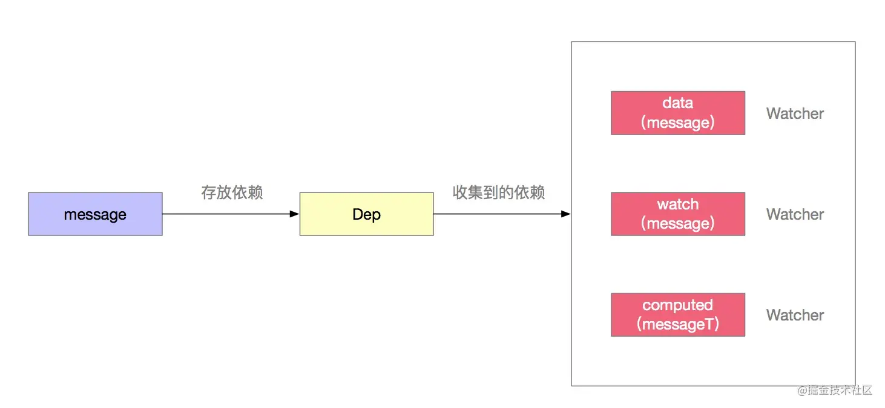
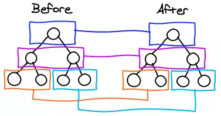

[vue开发看这篇文章就够了](https://segmentfault.com/a/1190000012692321)
https://www.yuque.com/cuggz/interview/hswu8g#8d6cd1d13b8d85c0090dd20084f39044
[30 道 Vue 面试题，内含详细讲解（涵盖入门到精通，自测 Vue 掌握程度）](https://github.com/fengshi123/blog/issues/14)
[Vue 面试知识点总结【持续更新中～】](https://segmentfault.com/a/1190000019633325)

>源码
>https://ustbhuangyi.github.io/vue-analysis/
>https://juejin.cn/post/6844903986978357256#heading-0
>http://zhouweicsu.github.io/blog/2017/03/07/vue-2-0-reactivity/

[vue生命周期探究（一）](https://segmentfault.com/a/1190000008879966)


稍后[基于Vue实现一个简易MVVM](https://juejin.cn/post/6844904099704471559#heading-14)

[剖析Vue原理&实现双向绑定MVVM](https://segmentfault.com/a/1190000006599500)
看 [0 到 1 掌握：Vue 核心之数据双向绑定](https://juejin.cn/post/6844903903822086151#heading-13)

[深入剖析：Vue核心之虚拟DOM](https://github.com/fengshi123/blog/blob/master/articles/%E6%B7%B1%E5%85%A5%E5%89%96%E6%9E%90%EF%BC%9AVue%E6%A0%B8%E5%BF%83%E4%B9%8B%E8%99%9A%E6%8B%9FDOM.md)

[Vue2.0 v-for 中 :key 到底有什么用？](https://www.zhihu.com/question/61064119)

---

[Vue3.0 新特性以及使用经验总结](https://juejin.cn/post/6940454764421316644#heading-15)


## 问题

### vue框架有什么特点

数据驱动、组件化

### 双向绑定（响应式）

#### Vue的工作原理（响应式原理）

Vue响应式底层实现方法是 Object.defineProperty() 方法，该方法中存在一个getter和setter的可选项，可以对属性值的获取和设置造成影响

从                                        3232 当你把一个普通的 JavaScript 对象传入 Vue 实例作为 data 选项，Vue 将遍历此对象所有的 property，并使用 Object.defineProperty 把这些 property 全部转为 getter/setter。

- 这些 getter/setter 对用户来说是不可见的，但是在内部它们让 Vue 能够追踪依赖，在 property 被访问和修改时通知变更。

- 每个组件实例都对应一个 watcher 实例，它会在组件渲染的过程中把“接触”过的数据 property 记录为依赖。之后当依赖项的 setter 触发时，会通知 watcher，从而使它关联的组件重新渲染。

>作者：Jieunsi
链接：https://www.nowcoder.com/discuss/670720?type=0&order=0&pos=13&page=1&ncTraceId=&channel=-1&source_id=discuss_tag_nctrack

>[Vue2.0 源码阅读：响应式原理](http://zhouweicsu.github.io/blog/2017/03/07/vue-2-0-reactivity/)

#### 为什么3.0用proxy取代Object.defineProperty
https://www.jianshu.com/p/860418f0785c

#### 依赖收集

Dep(依赖)就是帮我们收集**究竟要通知到哪里的**。 虽然data中有text和message属性，但是只有message被渲染到页面上，至于text无论怎么变化都影响不到视图的展示，因此我们**仅仅对message进行收集即可**，可以避免一些无用的工作。
那这个时候message的Dep就收集到了一个依赖，这个依赖就是用来管理data中message变化的。

- 当使用watch属性时，也就是开发者自定义的监听某个data中属性的变化。比如监听message的变化，message变化时我们就要通知到watch这个钩子，让它去执行回调函数。
这个时候message的Dep就收集到了两个依赖，第二个依赖就是用来管理watch中message变化的。

- 当开发者自定义computed计算属性时，如下messageT属性，是依赖message的变化的。因此message变化时我们也要通知到computed，让它去执行回调函数。
  
这个时候message的Dep就收集到了三个依赖，这个依赖就是用来管理computed中message变化的。

图示如下：一个属性可能有多个依赖，每个响应式数据都有一个Dep来管理它的依赖。



回顾一下，Vue响应式原理的核心就是Observer、Dep、Watcher。

- Observer中进行响应式的绑定，在数据被读的时候，触发get方法，执行Dep来收集依赖，也就是收集Watcher。
- 在数据被改的时候，触发set方法，通过对应的所有依赖(Watcher)，去执行更新。比如watch和computed就执行开发者自定义的回调方法。

>[Vue响应式原理-理解Observer、Dep、Watcher](https://juejin.cn/post/6844903858850758670)

---
Vue是一个实现数据驱动视图的框架~~ 我们都知道，Vue能够实现当一个数据变更时，视图就进行刷新，而且用到这个数据的其他地方也会同步变更；而且，这个数据必须是在有被依赖的情况下，视图和其他用到数据的地方才会变更。 所以，Vue要能够知道一个数据是否被使用，实现这种机制的技术叫做依赖收集根据Vue官方文档的介绍，其原理如下图所示：


---
```js
new Vue({
    template: 
        `<div>
            <span>text1:</span> {{text1}}
            <span>text2:</span> {{text2}}
        <div>`,
    data: {
        text1: 'text1',
        text2: 'text2',
        text3: 'text3'
    }
});
```
这里text3改变不会导致重新渲染，因为没对他进行依赖收集

##### Watcher

**每个组件实例都对应一个 watcher 实例**，它会在组件渲染的过程中把“接触”过的数据 property 记录为依赖。之后当依赖项的 setter 触发时，会通知 watcher，从而使它关联的组件重新渲染。
(一个Vue组件实例对应一个Watcher。)

**Vue里面有3种对象能创建Watcher实例**：component，watch，computed。

Watcher类的实现比较复杂，因为他的实例分为渲染 watcher（render-watcher）、计算属性 watcher（computed-watcher）、侦听器 watcher（normal-watcher）三种，
这三个实例分别是在三个函数中构建的：mountComponent 、initComputed和Vue.prototype.$watch。

- normal-watcher：我们在组件钩子函数watch 中定义的，都属于这种类型，即**只要监听的属性改变了，都会触发定义好的回调函数**，这类watch的expression是计算属性中的属性名。

- computed-watcher：我们在组件钩子函数computed中定义的，都属于这种类型，每一个 computed 属性，最后都会生成一个对应的 watcher 对象，但是这类 watcher 有个特点：当计算属性依赖于其他数据时，属性并不会立即重新计算，**只有之后其他地方需要读取属性的时候，它才会真正计算**，即具备 lazy（懒计算）特性。这类watch的expression是我们写的回调函数的字符串形式。

- render-watcher：每一个组件都会有一个 render-watcher, 当 data/computed 中的属性改变的时候，会调用该 render-watcher 来更新组件的视图。这类watch的expression是 function () {vm._update(vm._render(), hydrating);}。

除了功能上的区别，这三种 watcher 也有固定的执行顺序，分别是：computed-render -> normal-watcher -> render-watcher。

这样安排是有原因的，这样就能尽可能的保证，在更新组件视图的时候，computed 属性已经是最新值了，如果 render-watcher 排在 computed-render 前面，就会导致页面更新的时候 computed 值为旧数据。

---
观察者函数经过Watcher是这么被包装的： - 模板渲染：this._watcher = new Watcher(this, render, this._update) - 计算属性：

```js
computed: {
    name() {
        return `${this.firstName} ${this.lastName}`;
    }
}
/*
会形成
new Watcher(this, function name() {
    return `${this.firstName} ${this.lastName}`
}, callback);
*/
```

>作者：一只小考拉
链接：https://juejin.cn/post/6844903702881386504

---
当我们去实例化一个渲染 watcher 的时候，首先进入 watcher 的构造函数逻辑，然后会执行它的 `this.get()` 方法，进入 get 函数，首先会执行 `pushTarget(this)`

实际上就是把 Dep.target 赋值为当前的渲染 watcher 并压栈（为了恢复用）。接着又执行了 `this.getter` 对应就是 `updateComponent` 函数，这实际上就是在执行：

`vm._update(vm._render(), hydrating)`

它会先执行` vm._render()` 方法，因为之前分析过这个**方法会生成 渲染 VNode**，并且在这个过程中会对 vm 上的数据访问，这个时候就**触发**了数据对象的 getter。

>也就是模板编译在beforeMount就做好了，但是Vnode在`new Watcher`的时候（beforeMount之后mounted之前）才生成

>看 https://ustbhuangyi.github.io/vue-analysis/v2/reactive/getters.html#%E8%BF%87%E7%A8%8B%E5%88%86%E6%9E%90 源码
>看 https://github.com/AnnVoV/blog/issues/7 源码 很详细

#### 如何监听Array的变化

`Object.defineProperty`对数组进行响应式化是有缺陷的。

虽然我们可以监听到索引的改变(Vue只是没有使用这个方式去监听数组索引的变化，因为尤大认为**性能消耗太大**，于是在性能和用户体验之间做了取舍)。。但是`defineProperty`不能检测到数组长度的变化，准确的说是**通过改变length而增加的长度不能监测到**。这种情况无法触发任何改变。

**而且监听数组所有索引的的代价也比较高**，综合一些其他因素，Vue用了另一个方案来处理。

observe方法中，如果发现是数组，则调用`observeArray`方法处理。

在Vue初始化的过程中，给data中的每个数据都挂载了当前的Observer实例，又在这个实例上挂载了dep。这样就能保证我们在数组拦截器中访问到dep了

---
Vue在array.js中更准确的表达是拦截了数组的原型,重写了methodsToPatch中七个方法，并将重写后的原型暴露出去。

.png)

```js
const arrayProto = Array.prototype // 获取Array的原型

function def (obj, key) {
    Object.defineProperty(obj, key, {
        enumerable: true,
        configurable: true,
        value: function(...args) {
            console.log(key); // 控制台输出 push
            console.log(args); // 控制台输出 [Array(2), 7, "hello!"]
            
            // 获取原生的方法
            let original = arrayProto[key];
            // 将开发者的参数传给原生的方法，保证数组按照开发者的想法被改变
            const result = original.apply(this, args);

            // do something 比如通知Vue视图进行更新
            console.log('我的数据被改变了，视图该更新啦');
            this.text = 'hello Vue';
            return result;
        }
    });
}

// 新的原型
let obj = {
    push() {}
}

// 重写赋值
def(obj, 'push');

let arr = [0];

// 原型的指向重写
arr.__proto__ = obj;

// 执行push
arr.push([1, 2], 7, 'hello!');
console.log(arr);
```


### 渲染 虚拟DOM


#### 虚拟 DOM 的好处

​ 虚拟 DOM 就是为了解决浏览器性能问题而被设计出来的。如前，若一次操作中有 10 次更新 DOM 的动作，虚拟 DOM 不会立即操作 DOM，而是将这 10 次更新的 diff 内容保存到本地一个 JS 对象中，最终将这个 JS 对象一次性 attch 到 DOM 树上，再进行后续操作，避免大量无谓的计算量。所以，用 JS 对象模拟 DOM 节点的好处是，**页面的更新可以先全部反映在 JS 对象**(虚拟 DOM )上，**操作内存中的 JS 对象的速度显然要更快**，等更新完成后，再将最终的 JS 对象映射成真实的 DOM，交由浏览器去绘制。

#### 为什么要有虚拟 DOM
在以前还没有框架的时候，前端开发几乎都是靠原生 JavaScript 或者是 JQuery 一把梭进行 DOM 操作的。那么为什么 React 和 Vue 都采用了虚拟 DOM 呢？我理解的虚拟 DOM 的优势是：

- 跨平台渲染。借助虚拟 DOM 后 FrontEnd 可以进行移动端、小程序等开发。因为虚拟 DOM 本身只是一个 JavaScript 对象，所以可以先由 FE 们写 UI 并抽象成一个虚拟 DOM，再由安卓、IOS、小程序等原生实现根据虚拟 DOM 去渲染页面（React Native、Weex）。

- 函数式的 UI 编程。将 UI 抽象成对象的形式，相当于可以以编写 JavaScript 的形式来写 UI。

- 网上 Blog 常常会说到虚拟 DOM 会有更好的性能，因为虚拟 DOM 只会在 Diff 后修改一次真实 DOM，所以不会有大量的重排重绘消耗。并且只更新有变动的部分节点，而非更新整个视图。但我对这句话是存疑的，通过下文的 Diff 算法源码可以发现，Vue2 它的 Diff 是每次比对到匹配到的节点后就去修改真实 DOM 的，并不是等所有 Diff 完后再修改一次真实 DOM 而已。

#### 虚拟 DOM 一定会更快吗
我的理解是不一定。如果一个页面的**整个 DOM 结构都改变了的话**，使用虚拟 DOM 不仅一样要绘制渲染整个视图，而且还要进行 Diff 算法，会比直接操作真实 DOM 更慢，所以虚拟 DOM 带来的性能优势并不是绝对的。

而且不管框架如何封装、掩盖底层操作，终究是需要去调用到 DOM 相关的 api 更新页面的。并且它可能还包含了其他一些 Diff、polyfill、封装逻辑等，这样是不会比我们直接进行 DOM 操作更新 UI 快的。只是，难道我们每修改数据，就要手动操作 DOM 吗？虽然这样会更快，但带来的是很差的代码可读性和可维护性，这样得不偿失。所以正如尤雨溪说的，这是一个性能 VS 可维护性的取舍问题。

---
虚拟DOM的优劣如何?
优点:

保证性能下限: 虚拟DOM可以经过diff找出最小差异,然后批量进行patch,这种操作虽然比不上手动优化,但是比起粗暴的DOM操作性能要好很多,因此虚拟DOM可以保证性能下限
无需手动操作DOM: 虚拟DOM的diff和patch都是在一次更新中自动进行的,我们无需手动操作DOM,极大提高开发效率
跨平台: 虚拟DOM本质上是JavaScript对象,而DOM与平台强相关,相比之下虚拟DOM可以进行更方便地跨平台操作,例如服务器渲染、移动端开发等等

缺点:

无法进行极致优化: 在一些性能要求极高的应用中虚拟DOM无法进行针对性的极致优化,比如VScode采用直接手动操作DOM的方式进行极端的性能优化

>作者：寻找海蓝96
链接：https://juejin.cn/post/6844903903968903175

>源码 看 https://github.com/AnnVoV/blog/issues/7
>稍后 https://zhouweicsu.github.io/blog/2017/04/21/vue-2-0-template/
>稍后 https://www.jianshu.com/p/af0b398602bc

#### diff算法

创建一个React元素树之后，在更新的时候将创建一个新的React元素树，React使用Diff算法对元素树进行比对，只更新发生了改变的部分，避免多余的性能消耗。
主要是三个思想，可以从这三个谈：
- 永远只比较同层节点。
- 不同的两个节点产生两个不同的树。
- 通过key值指定哪些更新是相同的。
(尽可能的复用旧的节点)

??采用先序深度优先遍历的算法

只有当新旧子节点的类型都是多个子节点时，核心 Diff 算法才派得上用场

Vue 2.X进行diff时，调用patch打补丁函数，**一边比较一边给真实的DOM打补丁**

>作者：洛霞
链接：https://www.nowcoder.com/discuss/459995?channel=-1&source_id=profile_follow_post_nctrack

---
虚拟 DOM 后的渲染流程：

- 将真实 DOM 抽象成虚拟 DOM。

- 数据改变时，将新的真实 DOM 再抽象成另一个新的虚拟 DOM。

- 采用深度优先遍历新旧两个虚拟 DOM，如果两个虚拟 DOM 节点值得比较，就递归比较它们的子节点，否则直接创建新的 DOM 节点。

当对新旧两个虚拟 DOM 做 Diff 时，Vue 采用的思想是同级比较、深度递归、双端遍历。

**同级比较**
同级比较指的是只比对两个相同层级的 VNode，如果两者不一样了，就不再去 Diff 它们的子节点，更不会去跨层级比较，而是直接更新它。这是因为在我们平时的操作，很少出现将一个 DOM 节点进行跨层级移动，比如将原来的父节点移动到它子节点的位置上。所以 Diff 算法就没有为这个极少数的情况专门去跨层级 Diff，毕竟为此得不偿失，这也是 Diff 算法时间复杂度能从 O(n^3) 优化到 O(n) 的原因之一。


**深度递归**
深度递归指的是比较两个虚拟 DOM 时采用深度优先的先序遍历策略，**先比较完一个子节点后，就去比较这个子节点的子孙节点**，都递归完后再来遍历它的兄弟节点。


>稍后 https://juejin.cn/post/6844904078196097031#heading-27

>看 [详解vue的diff算法](https://juejin.cn/post/6844903607913938951)
  [vue diff算法 patch](https://www.cnblogs.com/mengfangui/p/9984135.html)

>看 http://blog.dangosky.com/2020/05/07/Vue2-%E7%9A%84-Diff-%E7%AE%97%E6%B3%95/#!

>https://github.com/fengshi123/blog/blob/master/articles/%E6%B7%B1%E5%85%A5%E5%89%96%E6%9E%90%EF%BC%9AVue%E6%A0%B8%E5%BF%83%E4%B9%8B%E8%99%9A%E6%8B%9FDOM.md


#### key

key 的特殊 attribute 主要用在 Vue 的虚拟 DOM 算法，在新旧 nodes 对比时辨识 VNodes。如果不使用 key，Vue 会使用一种最大限度减少动态元素并且尽可能的尝试就地修改/复用相同类型元素的算法。而使用 key 时，它会基于 key 的变化重新排列元素顺序，并且会移除 key 不存在的元素。

有相同父元素的子元素必须有独特的 key。重复的 key 会造成渲染错误。

最常见的用例是结合 v-for

>https://cn.vuejs.org/v2/api/#key

---
**使用 Vue 时我们常常会给节点赋予一个独一无二的 key，通过双端比较的过程能不能明白这是为什么**

我的理解是，如果我们编码时没有给节点一个 key 的话，它在上述4种比较方法都匹配不到后就会直接创建新的真实 DOM 节点并插入到相应位置。而创建一个真实 DOM 节点其实消耗是挺大的，看下图可以发现，我们创建一个 div 节点，它的初始属性都有 293 个。所以在能复用原 DOM 节点的时候就应该尽量复用，而不是重新创建。

Diff 过程的几种比较方法中，最好的是首首/尾尾/首尾/尾首比较，其次是通过 key 比较。那么为啥说首首比较这四种方法要优于通过 key 比较呢？不要忘了，通过 key 比较，不管是通过对象直接找到对应的 key，还是通过遍历一个个去找，它们都得先遍历一边旧子节点列表（第二种方法可能还不止遍历一次）再建立哈希表，而且通过对象直接找还得花费 O(n) 的空间复杂度。所以综合起来通过首首比较这四种方法进行比对，还是要优于通过 key 比对的。

**为什么不能用 index 作为 key**

如果你用 index 作为 key，那么在删除第二项的时候，index 就会从 1 2 3 变成 1 2(因为 **index 永远都是连续的**，所以不可能是 1 3），那么 Vue 依然会认为你删除的是第三项。

index 永远都是连续的，比如删除一个元素，他后面的所有index都会改变。而key应该是一个独一无二的值，**index改变了他的key也改变了**，Vue就会错误的复用这些元素。

>看 [轻松理解为什么不用Index作为key](https://juejin.cn/post/6844904133430870024)

---
新旧 children 中的节点只有顺序是不同的时候，最佳的操作应该是通过移动元素的位置来达到更新的目的，key是children中节点的唯一标识，以便能够在旧 children 的节点中找到可复用的节点。

#### 异步更新与nextTick

nextTick 可以让我们在下次 DOM 更新循环结束之后执行延迟回调，用于获得更新后的 DOM。在修改数据之后立即使用这个方法，获取更新后的 DOM。

只要观察到数据变化，Vue 将开启一个队列，并缓冲在同一事件循环中发生的所有数据改变。如果同一个 watcher 被多次触发，只会被推入到队列中一次。这种在缓冲时去除重复数据对于避免不必要的计算和 DOM 操作上非常重要。
然后，在下一个的事件循环“tick”中，Vue 刷新队列并执行实际 (已去重的) 工作。Vue 在内部尝试对异步队列使用原生的 Promise.then 和 MessageChannel，如果执行环境不支持，会采用 setTimeout(fn, 0) 代替。

```js

// watcher.js
update () {
    if (this.lazy) {
        // 如果是计算属性
        this.dirty = true
    } else if (this.sync) {
        // 如果要同步更新
        this.run()
    } else {
        // 进入更新队列
        queueWatcher(this)
    }
}
```

e.g.
```js
export default {
  data () {
    return {
      msg: 0
    }
  },
  mounted () {
    this.msg = 1
    this.msg = 2
    this.msg = 3
  },
  watch: {
    msg () {
      console.log(this.msg)
    }
  }
}

// 只会输出一次：3
```

---
实际上nextTick就是一个异步方法，也许和你使用的setTimeout没有太大的区别。

总结就是Promise > MutationObserver > setImmediate > setTimeout。

再总结一下优先级：**microtask (jobs) 优先**。

因为在执行微任务之后还会执行渲染操作

如果task队列如果有大量的任务等待执行时，将dom的变动作为microtasks而不是宏任务（task）能**更快的将变化呈现给用户**。
如果task里排队的队列比较多，同时遇到多次的微任务队列执行完。nextTick作为宏任务插入，很有可能之前触发多次浏览器渲染，但是依旧没有执行我们真正的修改dom任务

- 在一轮event loop中多次修改同一dom，只有最后一次会进行绘制。
- 渲染更新（Update the rendering）会在event loop中的tasks和microtasks完成后进行，但并不是每轮event loop都会更新渲染，这取决于是否修改了dom和浏览器觉得是否有必要在此时立即将新状态呈现给用户。如果在一帧的时间内（时间并不确定，因为浏览器每秒的帧数总在波动，16.7ms只是估算并不准确）修改了多处dom，浏览器可能将变动积攒起来，只进行一次绘制，这是合理的。
- 如果希望在每轮event loop都即时呈现变动，可以使用requestAnimationFrame。

>作者：青舟同学
链接：https://juejin.cn/post/6844903918472790023

---
nextTick为什么总能拿到最新的DOM

因为调用顺序不同！Vue文档中说明，在修改响应式数据后调用nextTick，可获取更新后的DOM。注意了！有顺序要求！

[Vue nextTick 机制](https://juejin.cn/post/6844903599655370765#heading-1)

### 生命周期

Vue 实例有一个完整的生命周期，也就是从开始创建、初始化数据、编译模版、挂载Dom -> 渲染、更新 -> 渲染、卸载等75一系列过程，我们称这是Vue的生命周期。 


流程图


>看 https://github.com/AnnVoV/blog/issues/7 源码 很详细

### 在v-model上怎么用Vuex中state的值？
需要通过computed计算属性来转换。

```js
<input v-model="message">
// ...
computed: {
    message: {
        get () {
            return this.$store.state.message
        },
        set (value) {
            this.$store.commit('updateMessage', value)
        }
    }
}
```

### 你都做过哪些 Vue 的性能优化

对象层级不要过深，否则性能就会差
不需要响应式的数据不要放到 data 中（可以用 Object.freeze() 冻结数据）
v-if 和 v-show 区分使用场景
computed 和 watch 区分使用场景
v-for 遍历必须加 key，key 最好是 id 值，且避免同时使用 v-if
大数据列表和表格性能优化-虚拟列表/虚拟表格
防止内部泄漏，组件销毁后把全局变量和事件销毁
图片懒加载
路由懒加载(按需加载也是用箭头函数，只不过直接写在实例的components里面)
第三方插件的按需引入
适当采用 keep-alive 缓存组件
防抖、节流运用
服务端渲染 SSR or 预渲染

>作者：Big shark@LX
链接：https://juejin.cn/post/6961222829979697165

### Object.freeze() 是“浅冻结”
[Vue性能提升之Object.freeze()](https://juejin.cn/post/6844903922469961741#heading-6)

Vue添加响应式的时候会先判断configurable是否为true，因为后面会劫持数据，改写get和set方法。所以freeze了就不能响应式了。

### React VS Vue
[React VS Vue —— 你需要知道的前端两大“框架”的异同](http://www.yangyong.xyz/2019/07/29/react-vs-vue/)

### Vuex

#### 页面刷新 Vuex数据丢失

在做vue项目的过程中有时候会遇到一个问题，就是进行页面刷新的时候，页面的数据会丢失，出现这个问题的原因是因为当用vuex做全局状态管理的时候，**store中的数据是保存在运行内存中**的，页面刷新时会**重新加载vue实例，store中的数据就会被重新赋值**，因此数据就丢失了

解决办法
- 最先想到的应该就是利用localStorage/sessionStorage将数据储存在外部
- computed

>https://segmentfault.com/a/1190000038950555

### 前端路由

#### hash 模式

hash 模式是一种把前端路由的路径用井号 # 拼接在真实 URL 后面的模式。当井号 # 后面的路径发生变化时，浏览器并不会重新发起请求，而是会触发 `hashchange` 事件。

它的特点在于：hash 虽然出现在 URL 中，但不会被包括在 HTTP 请求中，对后端完全没有影响，因此改变 hash 不会重新加载页面。

```html
<a href="#/a">A页面</a>
<a href="#/b">B页面</a>
<div id="app"></div>
<script>
  function render() {
    app.innerHTML = window.location.hash
  }
  window.addEventListener('hashchange', render)
  render()
</script>
```

总结一下 hash 模式的优缺点：

- 优点：浏览器兼容性较好，连 IE8 都支持
- 缺点：路径在井号 # 的后面，比较丑

#### history 模式

history API 是 H5 提供的新特性，允许开发者直接更改前端路由，即更新浏览器 URL 地址而不重新发起请求。

根据 Mozilla Develop Network 的介绍，调用 history.pushState() 相比于直接修改 hash(调用`window.location = "#foo"`)，存在以下优势：
- pushState() 设置的新 URL 可以是与当前 URL 同源的任意 URL；而 hash 只可修改 # 后面的部分，因此只能设置与当前 URL 同文档的 URL；
- pushState() 设置的新 URL 可以与当前 URL 一模一样，这样也会把记录添加到栈中；而 hash 设置的新值必须与原来不一样才会触发动作将记录添加到栈中；
- pushState() 通过 stateObject 参数可以添加任意类型的数据到记录中；而 hash 只可添加短字符串；
- pushState() 可额外设置 title 属性供后续使用。

>作者：旭1478080873000
链接：https://juejin.cn/post/6844903552519766029
来源：掘金
著作权归作者所有。商业转载请联系作者获得授权，非商业转载请注明出处。

```html
<a href="javascript:toA();">A页面</a>
<a href="javascript:toB();">B页面</a>
<div id="app"></div>
<script>
  function render() {
    app.innerHTML = window.location.pathname
  }
  function toA() {
    history.pushState({}, null, '/a')
    render()
  }
  function toB() {
    history.pushState({}, null, '/b')
    render()
  }
  window.addEventListener('popstate', render)
</script>
```

history API 提供了丰富的函数供开发者调用，我们不妨把控制台打开，然后输入下面的语句来观察浏览器地址栏的变化：

```js
history.replaceState({}, null, '/b') // 替换路由
history.pushState({}, null, '/a') // 路由压栈
history.back() // 返回
history.forward() // 前进
history.go(-2) // 后退2次
```

上面的代码监听了 popstate 事件，该事件能监听到：

- 用户点击浏览器的前进和后退操作
- 手动调用 history 的 back、forward 和 go 方法

监听不到：

- history 的 pushState 和 replaceState方法

这也是为什么上面的 toA 和 toB 函数内部需要**手动调用 render 方法**的原因。

浏览器在刷新的时候，会**按照路径发送真实的资源请求**，如果这个路径是前端通过 history API 设置的 URL，那么在服务端往往不存在这个资源，于是就返回 404 了。上面的参数的意思就是如果后端资源不存在就返回 history.html 的内容。

因此在线上部署基于 history API 的单页面应用的时候，一定要后端配合支持才行，否则会出现大量的 404。以最常用的 Nginx 为例，只需要在配置的 location / 中增加下面一行即可：

`try_files $uri /index.html;`

---
在用户手动输入 URL 后回车，或者刷新（重启）浏览器的时候。
1. hash 模式下，**仅** hash 符号之前的内容会被包含在请求中，如 http://www.abc.com，因此对于后端来说，即使没有做到对路由的全覆盖，也不会返回 404 错误。
2. history 模式下，前端的 URL 必须和实际向后端发起请求的 URL 一致，如 http://www.abc.com/book/id。 如果后端缺少对 /book/id 的路由处理，将返回 404 错误。Vue-Router 官网里如此描述：“不过这种模式要玩好，还需要后台配置支持……所以呢，你要在服务端增加一个**覆盖所有情况的候选资源**：如果 URL 匹配不到任何静态资源，则应该返回同一个 index.html 页面，这个页面就是你 app 依赖的页面。”

总结一下 history 模式的优缺点：

- 优点：路径比较正规，没有井号 #
- 缺点：兼容性不如 hash，且需要服务端支持，否则一刷新页面就404了

#### router和route的区别

route为当前router跳转对象里面可以获取name、path、query、params等

router为VueRouter实例，想要导航到不同URL，则使用router.push方法

#### 路由守卫

路由钩子函数有三种：
1：全局钩子： beforeEach、 afterEach、beforeResolve
2：单个路由里面的钩子：  beforeEnter
3:组件路由：beforeRouteEnter、 beforeRouteUpdate、 beforeRouteLeave

#### vue匹配不到路由跳转登录页或其他页面

两种方法
https://www.cxyzjd.com/article/woshidamimi0/84837727

### v-if v-show

#### v-if 原理

基于数据驱动的理念，当 v-if 指令对应的 value 为 false 的时候会预先**创建一个注释节点**。value 发生变化时，命中派发更新的逻辑，对新旧组件树进行 patch，从而完成使用 v-if 指令元素的动态显示隐藏。


>https://segmentfault.com/a/1190000039005215

#### 区别

编译的区别
- v-show其实就是在控制css
- v-if切换有一个局部编译/卸载的过程，切换过程中合适地销毁和重建内部的事件监听和子组件
  
编译的条件
- v-show都会编译，初始值为false，只是将display设为none，但它也编译了
- v-if初始值为false，就不会编译了
  
本质区别
- v-show本质就是通过设置css中的display设置为none，控制隐藏
- v-if是动态的向DOM树内添加或者删除DOM元素

### computed watch

1. computed是计算属性，类似于过滤器,对绑定到视图的数据进行处理,并监听变化进而执行对应的方法
   计算属性是基于它们的依赖进行缓存的。**只在相关依赖发生改变时它们才会重新求值**。
2. watch是一个侦听的动作，用来观察和响应 Vue 实例上的数据变动。

computed主要用于对同步数据的处理，watch则主要用于观测某个值的变化去完成一段开销较大的或者异步的复杂业务逻辑

>见 https://www.yuque.com/cuggz/interview/hswu8g#d72e59d5f3d78b8cf5d8038e0e12803e

>源码 [我想用大白话讲清楚watch和computed](https://juejin.cn/post/6924911113012248590) Watcher

### Vue SSR

Vue.js 是构建客户端应用程序的框架。默认情况下，可以在浏览器中输出 Vue 组件，进行生成 DOM 和操作 DOM。然而，也可以将同一个组件渲染为服务端的 HTML 字符串，将它们直接发送到浏览器，最后将这些静态标记"激活"为客户端上完全可交互的应用程序。
即：SSR大致的意思就是vue在客户端将标签渲染成的整个 html 片段的工作在服务端完成，服务端形成的html 片段直接返回给客户端这个过程就叫做服务端渲染。

服务端渲染 SSR 的优缺点如下：
（1）服务端渲染的优点：

更好的 SEO： 因为 SPA 页面的内容是通过 Ajax 获取，而搜索引擎爬取工具并不会等待 Ajax 异步完成后再抓取页面内容，所以在 SPA 中是抓取不到页面通过 Ajax 获取到的内容；而 SSR 是直接由服务端返回已经渲染好的页面（数据已经包含在页面中），所以搜索引擎爬取工具可以抓取渲染好的页面；

更快的内容到达时间（首屏加载更快）： SPA 会等待所有 Vue 编译后的 js 文件都下载完成后，才开始进行页面的渲染，文件下载等需要一定的时间等，所以首屏渲染需要一定的时间；SSR 直接由服务端渲染好页面直接返回显示，无需等待下载 js 文件及再去渲染等，所以 SSR 有更快的内容到达时间；

（2) 服务端渲染的缺点：

更多的开发条件限制： 例如服务端渲染只支持 beforCreate 和 created 两个钩子函数，这会导致一些外部扩展库需要特殊处理，才能在服务端渲染应用程序中运行；并且与可以部署在任何静态文件服务器上的完全静态单页面应用程序 SPA 不同，服务端渲染应用程序，需要处于 Node.js server 运行环境；

更多的服务器负载：在 Node.js  中渲染完整的应用程序，显然会比仅仅提供静态文件的  server 更加大量占用CPU 资源 (CPU-intensive - CPU 密集)，因此如果你预料在高流量环境 ( high traffic ) 下使用，请准备相应的服务器负载，并明智地采用缓存策略。

>作者：我是你的超级英雄
链接：https://juejin.cn/post/6844903918753808398