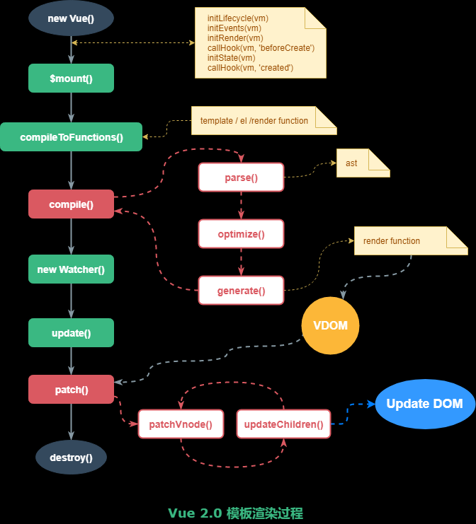

[vue开发看这篇文章就够了](https://segmentfault.com/a/1190000012692321)
https://www.yuque.com/cuggz/interview/hswu8g#8d6cd1d13b8d85c0090dd20084f39044
[30 道 Vue 面试题，内含详细讲解（涵盖入门到精通，自测 Vue 掌握程度）](https://github.com/fengshi123/blog/issues/14)
[Vue 面试知识点总结【持续更新中～】](https://segmentfault.com/a/1190000019633325)

>源码
>https://ustbhuangyi.github.io/vue-analysis/
>https://juejin.cn/post/6844903986978357256#heading-0
>http://zhouweicsu.github.io/blog/2017/03/07/vue-2-0-reactivity/

[vue生命周期探究（一）](https://segmentfault.com/a/1190000008879966)


稍后[基于Vue实现一个简易MVVM](https://juejin.cn/post/6844904099704471559#heading-14)

[剖析Vue原理&实现双向绑定MVVM](https://segmentfault.com/a/1190000006599500)
看 [0 到 1 掌握：Vue 核心之数据双向绑定](https://juejin.cn/post/6844903903822086151#heading-13)

[深入剖析：Vue核心之虚拟DOM](https://github.com/fengshi123/blog/blob/master/articles/%E6%B7%B1%E5%85%A5%E5%89%96%E6%9E%90%EF%BC%9AVue%E6%A0%B8%E5%BF%83%E4%B9%8B%E8%99%9A%E6%8B%9FDOM.md)

[Vue2.0 v-for 中 :key 到底有什么用？](https://www.zhihu.com/question/61064119)

---
nextTick 可以让我们在下次 DOM 更新循环结束之后执行延迟回调，用于获得更新后的 DOM。
[你真的理解$nextTick么](https://juejin.cn/post/6844903843197616136#heading-6)
[Vue nextTick 机制](https://juejin.cn/post/6844903599655370765#heading-1)

[Vue3.0 新特性以及使用经验总结](https://juejin.cn/post/6940454764421316644#heading-15)


## 问题

### vue框架有什么特点

数据驱动、组件化

### 双向绑定

#### 说一下Vue的工作原理（响应式原理）

Vue响应式底层实现方法是 Object.defineProperty() 方法，该方法中存在一个getter和setter的可选项，可以对属性值的获取和设置造成影响

从                                        3232 当你把一个普通的 JavaScript 对象传入 Vue 实例作为 data 选项，Vue 将遍历此对象所有的 property，并使用 Object.defineProperty 把这些 property 全部转为 getter/setter。

- 这些 getter/setter 对用户来说是不可见的，但是在内部它们让 Vue 能够追踪依赖，在 property 被访问和修改时通知变更。

- 每个组件实例都对应一个 watcher 实例，它会在组件渲染的过程中把“接触”过的数据 property 记录为依赖。之后当依赖项的 setter 触发时，会通知 watcher，从而使它关联的组件重新渲染。

>作者：Jieunsi
链接：https://www.nowcoder.com/discuss/670720?type=0&order=0&pos=13&page=1&ncTraceId=&channel=-1&source_id=discuss_tag_nctrack

>[Vue2.0 源码阅读：响应式原理](http://zhouweicsu.github.io/blog/2017/03/07/vue-2-0-reactivity/)

#### 为什么3.0用proxy取代Object.defineProperty
https://www.jianshu.com/p/860418f0785c

#### 依赖收集

Vue是一个实现数据驱动视图的框架~~ 我们都知道，Vue能够实现当一个数据变更时，视图就进行刷新，而且用到这个数据的其他地方也会同步变更；而且，这个数据必须是在有被依赖的情况下，视图和其他用到数据的地方才会变更。 所以，Vue要能够知道一个数据是否被使用，实现这种机制的技术叫做依赖收集根据Vue官方文档的介绍，其原理如下图所示：


---
```js
new Vue({
    template: 
        `<div>
            <span>text1:</span> {{text1}}
            <span>text2:</span> {{text2}}
        <div>`,
    data: {
        text1: 'text1',
        text2: 'text2',
        text3: 'text3'
    }
});
```
这里text3改变不会导致重新渲染，因为没对他进行依赖收集

##### Watcher

**每个组件实例都对应一个 watcher 实例**，它会在组件渲染的过程中把“接触”过的数据 property 记录为依赖。之后当依赖项的 setter 触发时，会通知 watcher，从而使它关联的组件重新渲染。
(一个Vue组件实例对应一个Watcher。)

**Vue里面有3种对象能创建Watcher实例**：component，watch，computed。

Watcher类的实现比较复杂，因为他的实例分为渲染 watcher（render-watcher）、计算属性 watcher（computed-watcher）、侦听器 watcher（normal-watcher）三种，
这三个实例分别是在三个函数中构建的：mountComponent 、initComputed和Vue.prototype.$watch。

- normal-watcher：我们在组件钩子函数watch 中定义的，都属于这种类型，即**只要监听的属性改变了，都会触发定义好的回调函数**，这类watch的expression是计算属性中的属性名。

- computed-watcher：我们在组件钩子函数computed中定义的，都属于这种类型，每一个 computed 属性，最后都会生成一个对应的 watcher 对象，但是这类 watcher 有个特点：当计算属性依赖于其他数据时，属性并不会立即重新计算，**只有之后其他地方需要读取属性的时候，它才会真正计算**，即具备 lazy（懒计算）特性。这类watch的expression是我们写的回调函数的字符串形式。

- render-watcher：每一个组件都会有一个 render-watcher, 当 data/computed 中的属性改变的时候，会调用该 render-watcher 来更新组件的视图。这类watch的expression是 function () {vm._update(vm._render(), hydrating);}。

除了功能上的区别，这三种 watcher 也有固定的执行顺序，分别是：computed-render -> normal-watcher -> render-watcher。

这样安排是有原因的，这样就能尽可能的保证，在更新组件视图的时候，computed 属性已经是最新值了，如果 render-watcher 排在 computed-render 前面，就会导致页面更新的时候 computed 值为旧数据。

---
观察者函数经过Watcher是这么被包装的： - 模板渲染：this._watcher = new Watcher(this, render, this._update) - 计算属性：

```js
computed: {
    name() {
        return `${this.firstName} ${this.lastName}`;
    }
}
/*
会形成
new Watcher(this, function name() {
    return `${this.firstName} ${this.lastName}`
}, callback);
*/
```

>作者：一只小考拉
链接：https://juejin.cn/post/6844903702881386504

---
当我们去实例化一个渲染 watcher 的时候，首先进入 watcher 的构造函数逻辑，然后会执行它的 `this.get()` 方法，进入 get 函数，首先会执行 `pushTarget(this)`

实际上就是把 Dep.target 赋值为当前的渲染 watcher 并压栈（为了恢复用）。接着又执行了 `this.getter` 对应就是 `updateComponent` 函数，这实际上就是在执行：

`vm._update(vm._render(), hydrating)`

它会先执行` vm._render()` 方法，因为之前分析过这个**方法会生成 渲染 VNode**，并且在这个过程中会对 vm 上的数据访问，这个时候就**触发**了数据对象的 getter。

>也就是模板编译在beforeMount就做好了，但是Vnode在`new Watcher`的时候（beforeMount之后mounted之前）才生成

>看 https://ustbhuangyi.github.io/vue-analysis/v2/reactive/getters.html#%E8%BF%87%E7%A8%8B%E5%88%86%E6%9E%90

### 渲染 虚拟DOM



>源码 看 https://github.com/AnnVoV/blog/issues/7
>稍后 https://zhouweicsu.github.io/blog/2017/04/21/vue-2-0-template/

### 生命周期

Vue 实例有一个完整的生命周期，也就是从开始创建、初始化数据、编译模版、挂载Dom -> 渲染、更新 -> 渲染、卸载等75一系列过程，我们称这是Vue的生命周期。 


流程图


### 在v-model上怎么用Vuex中state的值？
需要通过computed计算属性来转换。

```js
<input v-model="message">
// ...
computed: {
    message: {
        get () {
            return this.$store.state.message
        },
        set (value) {
            this.$store.commit('updateMessage', value)
        }
    }
}
```

### 你都做过哪些 Vue 的性能优化

对象层级不要过深，否则性能就会差
不需要响应式的数据不要放到 data 中（可以用 Object.freeze() 冻结数据）
v-if 和 v-show 区分使用场景
computed 和 watch 区分使用场景
v-for 遍历必须加 key，key 最好是 id 值，且避免同时使用 v-if
大数据列表和表格性能优化-虚拟列表/虚拟表格
防止内部泄漏，组件销毁后把全局变量和事件销毁
图片懒加载
路由懒加载(按需加载也是用箭头函数，只不过直接写在实例的components里面)
第三方插件的按需引入
适当采用 keep-alive 缓存组件
防抖、节流运用
服务端渲染 SSR or 预渲染

>作者：Big shark@LX
链接：https://juejin.cn/post/6961222829979697165
来源：掘金
著作权归作者所有。商业转载请联系作者获得授权，非商业转载请注明出处。

### Object.freeze() 是“浅冻结”
[Vue性能提升之Object.freeze()](https://juejin.cn/post/6844903922469961741#heading-6)

Vue添加响应式的时候会先判断configurable是否为true，因为后面会劫持数据，改写get和set方法。所以freeze了就不能响应式了。

### 说一下diff算法

稍后 [详解vue的diff算法](https://juejin.cn/post/6844903607913938951)

作者：洛霞
链接：https://www.nowcoder.com/discuss/459995?channel=-1&source_id=profile_follow_post_nctrack
来源：牛客网

创建一个React元素树之后，在更新的时候将创建一个新的React元素树，React使用Diff算法对元素树进行比对，只更新发生了改变的部分，避免多余的性能消耗。
主要是三个思想，可以从这三个谈：
7.1. 永远只比较同层节点。
7.2. 不同的两个节点产生两个不同的树。
7.3. 通过key值指定哪些更新是相同的。
(尽可能的复用旧的节点)

只有当新旧子节点的类型都是多个子节点时，核心 Diff 算法才派得上用场

---
vdom使用diff算法是为了找出需要更新的节点。vdom使用diff算法来比对两个虚拟dom的差异，以最小的代价比对2颗树的差异，在前一个颗树的基础上生成最小操作树，但是这个算法的时间复杂度为n的三次方=O(nnn)，当树的节点较多时，这个算法的时间代价会导致算法几乎无法工作。

>稍后 https://juejin.cn/post/6844904078196097031#heading-27

>https://github.com/fengshi123/blog/blob/master/articles/%E6%B7%B1%E5%85%A5%E5%89%96%E6%9E%90%EF%BC%9AVue%E6%A0%B8%E5%BF%83%E4%B9%8B%E8%99%9A%E6%8B%9FDOM.md

### React VS Vue
[React VS Vue —— 你需要知道的前端两大“框架”的异同](http://www.yangyong.xyz/2019/07/29/react-vs-vue/)

### Vuex

#### 页面刷新 Vuex数据丢失

在做vue项目的过程中有时候会遇到一个问题，就是进行页面刷新的时候，页面的数据会丢失，出现这个问题的原因是因为当用vuex做全局状态管理的时候，**store中的数据是保存在运行内存中**的，页面刷新时会**重新加载vue实例，store中的数据就会被重新赋值**，因此数据就丢失了

解决办法
- 最先想到的应该就是利用localStorage/sessionStorage将数据储存在外部
- computed

>https://segmentfault.com/a/1190000038950555

### 前端路由

#### hash 模式

hash 模式是一种把前端路由的路径用井号 # 拼接在真实 URL 后面的模式。当井号 # 后面的路径发生变化时，浏览器并不会重新发起请求，而是会触发 `hashchange` 事件。

它的特点在于：hash 虽然出现在 URL 中，但不会被包括在 HTTP 请求中，对后端完全没有影响，因此改变 hash 不会重新加载页面。

```html
<a href="#/a">A页面</a>
<a href="#/b">B页面</a>
<div id="app"></div>
<script>
  function render() {
    app.innerHTML = window.location.hash
  }
  window.addEventListener('hashchange', render)
  render()
</script>
```

总结一下 hash 模式的优缺点：

- 优点：浏览器兼容性较好，连 IE8 都支持
- 缺点：路径在井号 # 的后面，比较丑

#### history 模式

history API 是 H5 提供的新特性，允许开发者直接更改前端路由，即更新浏览器 URL 地址而不重新发起请求。

根据 Mozilla Develop Network 的介绍，调用 history.pushState() 相比于直接修改 hash(调用`window.location = "#foo"`)，存在以下优势：
- pushState() 设置的新 URL 可以是与当前 URL 同源的任意 URL；而 hash 只可修改 # 后面的部分，因此只能设置与当前 URL 同文档的 URL；
- pushState() 设置的新 URL 可以与当前 URL 一模一样，这样也会把记录添加到栈中；而 hash 设置的新值必须与原来不一样才会触发动作将记录添加到栈中；
- pushState() 通过 stateObject 参数可以添加任意类型的数据到记录中；而 hash 只可添加短字符串；
- pushState() 可额外设置 title 属性供后续使用。

>作者：旭1478080873000
链接：https://juejin.cn/post/6844903552519766029
来源：掘金
著作权归作者所有。商业转载请联系作者获得授权，非商业转载请注明出处。

```html
<a href="javascript:toA();">A页面</a>
<a href="javascript:toB();">B页面</a>
<div id="app"></div>
<script>
  function render() {
    app.innerHTML = window.location.pathname
  }
  function toA() {
    history.pushState({}, null, '/a')
    render()
  }
  function toB() {
    history.pushState({}, null, '/b')
    render()
  }
  window.addEventListener('popstate', render)
</script>
```

history API 提供了丰富的函数供开发者调用，我们不妨把控制台打开，然后输入下面的语句来观察浏览器地址栏的变化：

```js
history.replaceState({}, null, '/b') // 替换路由
history.pushState({}, null, '/a') // 路由压栈
history.back() // 返回
history.forward() // 前进
history.go(-2) // 后退2次
```

上面的代码监听了 popstate 事件，该事件能监听到：

- 用户点击浏览器的前进和后退操作
- 手动调用 history 的 back、forward 和 go 方法

监听不到：

- history 的 pushState 和 replaceState方法

这也是为什么上面的 toA 和 toB 函数内部需要**手动调用 render 方法**的原因。

浏览器在刷新的时候，会**按照路径发送真实的资源请求**，如果这个路径是前端通过 history API 设置的 URL，那么在服务端往往不存在这个资源，于是就返回 404 了。上面的参数的意思就是如果后端资源不存在就返回 history.html 的内容。

因此在线上部署基于 history API 的单页面应用的时候，一定要后端配合支持才行，否则会出现大量的 404。以最常用的 Nginx 为例，只需要在配置的 location / 中增加下面一行即可：

`try_files $uri /index.html;`

---
在用户手动输入 URL 后回车，或者刷新（重启）浏览器的时候。
1. hash 模式下，**仅** hash 符号之前的内容会被包含在请求中，如 http://www.abc.com，因此对于后端来说，即使没有做到对路由的全覆盖，也不会返回 404 错误。
2. history 模式下，前端的 URL 必须和实际向后端发起请求的 URL 一致，如 http://www.abc.com/book/id。 如果后端缺少对 /book/id 的路由处理，将返回 404 错误。Vue-Router 官网里如此描述：“不过这种模式要玩好，还需要后台配置支持……所以呢，你要在服务端增加一个**覆盖所有情况的候选资源**：如果 URL 匹配不到任何静态资源，则应该返回同一个 index.html 页面，这个页面就是你 app 依赖的页面。”

总结一下 history 模式的优缺点：

- 优点：路径比较正规，没有井号 #
- 缺点：兼容性不如 hash，且需要服务端支持，否则一刷新页面就404了

#### router和route的区别

route为当前router跳转对象里面可以获取name、path、query、params等

router为VueRouter实例，想要导航到不同URL，则使用router.push方法

### v-if v-show

#### v-if 原理

基于数据驱动的理念，当 v-if 指令对应的 value 为 false 的时候会预先**创建一个注释节点**。value 发生变化时，命中派发更新的逻辑，对新旧组件树进行 patch，从而完成使用 v-if 指令元素的动态显示隐藏。


>https://segmentfault.com/a/1190000039005215

### key

key 的特殊 attribute 主要用在 Vue 的虚拟 DOM 算法，在新旧 nodes 对比时辨识 VNodes。如果不使用 key，Vue 会使用一种最大限度减少动态元素并且尽可能的尝试就地修改/复用相同类型元素的算法。而使用 key 时，它会基于 key 的变化重新排列元素顺序，并且会移除 key 不存在的元素。

有相同父元素的子元素必须有独特的 key。重复的 key 会造成渲染错误。

最常见的用例是结合 v-for

>https://cn.vuejs.org/v2/api/#key