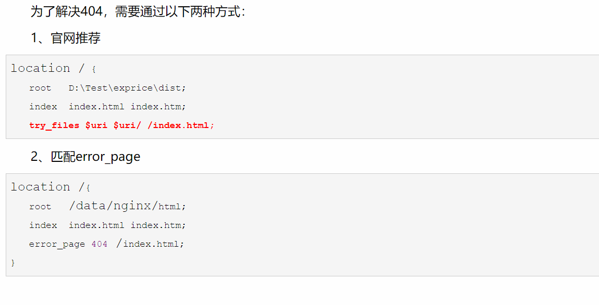

  ## 图片懒加载

1. 写lazyload方法
2. document.addEventListener("scroll", lazyLoad);
3. 包装成一个函数在mounted钩子调用

https://github.com/amandakelake/blog/issues/46

## 怎么保证图片等宽
父元素flex
子元素width: 48%; 固定宽度

## ？预加载

## 组件
### tab-control 联动效果

我们希望在当前页面上展示不同类型的商品。比如说当季流行，新品等等。

子组件tab-control内部是用v-for展示不同商品类型对应的选项卡的。
用一个变量currentType保存当前展示的商品类型。如果

### 详情页导航栏和页面的联动效果
就是当导航栏中有商品，参数，评论，推荐等选项，点击选项的时候会跳转到页面中对应的部分这个选项卡也会显示为被激活的样式。此外，当我们滑动页面到某个位置时，相应的导航栏中对应的选项卡也会被激活。

创建一个数组保存选项卡中对应元素在页面中的位置（offsetTop距离页面顶部的距离）。在这里其实就遇到了一些问题，开始我们想在mounted钩子里面获取这些值，但是发现获取到的值是错误的。之后试了像nexttick这些方法发现也都不行。最后发现原因在于我们页面中图片比较多，而且加载相对比较慢。在我们计算元素高度的时候这些图片还没加载出来，也就是没算上图片的高度所以结果不正确。最后解决的办法就是监听页面的onload事件，等图片加载完毕再去回调计算。

然后联动的效果就是当我们点击导航栏某个选项卡的时候，页面根据这个选项卡的索引他应该跳转到的位置，进行跳转。
然后通过监听scroll事件，判断当前页面位置，跟数组中的位置进行对比，激活对应的选项卡（v-bind动态绑定class）。当然这一步也是加上了节流来保证性能。


### backtop回到顶部

抽到mixin里面了
```js
document.documentElement.scrollTop = 0;   //点击返回顶部

// 超过指定高度才显示
mounted(){
        // console.log(window.document.documentElement.clientHeight); 
        //获取页面可视化高度

       window.addEventListener("scroll",()=>{
        //  console.log(document.documentElement.scrollTop);  
        //获取页面滚动的高度
           let scrollTop = document.documentElement.scrollTop;
           if(scrollTop > 100){
               this.flag = true;
           }else{
               this.flag = false;
           }

       }) 

//  离开该页面需要移除这个监听的事件，不然会报错;
destroyed () {
window.removeEventListener('scroll', this.scrollToTop);

}
```

---
平滑滚动
```js
// 封装一个回到底部或者顶部的函数
scrollToTop(position) {
  // 使用requestAnimationFrame，如果没有则使用setTimeOut
  if(!window.requestAnimationFrame) {
    window.requestAnimationFrame = function(callback) {
      return setTimeout(callback, 20)
    }
  }

  // 获取当前元素滚动的距离
  let scrollTopDistance = document.documentElement.scrollTop || document.body.scrollTop;

  function smoothScroll() {
    // 如果你要滚到顶部，那么position传过来的就是0，下面这个distance肯定就是负值。
    let distance = position - scrollTopDistance;
    // 每次滚动的距离要不一样，制造一个缓冲效果
    scrollTopDistance = scrollTopDistance + distance / 5;
    // 判断条件
    if(Math.abs(distance) < 1) {
      window.scrollTo(0, position);
    }else {
      window.scrollTo(0, scrollTopDistance);
      requestAnimationFrame(smoothScroll);
    }
  }

  smoothScroll();
 }
```

or
```js
backtop(){
          var timer = setInterval(function(){
            let osTop = document.documentElement.scrollTop || document.body.scrollTop;
            let ispeed = Math.floor(-osTop / 5); 
            document.documentElement.scrollTop = document.body.scrollTop = osTop + ispeed;
            this.isTop = true;
            if(osTop === 0){
              clearInterval(timer);
            }
          },30)
      }
    }
```

window.scrollto
```js
// 设置滚动行为改为平滑的滚动
window.scrollTo({
    top: 1000,
    behavior: "smooth"
});
```

### detail 
监听goodItem 点击，执行路由跳转。
带上商品id作为参数
```js
itemClick() {
      // 路由跳转
      this.$router.push({
        path: './detail',
        query: {
          // 传递参数（iid）
          iid: this.goodsItem.iid
        }
      })
    }
```

detail组件内获取到id
```js
created() {
      // 1.接收参数（iid）
      this.iid = this.$route.query.iid
```

### toast（插件）

(D:\Coding\frontend\supermall\src\components\common\toast\index.js)

插件通常用来为 Vue 添加全局功能。插件的功能范围没有严格的限制——一般有下面几种：

添加全局方法或者属性。如: vue-custom-element
添加全局资源：指令/过滤器/过渡等。如 vue-touch
通过全局混入来添加一些组件选项。如 vue-router
添加 Vue 实例方法，通过把它们添加到 Vue.prototype 上实现。
一个库，提供自己的 API，同时提供上面提到的一个或多个功能。如 vue-router

**使用场景**
具体的其实在插件是什么章节已经表述了，这里在总结一下

组件 (Component) 是用来构成你的 App 的业务模块，它的目标是 App.vue

插件 (Plugin) 是用来增强你的技术栈的功能模块，它的目标是 Vue 本身

简单来说，插件就是指对Vue的功能的增强或补充

>[面试官：Vue中组件和插件有什么区别？](https://github.com/febobo/web-interview/issues/11)

## keep-alive缓存组件

## 网络封装

### 重新封装接口
后端接口返回的是一个json格式的对象，他中间有很多属性也是对象。有很多像商品价格，历史价格等放在一个对象里了，商品名称又放在一个属性里，而其他的像商品服务（就是配送啊换新啊这些）则是放在另一个对象里面，除此之外还有一些我们不需要的属性。我们希望自己封装一个对象，把我们需要的属性都抽出来放到这个对象里面，而且只保留我们需要的属性。

```js
this.goodsInfo = new GoodsInfo(data.itemInfo, data.columns, data.shopInfo.services)
```
把多个对象传入，变成最终我们想要的对象。

### 请求分页数据
请求商品的时候带上参数page，请求对应的页。每种类型的商品都是个对象，包含属性page和list（商品列表）

### 返回按钮
`this.$router.back()`

## nginx
### 跨域
在配置文件中server 模块中加上一条location帮我们转发请求。具体来说就是匹配所有的/api 这种路径的请求，然后写上 proxy_pass 来帮我们转发到真正的后端的地址去。然后项目中的ajax请求实际上就直接发送到本地的端口等nginx转发了。

https://segmentfault.com/a/1190000015597029
https://segmentfault.com/a/1190000012859206

### History模式的配置
```js
server {
		listen       80;  # 配置监听的端口
		server_name  localhost;  # 配置的域名

		charset utf-8;

		location / {
			root   /usr/share/nginx/dist;  # 网站根目录
			index  index.html index.htm;   # 默认首页文件
 			try_files $uri $uri/ @router;   #一个覆盖所有情况的候选资源：如果 URL 匹配不到任何静态资源，返回同一个 index.html 页面
			# deny 172.168.22.11;   # 禁止访问的ip地址，可以为all
			# allow 172.168.33.4; # 允许访问的ip地址，可以为all
		}

    # 由于路由的资源不一定是真实的路径，无法找到具体文件
    # 所以需要将请求重写到 index.html 中，然后交给真正的 Vue 路由处理请求资源
		location @router {
		        rewrite ^.*$ /index.html last;
		}

		error_page 500 502 503 504 /50x.html;  # 默认50x对应的访问页面
		error_page 400 404 error.html;   # 同上
	}
```

---


以上面的 http://www.example.com/post 为例，`$uri` 会匹配到 post，`$uri/` 则匹配名为post的文件夹。nginx 发现 dist 目录下下面没有 post 这个文件，也没有 post 这个文件夹，所以最后会返回 dist 目录下的 index.html。这样，index.html 被浏览器加载之后，前端路由就会工作，将用户需要的资源加载出来。而我们 build 出来的 css，js 文件，由于可以被 nginx 正确找到，则不会受到影响。

>作者：关中码农
链接：https://juejin.cn/post/6973835820767641607

## 鉴权

稍后 [前后端常见的几种鉴权方式](https://blog.csdn.net/wang839305939/article/details/78713124/)
[单页应用 - Token 验证](https://juejin.cn/post/6844903471901048845)