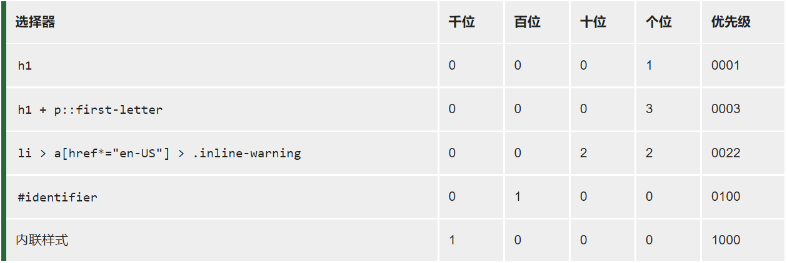
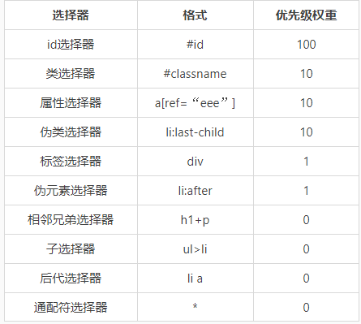
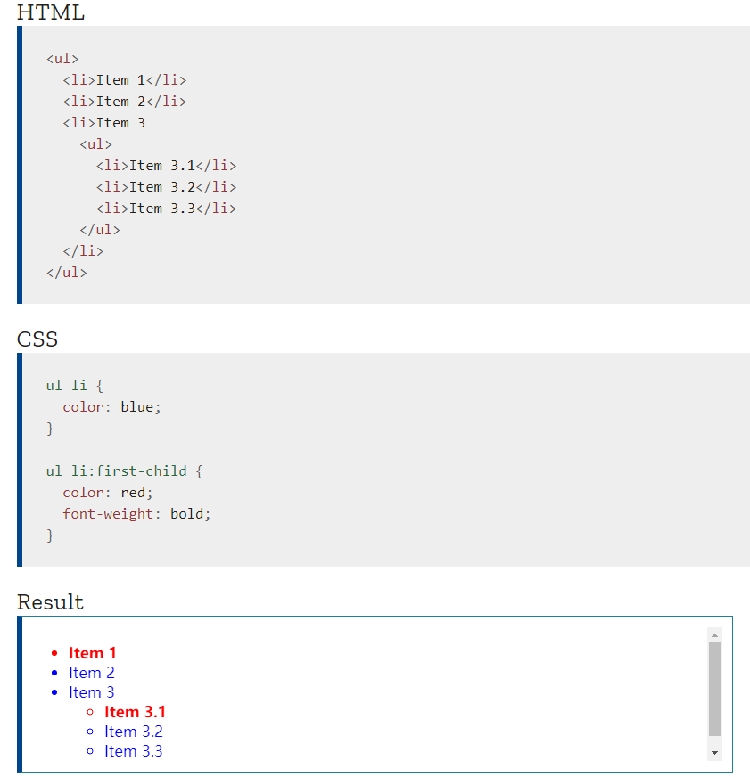
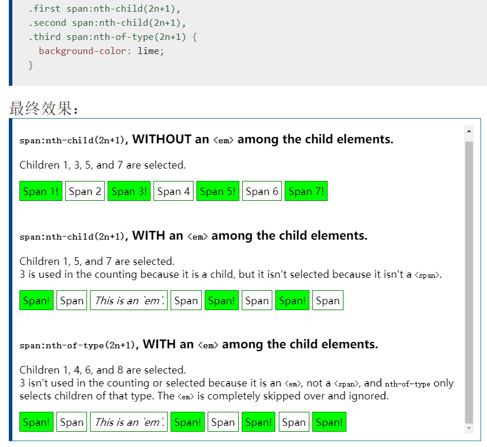
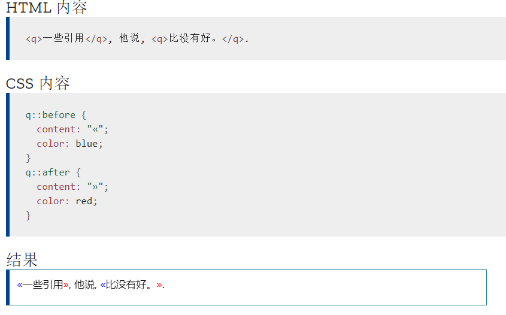
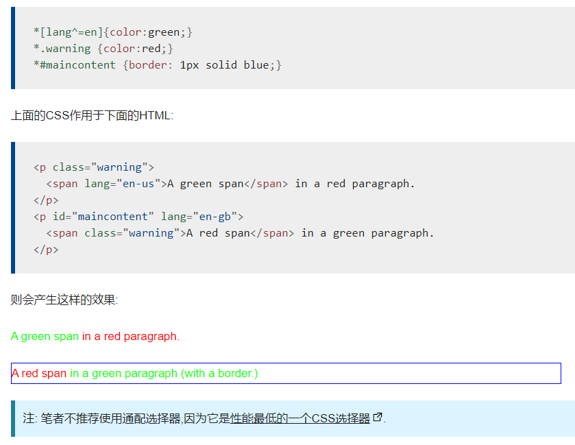
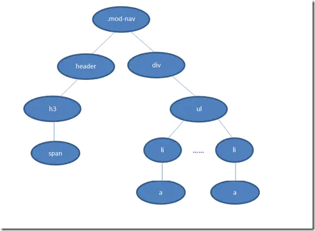

## 一. 选择器与优先级
### 1. 优先级
一个选择器的优先级可以说是由四个部分相加 (分量)，可以认为是个十百千 — 四位数的四个位数：


* **千位：** 如果声明在 style 的属性（内联样式）则该位得一分。这样的声明没有选择器，所以它得分总是1000。
* **百位：** 选择器中包含ID选择器则该位得一分。
* **十位：** 选择器中包含类选择器、属性选择器或者伪类则该位得一分。
* **个位：** 选择器中包含元素(标签)、伪元素选择器则该位得一分。

```注: 
1. 通用选择器 (*)，组合符 (+, >, ~, ' ')，和否定伪类 (:not) 不会影响优先级。
2. 不允许进位。
3. !important声明的样式的优先级最高；（覆盖 !important 唯一的办法就是另一个 !important 具有 相同优先级 而且顺序靠后，或者更高优先级。但是，强烈建议除了非常情况不要使用它。）
4. 如果优先级相同，则最后出现的样式生效；
5. 继承得到的样式的优先级最低
6. 样式表的来源不同时，优先级顺序为：内联样式 > 内部样式 > 外部样式 > 浏览器用户自定义样式 > 浏览器默认样式。
```

例子：

> https://developer.mozilla.org/zh-CN/docs/Learn/CSS/Building_blocks/Cascade_and_inheritance#%E4%BC%98%E5%85%88%E7%BA%A7 

---
```css
li                                  /* (0, 0, 0, 1) */
ul li                               /* (0, 0, 0, 2) */
ul ol+li                            /* (0, 0, 0, 3) */
ul ol+li                            /* (0, 0, 0, 3) */
h1 + *[REL=up]                      /* (0, 0, 1, 1) */
ul ol li.red                        /* (0, 0, 1, 3) */
li.red.level                        /* (0, 0, 2, 1) */
a1.a2.a3.a4.a5.a6.a7.a8.a9.a10.a11  /* (0, 0, 11,0) */
#x34y                               /* (0, 1, 0, 0) */
li:first-child h2 .title            /* (0, 0, 2, 2) */
#nav .selected > a:hover            /* (0, 1, 2, 1) */
html body #nav .selected > a:hover  /* (0, 1, 2, 3) */
```
比较规则是: 从左往右依次进行比较 ，较大者胜出，如果相等，则继续往右移动一位进行比较 。如果4位全部相等，则后面的会覆盖前面的

### 2. 选择器


#### 2.1 伪类
1）这组选择器包含了伪类，用来**样式化一个元素的特定状态**。（更好）
2）将特殊的效果添加到特定选择器上。它是**已有元素上添加类别的**，**不会产生新的元素**。例如：
``` css {.line-numbers}
a:hover {color: #FF00FF}
p:first-child {color: red}
```

##### 2.1.1 静态伪类和动态伪类

---
伪类选择器分为两种。

（1）**静态伪类**：只能用于**超链接**的样式。如下：

- `:link` 超链接点击之前
- `:visited` 链接被访问过之后

PS：以上两种样式，只能用于超链接。

（2）**动态伪类**：针对**所有标签**都适用的样式。如下：

- `:hover` “悬停”：鼠标放到标签上的时候
- `:active`	“激活”： 鼠标点击标签，但是不松手时。
- `:focus` 是某个标签获得焦点时的样式（比如某个输入框获得焦点）
---
分法2
**状态性伪类**
是基于元素当前状态进行选择的。在与用户的交互过程中元素的状态是动态变化的，因此该元素会根据其状态呈现不同的样式。当元素处于某状态时会呈现该样式，而进入另一状态后，该样式也会失去。

* `:link` 应用于未被访问过的链接。
* `:hover` 应用于鼠标悬停到的元素。
* `:active` 应用于被激活的元素。
* `:visited` 应用于被访问过的链接，与`:link`互斥。
* `:focus` 应用于拥有键盘输入焦点的元素。

**结构性伪类**
`CSS3`新增选择器，利用`dom`树进行元素过滤，通过文档结构的互相关系来匹配元素，能够减少`class`和`id`属性的定义，使文档结构更简洁。
* `div:first-child` 选择属于**其父元素**的第一个子`div`元素（==第一个孩子元素且名为div的,如果不是div则忽略==）。

* `div:last-child` 选择属于**其父元素**最后一个子元素的每个`div`元素。
* `div:nth-child(n)` 这个 CSS 伪类首先找到所有当前元素的兄弟元素，然后按照位置先后顺序从1开始排序，选择的结果为CSS伪类`:nth-child`括号中表达式`（an+b）`匹配到的元素集合。（==第n个孩子元素且名为div的，如果不是div则跳过再找下n个==）。

  >选择器示例
  >- tr:nth-child(2n+1)
  表示HTML表格中的奇数行。
  >- tr:nth-child(odd)
  表示HTML表格中的奇数行。
  >- tr:nth-child(2n)
  表示HTML表格中的偶数行。
  >- tr:nth-child(even)
  表示HTML表格中的偶数行。
  >- span:nth-child(0n+1)
  表示子元素中第一个且为span的元素，与 :first-child 选择器作用相同。
  >- span:nth-child(1)
  >表示父元素中子元素为第一的并且名字为span的标签被选中
  >- span:nth-child(-n+3)
  >匹配前三个子元素中的span元素。

  
* `div:nth-last-child(n)` 同上，从这个元素的最后一个子元素开始算。
* `:empty` 选择的元素里面没有任何内容。
* `:checked` 匹配被选中的`input`元素，这个`input`元素包括`radio`和`checkbox`。
* `:default` 匹配默认选中的元素，例如提交按钮总是表单的默认按钮。
* `:disabled` 匹配禁用的表单元素。
* `:enabled` 匹配没有设置`disabled`属性的表单元素。
* `:valid` 匹配条件验证正确的表单元素。

#### 2.2 伪元素
- 伪元素是一个附加至选择器末的关键词，允许你**对被选择元素的特定部分修改样式**。**选择一个元素的某个部分而不是元素自己**。（**并不存在于dom之中**，只存在在页面之中。）
- 在内容元素的前后插入额外的元素或样式，但是这些元素实际上并不在文档中生成。**它们只在外部显示可见，但不会在文档的源代码中找到它们**，因此，称为“伪”元素。例如：
``` css {.line-numbers}
p::before {content:"第一章：";}
p::after {content:"Hot!";}
p::first-line {background:red;}
p::first-letter {font-size:30px;}
```

##### 2.1.1 before, after
CSS中，::before 创建一个伪元素，其将成为匹配选中的元素的**第一个子元素**（after则是最后一个）。常通过 content 属性来为一个元素添加修饰性的内容。此元素默认为行内元素。

>注意: 
1.由::before 和::after 生成的伪元素 包含在元素格式框内（尖括号内）， 因此不能应用在替换元素上， 比如``或`<br>` 元素。
2.CSS3 引入 ::before  是为了将伪类和伪元素区别开来。浏览器也接受由CSS 2 引入的 :before 写法。

**语法**
``` css {.line-numbers}
/* CSS3 语法 */
element::before { 样式 }
/* （单冒号）CSS2 过时语法 (仅用来支持 IE8) */
element:before  { 样式 }
/* 在每一个p元素前插入内容 */
p::before { content: "Hello world!"; } 
```

e.g.


#### 2.2 其他
##### 2.2.1 子选择器
当使用  > 选择符分隔两个元素时,它只会匹配那些作为第一个元素的**直接后代**(子元素)的第二元素. 与之相比, 当两个元素由 后代选择器 相连时, 它表示匹配存在的所有由第一个元素作为祖先元素(但不一定是父元素)的第二个元素, 无论它在 DOM 中"跳跃" 多少次.

##### 2.2.2 相邻兄弟选择器
相邻兄弟选择器 (+) 介于两个选择器之间，当第二个元素紧跟在第一个元素之后，并且两个元素都是属于同一个父元素的子元素，则第二个元素将被选中

##### 2.2.3 通用兄弟选择器
兄弟选择符，位置无须紧邻，只须同层级，`A~B` 选择A元素之后所有同层级B元素。

##### 2.2.4 通配选择器
在CSS中,一个星号`(*)`就是一个通配选择器.它可以匹配任意类型的HTML元素.在配合其他简单选择器的时候,省略掉通配选择器会有同样的效果.比如,`*.warning` 和`.warning` 的效果完全相同.

e.g.


### 3. css解析规则
CSS选择器是 **从右向左解析** 。
若从左向右的匹配，发现不符合规则，需要进行回溯，会损失很多性能。
若从右向左匹配，先找到所有的最右节点，对于每一个节点，向上寻找父节点直到找到根元素或者满足条件的匹配规则，则结束这个分支的遍历。
两种匹配规则的性能差别很大，是因为**从右向左的匹配在第一步就筛选掉了大量的不符合条件的最右节点**（叶子节点），而从左向右的匹配规则的性能都浪费在了失败的查找上面。
```
.mod-nav h3 span { font-size: 16px; }
```

若从左向右的匹配，过程是：从.mod-nav开始，遍历子节点header和子节点div，然后各自向子节点遍历。在右侧div的分支中，最后遍历到叶子节点a，发现不符合规则，需要回溯到ul节点，再遍历下一个li-a，假如有1000个li，则这1000次的遍历与回溯会损失很多性能。
再看看从右至左的匹配：先找到所有的最右节点span，对于每一个span，向上寻找节点h3，由h3再向上寻找class=mod-nav的节点，最后找到根元素html则结束这个分支的遍历。
很明显，两种匹配规则的性能差别很大。之所以会差别很大，是因为从右向左的匹配在第一步就筛选掉了大量的不符合条件的最右节点（叶子节点）；而从左向右的匹配规则的性能都浪费在了失败的查找上面。
