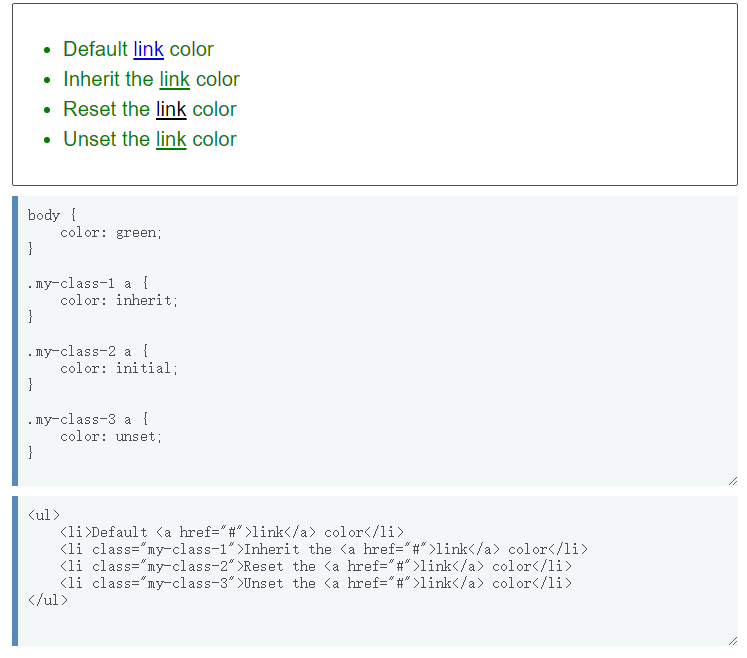
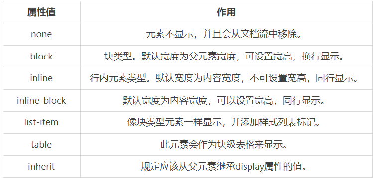
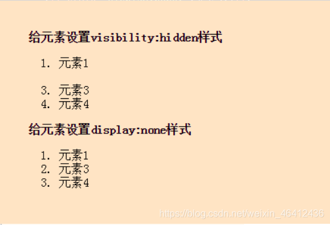
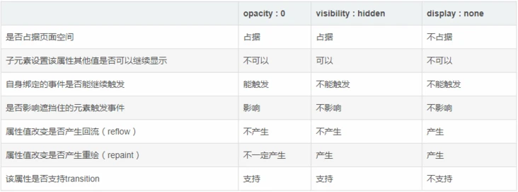
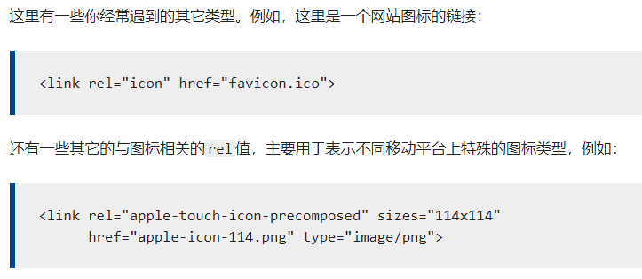
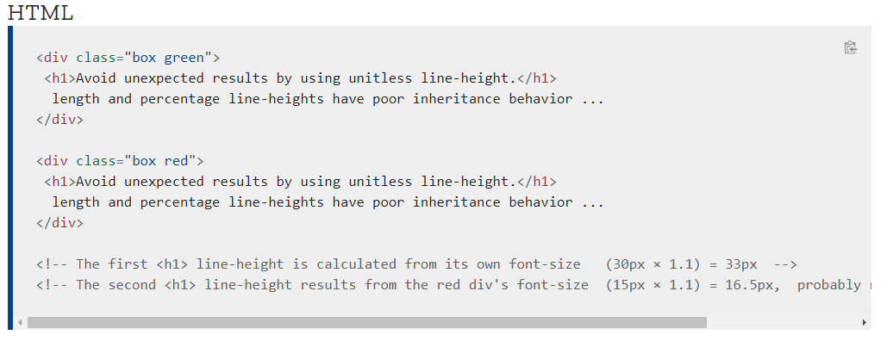
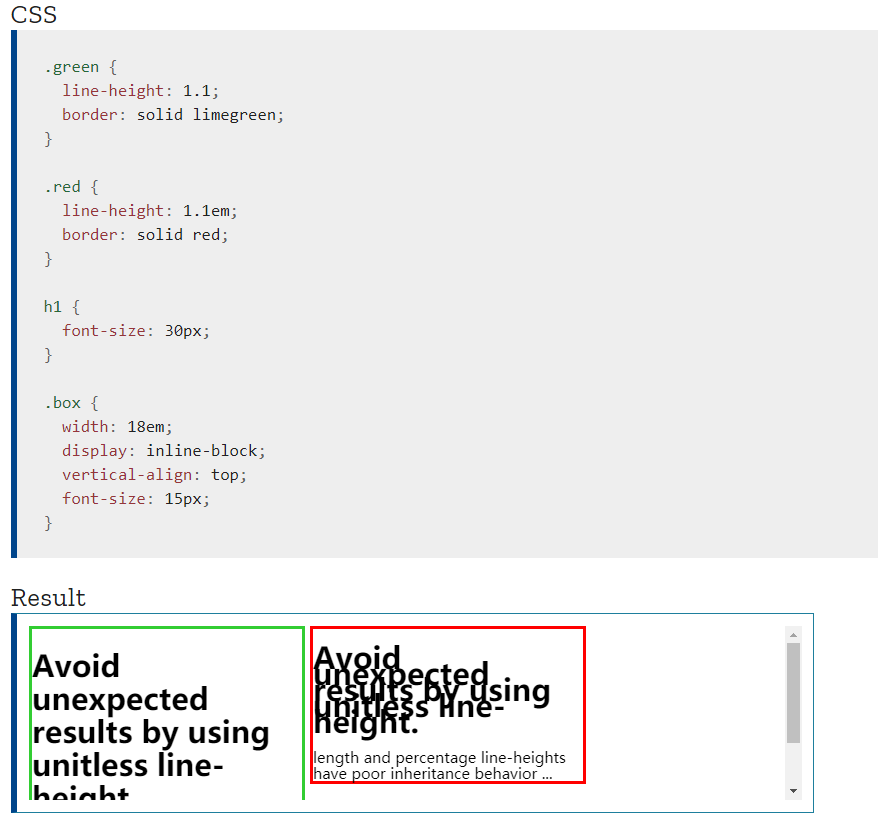
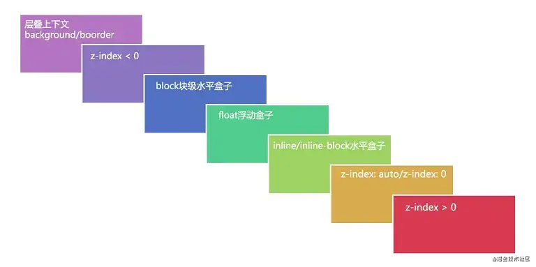
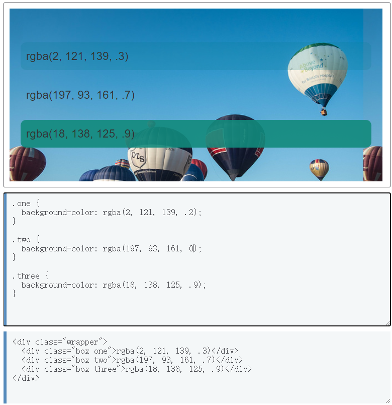

## 二. CSS中的属性
### 1. 属性继承
 一些设置在父元素上的css属性是可以被子元素继承的，有些则不能。

#### 1.1 CSS中可继承与不可继承属性有哪些

##### 1.1.1 无继承性的属性

1. display：规定元素应该生成的框的类型
2. 文本属性：
vertical-align：垂直文本对齐
text-decoration：规定添加到文本的装饰
text-shadow：文本阴影效果
white-space：空白符的处理
unicode-bidi：设置文本的方向
3. 盒子模型的属性：width、height、margin、border、padding
4. 背景属性：background、background-color、background-image、background-repeat、background-position、background-attachment
5. 定位属性：float、clear、position、top、right、bottom、left、min-width、min-height、max-width、max-height、overflow、clip、z-index
6. 生成内容属性：content、counter-reset、counter-increment
7. 轮廓样式属性：outline-style、outline-width、outline-color、outline
8. 页面样式属性：size、page-break-before、page-break-after
9. 声音样式属性：pause-before、pause-after、pause、cue-before、cue-after、cue、play-during

##### 1.1.2 有继承性的属性

1. 字体系列属性
font-family：字体系列
font-weight：字体的粗细
font-size：字体的大小
font-style：字体的风格
2. 文本系列属性
text-indent：文本缩进
text-align：文本水平对齐
line-height：行高
word-spacing：单词之间的间距
letter-spacing：中文或者字母之间的间距
text-transform：控制文本大小写（就是uppercase、lowercase、capitalize这三个）
color：文本颜色
3. 元素可见性
visibility：控制元素显示隐藏
4. 列表布局属性
list-style：列表风格，包括list-style-type、list-style-image等
5. 光标属性
cursor：光标显示为何种形态

#### 1.2 控制继承
CSS 为控制继承提供了四个特殊的通用属性值。每个css属性都接收这些值。

**inherit**
设置该属性会使子元素属性和父元素相同。实际上，就是 "开启继承".

**initial**
设置属性值和浏览器默认样式相同。如果浏览器默认样式中未设置且该属性是自然继承的，那么会设置为 inherit 。

**unset**
将属性重置为自然值，也就是如果属性是自然继承那么就是 inherit，否则和 initial一样

e.g.


### 2. display

#### 2.1 display的值及其作用


flex, grid

#### 2.2 display的 block、inline和 inline-block的区别

1. block：会独占一行，多个元素会另起一行，可以设置width、height、margin和padding属性；
2. inline：元素不会独占一行，设置width、height属性无效。但可以设置水平方向的margin和padding属性，不能设置垂直方向的padding和margin；
3. inline-block：将对象设置为inline对象，但对象的内容作为block对象呈现，之后的内联对象会被排列在同一行内。

#### 2.3 隐藏元素的方法有哪些

* display: none：渲染树不会包含该渲染对象，因此该元素不会在页面中占据位置，也不会响应绑定的监听事件。资源会加载，DOM可以访问。
* visibility: hidden：元素在页面中仍占据空间，但是不会响应绑定的监听事件。要注意若将其子元素设为 `visibility: visible`，则该子元素依然可见。
* opacity: 0：将元素的透明度设置为 0，以此来实现元素的隐藏。元素在页面中仍然占据空间，并且**能够响应元素绑定的监听事件**。
  
*这三个是主要的*

---
* position: absolute：通过使用绝对定位将元素移除可视区域内，以此来实现元素的隐藏。
* z-index: 负值：来使其他元素遮盖住该元素，以此来实现隐藏。
* clip/clip-path ：使用元素裁剪的方法来实现元素的隐藏，这种方法下，元素仍在页面中占据位置，但是不会响应绑定的监听事件。
* transform: scale(0,0)：将元素缩放为 0，来实现元素的隐藏。这种方法下，元素仍在页面中占据位置，但是不会响应绑定的监听事件。

#### 2.4 display:none与visibility:hidden的区别
这两个属性都是让元素隐藏，不可见。两者区别如下：
1. 在渲染树中
display:none会让元素完全从渲染树中消失，渲染时不会占据任何空间；
visibility:hidden不会让元素从渲染树中消失，渲染的元素还会占据相应的空间，只是内容不可见。
2. 是否是继承属性
display:none是非继承属性，子孙节点会随着父节点从渲染树消失，通过修改子孙节点的属性也无法显示；
visibility:hidden是继承属性，子孙节点消失是由于继承了hidden，通过设置visibility:visible可以让子孙节点显示；
3. 修改常规文档流中元素的 display 通常会造成文档的重排（回流），但是修改visibility属性只会造成本元素的重绘；
4. 如果使用读屏器，设置为display:none的内容不会被读取，设置为visibility:hidden的内容会被读取。
5. visibility:hidden不会影响计数器计数（ol标签）


#### 三者的区别

- 使用 opacity 和 display 属性时，父元素对子元素的影响很明显，**子元素**设置的 opacity 和 display 属性是不起作用的，显示的效果和父元素一样，而使用 visibility 属性时，子元素如果设置为 visibility:visible; 并没有受父元素的影响，可以继续显示出来。

- dispaly 属性会产生回流，而 opacity 和 visibility 属性不会产生回流。

- dispaly 和 visibility 属性会产生重绘，而 opacity 属性不一定会产生重绘。



>https://segmentfault.com/a/1190000015116392

### 3. 一些html标签和css属性的区别
### 3.1 link和@import的区别
两者都是外部引用CSS的方式，它们的区别如下：
* link是XHTML标签，除了加载CSS外，还可以定义RSS等其他事务，, 定义rel连接属性等作用；@import是 CSS 提供的语法规则，只有导入样式表（CSS）的作用
  ```html
  <!-- 标签 -->
  <link rel="icon" href="favicon.ico">

  <!-- 字体 -->
  <link rel="preload" href="myFont.woff2" as="font"
      type="font/woff2" crossorigin="anonymous">
  ```
* link引用CSS时，在页面载入时同时(异步，开启新的HTTP线程)加载（加载的时候就是带样式的）；@import需要在页面加载完毕以后（同步）加载（所以会出现一开始没有css样式，闪烁一下出现样式后的页面(网速慢的情况下)）。
* link是XHTML标签，无兼容问题；@import是在CSS2.1提出的，低版本的浏览器不支持。
---
* link支持使用Javascript控制DOM去改变样式；而@import不支持。
* 在css和html中均可以使用@import，`<link>`是html标签，只能放入html源代码中使用

#### 3.1.1 link标签
1. 

2. `<link>`元素可以出现在`<head>`元素或者`<body>`元素中，具体取决于它是否有一个body-ok的链接类型。例如，stylesheet链接类型是body-ok的，因此`<link rel="stylesheet">`允许出现在body中。然而，这不是一种好的可遵循的实践方式；更合理的方式是，将你的`<link>`元素从你的body内容中分离出来，将其放在`<head>`中。
3. 一般使用`<link>`指定可替换样式表。在这个标签中指定rel="alternate stylesheet" 属性和 title="..."属性
``` css {.line-numbers}
<link href="reset.css" rel="stylesheet" type="text/css">

<link href="default.css" rel="stylesheet" type="text/css" title="Default Style">
<link href="fancy.css" rel="alternate stylesheet" type="text/css" title="Fancy">
<link href="basic.css" rel="alternate stylesheet" type="text/css" title="Basic">
```
### 3.2 img和background-image的区别
* 解析机制：img属于html标签，background-img属于css。img先解析
* SEO：img标签有一个alt 属性可以指定图像的替代文本，有利于SEO，并且在图片加载失败时有利于阅读
* 语义化角度：img语义更加明确

### 4. 对line-height 的理解及其赋值方式
#### 4.1 line-height的概念：
* line-height 指一行文本的高度，包含了字间距，实际上是下一行基线到上一行**基线距离**；(基线之意，被定义为字符x的下边缘)
* 如果一个标签没有定义 height 属性，那么其最终表现的高度由 line-height 决定；
* 一个容器没有设置高度，那么**撑开容器高度**的是 line-height，而不是容器内的文本内容；(还是得有文字内容才能撑起来)
* 把 line-height 值设置为 height 一样大小的值可以实现**单行文字的垂直居中**；
* line-height 和 height 都能撑开一个高度；
  
#### 4.2 line-height 的赋值方式：
* 带单位：px 是固定值，而 em 会参考父元素 font-size 值计算自身的行高。以 em 为单位的值可能会产生不确定的结果（见下面的例子）。
* 纯数字：该属性的应用值是这个无单位数字<数字>乘以**该元素的字体大小**。计算值与指定值相同。大多数情况下，这是设置line-height的**推荐方法**，不会在继承时产生不确定的结果。
  会把比例传递给后代。例如，父级行高为 1.5，子元素字体为 18px，则子元素行高为 1.5 * 18 = 27px
* 百分比：与元素自身的字体大小有关。计算值是给定的百分比值乘以元素计算出的字体大小。将*计算后的值*传递给后代。百分比值可能会带来不确定的结果。
* normal：取决于用户端。桌面浏览器使用默认值，约为1.2，这取决于元素的 font-family。




百分比与纯数字区别：

使用百分比时，会计算父元素的line-height值，然后将其继承给子元素；使用数字时，子元素先继承1.5这个系数，再计算对应的line-height像素值
e.g.
``` css {.line-numbers}
百分比
body{font-size:14px;line-height:150%;}
p{font-size:26px;}

body{line-height:21px;}//14*150%=21
p{line-heigt:21px;}//继承父元素 
------
纯数字
body{font-size:14px;line-height:1.5;}
p{font-size:26px;}

body{line-height:21px;} //14*1.5=21 
p{line-height:39px;} //26*1.5=39
```

### 5. 层叠上下文
层叠上线文就是结界，其中的元素如果跟层叠上下文之外的元素发生层叠，就比较他们的层叠水平高低来显示。

创建的方法：postion为relative、absolute、fixed的元素设置z-index

顺序是：底层的border、background，负值z-index，块级盒子，浮动盒子，内联盒子，z-index：auto, 正z-index



对于上图，由上到下分别是：
（1）背景和边框：建立当前层叠上下文元素的背景和边框。
（2）负的z-index：当前层叠上下文中，z-index属性值为负的元素。
（3）块级盒：文档流内非行内级非定位后代元素。
（4）浮动盒：非定位浮动元素。
（5）行内盒：文档流内行内级非定位后代元素。
（6）z-index:0：层叠级数为0的定位元素。
（7）正z-index：z-index属性值为正的定位元素。

注意: 当定位元素z-index:auto，生成盒在当前层叠上下文中的层级为 0，不会建立新的层叠上下文，除非是根元素。

#### 5.1 z-index属性在什么情况下会失效
通常 z-index 的使用是在有两个重叠的标签，在一定的情况下控制其中一个在另一个的上方或者下方出现。z-index值越大就越是在上层。z-index元素的position属性需要是relative，absolute或是fixed。

z-index属性在下列情况下会失效：
* 父元素position为relative时，子元素的z-index失效。解决：父元素position改为absolute或static；
* 元素没有设置position属性为非static属性。解决：设置该元素的position属性为relative，absolute或是fixed中的一种；
* 元素在设置z-index的同时还设置了float浮动。解决：float去除，改为display：inline-block；

>同时设置float和position为absolute float会失效；


z-index 属性指定：
1. 盒子在当前堆叠上下文中的堆叠层级。
2. 盒子是否创建一个本地堆叠上下文。

### 6. CSS单位
#### 6.1 常见的CSS布局单位
常用的布局单位包括像素（px），百分比（%），em，rem，vw/vh。

1. 像素（px）是页面布局的基础，一个像素表示终端（电脑、手机、平板等）屏幕所能显示的最小的区域，像素分为两种类型：CSS像素和物理像素：
* CSS像素：为web开发者提供，在CSS中使用的一个抽象单位；
* 物理像素：只与设备的硬件密度有关，任何设备的物理像素都是固定的。
>通常而言，一个CSS像素代表屏幕设备的一个像素点，但是对于高分辨率屏幕而言一个CSS像素往往占多个设备像素，也就是说有多个屏幕像素点来表示1px，1px = 1in / 96。
作为CSS中最常用的单位，关于px还是有必要多说两句的。px的特点可以归纳如下：
在低分辨率设备上，1px = 1像素；(可能1个像素都大于1/96in)
在高分辨率设备上，1px = 1/96in，1px不一定等于1像素（比如4.7英寸的iphone上 1px=2像素）；
对于图片显示，1px = 1图片像素，比如：一个600x400分辨率的照片的的CSS宽高即为600px和400px（在4.7英寸iphone上要用1200x800个像素点显示）；

2. 百分比（%），当浏览器的宽度或者高度发生变化时，通过百分比单位可以使得浏览器中的组件的宽和高随着浏览器的变化而变化，从而实现响应式的效果。一般认为子元素的百分比相对于直接父元素。 
* 子元素的height或width中使用百分比，是相对于子元素的直接父元素，width相对于父元素的width，height相对于父元素的height。
>注意:height百分比**必须要父元素有高度**.如果父亲没内容子元素设百分比是撑不起高度的.而宽度默认是占满整行宽度的,一般没有这个问题.
当我们给块元素设置百分比高度时,往往没能看到效果.因为百分比的大小是相对其最近的父级元素的高的大小,也就是说,其最近的父级元素应该有一个明确的高度值才能使其百分比高度生效.（**默认的body元素没有高度 不能生效**， 可以用padding-bottom：50%）
* 子元素的**top和bottom如果设置百分比**，则相对于直接非static定位的父元素的高度，同样子元素的left和right如果设置百分比，则相对于直接非static定位父元素的宽度。
* 子元素的padding如果设置百分比，不论是垂直方向或者是水平方向，**都相对于直接父亲元素的width，而与父元素的height无关**。
* 子元素的margin如果设置成百分比，不论是垂直方向还是水平方向，**都相对于直接父元素的width**。
* 设置border-radius为百分比，则是**相对于自身**的宽度，还有translate、background-size等都是相对于自身的。
* transform: translate**相对于自身**的尺寸
  
3. em和rem相对于px更具灵活性，它们都是相对长度单位，它们之间的区别：em相对于父元素，rem相对于根元素。
* em： 文本相对长度单位。相对于当前对象内文本的字体尺寸。如果当前行内文本的字体尺寸未被人为设置，则相对于浏览器的默认字体尺寸(默认16px)。(相对父元素的字体大小倍数)。
>em表示元素的font-size属性的计算值，如果用于font-size属性本身，相对于父元素的font-size，若用于其他属性，相对于本身元素的font-size，需要注意的是，使用em可能会出现1.2 * 1.2 = 1.44的现象，若父元素font-size属性设置为16px，下一级元素设置为1.2em，经计算实际像素为16px * 1.2 = 19.2px，再下一级元素若继续设置为1.2em则经计算为16px * 1.2 * 1.2 = 23.04px，这是因为父级的基准font-size属性被计算重设为另一个值，在子元素中使用em时需要根据父元素的font-size重新计算子元素的em值。
* rem： rem是CSS3新增的一个相对单位，相对于根元素（html元素）的font-size的倍数。作用：利用rem可以实现简单的响应式布局，可以利用html元素中字体的大小与屏幕间的比值来设置font-size的值，以此实现当屏幕分辨率变化时让元素也随之变化。
>rem单位都是相对于根元素html的font-size来决定大小的，根元素的font-size相当于提供了一个基准，当页面的size发生变化时，只需要改变font-size的值，那么以rem为固定单位的元素的大小也会发生相应的变化。由于所有元素都是以根元素的font-size为基准进行计算的，也就不存在em的1.2 * 1.2 = 1.44现象。rem不是只对定义字体大小有用，可以使用rem把整个网格系统或者UI样式库基于HTML根元素的字体大小上，这将带来更加可预测的字体大小和比例缩放，实现响应式的布局。

4. vw/vh是与视图窗口有关的单位，vw表示相对于视图窗口的宽度，vh表示相对于视图窗口高度，除了vw和vh外，还有vmin和vmax两个相关的单位。
* vw：相对于视窗的宽度，视窗宽度是100vw；
* vh：相对于视窗的高度，视窗高度是100vh；
* vmin：vw和vh中的较小值；
* vmax：vw和vh中的较大值；

vw/vh 和百分比很类似，两者的区别：
百分比（%）：大部分相对于祖先元素，也有相对于自身的情况比如（border-radius、translate等)
vw/vm：相对于视窗的尺寸

>因为文本总是随着视口的大小改变大小，用户失去了放缩任何使用vw单位的文本的能力。所以你永远都不要只用viewport单位设定文本。

### 7. 一些属性之间的区别
#### 7.1 rgba()和opacity的区别
* opacity作用于元素及元素中所有的内容（包括文字、图片） 有继承性
* rgba()只用于元素的颜色及背景色
* 当opacity属性的值应用于某个元素上时，把这个元素和它内容当作一个整体来看待，即使这个值没有被子元素继承。因此一个元素和它包含的元素都会有与元素背景相同的透明度，哪怕父子元素由不同的opacity的值。

注意: 上面第三条的意思：在颜色上设置alpha通道与使用我们前面看到的opacity属性有一个关键区别。当你使用不透明度时，你让元素和它里面的所有东西都不透明，而**使用RGBA颜色只让你指定的颜色不透明**。（opacity是一个单独的属性；而rgba中的alpha通道只是一个值，只能改变包含颜色的属性）

>https://developer.mozilla.org/zh-CN/docs/Learn/CSS/Building_blocks/Values_and_units#%E5%8D%81%E5%85%AD%E8%BF%9B%E5%88%B6rgb%E5%80%BC

### 8. css动画
- transform：描述了元素的静态样式，本身不会呈现动画效果，可以对元素进行 旋转rotate、扭曲skew、缩放scale和移动translate以及矩阵变形matrix.
  transform常常配合transition和animation使用

- transition样式过渡，从一种效果逐渐改变为另一种效果。transition是一个合写属性：
```js
//从左到右分别是：css属性、过渡效果花费时间、速度曲线、过渡开始的延迟时间
transition:transition-property transition-duration transition-timing-function transition-delay
```

- animation动画 由@keyframes来描述每一帧的样式
```js
div{
　　animation:myAnimation 5s infinite
}
@keyframes myAnimation {
　　0%{left:0;transform:rotate(0);}
　　100%{left:200px;transform:rotate(180deg);}
}
```

#### 区别
（1）transform仅描述元素的静态样式，常常配合transition和animation使用

（2）transition通常和hover等事件配合使用，animation是自发的，立即播放

（3）animation可设置循环次数

（4）animation可设置每一帧的样式和时间，transition只能设置头尾

（5）transition可与js配合使用，js设定要变化的样式，transition负责动画效果

>https://blog.csdn.net/ImagineCode/article/details/101992717

---
https://juejin.cn/post/6844903615920898056#heading-2

opacity实现过渡
``` css {.line-numbers}
  .love{
      background: url(1.jpg) no-repeat;
      border: 300px;
      height: 300px;
      color: red;
      opacity: 1;
      position: relative;
     
  }
  .yes{
      opacity: 0;
      position: relative;
      top: 100px;
      left: 110px;
      width: 200px;
      height: 100px;
  }
  .love:hover .yes{
      opacity: 1;
      transition: 2s;
  }
```
