##三. 03-css布局
###1 盒模型
CSS3中的盒模型有以下两种：标准盒子模型、IE盒子模型
盒模型都是由四个部分组成的，分别是margin、border、padding和content。

标准盒模型和IE盒模型的区别在于设置width和height时，所对应的范围不同：
* 标准盒模型的width和height属性的范围只包含了content，
* IE盒模型的width和height属性的范围包含了border、padding和content。

可以通过修改元素的**box-sizing**属性来改变元素的盒模型：
* box-sizing: content-box表示标准盒模型（默认值）
* box-sizing: border-box表示IE盒模型（怪异盒模型）
---
* box-sizing:padding-box—高宽包括了padding和content。

> JS如何获取盒模型对应的宽和高
（1）dom.style.width/height 只能取到行内样式的宽和高，style 标签中和 link 外链的样式取不到。
（2）dom.currentStyle.width/height （只有IE兼容）取到的是最终渲染后的宽和高
（3）window.getComputedStyle(dom).width/height 同（2）但是多浏览器支持，IE9 以上支持。
（4）dom.getBoundingClientRect().width/height 也是得到渲染后的宽和高，大多浏览器支持。IE9 以上支持，除此外还可以取到相对于视窗的上下左右的距离。
>（6）dom.offsetWidth/offsetHeight 包括高度（宽度）、内边距和边框，不包括外边距。最常用，兼容性最好。

#### 1.1 margin冲突问题
子元素盒模型宽度和超过父元素宽度时
属性间冲突时，优先级：width>margin-left>margin-right。
>https://www.cnblogs.com/youhong/p/9392359.html

###2. li 与 li 之间有看不见的空白间隔是什么原因引起的？如何解决？
浏览器会把inline内联元素间的空白字符（空格、换行、Tab等）渲染成一个空格。为了美观，通常是一个`<li>`放在一行，这导致`<li>`换行后产生换行字符，它变成一个空格，占用了一个字符的宽度。

**解决办法：**
1. 为`<li>`设置float:left。不足：有些容器是不能设置浮动，如左右切换的焦点图等。
2. 将所有`<li>`写在同一行。不足：代码不美观。
3. 将`<ul>`内的字符尺寸直接设为0，即font-size:0。不足：`<ul>`中的其他字符尺寸也被设为0，需要额外重新设定其他字符尺寸，且在Safari浏览器依然会出现空白间隔。
4. 消除`<ul>`的字符间隔letter-spacing:-8px，不足：这也设置了`<li>`内的字符间隔，因此需要将`<li>`内的字符间隔设为默认letter-spacing:normal。

###3. 替换元素的概念及计算规则
通过修改某个属性值呈现的内容就可以被替换的元素就称为“替换元素”。

替换元素除了内容可替换这一特性以外，还有以下特性：
* 内容的**外观不受页面上的CSS的影响**：用专业的话讲就是在样式表现在CSS作用域之外。如何更改替换元素本身的外观需要类似appearance属性，或者浏览器自身暴露的一些样式接口。（img的宽高还是受css影响）
* **有自己的尺寸**：在Web中，很多替换元素在没有明确尺寸设定的情况下，其默认的尺寸（不包括边框）是300像素×150像素，如
* 在很多CSS属性上有自己的一套表现规则：比较具有代表性的就是vertical-align属性，对于替换元素和非替换元素，vertical-align属性值的解释是不一样的。比方说vertical-align的默认值的baseline，很简单的属性值，基线之意，被定义为字符x的下边缘，而替换元素的基线却被硬生生定义成了元素的下边缘。
* **所有的替换元素都是内联水平元素**：也就是替换元素和替换元素、替换元素和文字都是可以在一行显示的。但是，替换元素默认的display值却是不一样的，有的是inline，有的是inline-block。

替换元素的尺寸从内而外分为三类：
1. 固有尺寸： 指的是替换内容原本的尺寸。例如，图片、视频作为一个独立文件存在的时候，都是有着自己的宽度和高度的。
2. HTML尺寸： 只能通过HTML原生属性改变，这些HTML原生属性包括的width和height属性、的size属性。
3. CSS尺寸： 特指可以通过CSS的width和height或者max-width/min-width和max-height/min-height设置的尺寸，对应盒尺寸中的content box。

这三层结构的计算规则具体如下：
（1）如果没有CSS尺寸和HTML尺寸，则使用固有尺寸作为最终的宽高。
（2）如果没有CSS尺寸，则使用HTML尺寸作为最终的宽高。
（3）如果有CSS尺寸，则最终尺寸由CSS属性决定。
（4）如果“固有尺寸”含有固有的宽高比例，同时仅设置了宽度或仅设置了高度，则元素依然按照固有的宽高比例显示。
（5）如果上面的条件都不符合，则最终宽度表现为300像素，高度为150像素。
（6）内联替换元素和块级替换元素使用上面同一套尺寸计算规则。

#### 3.1 为什么img是inline还可以设置宽高？
img是可替换元素，这类元素的展现效果不是由CSS来控制的。他们是一种**外部对象**，外观的渲染独立于CSS。内容不受当前文档的样式影响，CSS可以影响可替换元素的位置，但是不会影响到可替换元素自身的内容。（比如iframe，可能有自己的样式表，不会继承父文档的样式）
可替换元素有内置宽高，性质同设置了inline-block一样。

#### 4. 什么是物理像素，逻辑像素和像素密度，为什么在移动端开发时需要用到@3x, @2x这种图片？
以 iPhone XS 为例，当写 CSS 代码时，针对于单位 px，其宽度为 414px & 896px，也就是说当赋予一个 DIV元素宽度为 414px，这个 DIV 就会填满手机的宽度；

而如果有一把尺子来实际测量这部手机的物理像素，实际为 1242*2688 物理像素；经过计算可知，1242/414=3，也就是说，在单边上，一个逻辑像素=3个物理像素，就说这个屏幕的像素密度为 3，也就是常说的 3 倍屏。

对于图片来说，为了保证其不失真，1 个图片像素至少要对应一个物理像素，假如原始图片是 500300 像素，那么在 3 倍屏上就要放一个 1500900 像素的图片才能保证 1 个物理像素至少对应一个图片像素，才能不失真。

逻辑像素由设备本身属性决定。

还可以使用 CSS 媒体查询来判断不同的像素密度，从而选择不同的图片:
``` css {.line-numbers}
my-image { background: (low.png); }
@media only screen and (min-device-pixel-ratio: 1.5) {
  #my-image { background: (high.png); }
}
```

### 4.单行文本溢出

下面是一起使用起作用的
``` css {.line-numbers}
overflow: hidden;            // 溢出隐藏
text-overflow: ellipsis;      // 溢出用省略号显示
white-space: nowrap;         // 规定段落中的文本不进行换行
```

[多行](https://www.jianshu.com/p/181667e52a93)

### 5. 多端适配

#### 5.1 对媒体查询的理解

媒体查询由⼀个可选的媒体类型和零个或多个使⽤媒体功能的限制了样式表范围的表达式组成，例如宽度、⾼度和颜⾊。媒体查询，添加⾃CSS3，允许内容的呈现针对⼀个特定范围的输出设备⽽进⾏裁剪，⽽不必改变内容本身，适合web⽹⻚应对不同型号的设备⽽做出对应的响应适配。 

媒体查询包含⼀个可选的媒体类型和满⾜CSS3规范的条件下，包含零个或多个表达式，这些表达式描述了媒体特征，最终会被解析为true或false。如果媒体查询中指定的媒体类型匹配展示⽂档所使⽤的设备类型，并且所有的表达式的值都是true，那么该媒体查询的结果为true。那么媒体查询内的样式将会⽣效。
``` css {.line-numbers}
<!-- link元素中的CSS媒体查询 --> 
<link rel="stylesheet" media="(max-width: 800px)" href="example.css" /> 
<!-- 样式表中的CSS媒体查询 --> 
<style> 
@media (max-width: 600px) { 
  .facet_sidebar { 
    display: none; 
  } 
}

@media screen, print {
  body { line-height: 1.2; }
}

@media only screen
  and (min-width: 320px)
  and (max-width: 480px)
  and (resolution: 150dpi) {
    body { line-height: 1.4; }
}

@media (hover: hover) { ... }
</style>
```
简单来说，使用 @media 查询，可以针对不同的媒体类型定义不同的样式。@media 可以针对不同的屏幕尺寸设置不同的样式，特别是需要设置设计响应式的页面，@media 是非常有用的。当重置浏览器大小的过程中，页面也会根据浏览器的宽度和高度重新渲染页面。

>可以使用width CSS @media 基于**viewport宽度**(或页面框，用于paged media)应用样式。

##### 5.1.1 逻辑操作符
逻辑操作符（logical operators） not, and, 和 only 可用于联合构造复杂的媒体查询，您还可以通过用逗号分隔多个媒体查询，将它们组合为一个规则。

**and**
 and 操作符用于将多个媒体查询规则组合成单条媒体查询，当每个查询规则都为真时则该条媒体查询为真，它还用于将媒体功能与媒体类型结合在一起。

**not**
not运算符用于否定媒体查询，如果不满足这个条件则返回true，否则返回false。 如果出现在以逗号分隔的查询列表中，它将仅否定应用了该查询的特定查询。 如果使用not运算符，则还必须指定媒体类型。

>注意：在Level 3中，not关键字不能用于否定单个媒体功能表达式，而只能用于否定整个媒体查询。

**only**
only运算符仅在整个查询匹配时才用于应用样式，并且对于防止较早的浏览器应用所选样式很有用。 当不使用only时，旧版本的浏览器会将screen and (max-width: 500px)简单地解释为screen，忽略查询的其余部分，并将其样式应用于所有屏幕。 如果使用only运算符，则还必须指定媒体类型。

**, (逗号)**
逗号用于将多个媒体查询合并为一个规则。 逗号分隔列表中的每个查询都与其他查询分开处理。 因此，如果列表中的任何查询为true，则整个media语句均返回true。 换句话说，列表的行为类似于逻辑或or运算符。

#### 5.2 如何根据设计稿进行移动端适配
移动端适配主要有两个维度：
1. 适配不同像素密度，针对不同的像素密度（`@media (resolution: 150dpi)`），使用 CSS 媒体查询，选择不同精度的图片，以保证图片不会失真；
2. 适配不同屏幕大小，由于不同的屏幕有着不同的逻辑像素大小，所以如果直接使用 px 作为开发单位，会使得开发的页面在某一款手机上可以准确显示，但是在另一款手机上就会失真。为了适配不同屏幕的大小，应按照比例来还原设计稿的内容。

为了能让页面的尺寸自适应，可以使用 rem，em，vw，vh 等相对单位。

#### 5.3 响应式设计的概念及基本原理
响应式网站设计（Responsive Web design）是一个网站能够兼容多个终端，而不是为每一个终端做一个特定的版本。

关于原理： 基本原理是通过媒体查询（`@media`）查询检测不同的设备屏幕尺寸做处理。(可能还包括响应式图像和流式布局+弹性布局)

关于兼容： 页面头部必须有mata声明的viewport。

>为何需要这个？因为移动端浏览器倾向于在它们的视口宽度上说谎。
https://developer.mozilla.org/zh-CN/docs/Learn/CSS/CSS_layout/Responsive_Design#%E8%A7%86%E5%8F%A3%E5%85%83%E6%A0%87%E7%AD%BE

>见
https://github.com/WindrunnerMax/EveryDay/blob/master/CSS/%E5%93%8D%E5%BA%94%E5%BC%8F%E5%B8%83%E5%B1%80%E7%9A%84%E5%AE%9E%E7%8E%B0.md
[移动端页面开发适配 rem布局原理](https://segmentfault.com/a/1190000007526917)  (viewport)

>[响应式布局的常用解决方案对比(媒体查询、百分比、rem和vw/vh）](https://juejin.cn/post/6844903630655471624#heading-12)
[面试官：你了解过移动端适配吗？](https://juejin.cn/post/6844903631993454600#heading-12)
[rem布局解析](https://juejin.cn/post/6844903671143088136)

### 6. 如何判断元素是否到达可视区域 
以图片显示为例：
* window.innerHeight 是浏览器可视区的高度；documentElment.clientHeight(老版本)
* document.body.scrollTop || document.documentElement.* scrollTop 是浏览器滚动的过的距离；
* imgs.offsetTop 是元素顶部距离文档顶部的高度（包括滚动条的距离）；
* 内容达到显示区域的：img.offsetTop < window.innerHeight + document.body.scrollTop;
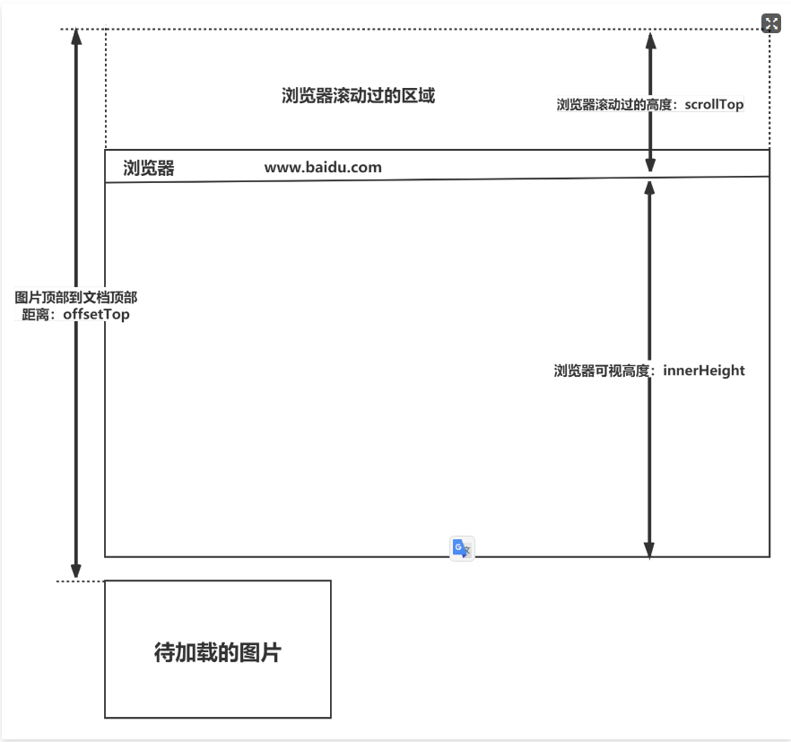

### 7. Flex
Flex是FlexibleBox的缩写，意为"**弹性布局**"，用来为盒状模型提供最大的**灵活性**。任何一个容器都可以指定为Flex布局。行内元素也可以使用Flex布局。注意，设为Flex布局以后，**子元素的float、clear和vertical-align属性将失效**。采用Flex布局的元素，称为**Flex容器**（flex container），简称"容器"。它的所有子元素自动成为容器成员，称为**Flex项目**（flex item），简称"项目"。容器默认存在两根轴：水平的主轴（main axis）和垂直的交叉轴（cross axis），项目默认沿水平主轴排列。

以下6个属性设置在容器上：
* flex-direction属性决定主轴的方向（即项目的排列方向）。
* flex-wrap属性定义，如果一条轴线排不下，如何换行。
* flex-flow属性是flex-direction属性和flex-wrap属性的简写形式，默认值为row nowrap。
* justify-content属性定义了项目在主轴上的对齐方式。
* align-items属性定义项目在交叉轴上如何对齐。
* align-content属性定义了多根轴线的对齐方式。如果项目只有一根轴线，该属性不起作用。

以下6个属性设置在项目上：
* order属性定义项目的排列顺序。数值越小，排列越靠前，默认为0。
* flex-grow属性定义项目的放大比例，默认为0，即如果存在剩余空间，也不放大。
* flex-shrink属性定义了项目的缩小比例，默认为1，即如果空间不足，该项目将缩小。
* flex-basis属性定义了在分配多余空间之前，项目占据的主轴空间。浏览器根据这个属性，计算主轴是否有多余空间。它的默认值为auto，即项目的本来大小。
* flex属性是flex-grow，flex-shrink和flex-basis的简写，默认值为0 1 auto。
* align-self属性允许单个项目有与其他项目不一样的对齐方式，可覆盖align-items属性。默认值为auto，表示继承父元素的align-items属性，如果没有父元素，则等同于stretch。

**简单来说：**
flex布局是CSS3新增的一种布局方式，可以通过将一个元素的display属性值设置为flex从而使它成为一个flex容器，它的所有子元素都会成为它的项目。
一个容器默认有两条轴：一个是水平的主轴，一个是与主轴垂直的交叉轴。可以使用flex-direction来指定主轴的方向。可以使用justify-content来指定元素在主轴上的排列方式，使用align-items来指定元素在交叉轴上的排列方式。还可以使用flex-wrap来规定当一行排列不下时的换行方式。
对于容器中的项目，可以使用order属性来指定项目的排列顺序，还可以使用flex-grow来指定当排列空间有剩余的时候，项目的放大比例，还可以使用flex-shrink来指定当排列空间不足时，项目的缩小比例。
>https://www.ruanyifeng.com/blog/2015/07/flex-grammar.html

---
解题思路

- 首先得说出 Flex 布局概念，Flex 的结构组成（Flex Container 、Flex Item），遇到的所有面试者都没有此回答
- 其次可以讲讲自己平常用的最多的 Flex 属性
- 最后可以讲讲自己平时常用的布局（左右两列，上下两行等）

#### 7.1 flex属性
flex属性是flex-grow, flex-shrink 和 flex-basis的简写，默认值为0 1 auto。后两个属性可选。
该属性有两个快捷值：auto (1 1 auto) 和 none (0 0 auto)。
建议优先使用这个属性，而不是单独写三个分离的属性，因为浏览器会推算相关值。

#### 7.2 flex的高度
Flex 布局会默认：
- 把所有子项变成水平排列。
- 默认不自动换行。
- 让子项与其内容等宽，并把**所有子项的高度变为最高子项的高度**。

这样设置背景色的时候非常不方便，那么直接在父项上，将align-items设为 flex-start,或者**align-items属性的其他值都可以（不为stretch）**,**子项就会保持自身的高度了**

单独设置align-self应该也可？

>justify-content和align-items的默认值为stretch：如果项目未设置高度或设为auto，将占满整个容器的高度。

### 8. BFC
BFC（Block Formatting Context）块级格式化上下文，是 Web 页面中盒模型布局的 CSS 渲染模式，指一个独立的渲染区域或者说是一个隔离的独立容器。具有 BFC 特性的元素可以看作是**隔离了的独立容器**，容器里面的元素不会在布局上影响到外面的元素，并且 BFC 具有普通容器所没有的一些特性。

#### 8.1 触发 BFC
只要元素满足下面任一条件即可触发 BFC 特性：

* 根元素 （`<html>`）
* 浮动元素：float 除 none 以外的值
* 绝对定位元素：position (absolute、fixed)
* display 为 inline-block、table-cells、flex、 grid等
* overflow 除了 visible 以外的值 (hidden、auto、scroll)

#### 8.2 BFC 特性

* 内部的 Box 会在垂直方向上一个接一个的放置。
* 垂直方向上的距离由 margin 决定（BFC内部外边距会发生折叠）
* bfc 的区域不会与 float 的元素区域重叠。
* 计算 bfc 的高度时，浮动元素也参与计算（解决高度塌陷）
* bfc 就是页面上的一个独立容器，容器里面的子元素不会影响外面元素。

#### 8.3 BFC 作用
1. **解决margin的重叠问题**：由于BFC是一个独立的区域，内部的元素和外部的元素互不影响，将两个元素变为两个BFC，就解决了margin重叠的问题。
   
2. **解决高度塌陷的问题**：在对子元素设置浮动后，父元素会发生高度塌陷，也就是父元素的高度变为0。解决这个问题，只需要把父元素变成一个BFC。常用的办法是给父元素设置`overflow:hidden。`

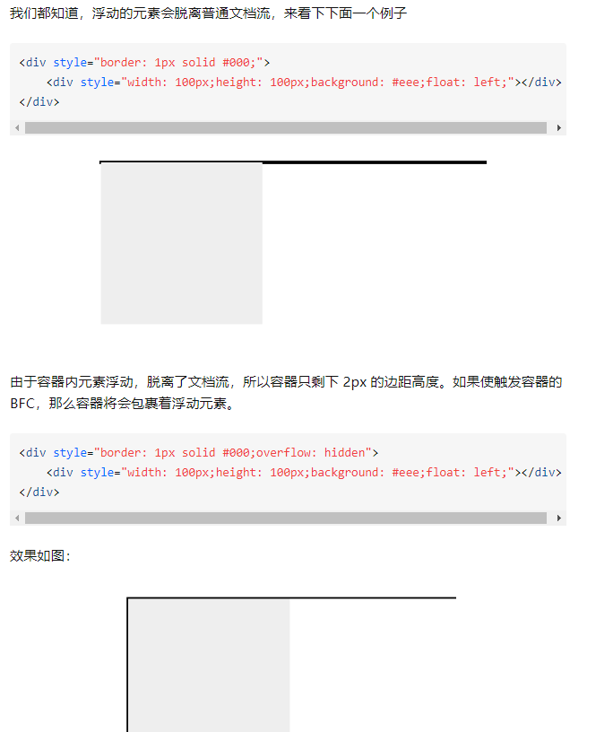
3. **创建自适应两（三）栏布局**：可以用来创建自适应两栏布局：左边的宽度固定，右边的宽度自适应。
左侧设置float:left，右侧设置overflow: hidden。这样右边就触发了BFC，BFC的区域不会与浮动元素发生重叠，所以两侧就不会发生重叠，实现了自适应两栏布局。
4. **清除浮动**：
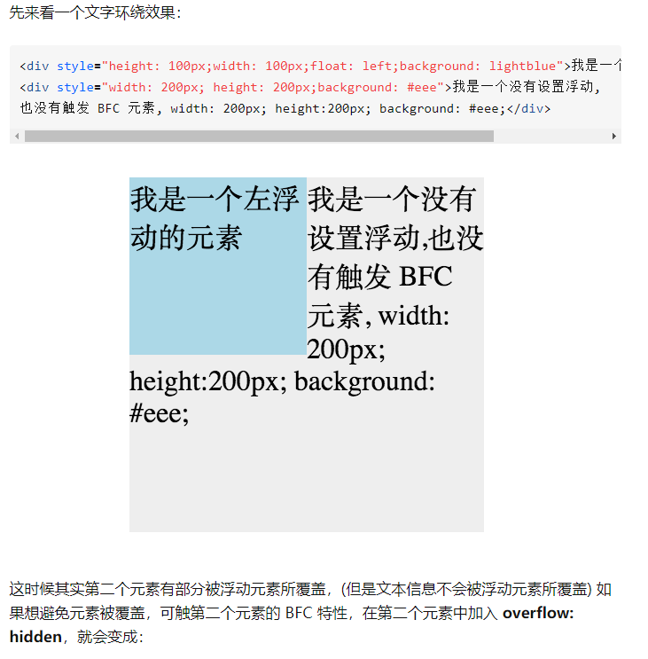
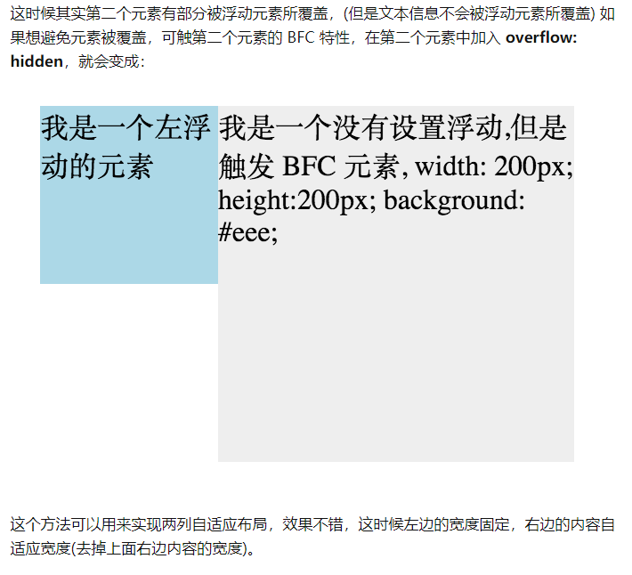

>https://zhuanlan.zhihu.com/p/25321647

#### 8.4 什么是margin重叠问题？如何解决？
##### 8.4.1 问题描述：
元素在 BFC 中会进行上下排列，然后垂直距离由 margin 决定，并且会发生重叠。两个块级元素的上外边距和下外边距可能会合并（折叠）为一个外边距，其大小会取其中外边距值大的那个，这种行为就是外边距折叠。需要注意的是，**浮动的元素和绝对定位**这种脱离文档流的元素的外边距不会折叠。重叠只会出现在**垂直方向**。

##### 8.4.2 计算原则：
折叠合并后外边距的计算原则如下：
* 如果两者都是正数，那么就去最大者
* 如果是一正一负，就会正值减去负值的绝对值
* 两个都是负值时，用0减去两个中绝对值大的那个

##### 8.4.3 解决办法：
对于折叠的情况，主要有两种：兄弟之间重叠和父子之间重叠
（1）兄弟之间重叠(变BFC)
* 底部元素变为行内盒子：display: inline-block
* 底部元素设置浮动：float
* 底部元素的position的值为absolute/fixed

（2）**父子之间重叠**
* 父元素加入：overflow: hidden
* 父元素添加透明边框：border:1px solid transparent
* 子元素变为行内盒子：display: inline-block
* 子元素加入浮动属性或定位

---
有时当我们设置子元素的margin-top，但是却发现子元素没有出现上外边距的效果，反而是父元素出现了上外边距的效果。

原因：
边距重叠：一个盒子和其子孙的边距重叠。根据规范，一个盒子如果没有上补白和上边框，那么**它的上边距应该和其文档流中的第一个孩子元素的上边距重叠**。

### 9. 浮动

#### 9.1 浮动的特点
* 元素的水平方向浮动，意味着元素只能左右移动而不能上下移动。
* 使用float意味着使用块布局，其会在display非块级元素情况下修改display值的计算值。
* 一个浮动元素会尽量向左或向右移动，直到它的外边缘碰到包含框或另一个浮动框的边框为止。
* **浮动元素会脱离文档流但不会脱离文本流**，当浮动时其不会影响周围的盒子模型，但是文字会环绕在浮动元素周围，可以认为文档流与文字流是分层结构而浮动元素盒子与文字元素处于同一层。
  
---
* 文档流，指的是盒子元素排版布局过程中，元素会自动从左往右，从上往下的流式排列。
* 文本流，指的是文字元素排版布局过程中，元素会自动从左往右，从上往下的流式排列。
* 脱离文档流，也就是将元素从普通的布局排版中拿走，其他盒子在定位的时候，会当做脱离文档流的元素不存在而进行定位。

>css中一共有三种手段，使一个元素脱离标准文档流：
（1）浮动
（2）绝对定位
（3）固定定位

**性质1**：浮动的元素脱标

脱标即脱离标准流。我们来看几个例子。

证明1：


上图中，在默认情况下，两个div标签是上下进行排列的。现在由于float属性让上图中的第一个`<div>`标签出现了浮动，于是这个标签在另外一个层面上进行排列。而第二个`<div>`还在自己的层面上遵从标准流进行排列。

证明2：


上图中，span标签在标准流中，是不能设置宽高的（因为是行内元素）。但是，**一旦设置为浮动之后，即使不转成块级元素，也能够设置宽高了**。

所以能够证明一件事：**一旦一个元素浮动了，那么，将能够并排了，并且能够设置宽高了。无论它原来是个div还是个span**所有标签，**浮动之后，已经不区分行内、块级了**。


**性质2**：浮动的元素互相贴靠

我们来看一个例子就明白了。

我们给三个div均设置了`float: left;`属性之后，然后设置宽高。当改变浏览器窗口大小时，可以看到div的贴靠效果：


上图显示，3号如果有足够空间，那么就会靠着2号。如果没有足够的空间，那么会靠着1号大哥。
如果没有足够的空间靠着1号大哥，3号自己去贴左墙。

不过3号自己去贴墙的时候，注意：


上图显示，3号贴左墙的时候，并不会往1号里面挤。

同样，float还有一个属性值是`right`，这个和属性值`left`是对称的。


**性质3**：浮动的元素有“字围”效果

来看一张图就明白了。我们让div浮动，p不浮动。


上图中，我们发现：**div挡住了p，但不会挡住p中的文字**，形成“字围”效果。

总结：**标准流中的文字不会被浮动的盒子遮挡住**。（文字就像水一样）

关于浮动我们要强调一点，浮动这个东西，为避免混乱，我们在初期一定要遵循一个原则：**永远不是一个东西单独浮动，浮动都是一起浮动，要浮动，大家都浮动。**


**性质4**：收缩

收缩：一个浮动的元素，如果没有设置width，那么将自动收缩为内容的宽度（**这点非常像行内元素**）。

举例如下：


上图中，div本身是块级元素，如果不设置width，它会单独霸占整行；但是，设置div浮动后，它会收缩


>https://github.com/qianguyihao/Web/blob/master/02-CSS%E5%9F%BA%E7%A1%80/07-%E6%B5%AE%E5%8A%A8.md

#### 9.2 为什么需要清除浮动
CSS中float属性会使元素浮动，使元素向左或向右移动，直到它的外边缘碰到包含框或另一个浮动框的边框为止。
1. 浮动元素会造成父元素**高度塌陷**，所以设置完浮动之后需要进行清除浮动（主要）
2. 所有在浮动下面的自身不浮动的内容都将围绕浮动元素进行包装，如果没有处理这些元素，就会变得很糟糕。（？）
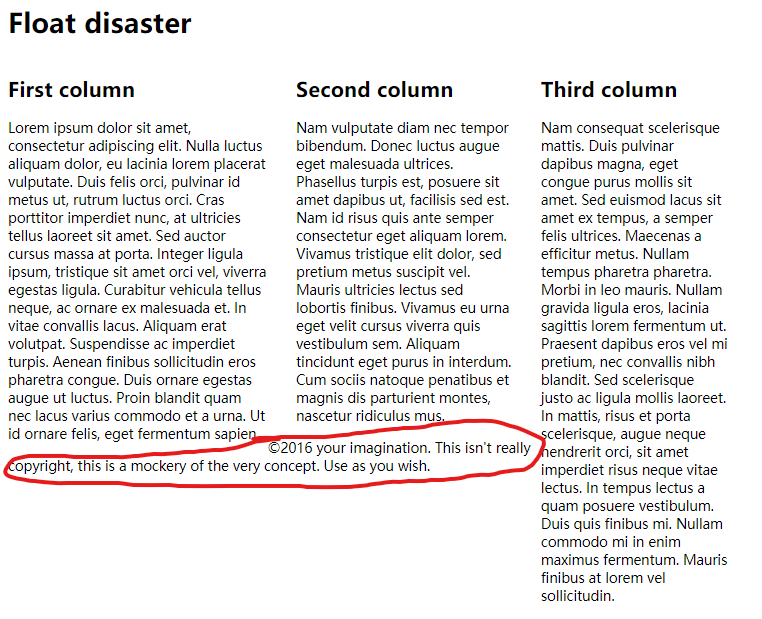

>当父元素没有添加高度（高度自适应），而子元素又脱离文档流的时候（当子元素设置了浮动或者子元素的position属性值为absolute或是fixed，都会脱离文档流），就会发生**高度塌陷**。

>**清除塌陷就是清除浮动**

**浮动元素引起的问题？**
* 父元素的高度无法被撑开，影响与父元素同级的元素
* 与浮动元素同级的非浮动元素会跟随其后
* 若浮动的元素不是第一个元素，则该元素之前的元素也要浮动，否则会影响页面的显示结构
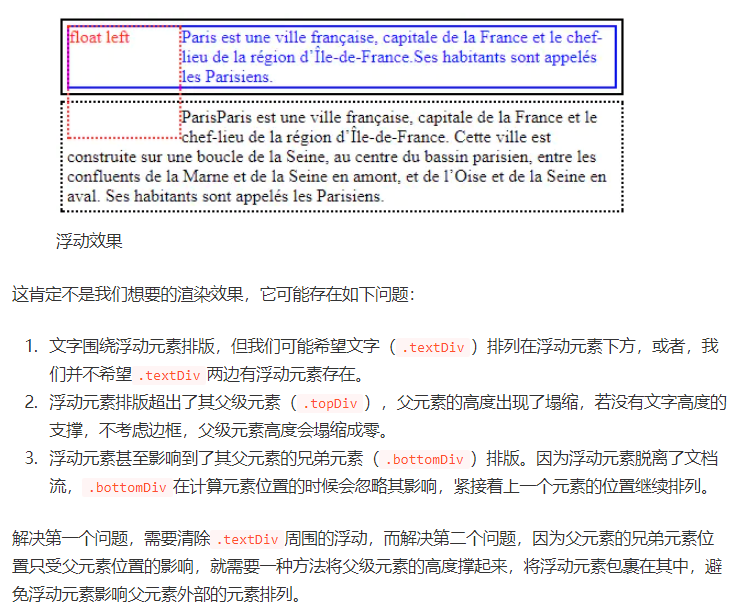

#### 9.3 清除浮动（塌陷）的方式
1. 给父级div定义`height`属性撑起高度。
2. 父元素结束标签之前插入清除浮动的块级元素
在浮动元素后面添加一个不浮动的空元素(div标签)，父容器必须考虑浮动子元素的位置，子元素出现在浮动元素后面，所以显示出来就正常了。
同时要给空元素加上:`style="clear:both"`

    缺点：需要添加额外的html标签，这违背了语义的原则
3. 包含浮动元素的父级标签添加overflow:hidden或者overflow:auto。形成BFC。
4. 使用伪元素::after
它父容器尾部自动创建一个子元素，原理和空元素一样，可以把它设置为height：0不显示，clear：both display:block，保证空白字符不浮动区块。（最好）
(但是：after不支持IE6，只需要添加上zoom：1,这个是激活父元素的haslayout属性，让父元素拥有自己的布局）
``` css {.line-numbers}
.clearfix:after {
    content: '.';
    height: 0;
    /* 关键 */
    display: block;
    clear: both;
}
.clearfix{
    zoom:1;
}
```
>https://juejin.cn/post/6844903504545316877
讲的很清楚

#### 9.4 使用 clear 属性清除浮动的原理？
如果单看字面意思，clear:left 是“清除左浮动”，clear:right 是“清除右浮动”，实际上，这种解释是有问题的，因为浮动一直还在，并没有清除。

官方对clear属性解释：“**元素盒子的边不能和前面的浮动元素相邻**”，对元素设置clear属性是为了避免浮动元素对该元素的影响，而不是清除掉浮动。

还需要注意 clear 属性指的是元素盒子的边不能和前面的浮动元素相邻，注意这里“**前面的**”3个字，也就是clear属性对“后面的”浮动元素是不闻不问的。考虑到float属性要么是left，要么是right，不可能同时存在，同时由于clear属性对“后面的”浮动元素不闻不问，因此，当clear:left有效的时候，clear:right必定无效，也就是此时clear:left等同于设置clear:both；同样地，clear:right如果有效也是等同于设置clear:both。由此可见，clear:left和clear:right这两个声明就没有任何使用的价值，至少在CSS世界中是如此，直接使用clear:both吧。

一般使用伪元素的方式清除浮动。**clear属性只有块级元素才有效的**，而::after等伪元素默认都是内联水平，这就是借助伪元素清除浮动影响时需要设置`display: block`属性值的原因。

### 10. 定位

#### 10.1  position的属性有哪些，区别是什么

* static
默认值。该关键字指定元素使用正常的布局行为，即元素在文档常规流中当前的布局位置。此时 top, right, bottom, left 和 z-index 属性无效

* relative
  - 该关键字下，元素先放置在未添加定位时的位置，再在不改变页面布局的前提下调整元素位置（因此会在此元素未添加定位时所在位置留下空白）。
  - 元素的位置通过left、top、right、bottom属性进行规定。
  - position:relative 对 table-*-group, table-row, table-column, table-cell, table-caption 元素无效。
  - 而其层叠通过z-index属性定义。

* absolute
  - 元素会被移出正常文档流，并不为元素预留空间，通过指定元素相对于最近的非 static 定位祖先元素的偏移，来确定元素位置。绝对定位的元素可以设置外边距（margins），且不会与其他边距合并。
  - 元素的位置通过left、top、right、bottom属性进行规定。(距离自己原本位置多远)
  - 而其层叠通过z-index属性定义。
  
* fixed
  - 元素会被移出正常文档流，并不为元素预留空间，而是通过指定元素相对于屏幕视口（viewport）的位置来指定元素位置。元素的位置在屏幕滚动时不会改变。打印时，元素会出现在的每页的固定位置。
  - fixed 属性会创建新的层叠上下文。
  - 当元素祖先的 transform, perspective 或 filter 属性非 none 时，容器由视口改为该祖先。
  - 元素的位置在屏幕滚动时不会改变，⽐如回到顶部的按钮⼀般都是⽤此定位⽅式。
  - 而其层叠通过z-index属性定义。

* sticky
  - 元素根据正常文档流进行定位，然后相对它的最近滚动祖先（nearest scrolling ancestor）和 containing block (最近块级祖先 nearest block-level ancestor)，包括table-related元素，基于top, right, bottom, 和 left的值进行偏移。偏移值不会影响任何其他元素的位置。
  - 该值总是创建一个新的层叠上下文（stacking context）。注意，一个sticky元素会“固定”在离它最近的一个拥有“滚动机制”的祖先上（当该祖先的overflow 是 hidden, scroll, auto, 或 overlay时），即便这个祖先不是最近的真实可滚动祖先。这有效地抑制了任何“sticky”行为（详情见Github issue on W3C CSSWG）。
  - 粘性定位可以被认为是相对定位和固定定位的混合。元素在跨越特定阈值前为相对定位，之后为固定定位。
- >但是跟固定定位又不太一样的，偏移值不会影响任何其他元素的位置。也就是说，没有脱离文档流。
  - 须指定 top, right, bottom 或 left 四个阈值其中之一，才可使粘性定位生效。否则其行为与相对定位相同。

**定位方式：**
* relative：元素的定位永远是相对于元素自身位置的，和其他元素没关系，也不会影响其他元素。
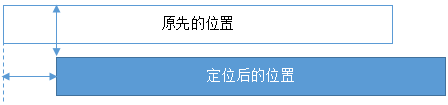
* fixed：元素的定位是相对于 window （或者 iframe）边界的，和其他元素没有关系。但是它具有破坏性，会导致其他元素位置的变化。
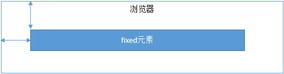
* absolute：元素的定位相对于前两者要复杂许多。如果为 absolute 设置了 top、left，浏览器会根据什么去确定它的纵向和横向的偏移量呢？答案是浏览器会递归查找该元素的所有父元素，如果找到一个设置了`position:relative/absolute/fixed`的元素，就以该元素为基准定位，如果没找到，就以浏览器边界定位。如下两个图所示：
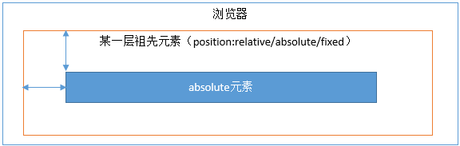
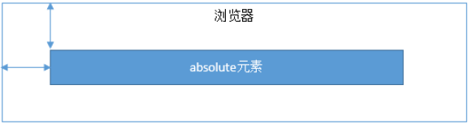
>当 top和bottom同时指定时，并且 height没有被指定或者指定为auto或100%的时候，top和bottom都会生效(可用来拉伸元素尺寸)，在其他情况下，如果 height被限制，则top属性会优先设置，bottom属性则会被忽略。

---
absolute元素, top和margin-top可以同时作用

>https://www.ruanyifeng.com/blog/2019/11/css-position.html

#### 10.2  display、float、position的关系

1. 首先判断display属性是否为none，如果为none，则position和float属性的值不影响元素最后的表现。

2. 然后判断position的值是否为absolute或者fixed，如果是，**则float属性失效**，并且display的值应该被设置为table或者block，具体转换需要看初始转换值。

3. 如果position的值不为absolute或者fixed，则判断float属性的值是否为none，如果不是，则display的值则按上面的规则转换。注意，如果position的值为relative并且float属性的值存在，**则relative相对于浮动后的最终位置定位**。

4. 如果float的值为none，则判断元素是否为根元素，如果是根元素则display属性按照上面的规则转换，如果不是，则保持指定的display属性值不变。

总的来说，可以把它看作是一个类似优先级的机制，`"position:absolute"`和`"position:fixed"`优先级最高，有它存在的时候，浮动不起作用，`'display'`的值也需要调整；其次，元素的`'float'`特性的值不是`"none"`的时候或者它是根元素的时候，调整`'display'`的值；最后，非根元素，并且非浮动元素，并且非绝对定位的元素，`'display'`特性值同设置值

---
**position兼容问题**

同上

- 元素同时应用了position: relative、float、（top / left / bottom / right）属性后，则元素先浮动到相应的位置，然后再根据（top / left / bottom / right）所设置的距离来发生偏移。
- 元素同时应用了position: absolute及float属性，则float失效。
- 第一个元素应用了position之后会覆盖着接下来的float元素（如果两个元素所处的位置相同）
注：如果你不将float的元素的position设置成relative的话，你想通过设置float元素的z-index来的达到覆盖position:absolute是无效的。同理，float元素下面存在position: absolute的子元素，如果你不将float的元素的position设置成relative的话，absolute元素是不会定位到float元素的。
- 同时应用position: absolute和float: left会导致清除浮动无效（position: relative则可以清除浮动）。

#### tranform和position: relative设置的偏移有什么区别

从页面布局的角度看
- transform 和 position:relative 的效果是一样的。

- 差别在于，transform 可以简单地作用于 position:absolute 的元素上面，而 position:relative; 还得加额外的 html

从动画角度来说
- 使用 transform 或 position 实现动画效果时是有很大差别。

- 使用 transform 时，可以让 GPU 参与运算，动画的 FPS 更高。

- 使用 position 时，最小的动画变化的单位是 1px，而使用 transform 参与时，可以做到更小（动画效果更加平滑）

#### float与absolute脱离文档流的区别

float没有脱离文本流

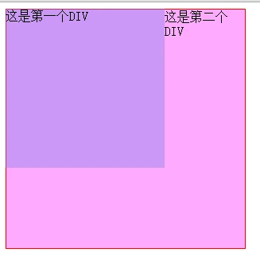

absolute脱离文本流

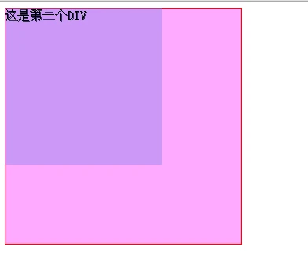

