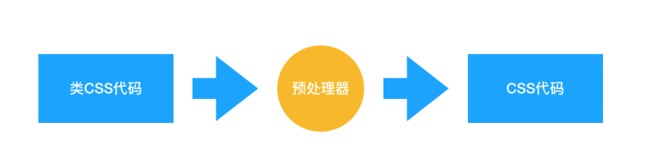
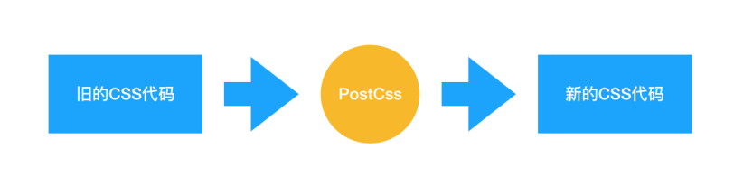

## 五. css优化

### 1 重绘与回流（重排）

* 重绘：当渲染树中的元素外观（如：颜色）发生改变，不影响布局时，产生重绘
* 回流：当渲染树中的元素的布局（如：尺寸、位置、隐藏/状态状态）发生改变时，产生重绘回流
* 注意：JS获取Layout属性值（如：offsetLeft、scrollTop、getComputedStyle等）也会引起回流。因为浏览器需要通过回流计算最新值
* **回流必将引起重绘，而重绘不一定会引起回流。**
  
当渲染对象被创建并添加到树中，它们并没有位置和大小，所以当浏览器生成渲染树以后，就会根据渲染树来进行布局（也可以叫做回流）。这一阶段浏览器要做的事情是要弄清楚各个节点在页面中的确切位置和大小。通常这一行为也被称为“自动重排”。

---
**回流（reflow）**

1. 通过构造渲染树，将可见DOM节点以及它对应的样式结合起来，可是还需要**计算它们在设备视口(viewport)内的确切位置和大小**，**这个计算的阶段就是回流**，为了弄清每个对象在网站上的确切大小和位置，浏览器从渲染树的根节点开始遍历
2. 当然当浏览器发现布局发生了变化，这个时候就需要倒回去重新渲染，这个回退的过程叫reflow
<!-- 3. 其实页面一开始渲染的时候之所以叫回流，我的理解是，页面渲染之前那个空白页其实也是有内容的，从"空白"到有元素显示这就是回流与重绘 -->

**重绘（repaint）**

1. 通过构造渲染树和回流阶段，我们知道了哪些节点是可见的，以及可见节点的样式和具体的几何信息(位置、大小)，那么我们就可以**将渲染树的每个节点都转换为屏幕上的实际像素**，这个阶段就叫做重绘

#### 何时发生回流（reflow）与重绘（repaint）

1. 页面第一次渲染（初始化）
2. DOM树变化（如：增删节点）
3. Render树变化（如：padding改变）
4. 浏览器窗口**resize**
5. 设置style属性
6. 获取元素的某些属性和方法（例如）
- offsetTop、offsetLeft、offsetWidth、offsetHeight
- scrollTop、scrollLeft、scrollWidth、scrollHeight
- clientTop、clientLeft、clientWidth、clientHeight
- getComputedStyle()
- getBoundingClientRect()返回元素的大小及其相对于视口的位置
- 背景色、颜色、字体改变（注意：字体大小发生变化时，会触发回流）
- 具体可以访问这个网站：https://gist.github.com/paulirish/5d52fb081b3570c81e3a （有可能打不开，可以多次刷新试试）


7. 回流必定引起重绘，重绘可以单独触发

>见
https://juejin.cn/post/6844904119157669902
https://juejin.cn/post/6844904063641862151

---
假如，你的js代码在主线程中执行过程中，有对元素尺寸等的api操作（例如修改width），那么，js主线程中这个dom修改会将c++层中的dom对象上width属性改掉，且会"触发"c++对这片渲染树的reflow。
为什么是带引号的“触发”呢，那是因为浏览器会做优化：虽然你改变了dom元素的width，但是你此时**js还未执行完**，那么UI渲染线程必然无法执行。既然UI渲染都无法执行，所以界面也无法绘制，因此浏览器认为，他也没必要对你的width进行reflow重排。因此，**浏览器仅仅把你的width设置给缓存到队列**-----等到真正要渲染UI的时候再reflow就好。

浏览器做的挺好了，他的思路没毛病。但有一种情况叫做“不可中断的回流” Uninterruptible reflow 。 这种情况回流会同步发生（即浏览器没办法缓存，必须要做完reflow的动作后再往下执行）。

例如你读取了元素的宽：

```js
ele.style.flex = 1
console.log(ele.offsetWidth)
```

那么，本来上面那一句flex:1的动作浏览器是可以缓存的，这样主线程可以立刻执行下方代码。但由于你直接调用了offsetwidth，那么这一句会立刻触发浏览器dom清空回流操作，即把之前的flex:1实施。因此**你的代码会阻塞**在 ele.offsetWidth这里等待回流完成，从而拿到正确的offsetwidth值（至于回流是发生在主线程还是ui线程都并不重要了，总之会阻塞你主线程代码）。这也就是回流性能低的原因了。

不管你js执行过程中有没有触发上述同步的回流。当你js空闲，那么此时ui线程得到机会渲染时，都会看看回流重绘队列里有没有需要重排重绘的操作，有则执行他们并进行UI绘制。

因此，这给我们的启示是，**不要频繁读取这种触发重排的属性**。
另一个启示是：你操作dom也就罢了，但千万别操作完就读取它。

>[再理解reflow重排和repaint重绘](https://segmentfault.com/a/1190000038204886)

#### 如何最小化重绘(repaint)和回流(reflow)：

其实浏览器很聪明，不可能每次修改样式就 reflow 或者 repaint 一次，一般来说，浏览器会积累一批操作，然后做一次 reflow。但是我们也应该减少重绘重排的次数。

我们知道操作DOM是一个高成本的操作，不仅是因为本身js与DOM的链接访问，还包括操作DOM后引起一连串的重排，因此，从性能优化角度，我们可以从以下几个方面着手：

1. 减少DOM操作
- 最小化DOM访问次数，尽量缓存访问DOM的样式信息，避免过度触发回流。
- 如果在一个局部方法中需要多次访问同一个dom，可以在第一次获取元素时用变量保存下来，减少遍历时间。
- 用事件委托来减少事件处理器的数量。
- 用querySelectorAll()替代getElementByXX()。

2. 减少重排
- 避免设置大量的style内联属性，因为通过设置style属性改变结点样式的话，每一次设置都会触发一次reflow，所以最好是使用class属性
- 不要使用table布局，因为table中某个元素一旦触发了reflow，那么整个table的元素都会触发reflow。那么在不得已使用table的场合，可以设置table-layout:auto;或者是table-layout:fixed这样可以让table一行一行的渲染，这种做法也是为了限制reflow的影响范围
- 尽量少使用display：none可以使用visibility：hidden代替，- - display：none会造成**重排**，visibility：hidden只会造成**重绘**。
- 使用resize事件时，做防抖和节流处理。

3. css及优化动画
- 少用css表达式
- 减少通过JavaScript代码修改元素样式，尽量使用修改class名方式操作样式或动画；
- 可以把动画效果应用到position属性为absolute或fixed的元素上，这样对其他元素影响较小(**脱离标准流**)
- 动画实现的速度的选择。比如实现一个动画，以1个像素为单位移动这样最平滑，但是reflow就会过于频繁，大量消耗CPU资源，如果以3个像素为单位移动则会好很多。
- 开启动画的GPU加速，把渲染计算交给GPU。
>见
https://blog.csdn.net/qq_38128179/article/details/101023305

---
1. css3硬件加速（GPU加速）

   可以让transform、opacity、filters这些动画不会引起回流重绘

2. 避免逐个修改节点样式，尽量一次性修改(使用cssText或者修改CSS的class)

3. 使用DocumentFragment将需要多次修改的DOM元素缓存，最后一次性append到真实DOM中渲染
```js
function appendDataToElement(appendToElement, data) {
    let li;
    for (let i = 0; i < data.length; i++) {
    	li = document.createElement('li');
        li.textContent = 'text';
        appendToElement.appendChild(li);
    }
}
const ul = document.getElementById('list');
const fragment = document.createDocumentFragment();
appendDataToElement(fragment, data);
ul.appendChild(fragment);
```

4. 可以将需要多次修改的DOM元素设置display:none，操作完再显示。（**因为隐藏元素不在render树内**，因此修改隐藏元素不会触发回流重绘）

5. 避免多次读取某些属性（避免触发同步布局事件）(**缓存**Layout属性值，如：var left = elem.offsetLeft; 这样，多次使用 left 只产生一次回流)
   
6. 避免使用css表达式(expression)，因为每次调用都会重新计算值（包括加载页面）(因为浏览器要获取当前页面最新的值，要先回流)

>[你真的了解回流和重绘吗?请看这里](https://juejin.cn/post/6844904063641862151#heading-7)

### 2. 如何避免FOUC
`FOUC`即无样式内容闪烁也可以称为文档样式短暂失效，主要就是指`HTML`已加载而样式表并未加载，此后样式表再加载而产生的闪烁现象。

#### 2.1 样式表前置
根据浏览器渲染的顺序，将`CSS`在`<head>`中引入或者嵌入，相对于将`CSS`放到`<body>`或者页面底部来说，可以使页面渲染速度加快，这对于页面内容比较丰富的网站或者网络链接较慢时相当重要。假如将样式表放置于底部，就会导致浏览器还未加载样式表就开始渲染页面，无法渐进式渲染页面而直接从无样式状态立即跳转到有样式状态，就会造成`FOUC`，用户体验较差；此外有些浏览器可能会在`CSS`下载完成后才开始渲染页面，样式表放在下方会导致页面渲染推迟。


#### 2.2 尽量避免使用@import
**主要**
尽量使用`<link>`而避免使用`@import`，当`HTML`文件被加载时，`<link>`引用的文件会同时被加载，而`@import`引用的文件则会等页面全部下载完毕再被加载，所以有时候浏览`@import`加载`CSS`的页面时会没有样式，会出现`FOUC`现象，网速慢的时候就比较明显。此外当`<link>`与`@import`混用可能会对网页性能有负面影响，在一些低版本`IE`中`<link>`与`@import`混用会导致样式表文件逐个加载，破坏并行下载的方式导致页面加载变慢。此外无论是哪种浏览器，若在`<link>`中引入的`CSS`中继续使用`@import`加载外部`CSS`，同样会导致顺序加载而不是并行加载，因为浏览器需要先解析`<link>`引入的`CSS`发现`@import`外部`CSS`后再次引入外部`CSS`，这样就导致页面加载变慢。

#### 3. style在body前与在body后的区别
* 写在body标签前利于浏览器逐步渲染
* 写在body标签后：由于浏览器以逐行方式对html文档进行解析，当解析到写在尾部的样式表（外联或写在style标签）会导致浏览器停止之前的渲染，等待加载且解析样式表完成之后重新渲染

任何时候都应该写在`head`里

之所以建议这样做，是因为当你在前面声明css时`<body>`开始时，你的样式实际上已经加载了。所以用户很快就会看到屏幕上出现的东西(例如背景色)。如果没有，用户会在CSS到达用户之前看到一段时间的空白屏幕。

此外，如果将样式放在`<body>`，当已声明的样式被解析时，浏览器必须重新呈现页面(加载时新的和旧的)。
>https://blog.csdn.net/weixin_43438052/article/details/109703897

---
当css还没加载出来的时候，页面显示白屏（css阻塞页面渲染）

？不同浏览器的处理CSS和HTML的方式是不同的：
css未加载前，ie和chrome会先白屏，但是firefox会先显示html（对于 Firefox 会表现出 FOUC 。）。

#### 4. 浏览器渲染机制
https://blog.csdn.net/wozaixiaoximen/article/details/50640954##1

### CSS 优化和提高性能的方法有哪些？
1. 加载性能：

（1）css压缩：将写好的css进行打包压缩，可以减小文件体积。

（2）css单一样式：当需要下边距和左边距的时候，很多时候会选择使用 margin:top 0 bottom 0；但margin-bottom:bottom;margin-left:left;执行效率会更高。

（3）减少使用@import，建议使用link，因为后者在页面加载时一起加载，前者是等待页面加载完成之后再进行加载。

2. 选择器性能：

（1）关键选择器（key selector）。选择器的最后面的部分为关键选择器（即用来匹配目标元素的部分）。CSS选择符是从右到左进行匹配的。当使用后代选择器的时候，浏览器会遍历所有子元素来确定是否是指定的元素等等；

（2）如果规则拥有ID选择器作为其关键选择器，则不要为规则增加标签。过滤掉无关的规则（这样样式系统就不会浪费时间去匹配它们了）。

（3）避免使用通配规则，如*{}计算次数惊人，只对需要用到的元素进行选择。

（4）尽量少的去对标签进行选择，而是用class。

（5）尽量少的去使用后代选择器，降低选择器的权重值。后代选择器的开销是最高的，尽量将选择器的深度降到最低，最高不要超过三层，更多的使用类来关联每一个标签元素。

（6）了解哪些属性是可以通过继承而来的，然后避免对这些属性重复指定规则。

3. 渲染性能：

（1）慎重使用高性能属性：浮动、定位。

（2）尽量减少页面重排、重绘。

（3）去除空规则：｛｝。空规则的产生原因一般来说是为了预留样式。去除这些空规则无疑能减少css文档体积。

（4）属性值为0时，不加单位。

（5）属性值为浮动小数0.**，可以省略小数点之前的0。

（6）标准化各种浏览器前缀：带浏览器前缀的在前。标准属性在后。

（7）不使用@import前缀，它会影响css的加载速度。

（8）选择器优化嵌套，尽量避免层级过深。

（9）css雪碧图，同一页面相近部分的小图标，方便使用，减少页面的请求次数，但是同时图片本身会变大，使用时，优劣考虑清楚，再使用。

（10）正确使用display的属性，由于display的作用，某些样式组合会无效，徒增样式体积的同时也影响解析性能。

（11）不滥用web字体。对于中文网站来说WebFonts可能很陌生，国外却很流行。web fonts通常体积庞大，而且一些浏览器在下载web fonts时会阻塞页面渲染损伤性能。

4. 可维护性、健壮性：

（1）将具有相同属性的样式抽离出来，整合并通过class在页面中进行使用，提高css的可维护性。

（2）样式与内容分离：将css代码定义到外部css中。

### 3. 对 CSS 工程化的理解
CSS 工程化是为了解决以下问题：
1. 宏观设计：CSS 代码如何组织、如何拆分、模块结构怎样设计？
2. 编码优化：怎样写出更好的 CSS？
3. 构建：如何处理我的 CSS，才能让它的打包结果最优？
4. 可维护性：代码写完了，如何最小化它后续的变更成本？如何确保任何一个同事都能轻松接手？

以下三个方向都是时下比较流行的、普适性非常好的 CSS 工程化实践：
* 预处理器：Less、 Sass 等；
* 重要的工程化插件： PostCss；
* Webpack loader 等 。

基于这三个方向，可以衍生出一些具有典型意义的子问题，这里我们逐个来看：
（1）预处理器：为什么要用预处理器？它的出现是为了解决什么问题？
预处理器，其实就是 CSS 世界的“轮子”。预处理器支持我们写一种类似 CSS、但实际并不是 CSS 的语言，然后把它编译成 CSS 代码：

那为什么写 CSS 代码写得好好的，偏偏要转去写“类 CSS”呢？这就和本来用 JS 也可以实现所有功能，但最后却写 React 的 jsx 或者 Vue 的模板语法一样——为了爽！要想知道有了预处理器有多爽，首先要知道的是传统 CSS 有多不爽。随着前端业务复杂度的提高，前端工程中对 CSS 提出了以下的诉求：
1. 宏观设计上：我们希望能优化 CSS 文件的目录结构，对现有的 CSS 文件实现复用；
2. 编码优化上：我们希望能写出结构清晰、简明易懂的 CSS，需要它具有一目了然的嵌套层级关系，而不是无差别的一铺到底写法；我们希望它具有变量特征、计算能力、循环能力等等更强的可编程性，这样我们可以少写一些无用的代码；
3. 可维护性上：更强的可编程性意味着更优质的代码结构，实现复用意味着更简单的目录结构和更强的拓展能力，这两点如果能做到，自然会带来更强的可维护性。

这三点是传统 CSS 所做不到的，也正是预处理器所解决掉的问题。预处理器普遍会具备这样的特性：
* 嵌套代码的能力，通过嵌套来反映不同 css 属性之间的层级关系 ；
* 支持定义 css 变量；
* 提供计算函数；
* 允许对代码片段进行 extend 和 mixin；
* 支持循环语句的使用；
* 支持将 CSS 文件模块化，实现复用。

（2）PostCss：PostCss 是如何工作的？我们在什么场景下会使用 PostCss？
PostCss 仍然是一个对 CSS 进行解析和处理的工具，它会对 CSS 做这样的事情：

它和预处理器的不同就在于，预处理器处理的是 类CSS，而 PostCss 处理的就是 CSS 本身。Babel 可以将高版本的 JS 代码转换为低版本的 JS 代码。PostCss 做的是类似的事情：它可以编译尚未被浏览器广泛支持的先进的 CSS 语法，还可以自动为一些需要额外兼容的语法增加前缀。更强的是，由于 PostCss 有着强大的插件机制，支持各种各样的扩展，极大地强化了 CSS 的能力。

PostCss 在业务中的使用场景非常多：
* 提高 CSS 代码的可读性：PostCss 其实可以做类似预处理器能做的工作；
* 当我们的 CSS 代码需要适配低版本浏览器时，PostCss 的 Autoprefixer 插件可以帮助我们自动增加浏览器前缀；
* 允许我们编写面向未来的 CSS：PostCss 能够帮助我们编译 CSS next 代码；

（3）Webpack 能处理 CSS 吗？如何实现？
Webpack 能处理 CSS 吗：
* Webpack 在裸奔的状态下，是不能处理 CSS 的，Webpack 本身是一个面向 JavaScript 且只能处理 JavaScript 代码的模块化打包工具；
* Webpack 在 loader 的辅助下，是可以处理 CSS 的。

### css-loader 和 style-loader
如何用 Webpack 实现对 CSS 的处理：
* Webpack 中操作 CSS 需要使用的两个关键的 loader：css-loader 和 style-loader
* 注意，答出“用什么”有时候可能还不够，面试官会怀疑你是不是在背答案，所以你还需要了解每个 loader **都做了什么事情**：
  * css-loader：导入 CSS 模块，对 CSS 代码进行编译处理；
  >CSS 文件之间通过了 **@import 语法**建立了引入的关系，而 css-loader 则可以解析这种关系，然后把多个的 css 文件关联在一起，并将 css 转换为 CommonJS 模块。

  >css-loader 解释(interpret) @import 和 url() ，会 import/require() 后再解析(resolve)它们。

  * style-loader：创建style标签，把 CSS 内容写入标签。（将 CSS 样式注入到 DOM 中。）

经过css-loader的转译，我们已经得到了完整的css样式代码，style-loader的作用就是将结果以style标签的方式插入DOM树中。

直觉上似乎我们只需要像下面这样返回一段js代码，将css-loader返回的结果插入DOM就行：
```js
module.exports = function (content) {
  return `
    const style = document.createElement('style');
    style.innerHTML = '${content}';
    document.head.appendChild(style);
  `;
};
```
但css-loader返回的不是css样式代码的文本，而**是一个js模块的代码**，将这些js代码直接放进style标里显然是不行的。

style-loader 通过一个JS脚本创建一个style标签，里面包含一些样式。

---
在实际使用中，**css-loader 的执行顺序一定要安排在 style-loader 的前面**。因为只有完成了编译过程，才可以对 css 代码进行插入；若提前插入了未编译的代码，那么 webpack 是无法理解这坨东西的，它会无情报错。

但是**写法上**css-loader要在后面，因为他是从右向左解析度。
```js
module.exports = {
  module: {
    rules: [
      {
        test: /\.css$/,
        use: [ 'style-loader', 'css-loader' ]
      }
    ]
  }
}
```

### 4. 前端优化
https://github.com/WindrunnerMax/EveryDay/blob/master/HTML/%E5%89%8D%E7%AB%AF%E6%80%A7%E8%83%BD%E4%BC%98%E5%8C%96%E6%96%B9%E6%A1%88.md