>https://github.com/funnycoderstar/blog/issues/125 常见CSS布局的实现
https://juejin.cn/post/6960844183611375630#heading-26 【CSS】CSS布局解决方案（终结版）
### 1. 两栏布局
一般两栏布局指的是左边一栏宽度固定，右边一栏宽度自适应
#### 1.1 float + BFC
实现思路：
普通流体BFC后（float:left）和浮动元素不会产生交集，顺着浮动元素形成自己的封闭上下文。
``` css {.line-numbers}
  .left {
      width: 300px;
      background-color: pink;
      float: left;
      height:500px;
  }
  .right {
      background-color: aquamarine;
      height:500px;  
      overflow: hidden;
  }
```

#### 1.2 float + margin-left
利用浮动，将左边元素宽度设置为200px，并且设置向左浮动。将右边元素的margin-left设置为200px，宽度设置为auto（默认为auto，撑满整个父元素）
``` css {.line-numbers}
  div {
    height: 500px;
  }

  .aside {
    width: 300px;
    float: left;
    background: yellow;
  }

  .main {
    background: aqua;
    margin-left: 300px;
  }
```

#### 1.3 position + margin-left
* 利用绝对定位，将父级元素设置为相对定位。左边元素设置为absolute定位，并且宽度设置为200px。将右边元素的margin-left的值设置为200px。
``` css {.line-numbers}
  .outer {
    position: relative;
    height: 100px;
  }
  .left {
    position: absolute;
    width: 200px;
    height: 100px;
    background: tomato;
  }
  .right {
    margin-left: 200px;
    background: gold;
  }
```
* 利用绝对定位，将父级元素设置为相对定位。左边元素宽度设置为200px，右边元素设置为绝对定位，左边定位为200px，其余方向定位为0。
``` css {.line-numbers}
  .outer {
    position: relative;
    height: 100px;
  }
  .left {
    width: 200px;
    background: tomato;
  }
  .right {
    position: absolute;
    top: 0;
    bottom: 0;
    /* 同时设定左右来拉伸宽度 */
    right: 0;
    left: 200px;
    background: gold;
  }
```

#### 1.4 flex
利用flex布局，将左边元素设置为固定宽度200px，将右边的元素设置为flex:1。
``` css {.line-numbers}
  .outer {
    display: flex;
    height: 100px;
  }
  .left {
    width: 200px;
    background: tomato;
  }
  .right {
    flex: 1;
    background: gold;
  }
```

#### 1.5 圣杯（右边宽度固定, 左边宽度自适应）
左右都浮动,左边自适应元素设置外层div 100%宽度, 这样就会独占一行, 然后里层设置右边的margin, 把右边元素位置空出来
``` css {.line-numbers}
  html,
  body {
    height: 100%;
  }

  div {
    height: 100%;
  }

  .left {
    float: left;
    width: 100%;
    background: #0f0;
  }

  .right {
    float: left;
    width: 300px;
    /* 负的margin-left会更贴近前面的元素 */
    margin-left: -300px;
    background: #00f;
  }
```

### 2. 三栏布局
#### 2.1 float
利用浮动，左右两栏设置固定大小，并设置对应方向的浮动。中间一栏设置左右两个方向的margin值，注意这种方式，**需要将中间的内容放在html结构的最后(浮动的元素在前面)**,否则右侧会沉在中间内容的下侧
原理: 元素浮动后,脱离文档流,后面的元素受浮动影响,设置受影响元素的margin值即可
``` html {.line-numbers}
<head>
    <style>
        .left {
            width: 200px;
            height: 100px;
            background-color: blue;
            float: left;
        }
        .right {
            width: 200px;
            height: 100px;
            background-color: red;
            float: right;
        }
        /* 利用中间元素的margin值控制两边的间距, 宽度小于左右部分宽度之和时，右侧部分会被挤下去*/
        .middle {
            height: 100px;
            background-color: yellow;
            margin-left: 200px;
            margin-right: 200px;
        }        
    </style>
</head>
<body>
    <div class="main">
        <div class="left">
                left
        </div>
        <div class="right">
            right
        </div>
        <!-- 需要将中间的内容放在html结构的最后,否则右侧会沉在中间内容的下侧 -->
        <div class="middle">
                middle
        </div>
    </div>
</body>
</html>
```
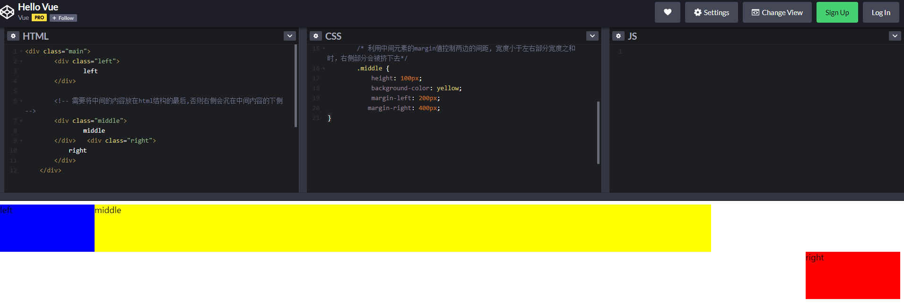

#### 2.2 position
利用绝对定位，左右两栏设置为绝对定位，中间设置对应方向大小的margin的值。
注意绝对定位的元素脱离文档流,相对于最近的已经定位的元素进行定位, 无需考虑HTML中结构的顺序
缺点：有顶部对齐问题，需要进行调整，注意中间的高度为整个内容的高度
``` css {.line-numbers}
  * {
    /* 不设置这些顶部会对不齐 */
      margin: 0;
      padding: 0;
      border: 0;
  }
  .main {
      position: relative;
  }
  .left {
      width: 200px;
      height: 100px;
      background-color: blue;
      /* 左边也得绝对定位，不然middle会挤到下一行 */
      position: absolute;
      /* top: 0;
      left: 0; */
  }
  .middle {
      margin-left: 200px;
      height: 100px;
      background-color: yellow;
      margin-right: 200px;
  }
  .right {
      position: absolute;
      width: 200px;
      height: 100px;
      background-color: red;
      top: 0;
      right: 0;
  }
```
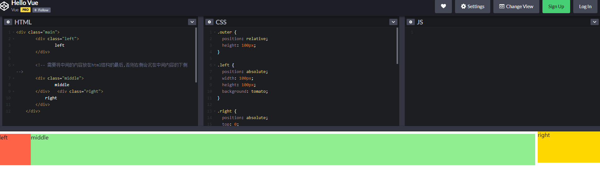
右边顶部没对齐（因为top:0 而本身外面盒子有margin等属性）

#### 2.3 flex
利用flex布局，左右两栏设置固定大小，中间一栏设置为flex:1。
``` css {.line-numbers}
  .outer {
    display: flex;
    height: 100px;
  }

  .left {
    width: 100px;
    background: tomato;
  }

  .right {
    width: 100px;
    background: gold;
  }

  .center {
    flex: 1;
    background: lightgreen;
  }
```

#### 2.4 圣杯布局和双飞翼布局
* 共同点：三栏全部float浮动，但左右两栏加上负margin让其跟中间栏div并排，以形成三栏布局。负边距是这两种布局中的重中之重
* 不同点：解决“中间栏div内容不被遮挡”的思路不同
>https://segmentfault.com/a/1190000003942591 负边距详解
https://blog.csdn.net/zhoulei1995/article/details/80161240 CSS 负边距
#### 2.4.1 圣杯布局
圣杯布局，利用浮动和负边距来实现。父级元素设置左右的 padding，三列均设置向左浮动，**中间一列放在最前面**，**宽度设置为父级元素的宽度**，因此后面两列都被挤到了下一行，通过设置 margin 负值将其移动到上一行，再利用相对定位，定位到两边。
``` html {.line-numbers}
<head>
    <style>
        .content {
    			/* overflow: hidden; */
          /* 4、padding左右盒子的宽度 */
          /* 控制的是中间盒子宽度，其他两个已经定了 */
    			padding: 0 100px;
    		}
        .middle {
          /* 注意这里设置width: 100%; */
            width: 100%;
            height: 100px;
            background: red;
            float:left;
            position:relative;	
        }
        .left {
            width: 100px;
            height: 100px;
            background: green;
            /* 1、三个盒子都设置浮动 */
            float:left;
            /* 2、走中间盒子的-100%（因为他在第二个所以走100%） */
            margin-left: -100%;
            /* 5 相对定位,往回走 */
            position: relative;
            left: -100px;
        }
        .right {
            width: 100px;
            height: 100px;
            background: blue;
            float:left;
             /* 3、走负自身的宽度 */
            margin-left: -100px;
            /* 6 相对定位,往回走 */
            position: relative;
            right: -100px;
        }
    </style>
</head>
<body>
    <div class="content">
      <!-- 注意middle在前面 -->
        <div class="middle">
            middle
        </div>
        <div class="left"></div>
        <div class="right"></div>
    </div>
</body>
```
1. 三者都设置向左浮动
2. 设置middle宽度为100%;
3. 设置负边距， left设置负左边距为100%, right设置负左边距为负的自身宽度
4. 设置content的padding值给左右两个子面板留出空间
5. 设置两个子面板为相对定位，left面板的left值为负的left面板宽度，right面板的right值为负的right面板的值

---
1. 三个盒子都设置浮动
  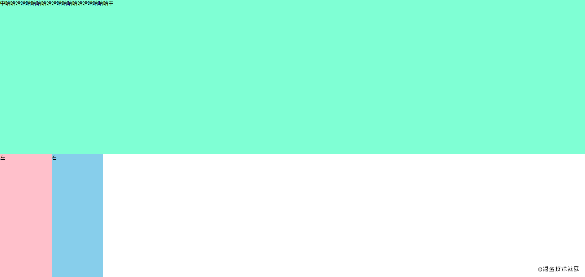
2. 左盒子走负margin-left:100%，右盒子走负自身的宽度
  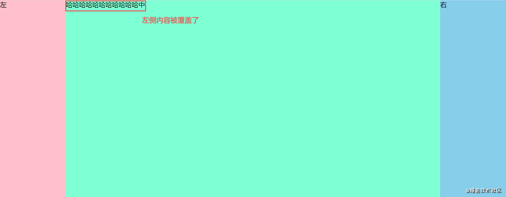
3. 大盒子padding left和right左右盒子宽度
  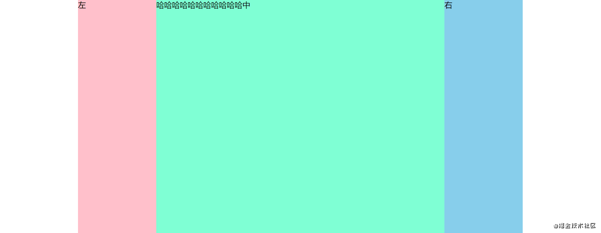
4. 左右盒子相对定位，left，right-往回走
 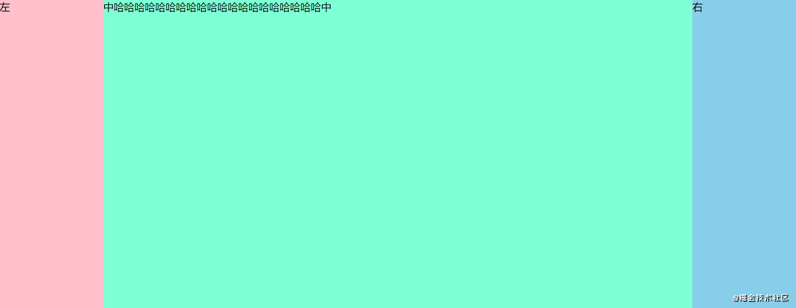

注意：
1. 大盒子不padding会这样
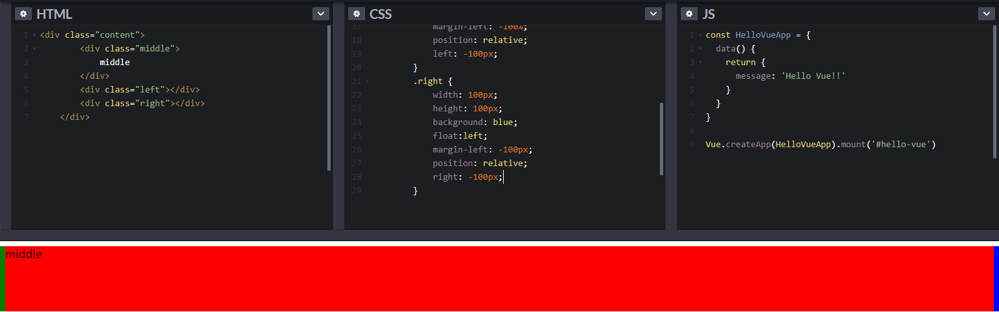
2. left: -100px是往左走100px

但是圣杯布局有个问题：当面板的middle部分比两边的子面板宽度小的时候，布局就会乱掉（左右宽度过大）。因此也就有了双飞翼布局来克服这个问题。如果不增加任何标签，想实现更完美的布局非常困难，因此双飞翼布局在主面板上选择了加一个标签

#### 2.4.2 双飞翼布局
双飞翼布局相对于圣杯布局来说，左右位置的保留是通过中间列的 margin 值来实现的，而不是通过父元素的 padding 来实现的。本质上来说，也是通过浮动和外边距负值来实现的。
``` html {.line-numbers}
<head>
    <style>
       .content {
   			overflow: hidden;
   		}
        .middle {
            width: 100%;
            float:left;
        }
        .middle-content {
            /* width: 100%; */
            height: 100px;
            background: red;
            /* 4、调整中间盒子margin */
            margin-left: 100px;
            margin-right: 100px;
        }
        .left {
            width: 100px;
            height: 100px;
            background: green;
            /* 1、三个盒子都设置浮动 */
            float:left;
            /* 2、走中间盒子的-100% */
            margin-left: -100%;
        }
        .right {
            width: 100px;
            height: 100px;
            background: blue;
            float:left;
          /*3、走负自身的宽度 */
            margin-left: -100px;
        }
    </style>
</head>
<body>
    <div class="content">
        <div class="middle">
            <div class="middle-content">
                    middle
            </div>
        </div>
        <div class="left"></div>
        <div class="right"></div>
    </div>
</body>
```
1. 三者都设置向左浮动。
2. 设置middle宽度为100%。
3. 设置 负边距，left设置负左边距为100%，right设置负左边距为负的自身宽度
4. 设置middle-content的margin值给左右两个子面板留出空间。

---
1. 三个盒子都设置浮动
  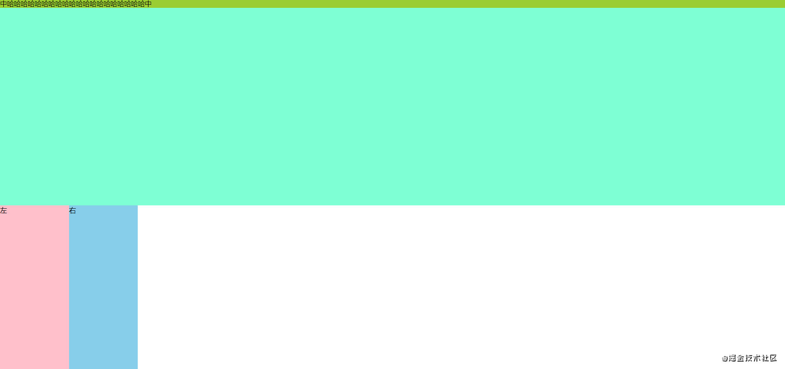
2. 左盒子走负margin-left:100%，右盒子走负自身的宽度
  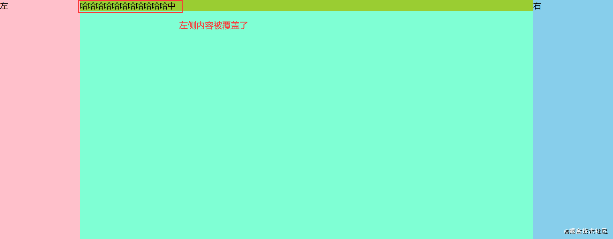
3. 调整中间盒子margin
  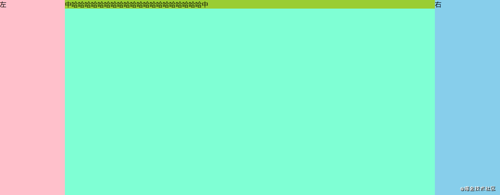

#### 2.4.3 区别
对比两者可以发现，双飞翼布局与圣杯布局的主要差别在于：

1. 双飞翼布局给主面板（中间元素）添加了一个父标签用来通过margin给子面板腾出空间
2. 圣杯布局采用的是padding,而双飞翼布局采用的margin, 解决了圣杯布局的问题
3. 双飞翼布局不用设置相对布局，以及对应的left和right值
---
左右宽度过大时：
圣杯
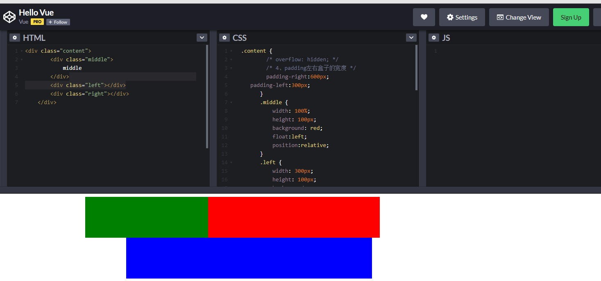

双飞翼
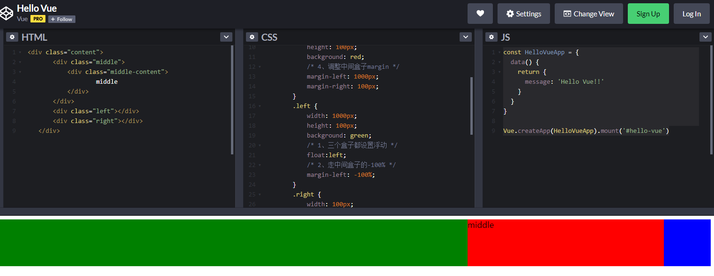

### 3. 水平垂直居中布局
行内元素(如`span`)水平垂直居中常用方法有两种：
* 水平居中: text-align: center
* 垂直居中：Height=line-height（适合纯文字类）
  >也是父元素中， 如：
  height： 300px;
  line-height: 300px;

块级元素居中分为：
* 居中元素宽高固定
* 居中元素宽高不固定

#### 3.1 水平居中的实现方案
- 利用块级元素撑满父元素的特点，如果宽度已定，左右margin auto（`margin:0 auto`）就可以平分剩余空间
  >`margin: auto`对水平居中有效，垂直无效
- 利用行内块居中： 把父级元素设置为`text-align=center`，之后子元素的`display`设置为`inline-block`(或者是文字本身也可以)
  >注意是父元素设置`text-align=center`，而子元素为内联（p或者a标签之类的）或者`inline-block`
- 绝对定位：`postion ：absolute`，之后`left 50%`
- flex: 父元素`display:flex; justify-content：center;`

#### 3.2 垂直居中的实现方案
- 元素无高度
利用内边距，让块级文字包裹在padding中，实现垂直居中。

- 父元素高度确定的单行文本：
使用行高的特性：height=line-height即可。

- 父元素高度确定的多行文本：
利用vertical-align（只能内联元素）如果是div，可以设置为table和table-cell。

- 父元素高度未知：
绝对定位，设置top 50%
``` css {.line-numbers}
parent{
    position:relative;
}
child{
    position:absolute;
    top:50%;
    transform:translateY(-50%);
}
```
如果子元素有高度(不用translateY了可以用margin)
``` css {.line-numbers}
child{
    position:absolute;
    top:50%;
    height=Hpx;
    margin-top:(H/2)px;
}
```
- flex方法 `align-items:center;`

#### 3.3 水平垂直居中的实现方案
##### 3.3.1 固定宽高
###### 3.3.1.1 margin

注意，**会发生父子margin重叠**

**父元素要设置overflow: hidden**;

``` css {.line-numbers}
.outer{
  width: 500px;
  height: 300px;
  background-color: blanchedalmond;

  /* 变成BFC解决margin重叠 */
  overflow: hidden;
}
.inner{
  background-color: cadetblue;
  height: 100px;
  width: 100px;

  /*水平居中 这行要先写不谈会覆盖下面的语句*/
  margin: 0 auto;
  /*垂直居中 (父元素高-子元素高)/2*/
  margin-top: 100px;
}
```

###### 3.3.1.2 absolute + 负margin
利用绝对定位，先将元素的左上角通过top:50%和left:50%定位到页面的中心，然后再通过margin负值来调整元素的中心点到页面的中心。
``` css {.line-numbers}
 .father {
      position: relative;
   }
 .son {
     position: absolute;
     /*水平居中*/
     left: 50%;
     margin-left: -50px;    /* 自身 width 的一半 */
     /*垂直居中*/
     top: 50%;
     margin-top: -50px;     /* 自身 height 的一半 */
 }
```

###### 3.3.1.3 absolute + margin auto
利用绝对定位，设置四个方向的值都为0，并将margin设置为auto，由于宽高固定，因此对应方向实现平分，可以实现水平和垂直方向上的居中(？？子元素要有宽高才行，否则同时设置left、right等会将元素拉伸)
``` css {.line-numbers}
.father {
     position: relative;
 }
 .son {
     position: absolute; 
     /* 这样设置才能自动添加margin 撑开 */
     /* 不然right和bottom都不起作用 */
     margin: auto; 
     /*水平居中 也得写*/
     left: 0;
     right: 0;
     /*垂直居中*/
     top: 0;
     bottom: 0;
 }
```

##### 3.3.2 不固定宽高
###### 3.3.2.1 absolute + transform
利用绝对定位，先将元素的左上角通过top:50%和left:50%定位到页面的中心，然后再通过translate来调整元素的中心点到页面的中心。该方法需要考虑浏览器兼容问题。
``` css {.line-numbers}
.parent {
    position: relative;
}
 
.child {
    position: absolute;
    left: 50%;
    top: 50%;
    transform: translate(-50%,-50%);
}
```

###### 3.3.2.2 css-table
``` css {.line-numbers}
/* 水平居中 */
.father{
    text-align: center;
}
.son {
    display: inline-block;
}

/* 垂直居中 */
.father{
    display: table-cell;
    vertical-align: middle;
}
```

###### 3.3.2.3 flex
使用flex布局，通过align-items:center和justify-content:center设置容器的垂直和水平方向上为居中对齐，然后它的子元素也可以实现垂直和水平的居中。该方法要考虑兼容的问题，该方法在移动端用的较多

注意这些属性是设置在容器上的

``` css {.line-numbers}
/* 水平居中 */
.father {
   display: flex;
   /*水平居中*/
   justify-content: center;
   /*垂直居中*/
   align-items: center;
}
```

#### img/文本居中

img是行内元素

1. flex
2. position
   >上面两个都会把行内元素表现得变为块级元素
3. text-align: center;
4. 垂直居中：
   `vertical-align:middle;`
   或者
   设line-height = height
   应该能用但我试了不行
5. img设为`display: block;`用块级居中 

### 4. 场景应用
#### 4.1 画三角形
CSS绘制三角形主要用到的是border属性，也就是边框。

平时在给盒子设置边框时，往往都设置很窄，就可能误以为边框是由矩形组成的。实际上，border属性是由三角形组成的(?)，下面看一个例子：
``` css {.line-numbers}
/* 水平居中 */
div {
    width: 0;
    height: 0;
    /* 这里盒子高为200px，因为有两个border */
    border: 100px solid;
    border-color: orange blue red green;
}
```
将元素的长宽都设置为0，显示出来的效果是这样的：
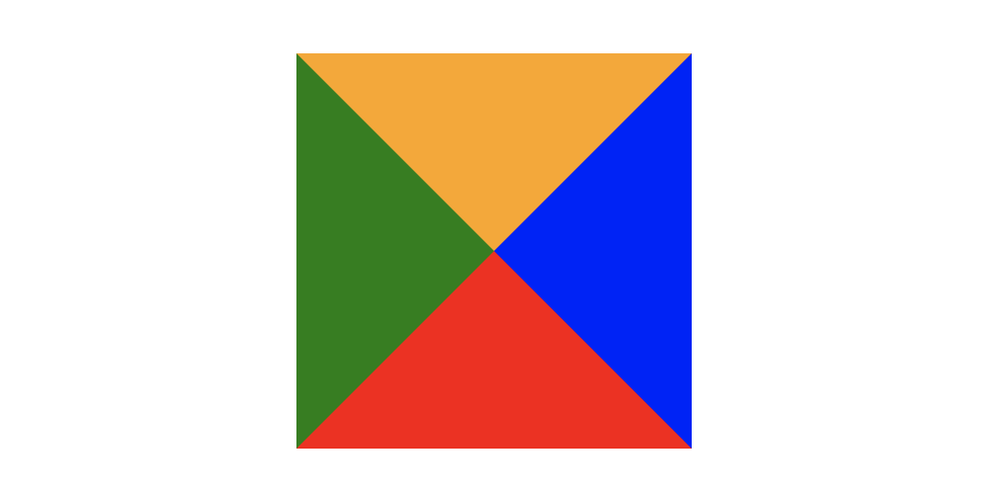

---
原理就是边框的衔接部分是斜角的方式，正是因为此，我们可以做很多有意思的事情，这也是面试中经常考查看的手写css问题，我们明白了原理简单的自己尝试下吧

也可以设置width height不为0来画梯形

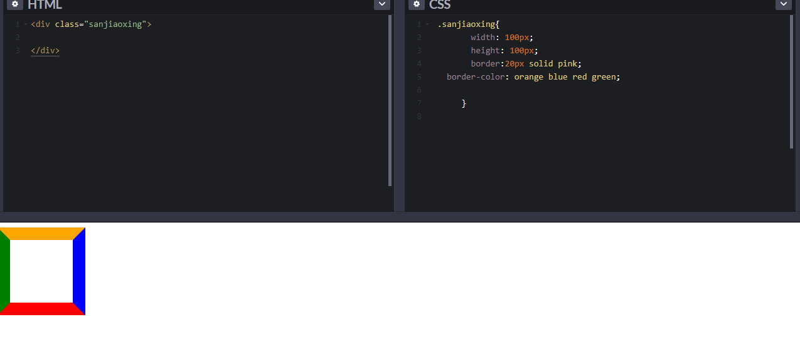

1. 三角1
``` css {.line-numbers}
div {
    width: 0;
    height: 0;
    border-top: 50px solid red;
    border-right: 50px solid transparent;
    border-left: 50px solid transparent;
}
```
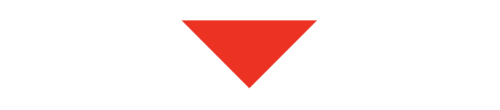

2. 三角2
``` css {.line-numbers}
div {
    width: 0;
    height: 0;
    border-top: 100px solid red;
    border-right: 100px solid transparent;
}
```
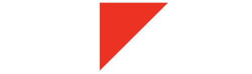

...

#### 4.2 画扇形
用CSS实现扇形的思路和三角形基本一致，就是多了一个圆角的样式，实现一个90°的扇形：
``` css {.line-numbers}
div{
    border: 100px solid transparent;
    width: 0;
    heigt: 0;
    /* 半径是100px */
    /* 这句才让三角形变成扇形了 */
    border-radius: 100px；ll;
    border-top-color: red;
}
```
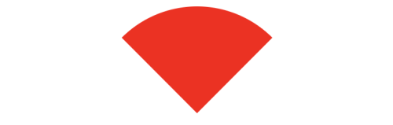

原理
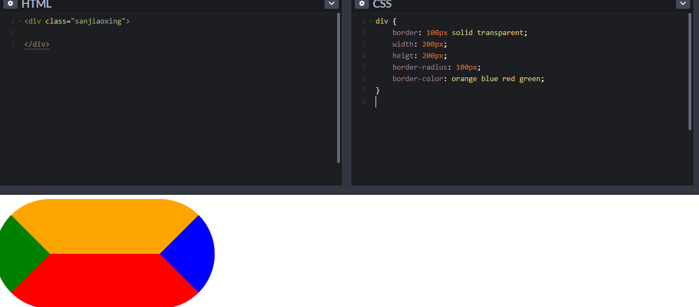

#### 4.3 画圆
``` css {.line-numbers}
div{
    border: 100px solid red;
    width: 0;
    heigt: 0;
    border-radius: 100px; 
}
```
##### 4.3.1 画圆
``` css {.line-numbers}
div {
  background-color: red;
  height: 100px;
  width: 100px;
  border-radius: 50%;
}
```
**注意**：在使用border-radius时，使用50%和100%都可以得到一个圆，那这两个值到底有什么区别呢：border-radius的值是百分比的话，就相当于盒子的宽度和高度的百分比。如一个50px 150px的方形，如果border-radius设置为100%，则等价于：
```
border-radius: 50px/150px; 1
```
而border-radius又是由border-top-left-radius、border-top-right-radius、border-bottom-left-radius、border-bottom-right-radius组成，所有上面border-radius：100%又等价于：
``` css {.line-numbers}
border-top-left-radius: 100%; 
border-top-right-radius: 100%; 
border-bottom-left-radius: 100%; 
border-bottom-right-radius: 100%;
或
border-top-left-radius: 50px 150px; 
border-top-right-radius: 50px 150px; 
border-bottom-left-radius: 50px 150px; 
border-bottom-right-radius: 50px 150px; 
```
为什么border-radius设置成100%和50%都能画成圆呢？因为，在W3C中对重合曲线做了规定：如果两个相邻的半径和超过了对应的盒子的边的长度，那么浏览器要重新计算以保证它们不重合。也就是说，如果相邻圆角的半径都设置成大于50%，那么浏览器会根据图形的实际情况做一些计算。因此，为了避免不必要的计算，**建议使用border-radius: 50%**。

##### 4.3.2 画半圆
``` css {.line-numbers}
div {
  background-color: red;
  width: 100px;
  height: 50px;
  border-radius: 0px 0px 100px 100px;
}
```

##### 同心圆
1. 渐变
  ```csss
    background: repeating-radial-gradient(circle, rgb(255, 255, 255) 5%, rgb(0, 0, 0) 10%);
  ```

2. 伪元素
  ```css
    div::before {
       content: '';
       width: 80px;
       height: 80px;
       background-color: green;
       position: absolute;
       top: 50%;
       left: 50%;
       transform: translate(-50%,-50%);
       border-radius: 50%;
   }

    div::after {
       content: '';
       width: 60px;
       height: 60px;
       background-color: blue;
       position: absolute;
       top: 50%;
       left: 50%;
       transform: translate(-50%,-50%);
       border-radius: 50%;
   }


    div{
      position: relative;
      background-color: yellow;
      width: 100px;
      height: 100px;
      border-radius: 50%;
    }
  ```

**关键** 大圆设为`position: relative;`, **::after也相当于他的子元素**，所以设置`position: absolute;`也会相当于大圆定位。

#### 4.4 画宽高自适应的正方形
- 利用vw来实现：
``` css {.line-numbers}
.square {
  width: 10%;
  height: 10vw;
  background: tomato;
}
```
- 利用元素的margin/padding百分比是相对父元素width的性质来实现：
``` css {.line-numbers}
.square {
  width: 20%;
  height: 0;
  /* 注意:用padding-top的方法 */
  padding-top: 20%;
  background: orange;
}
```
- 利用子元素的margin-top的值来实现：
``` css {.line-numbers}
.square {
  width: 30%;
  overflow: hidden;
  background: yellow;
}
.square::after {
  content: '';
  display: block;
  margin-top: 100%;
}
```

#### 4.5 画一条0.5px的线
- 采用transform: scale()的方式，该方法用来定义元素的2D 缩放转换: 
  ```transform: scaleY(0.5);```
- 采用meta viewport的方式
  ``` <meta name="viewport" content="width=device-width, initial-scale=0.5, minimum-scale=0.5, maximum-scale=0.5"/> ```

这样就能缩放到原来的0.5倍，如果是1px那么就会变成0.5px。viewport只针对于移动端，只在移动端上才能看到效果

#### 4.6 设置小于12px的字体
在谷歌下css设置字体大小为12px及以下时，显示都是一样大小，都是默认12px。

解决办法：
- 使用Webkit的内核的-webkit-text-size-adjust的私有CSS属性来解决，只要加了-webkit-text-size-adjust:none;字体大小就不受限制了。但是chrome更新到27版本之后就不可以用了。所以高版本chrome谷歌浏览器已经不再支持-webkit-text-size-adjust样式，所以要使用时候慎用。
- 使用css3的transform缩放属性-webkit-transform:scale(0.5); 注意-webkit-transform:scale(0.75);收缩的是整个元素的大小，这时候，如果是内联元素，必须要将内联元素转换成块元素，可以使用display：block/inline-block/...；
- 使用图片：如果是内容固定不变情况下，使用将小于12px文字内容切出做图片，这样不影响兼容也不影响美观。

#### CSS9宫格
问题：创建出CSS9宫格，3*3宫格，每个宫格的长宽未知，要求达到自适应并且精确分配。
学长特意说要精确分配，所以用1/3肯定是不行的，于是使用flex布局：
``` html
<!--HTML-->
<div class="container">
  <div class="wrapper">
    <div class="item"></div>
    <div class="item"></div>
    <div class="item"></div>
  </div>
  <div class="wrapper">
    <div class="item"></div>
    <div class="item"></div>
    <div class="item"></div>
  </div>
  <div class="wrapper">
    <div class="item"></div>
    <div class="item"></div>
    <div class="item"></div>
  </div>
</div>

<!--CSS-->
.container {
  display: flex;
  flex-direction: column;
  flex-wrap: nowrap;  //不换行

  background-color:blue;
  height: 400px;
}
.wrapper {
  display: flex;
  flex: 1;
  flex-direction: row;
  flex-wrap: nowrap;
}
.item {
  flex: 1;

  background-color:red;
  border:solid 1px;
}
```

#### 品字形布局

```html
<style>
  .top {
    /* 上排占整行 */
    width: 100%; 
    /* 上排居中
      width: 50%;
      margin: 0 auto;
    */
    height: 50px;
    background: red;
  }
  .bottom-left, .bottom-right {
    width: 50%;
    height: 50px;
  }
  .bottom-right {
    float: right;
    background: #000;
  }
  .bottom-left {
    float: left;
    background: green;
  }
</style>
<div class="top"></div>
<div class="bottom-left"></div>
<div class="bottom-right"></div>
```

#### 半红半蓝
1. border
```css
div {
    width: 200px;
    height: 200px;
    /* 设置盒模型关键 */
    box-sizing: border-box;
    border-left: 100px solid red; 
    border-right: 100px solid blue; 
}
```

2. gradient
   
```css
div {
  width: 300px;
  height: 300px;
  /* 渐变 */
  /* 不加to right 默认是从上到下渐变的 */
  background: linear-gradient(to right, red 0%,red 50%,white 50%,white 100%);
  border: 1px solid #ccc;
}
```

3. 伪元素
```css
.test {
  width: 100px;
  height: 100px;
  border: 1px solid #000;
}

.test::after {
  /* 必须有这行 */
  content: "";
  display: block;
  /* width: 50px; */
  margin-left: 50%;
  height: 100%;
  background-color: blue;
}
```

### 其他

#### js改css记得用驼峰
```js
const p = document.getElementById('pp')
p.style.backgroundColor = 'red'
```