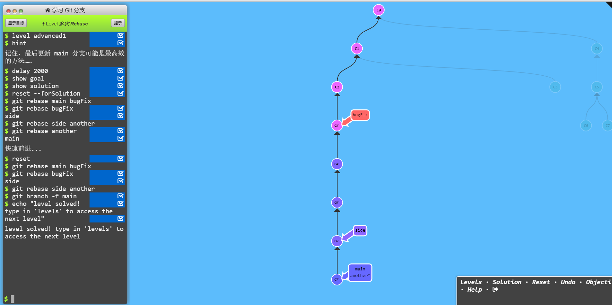

https://learngitbranching.js.org/?locale=zh_CN
https://www.liaoxuefeng.com/wiki/896043488029600/900003767775424

## git pull 和 git fetch 的区别 

- git fetch 只是将远程仓库的变化下载下来，并没有和本地分支合并。 
- git pull 会将远程仓库的变化下载下来，**并和当前分支合并**
  >pull相当于fetch和merge结合（不是rebase）
  >或者用git pull --rebase 就是 fetch 和 rebase 的**简写**

## git reset --hard 和 --soft 

### hard （修改版本库，修改暂存区，修改工作区）
hard HEAD～1 (或是版本号)意为将版本库回退1个版本，但是不仅仅是将本地版本库的头指针全部重置到指定版本，**也会重置暂存区**，并且会**将工作区代码也回退到这个版本**

### soft （修改版本库，保留暂存区，保留工作区）

soft HEAD～1 意为将版本库软回退1个版本，所谓软回退表示将本地版本库的头指针全部重置到指定版本，且**将这次提交之后的所有变更都移动到暂存区**。

## rebase merge

### rebase
注意rebase 可以接收**两个参数**，第一个为不变的原节点，第二个为要合并的放在后面的节点。
而且rebase不光合并这一个节点，**也包括他的祖先节点**

---
- 优点:
Rebase 使你的提交树变得很干净, 所有的提交都在一条线上

- 缺点:
Rebase 修改了提交树的历史
比如, 提交 C1 可以被 rebase 到 C3 之后。这看起来 C1 中的工作是在 C3 之后进行的，但实际上是在 C3 之前。

一些开发人员喜欢保留提交历史，因此更偏爱 merge。而其他人（比如我自己）可能更喜欢干净的提交树，于是偏爱 rebase。仁者见仁，智者见智。