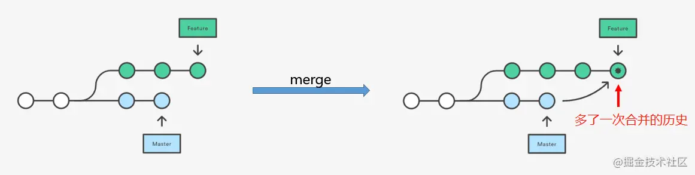
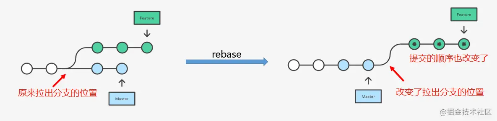

https://learngitbranching.js.org/?locale=zh_CN
https://www.liaoxuefeng.com/wiki/896043488029600/900003767775424
https://juejin.cn/post/6986868722136776718#heading-14

## git pull 和 git fetch 的区别 

- git fetch 只是将远程仓库的变化下载下来，并没有和本地分支合并。 
- git pull 会将远程仓库的变化下载下来，**并和当前分支合并**
  >pull相当于fetch和merge结合（不是rebase）
  >或者用git pull --rebase 就是 fetch 和 rebase 的**简写**

  >直接git pull 不加任何选项，等价于git fetch + git merge FETCH_HEAD，执行效果就是会**拉取所有分支信息回来**，但是只合并当前分支的更改。其他分支的变更没有执行合并。

  >使用git pull --rebase 可以减少冲突的提交点，比如我本地已经提交，但是远程其他同事也有新的代码提交记录，此时拉取远端其他同事的代码，如果是merge的形式，就会有一个merge的commit记录。如果用rebase，就不会产生该合并记录，是将我们的提交点挪到其他同事的提交点之后。

## reset 和 revert

- reset是根据来移动HEAD指针，在该次提交点后面的提交记录会丢失。
- revert会产生新的提交，来抵消选中的该次提交的修改内容，可以理解为“反做”，不会丢失中间的提交记录。

使用建议
- 公共分支回退使用git revert，避免丢掉其他同事的提交。
- 自己分支回退可使用git reset，也可以使用git revert，按需使用。

## git reset --hard 、--soft 、mixed

### hard （修改版本库，修改暂存区，修改工作区）
hard HEAD～1 (或是版本号)意为将版本库回退1个版本，但是不仅仅是将本地版本库的头指针全部重置到指定版本，**也会重置暂存区**，并且会**将工作区代码也回退到这个版本**

### soft （修改版本库，保留暂存区，保留工作区）

soft HEAD～1 意为将版本库软回退1个版本，所谓软回退表示将本地版本库的头指针全部重置到指定版本，且**将这次提交之后的所有变更都移动到暂存区**。

### mixed(default）（保留工作目录，并清空暂存区）

reset 如果不加参数，那么默认使用 --mixed 参数。它的行为是：保留工作目录，并且清空暂存区。也就是说，工作目录的修改、暂存区的内容以及由 reset 所导致的新的文件差异，都会被放进工作目录。简而言之，就是「**把所有差异都混合（mixed）放在工作目录中**」。

## rebase merge

### merge

marge 特点：
- 只处理一次冲突
- 引入了一次合并的历史记录，合并后的所有 commit 会按照提交时间从旧到新排列
- 所有的过程信息更多，可能会提高之后查找问题的难度

优点：
- 记录了真实的commit情况，包括每个分支的详情

缺点：
- 因为每次merge会自动产生一个merge commit，所以在使用一些git 的GUI tools，特别是commit比较频繁时，看到分支很杂乱。

### rebase
注意rebase 可以接收**两个参数**，第一个为不变的原节点，第二个为要合并的放在后面的节点。
而且rebase不光合并这一个节点，**也包括他的祖先节点**

---

rebase特点：
- 改变当前分支从 master 上拉出分支的位置
- 没有多余的合并历史的记录，且合并后的 commit 顺序不一定按照 commit 的提交时间排列
- 可能会多次解决同一个地方的冲突（有 squash 来解决）
- 更清爽一些，master 分支上每个 commit 点都是相对独立完整的功能单元

优点:
- Rebase 使你的提交树变得很干净, 所有的提交都在一条线上

缺点:
- Rebase 修改了提交树的历史
比如, 提交 C1 可以被 rebase 到 C3 之后。这看起来 C1 中的工作是在 C3 之后进行的，但实际上是在 C3 之前。

---
rebase解决冲突：
解决后用` git rebase --continue`继续合并

### 区别

一些开发人员喜欢保留提交历史，因此更偏爱 merge。而其他人（比如我自己）可能更喜欢干净的提交树，于是偏爱 rebase。仁者见仁，智者见智。

当需要保留详细的合并信息的时候建议使用git merge，特别是需要将分支合并进入master分支时；当发现自己修改某个功能时，频繁进行了git commit提交时，发现其实过多的提交信息没有必要时，可以尝试git rebase。