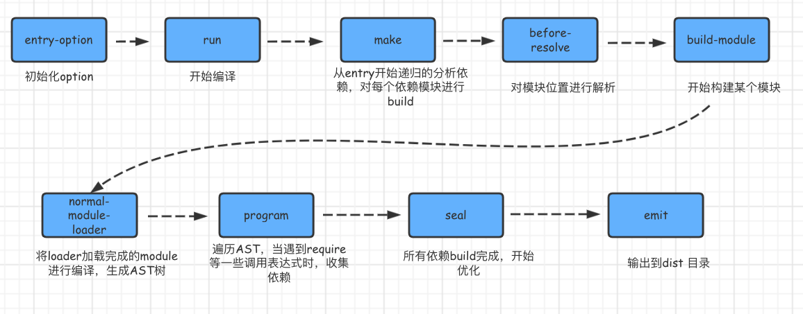
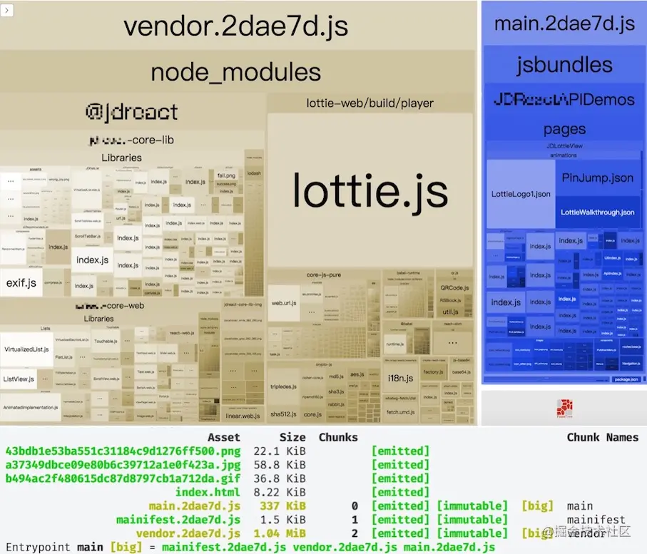
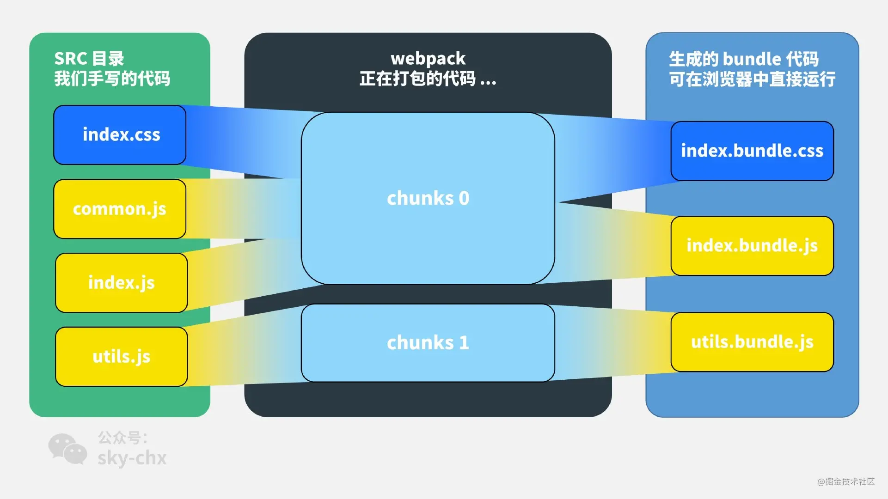
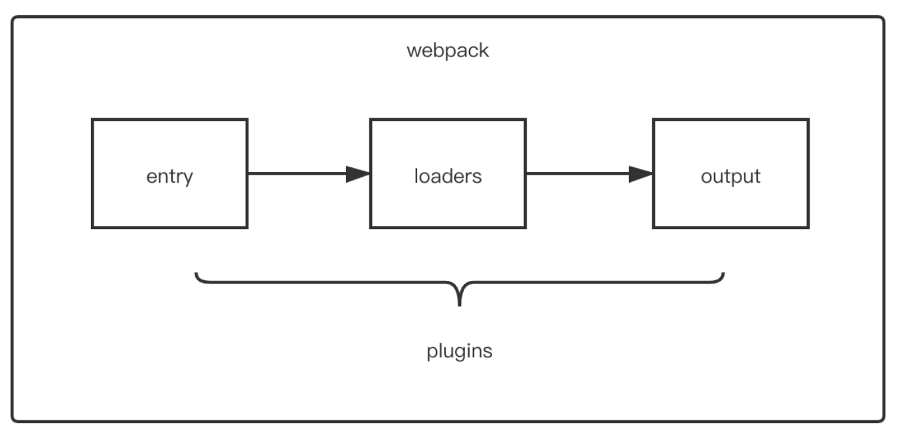

## webpack

>极客时间程柳锋老师的「玩转 webpack」
[「吐血整理」再来一打Webpack面试题](https://juejin.cn/post/6844904094281236487#heading-19)
https://vue3js.cn/interview/webpack/performance.html#%E4%B8%80%E3%80%81%E8%83%8C%E6%99%AF

webpack 是一个用于现代JavaScript应用程序的静态模块打包工具。

### 使用
webpack适⽤于⼤型复杂的前端站点构建: webpack有强⼤的loader和插件⽣态,打包后的⽂件实际上就是⼀个**⽴即执⾏函数**，这个⽴即执⾏函数接收⼀个参数，这个**参数是模块对象**，键为各个模块的路径，值为模块内容。⽴即执⾏函数内部则处理模块之间的引⽤，执⾏模块等,这种情况更适合⽂件依赖复杂的应⽤开发。

### 构建流程



Webpack 的运⾏流程是⼀个串⾏的过程，从启动到结束会依次执⾏以下流程：
1. 初始化参数：从配置⽂件和 Shell 语句中读取与合并参数，得出最终的参数；
2. 开始编译：⽤上⼀步得到的参数初始化 Compiler 对象，加载所有配置的插件，执⾏对象的 run ⽅法开始执⾏编译；
3. 确定⼊⼝：根据配置中的 entry 找出所有的⼊⼝⽂件；
4. 编译模块：从⼊⼝⽂件出发，调⽤所有配置的 Loader 对模块进⾏翻译，再找出该模块依赖的模块，再递归本步骤直到所有⼊⼝依赖的⽂件都经过了本步骤的处理；
5. 完成模块编译：在经过第4步使⽤ Loader 翻译完所有模块后，得到了每个模块被翻译后的最终内容以及它们之间的依赖关系；
6. 输出资源：根据⼊⼝和模块之间的依赖关系，组装成⼀个个包含多个模块的 Chunk，再把每个 Chunk 转换成⼀个单独的⽂件加⼊到输出列表，这步是可以修改输出内容的最后机会；
7. 输出完成：在确定好输出内容后，根据配置确定输出的路径和⽂件名，把⽂件内容写⼊到⽂件系统。

在以上过程中，Webpack 会在特定的时间点⼴播出特定的事件，插件在监听到感兴趣的事件后会执⾏特定的逻辑，并且插件可以调⽤ Webpack 提供的 API 改变 Webpack 的运⾏结果。

---
简单说

初始化：启动构建，读取与合并配置参数，加载 Plugin，实例化 Compiler
编译：从 Entry 出发，针对每个 Module 串行调用对应的 Loader 去翻译文件的内容，再找到该 Module 依赖的 Module，递归地进行编译处理
输出：将编译后的 Module 组合成 Chunk，将 Chunk 转换成文件，输出到文件系统中

>作者：童欧巴
链接：https://juejin.cn/post/6844904094281236487

### 优化

#### 优化打包速度

1. 优化loader配置
我们可以通过 exclude、include 配置来确保转译尽可能少的文件。顾名思义，exclude 指定要排除的文件，include 指定要包含的文件。
exclude 的优先级高于 include，在 include 和 exclude 中使用绝对路径数组，尽量避免 exclude，更倾向于使用 include。

2. 合理使用 resolve.extensions
通过resolve.extensions是解析到文件时自动添加拓展名，默认情况如下：
```js
module.exports = {
    ...
    extensions:[".warm",".mjs",".js",".json"]
}
```
当我们引入文件的时候，若没有文件后缀名，则会根据数组内的值依次查找(频率较高的文件类型优先写在前面)

3. 优化 resolve.alias
   alias给一些常用的路径起一个别名，特别当我们的项目目录结构比较深的时候，一个文件的路径可能是./../../的形式

   通过配置alias以减少查找过程

4. 使用 DLLPlugin 插件
   DLL全称是 动态链接库，是为软件在winodw种实现共享函数库的一种实现方式，而Webpack也内置了DLL的功能，为的就是可以共享，不经常改变的代码，抽成一个共享的库。这个库在之后的编译过程中，会被引入到其他项目的代码中

5. 使用 cache-loader
   在一些性能开销较大的 loader之前添加 cache-loader，以将结果缓存到磁盘里，显著提升二次构建速度
   保存和读取这些缓存文件会有一些时间开销，所以请只对性能开销较大的 loader 使用此loader

```js
module.exports = {
    //...
    
    module: {
        //我的项目中,babel-loader耗时比较长，所以我给它配置了`cache-loader`
        rules: [
            {
                test: /\.jsx?$/,
                use: ['cache-loader','babel-loader']
            }
        ]
    }
}

```

6. happypack
   由于有大量文件需要解析和处理，构建是文件读写和计算密集型的操作，特别是当文件数量变多后，Webpack 构建慢的问题会显得严重。文件读写和计算操作是无法避免的，那能不能让 Webpack 同一时刻处理多个任务，发挥多核 CPU 电脑的威力，以提升构建速度呢？

    HappyPack 就能让 Webpack 做到这点，它把任务分解给多个子进程去并发的执行，子进程处理完后再把结果发送给主进程。

7. 开启 JS 多进程压缩
   虽然很多 webpack 优化的文章上会提及多进程压缩的优化，不管是 webpack-parallel-uglify-plugin 或者是 uglifyjs-webpack-plugin 配置 parallel。不过这里我要说一句，没必要单独安装这些插件，它们并不会让你的 Webpack 构建速度提升。
    当前 Webpack 默认使用的是 TerserWebpackPlugin，默认就开启了多进程和缓存，构建时，你的项目中可以看到 terser 的缓存文件 node_modules/.cache/terser-webpack-plugin。

#### 优化打包体积

1. webpack自身的优化-tree-shaking

2. html,js,css,图片压缩
   
3. 代码分离（抽离公共代码）
   将代码分离到不同的bundle中，之后我们可以按需加载，或者并行加载这些文件

    默认情况下，所有的JavaScript代码（业务代码、第三方依赖、暂时没有用到的模块）在首页全部都加载，就会影响首页的加载速度

    代码分离可以分出出更小的bundle，以及控制资源加载优先级，提供代码的加载性能

    这里通过splitChunksPlugin来实现，该插件webpack已经默认安装和集成，只需要配置即可

    默认配置中，chunks仅仅针对于异步（async）请求，我们可以设置为initial或者all

    ```js
        module.exports = {
        ...
        optimization:{
            splitChunks:{
                chunks:"all"
            }
        }
    }
    ```
    splitChunks主要属性有如下：

    - Chunks，对同步代码还是异步代码进行处理
    - minSize： 拆分包的大小, 至少为minSize，如何包的大小不超过minSize，这个包不会拆分
    - maxSize： 将大于maxSize的包，拆分为不小于minSize的包
    - minChunks：被引入的次数，默认是1

4. 引入webpack-bundle-analyzer分析打包后的文件
webpack-bundle-analyzer将打包后的内容束展示为方便交互的直观树状图，让我们知道我们所构建包中真正引入的内容. 查看一下是哪些包的体积较大。



>[带你深度解锁Webpack系列(优化篇)](https://juejin.cn/post/6844904093463347208#heading-13)
[2020年了,再不会webpack敲得代码就不香了(近万字实战)](https://juejin.cn/post/6844904031240863758#heading-31)
https://vue3js.cn/interview/webpack/performance.html#%E4%BA%8C%E3%80%81%E5%A6%82%E4%BD%95%E4%BC%98%E5%8C%96


### bundle.js文件做了什么

立即执行函数

```js
(function(modules){
    //模拟require语句
    function __webpack_require__(){}
    //执行存放所有模块数组中的第0个模块(main.js)
    __webpack_require_[0]
})([/*存放所有模块的数组*/])
```

bundles.js能直接在浏览器中运行的原因是，在输出的文件中通过__webpack_require__函数,定义了一个可以在浏览器中执行的加载函数(加载文件使用ajax实现),来模拟Node.js中的require语句。

原来一个个独立的模块文件被**合并到了一个单独的 bundle.js 的原因**在于浏览器不能像 Node.js 那样快速地去本地加载一个个模块文件，**而必须通过网络请求去加载还未得到的文件**。 如果模块数量很多，加载时间会很长，因此把所有模块都存放在了数组中，执行一次网络加载。

>https://segmentfault.com/a/1190000017890529

### Bundle VS Chunk VS Module



1. 对于一份同逻辑的代码，当我们手写下一个一个的文件，它们无论是 ESM 还是 commonJS 或是 AMD，他们都是 module ；
2. 当我们写的 module 源文件传到 webpack 进行打包时，webpack 会根据文件引用关系生成 chunk 文件，webpack 会对这个 chunk 文件进行一些操作；
3. webpack 处理好 chunk 文件后，最后会输出 bundle 文件，这个 bundle 文件包含了经过加载和编译的最终源文件，所以它可以直接在浏览器中运行。

一般来说一个 chunk 对应一个 bundle，比如上图中的 utils.js -> chunks 1 -> utils.bundle.js；但也有例外，比如说上图中，我就用 MiniCssExtractPlugin 从 chunks 0 中抽离出了 index.bundle.css 文件。

**一句话总结：**
module，chunk 和 bundle 其实就是同一份逻辑代码在不同转换场景下的取了三个名字：

我们直接写出来的是 module，webpack 处理时是 chunk，最后生成浏览器可以直接运行的 bundle。

>[webpack 中那些最易混淆的 5 个知识点](https://juejin.cn/post/6844904007362674701#heading-0)

### hash、chunkhash、contenthash 有什么不同

#### chunkhash
因为 hash 是项目构建的哈希值，项目中如果有些变动，hash 一定会变，比如说我改动了 utils.js 的代码，index.js 里的代码虽然没有改变，但是大家都是用的同一份 hash。hash 一变，缓存一定失效了，这样子是没办法实现 CDN 和浏览器缓存的。
chunkhash 就是解决这个问题的，它根据**不同的入口文件**(Entry)进行依赖文件解析、构建对应的 chunk，生成对应的哈希值。(不同chunk对应不同哈希)

#### contenthash
我们更近一步，index.js 和 index.css 同为一个 chunk，如果 index.js 内容发生变化，但是 index.css 没有变化，打包后他们的 hash 都发生变化，这对 css 文件来说是一种浪费。如何解决这个问题呢？
contenthash 将**根据资源内容**创建出唯一 hash，也就是说文件内容不变，hash 就不变。

>[webpack 中那些最易混淆的 5 个知识点](https://juejin.cn/post/6844904007362674701#heading-0)

## loader与插件

### loader
loader 让 webpack 能够去处理那些非 JavaScript 文件（webpack 自身只理解 JavaScript）。

loader 可以将所有类型的文件转换为 webpack 能够处理的有效模块,然后你就可以利用 webpack 的打包能力,对它们进行处理。

本质上,webpack loader 将所有类型的文件,转换为应用程序的依赖图（和最终的 bundle）可以直接引用的模块。

#### vue-loader

[深入 vue-loader 原理](http://soiiy.com/index.php/Vue-js/15262.html)

### 常用插件

Plugin 就是插件，基于事件流框架 Tapable，插件可以扩展 Webpack 的功能，在 Webpack 运行的生命周期中会广播出许多事件，Plugin 可以监听这些事件，在合适的时机通过 Webpack 提供的 API 改变输出结果。

1. HtmlWebpackPlugin
在打包结束后，⾃动生成⼀个 html ⽂文件，并把打包生成的js 模块引⼊到该 html 中

为了缓存，你会发现打包好的js文件的名称每次都不一样(带哈希)。webpack打包出来的js文件我们需要引入到html中，但是每次我们都手动修改js文件名显得很麻烦，因此我们需要一个插件来帮我们完成这件事情

2. UglifyJsPlugin
uglifyJsPlugin 是 vue-cli 默认使用的压缩代码方式，用来对 js 文件进行压缩，从而减小 js 文件的大小，加速 load 速度。它使用的是单线程压缩代码，打包时间较慢，所以可以在开发环境将其关闭，生产环境部署时再把它打开。

3. clean-webpack-plugin
每次执行npm run build 会发现dist文件夹里会残留上次打包的文件，这里我们推荐一个plugin来帮我们在打包输出前清空文件夹

4. mini-css-extract-plugin
webpack 4.0以前，我们通过extract-text-webpack-plugin插件，把css样式从js文件中**提取到单独的css文件中**。webpack4.0以后，官方推荐使用mini-css-extract-plugin插件来打包css文件

### 区别

- loader 是文件加载器，能够加载资源文件，并对这些文件进行一些处理，诸如编译、压缩等，最终一起打包到指定的文件中
- plugin 赋予（扩展）了 webpack 各种灵活的功能，例如打包优化、资源管理、环境变量注入等，目的是解决 loader 无法实现的其他事

从整个运行时机上来看，如下图所示：


可以看到，两者在运行时机上的区别：

- loader 运行在打包文件之前
- plugins 在整个编译周期都起作用
  
在Webpack 运行的生命周期中会广播出许多事件，Plugin 可以**监听这些事件**，在合适的时机通过Webpack提供的 API改变输出结果

对于loader，实质是一个转换器，将A文件进行编译形成B文件，操作的是文件，比如将A.scss或A.less转变为B.css，单纯的文件转换过程

## 热更新原理

Webpack 的热更新又称热替换（Hot Module Replacement），缩写为 HMR。 这个机制可以做到不用刷新浏览器而将新变更的模块替换掉旧的模块。
HMR的核心就是客户端从服务端拉去更新后的文件，准确的说是 chunk diff (chunk 需要更新的部分)，实际上 WDS 与浏览器之间维护了一个 Websocket，当本地资源发生变化时，WDS 会向浏览器推送更新，并带上构建时的 hash，让客户端与上一次资源进行对比。客户端对比出差异后会向 WDS 发起 Ajax 请求来获取更改内容(文件列表、hash)，
>服务端返回一个 json，该 json 包含了所有要更新的模块的 hash 值，获取到更新列表后，该模块再次通过 jsonp 请求，获取到最新的模块代码。

这样客户端就可以再借助这些信息继续向 WDS 发起 jsonp 请求获取该chunk的增量更新。
后续的部分(拿到增量更新之后如何处理？哪些状态该保留？哪些又需要更新？)由 HotModulePlugin 来完成，提供了相关 API 以供开发者针对自身场景进行处理，像react-hot-loader 和 vue-loader 都是借助这些 API 实现 HMR。

>作者：童欧巴
链接：https://juejin.cn/post/6844904094281236487

>稍后： [Webpack HMR 原理解析](https://zhuanlan.zhihu.com/p/30669007)
[轻松理解webpack热更新原理](https://juejin.cn/post/6844904008432222215#heading-15)

## Vue-cli
