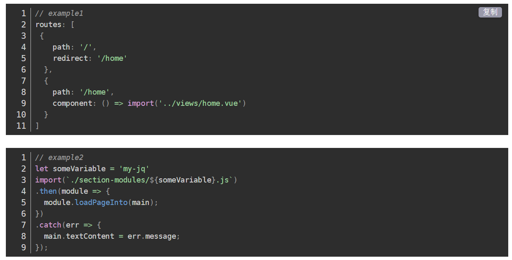

## ES6模块和CommonJS模块有哪些差异

### ES6
1. ES6模块中的值属于动态只读引用。
2. 对于只读来说，即不允许修改引入变量的值，import的变量是只读的，不论是基本数据类型还是复杂数据类型。当模块遇到import命令时，就会生成一个只读引用。等到脚本真正执行时，再根据这个只读引用，到被加载的那个模块里面去取值。
3. 对于动态来说，原始值发生变化，import加载的值也会发生变化。不论是基本数据类型还是复杂数据类型。
4. 循环加载时，ES6模块是动态引用。只要两个模块之间存在某个引用，代码就能够执行。

#### import...from 与 import() 的区别异同

- import() 函数 是动态加载的，对标 nodejs 中的 require() 。
- import() 返回一个 Promise 对象。

e.g. 路由懒加载用的就是这个

- import ... from 命令会被 JavaScript 引擎静态分析，先于模块内的其他语句执行。

- import() 函数可以用在任何地方，不仅仅是模块，非模块的脚本也可以使用。它是运行时执行，也就是说，什么时候运行到这一句，就会加载指定的模块。另外，import() 函数与所加载的模块没有静态连接关系，这点也是与 import...from 语句不相同。

>https://es6.ruanyifeng.com/#docs/module#import
[import...from 与 import() 的区别异同](https://blog.csdn.net/csdn_yudong/article/details/87814000)
   
### CommonJS
1. 对于基本数据类型，属于复制。即会被模块缓存。同时，在另一个模块可以对该模块输出的变量重新赋值。
2. 对于复杂数据类型，属于浅拷贝。由于两个模块引用的对象指向同一个内存空间，因此对该模块的值做修改时会影响另一个模块。
3. 当使用require命令加载某个模块时，就会运行整个模块的代码。
4. 当使用require命令加载同一个模块时，不会再执行该模块，而是取到缓存之中的值。也就是说，CommonJS模块无论加载多少次，都只会在第一次加载时运行一次，以后再加载，就返回第一次运行的结果，除非手动清除系统缓存。
5. 当循环加载时，脚本代码在require的时候，就会全部执行。一旦出现某个模块被"循环加载"，就只输出已经执行的部分，还未执行的部分不会输出。
   
>https://github.com/YvetteLau/Step-By-Step/issues/43#issuecomment-508682062_

#### module.exports与exports
exports是引用 module.exports的值。module.exports 被改变的时候，exports不会被改变，而模块导出的时候，真正导出的执行是module.exports，而不是exports

（exports只辅助module.exports操作内存中的数据）

### 区别

CommonJS模块是**运行时**加载，ES6模块是**编译时**输出接口
- 因为CommonJS加载的是一个**对象**，即module.export属性，**该对象只有在脚本运行结束时才会生成**。而ES6模块不是对象，它的对外接口只是一种静态定义，在代码静态解析阶段就会生成。
- ES6模块的运行机制与CommonJS不一样。JS引擎对脚本静态分析的时候，遇到模块加载命令import就会生成一个只读引用。等到脚本真正执行的时候，再根据这个只读引用到被加载的模块中取值。因此，ES6模块是动态引用，并且不会缓存值，模块里的变量绑定其所在的模块。

---

- 因为CommonJS的require语法是**同步的**，所以就导致了CommonJS模块规范**只适合用在服务端**，而ES6模块无论是在浏览器端还是服务端都是可以使用的，但是在服务端中，还需要遵循一些特殊的规则才能使用 ；
  >(require是服务端，同步的，只需要从本地硬盘中读取文件，速度是比较快的。但是如果在客户端还需要网络请求就很慢了，会阻塞。)
- CommonJS 模块输出的是一个值的拷贝，而ES6 模块输出的是值的引用；
  >CommonJS模块输出的是值的复制，也就是说，一旦输出一个值，模块内部的变化就影响不到这个值。(模块可以多次加载，但是只会在第一次加载时运行一次，然后运行结果就**被缓存**了，以后再加载，就直接读取缓存结果。要想让模块再次运行，必须清除缓存。)
- CommonJS 模块是运行时加载，而ES6 模块是编译时输出接口，使得对JS的模块进行静态分析成为了可能；
- 因为两个模块加载机制的不同，所以在对待循环加载的时候，它们会有不同的表现。CommonJS遇到循环依赖的时候，只会输出已经执行的部分，后续的输出或者变化，是不会影响已经输出的变量。而ES6模块相反，使用import加载一个变量，变量不会被缓存，真正取值的时候就能取到最终的值；
- 关于模块顶层的this指向问题，在CommonJS顶层，this指向当前模块；而在ES6模块中，this指向undefined；
- 关于两个模块互相引用的问题，在ES6模块当中，是支持加载CommonJS模块的。但是反过来，CommonJS并不能require ES6模块，在NodeJS中，两种模块方案是分开处理的。

>作者：echolc55873
链接：https://juejin.cn/post/6844904067651600391

## webpack 按需加载

https://juejin.cn/post/6968505746757533710