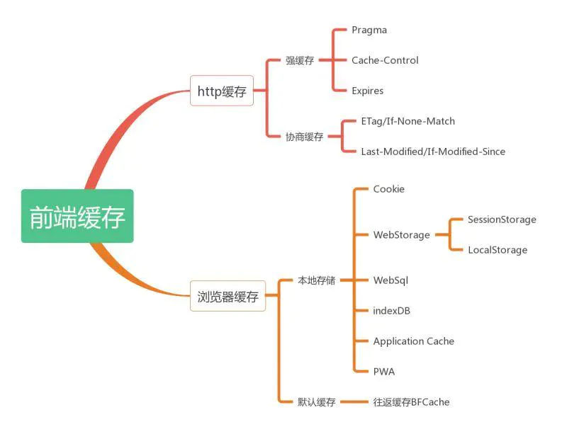
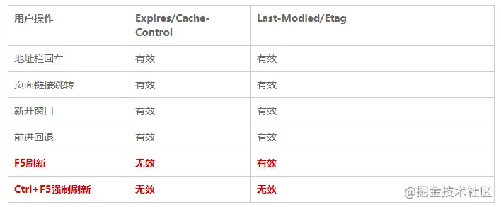
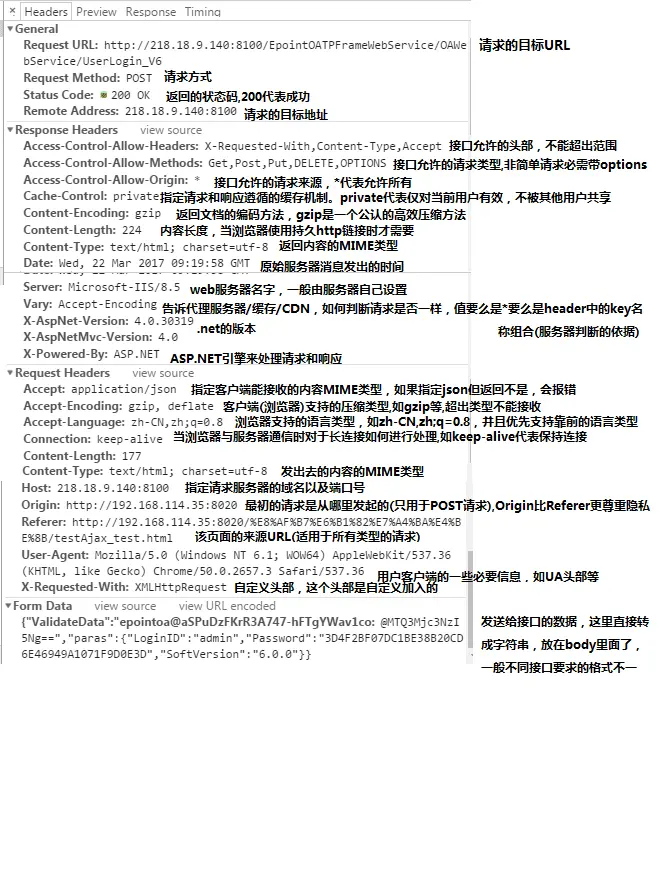
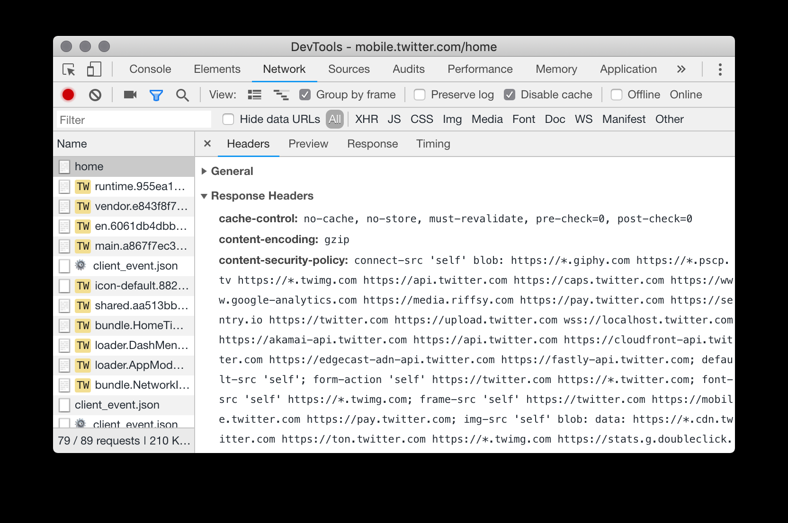

  ### 1. 浏览器缓存
https://juejin.cn/post/6844903763665240072
https://github.com/WindrunnerMax/EveryDay/blob/master/Browser/%E5%BC%BA%E7%BC%93%E5%AD%98%E4%B8%8E%E5%8D%8F%E5%95%86%E7%BC%93%E5%AD%98.md 看他的参考

前端缓存：

https://www.jianshu.com/p/227cee9c8d15

#### If-None-Match If-Modified-Since
当与 If-None-Match 一同出现时，If-Modified-Since会被忽略掉，除非服务器不支持 If-None-Match。

#### 为什么要有Etag
你可能会觉得使用Last-Modified已经足以让浏览器知道本地的缓存副本是否足够新，为什么还需要Etag呢？HTTP1.1中Etag的出现（也就是说，ETag是新增的，为了解决之前只有If-Modified的缺点）主要是为了解决几个Last-Modified比较难解决的问题：

- 一些文件也许会周期性的更改，但是他的内容并不改变(仅仅改变的修改时间)，这个时候我们并不希望客户端认为这个文件被修改了，而重新GET；

- 某些文件修改非常频繁，比如在秒以下的时间内进行修改，(比方说1s内修改了N次)，If-Modified-Since能检查到的粒度是s级的，这种修改无法判断(或者说UNIX记录MTIME只能精确到秒)；

- 某些服务器不能精确的得到文件的最后修改时间。

#### 用户行为对缓存的影响

即：F5 会 跳过强缓存规则，直接走协商缓存；Ctrl+F5 ，跳过所有缓存规则，和第一次请求一样，重新获取资源

#### 强制缓存的几个位置

总的来说就分为四个位置：

Service Worker
Memory Cache
Disk Cache
Push Cache
>(Push Cache是 HTTP/2 中的内容,它只在会话（Session）中存在，一旦会话结束就被释放，并且缓存时间也很短暂)

---
Memory Cache
存在内存中的缓存，一般是页面刷新后，浏览器从内存中获取缓存，从内存中获取缓存的速度要比从硬盘中获取的速度要快，因此在**刷新的时候**会从内存中获取缓存比较方便。当页面关闭后，内存就会释放。

Disk Cache
存在硬盘中的缓存，当重新打开页面后，会从硬盘中获取缓存。它与内存缓存最大的区别是：硬盘缓存不会在页面关闭后被清除，当页面关闭后再进入页面读取的就是硬盘缓存。

---
当有Service Worker时，浏览器（chrome）会从Service Worker拿取缓存
浏览器（chrome）首先会从内存中获取缓存，获取多少由当前内存和内存空间决定
浏览器（chrome）拿取缓存的顺序：Service Worker > memory cache > disk cache
其他：在chrome中状态码为200（from disk cache和from memory cache）的文件在edge和firefox中都是304（感兴趣的同学可以试一试）

>[扒一扒浏览器缓存机制](https://jayzangwill.github.io/blog/2019/02/07/cache/)

### 2. css和js阻塞页面渲染
理论上，**既然样式表不改变 DOM 树，也就没有必要停下文档的解析等待它们**。

#### css不阻塞DOM解析，会阻塞页面渲染

打开浏览器，可以看到是首先打印出div这个DOM节点，过3s左右之后才渲染出一个浅蓝色的div。这就证明了CSS 是不会阻塞 DOM 的解析的，尽管CSS下载需要3s，但这个过程中，浏览器不会傻等着CSS下载完，而是会解析DOM的。

浏览器是解析DOM生成DOM Tree，结合CSS生成的CSS Tree，最终组成render tree，再渲染页面。由此可见，在此过程中CSS完全无法影响DOM Tree，因而无需阻塞DOM解析。然而，DOM Tree和CSS Tree会组合成render tree，那CSS会不会页面阻塞渲染呢？

其实这一点，刚才的例子已经说明了，如果CSS 不会阻塞页面阻塞渲染，那么CSS文件下载之前，浏览器就会渲染出一个浅绿色的div，之后再变成浅蓝色。浏览器的这个策略其实很明智的，想象一下，如果没有这个策略，页面首先会呈现出一个原始的模样，待CSS下载完之后又突然变了一个模样。用户体验可谓极差，而且渲染是有成本的。

因此，基于性能与用户体验的考虑，浏览器会尽量减少渲染的次数，CSS顺理成章地阻塞页面渲染。

#### JS阻塞DOM解析和渲染

对此的优化其实也很显而易见，具体分为两类。
- 如果JS文件体积太大，同时你确定没必要阻塞DOM解析的话，不妨按需要**加上defer或者async**属性，此时脚本下载的过程中是不会阻塞DOM解析的。
- 而如果是文件执行时间太长，不妨分拆一下代码，不用立即执行的代码，可以使用一下以前的黑科技：setTimeout()。当然，现代的浏览器很聪明，它会“偷看”之后的DOM内容，碰到如`<link>、` 标签嵌入跨域脚本。语法错误信息只能在同源脚本中捕捉到。
`<link rel="stylesheet" href="...">` 标签嵌入CSS。由于CSS的松散的语法规则，CSS的跨域需要一个设置正确的Content-Type 消息头。不同浏览器有不同的限制： IE, Firefox, Chrome, Safari (跳至CVE-2010-0051)部分 和 Opera。
``嵌入图片。支持的图片格式包括PNG,JPEG,GIF,BMP,SVG,...
`<video> 和 <audio>`嵌入多媒体资源。
`<object>, <embed> 和 <applet> `的插件。
`@font-face` 引入的字体。一些浏览器允许跨域字体（ cross-origin fonts），一些需要同源字体（same-origin fonts）。
`<frame> 和 <iframe>` 载入的任何资源。站点可以使用X-Frame-Options消息头来阻止这种形式的跨域交互。

### 4. 浏览器进程
[浏览器工作原理：从输入URL到页面加载完成](https://github.com/amandakelake/blog/issues/55)

[浏览器进程架构的演化](https://juejin.cn/post/6844904019131891725#heading-6)

[浏览器进程、JS事件循环机制、宏任务和微任务](https://juejin.cn/post/6856324679951450120#heading-9)

>浏览器渲染(render)进程 =>（浏览器内核）

#### 浏览器渲染进程的多线程机制

看 [浏览器渲染进程的多线程机制](https://blog.csdn.net/fredricen/article/details/105217588)

#### 为什么要给浏览器使用多进程架构？
因此Chrome一开始就设计为把隔离性作为基本的设计原则，用进程的隔离性来实现对App的隔离。这样用户就不用担心：

- 一个Web App挂掉造成其他所有的Web App全部挂掉（稳定性）
- 一个Web App可以以某种形式访问其他App的数据（安全性）

以及Web App之间是并发的，可以提供更好的响应，一个App的渲染卡顿不会影响其他App的渲染（性能）（当然这点线程也能做到）

### 渲染过程
真实`DOM`和其解析流程

本节我们主要介绍真实   `DOM` 的解析过程，通过介绍其解析过程以及存在的问题，从而引出为什么需要虚拟`DOM`。一图胜千言，如下图为 `webkit` 渲染引擎工作流程图

所有的浏览器渲染引擎工作流程大致分为5步：创建        `   DOM` 树 —> 创建 `Style Rules` -> 构建 `Render` 树 —> 布局 `Layout` -—> 绘制 `Painting`。

- 第一步，构建 `DOM` 树：用 `HTML` 分析器，分析 `HTML` 元素，构建一棵 `DOM` 树；

- 第二步，生成样式表：用 `CSS` 分析器，分析 `CSS` 文件和元素上的 `inline` 样式，生成页面的样式表；

- 第三步，构建 `Render` 树：将 `DOM` 树和样式表关联起来，构建一棵 `Render` 树（`Attachment`）。每个 `DOM` 节点都有 `attach` 方法，接受样式信息，返回一个 `render` 对象（又名 `renderer`），这些 `render` 对象最终会被构建成一棵 `Render` 树；

- 第四步，确定节点坐标：根据 `Render` 树结构，为每个 `Render` 树上的节点确定一个在显示屏上出现的精确坐标；

- 第五步，绘制页面：根据 `Render` 树和节点显示坐标，然后调用每个节点的 `paint` 方法，将它们绘制出来。

### 安全
[浅说 XSS 和 CSRF](https://github.com/dwqs/blog/issues/68)
[Web安全之CSRF实例解析 ](https://github.com/funnycoderstar/blog/issues/142)
https://www.yuque.com/cuggz/feplus/oewdt3

#### CSRF

CSRF 跨站请求伪造（英语：Cross-site request forgery），是一种挟制用户在当前已登录的 Web 应用程序上执行非本意的操作的攻击方法。如：
攻击者诱导受害者进入第三方网站，在第三方网站中，向被攻击网站发送跨站请求。利用受害者在被攻击网站已经获取的注册凭证，绕过后台的用户验证，达到冒充用户对被攻击的网站执行某项操作的目的。

---
CSRF 攻击指的是跨站请求伪造攻击，攻击者诱导用户进入一个第三方网站，然后该网站向被攻击网站发送跨站请求。如果用户在被攻击网站中保存了登录状态，那么攻击者就可以利用这个登录状态，绕过后台的用户验证，冒充用户向服务器执行一些操作。

CSRF 攻击的本质是利用 cookie 会在同源请求中携带发送给服务器的特点，以此来实现用户的冒充。

攻击类型，常见的 CSRF 攻击有三种：

- GET 类型的 CSRF 攻击，比如在网站中的一个 img 标签里构建一个请求，当用户打开这个网站的时候就会自动发起提交。

- POST 类型的 CSRF 攻击，比如构建一个表单，然后隐藏它，当用户进入页面时，自动提交这个表单。

- 链接类型的 CSRF 攻击，比如在 a 标签的 href 属性里构建一个请求，然后诱导用户去点击。

>作者：KaiSarH
链接：https://www.nowcoder.com/discuss/726027?channel=-1&source_id=profile_follow_post_nctrack

---
注意，cookie是浏览器自动加到http头部发送的，token（通常存在localStorage中）不会，要显式的通过ajax脚本添加上才发送。所以CSRF攻击只能跳转链接，让浏览器自动带上cookie，但不能带上token。

>看 [前端安全系列之二：如何防止CSRF攻击？](https://juejin.cn/post/6844903689702866952)

#### 如何防御CSRF

##### 利用cookie的SameSite
SameSite有3个值： Strict, Lax和None
1. Strict。浏览器会完全禁止第三方cookie。比如 a.com的页面中访问 b.com的资源，那么a.com中的cookie不会被发送到 b.com服务器，只有从b.com的站点去请求b.com的资源，才会带上这些Cookie
2. Lax。相对宽松一些，在跨站点的情况下，从第三方站点链接打开和从第三方站点提交 Get方式的表单这两种方式都会携带Cookie。但如果在第三方站点中**使用POST方法或者通过 img、Iframe等标签加载的URL，这些场景都不会携带Cookie**。
3. None。任何情况下都会发送 Cookie数据

我们可以根据实际情况将一些关键的Cookie设置 Stirct或者 Lax模式，这样在跨站点请求的时候，这些关键的Cookie就不会被发送到服务器，从而使得CSRF攻击失败。

---
有些情况下需要第三方cookie所以要设置SameSite：None

但是要注意：

- HTTP 接口不支持 SameSite=none
如果你想加 SameSite=none 属性，那么该 Cookie 就**必须同时加上 Secure 属性**，表示只有在 HTTPS 协议下该 Cookie 才会被发送。

- 需要 UA 检测，部分浏览器不能加 SameSite=none
IOS 12 的 Safari 以及老版本的一些 Chrome 会把 SameSite=none 识别成 SameSite=Strict，所以服务端必须在下发 Set-Cookie 响应头时进行 User-Agent 检测，对这些浏览器不下发 SameSite=none 属性

- Cookie 的 SameSite 属性表示该 Cookie 是否能被**跨站**发送(不是跨域，也就是子域名也会发送)

##### 验证请求的来源点

由于CSRF攻击大多来自第三方站点，可以在服务器端验证请求来源的站点，禁止第三方站点的请求。
可以通过HTTP请求头中的 Referer和Origin属性。

但是这种 **Referer和Origin**属性是可以被伪造的，碰上黑客高手，这种判断就是不安全的了。

---
1. Host
描述请求将被发送的目的地，包括，且仅仅包括域名和端口号。
在任何类型请求中，request都会包含此header信息。

2. Origin
用来说明请求从哪里发起的，包括，且仅仅包括协议和域名。
这个参数**一般只存在于CORS跨域请求中**，可以看到response有对应的header：Access-Control-Allow-Origin。

3. Referer
告知服务器请求的原始资源的URI，其用于所有类型的请求，并且包括：协议+域名+查询参数（注意，不包含锚点信息）。

因为原始的URI中的查询参数可能包含ID或密码等敏感信息，如果写入referer，则可能导致信息泄露。

##### CSRF Token
1. 最开始浏览器向服务器发起请求时，服务器生成一个CSRF Token。CSRF Token其实就是服务器生成的字符串，然后将该字符串种植到返回的页面中(可以通过Cookie)
2. 浏览器之后再发起请求的时候，需要带上页面中的 `CSRF Token`（在request中要带上之前获取到的Token，比如 `x-csrf-token：xxxx`）, 然后服务器会验证该Token是否合法。第三方网站发出去的请求是无法获取到 `CSRF Token`的值的。

##### 双重cookie
对 Cookie 进行双重验证，服务器在用户访问网站页面时，向请求域名注入一个Cookie，内容为随机字符串，然后当用户再次向服务器发送请求的时候，从 cookie 中取出这个字符串，添加到 URL 参数中，然后服务器通过对 cookie 中的数据和参数中的数据进行比较，来进行验证。使用这种方式是利用了攻击者只能利用 cookie，但是不能访问获取 cookie 的特点。并且这种方法比 CSRF Token 的方法更加方便，并且不涉及到分布式访问的问题。这种方法的缺点是如果网站存在 XSS 漏洞的，那么这种方式会失效。同时这种方式不能做到子域名的隔离。

##### 验证码

CSRF 攻击往往是在用户不知情的情况下构造了网络请求。而验证码会强制用户必须与应用进行交互，才能完成最终请求。因为通常情况下，验证码能够很好地遏制 CSRF 攻击。

但验证码并不是万能的，因为出于用户考虑，不能给网站所有的操作都加上验证码。因此，验证码只能作为防御 CSRF 的一种辅助手段，而不能作为最主要的解决方案。

[Cookie 的 SameSite 属性](https://www.ruanyifeng.com/blog/2019/09/cookie-samesite.html)

[vue前端利用localStorage存储token值并放到请求头headers实例](https://blog.csdn.net/bentou_/article/details/105400022?utm_medium=distribute.pc_relevant.none-task-blog-2%7Edefault%7EBlogCommendFromMachineLearnPai2%7Edefault-4.base&depth_1-utm_source=distribute.pc_relevant.none-task-blog-2%7Edefault%7EBlogCommendFromMachineLearnPai2%7Edefault-4.base)

#### XSS

Cross-Site Scripting（跨站脚本攻击）简称 XSS，是一种代码注入攻击。攻击者通过在目标网站上注入恶意脚本，使之在用户的浏览器上运行。利用这些恶意脚本，攻击者可获取用户的敏感信息如 Cookie、SessionID 等，进而危害数据安全。

>看 [前端安全系列（一）：如何防止XSS攻击？](https://juejin.cn/post/6844903685122703367#heading-1)

##### CSP

CSP是一种可信白名单机制，可以在服务端配置浏览器**哪些外部资源可以加载和执行**。

CSP 通过告诉浏览器一系列规则，严格规定页面中哪些资源允许有哪些来源， 不在指定范围内的统统拒绝。相比同源策略，CSP 可以说是很严格了。

其实施有两种途径：

- 服务器添加 Content-Security-Policy 响应头来指定规则
- HTML 中添加 标签来指定 Content-Security-Policy 规则

>[Content Security Policy (CSP) 介绍](https://i.jakeyu.top/2018/08/26/Content-Security-Policy-CSP-%E4%BB%8B%E7%BB%8D/)

严格的 CSP 在 XSS 的防范中可以起到以下的作用：

- 禁止加载外域代码，防止复杂的攻击逻辑。
- 禁止外域提交，网站被攻击后，用户的数据不会泄露到外域。
- 禁止内联脚本执行（规则较严格，目前发现 GitHub 使用）。
- 禁止未授权的脚本执行（新特性，Google Map 移动版在使用）。
  
合理使用上报可以及时发现 XSS，利于尽快修复问题。

#### DDos(洪水)

https://www.cloudflare.com/zh-cn/learning/ddos/what-is-a-ddos-attack/

#### 兼容性

Normalize.css

Normalize.css 是一个可以定制的CSS文件，它让不同的浏览器在渲染网页元素的时候形式更统一。

不同的浏览器在对于CSS没有定义的一些样式属性是不一样的，
比如没有在自己的CSS里面规定超链接有没有下划线的时候，有些浏览器有，有些浏览器没有；
再比如有一些浏览器规定的超链接默认颜色是蓝色，有一些又是黑色。
而这个CSS的功能就是对几乎所有的默认样式进行重置，让所有的浏览器上对于未定义的样式浏览效果达到一致

（虽然说无法完全一致，但至少可以消除掉大部分差距）

[常见浏览器兼容性问题与解决方案](https://blog.csdn.net/weixin_38536027/article/details/79375411)