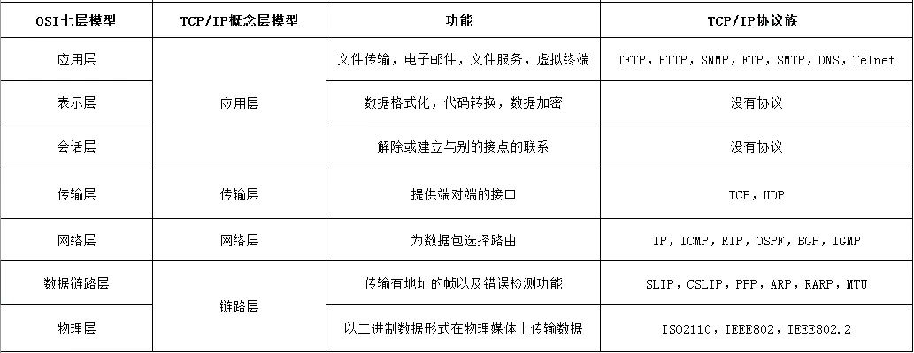
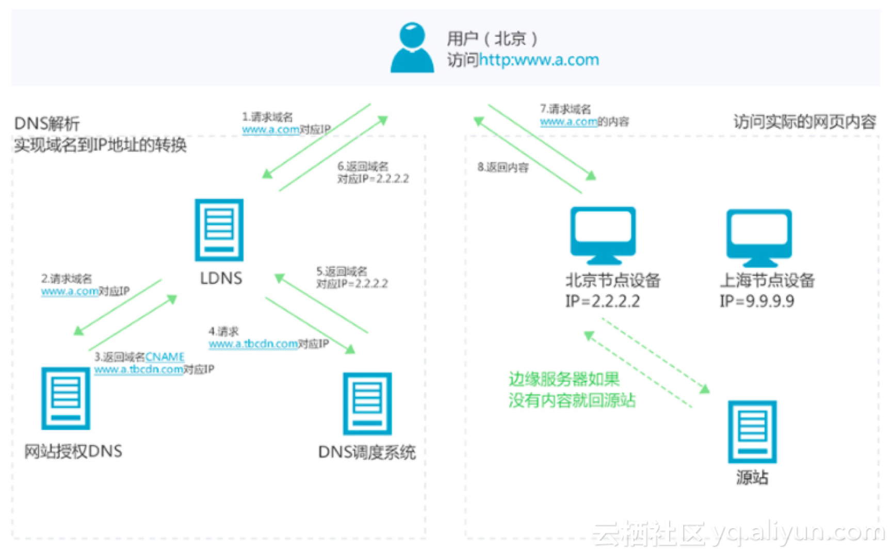
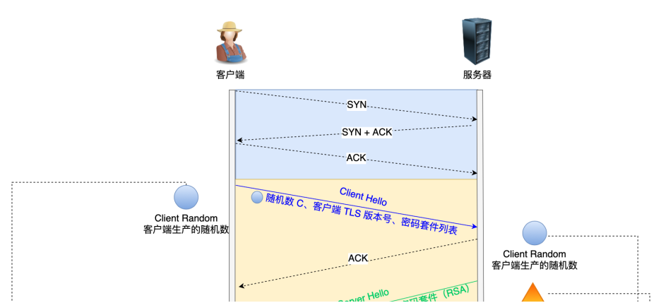
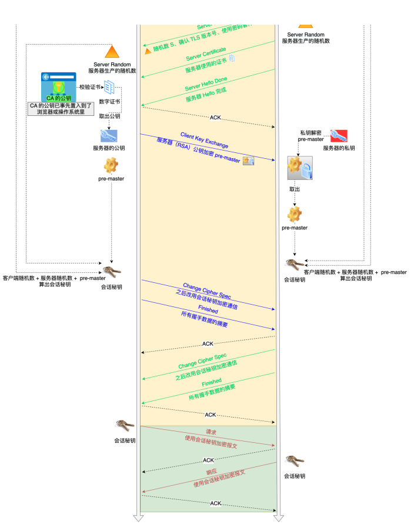

https://juejin.cn/post/6915362842212302862#heading-2 「计算机网络」前端必备知识，看到就是赚到系列（上）

https://mp.weixin.qq.com/s/iSZp41SRmh5b2bXIvzemIw  探究！一个数据包在网络中的心路历程

https://juejin.cn/post/6939691851746279437#heading-17 字节跳动最爱考的前端面试题：计算机网络基础

https://www.jianshu.com/p/3fc3646fad80 http的长连接和短连接（史上最通俗！）

https://blog.nowcoder.net/n/d5e2c1b0abf1416e8379c0c24eb3458a 前端复习企划7-网络

**小林Coding**

### 1. 网络模型
<!-- https://www.yuque.com/cuggz/interview/cdpgm0#NQHWi -->

https://www.yuque.com/cuggz/interview/cdpgm0#YhF2j

https://blog.nowcoder.net/n/d5e2c1b0abf1416e8379c0c24eb3458a

https://juejin.cn/post/6915362842212302862




---

应用层：为应用程序提供交互服务。在互联网中的应用层协议很多，如域名系统DNS，支持万维网应用的HTTP协议，支持电子邮件的SMTP协议等。

表示层：主要负责数据格式的转换，如加密解密、转换翻译、压缩解压缩等。

会话层：负责在网络中的两节点之间建立、维持和终止通信，如服务器验证用户登录便是由会话层完成的。

运输层：有时也译为传输层，向主机进程提供（端到端的）通用的数据传输服务。该层主要有以下两种协议：

- TCP：提供面向连接的、可靠的数据传输服务；

- UDP：提供无连接的、尽最大努力的数据传输服务，但不保证数据传输的可靠性。

网络层：选择合适的路由和交换结点（将数据从一台主机发送到另一台主机），确保数据及时传送。主要包括IP协议。

数据链路层：数据链路层通常简称为链路层。将网络层传下来的IP数据包组装成帧，并再相邻节点（主机或路由器）的链路上传送帧。

物理层：实现相邻节点间比特流的透明传输，尽可能屏蔽传输介质和通信手段的差异。

>作者：程序员库森
链接：https://www.nowcoder.com/discuss/694989?channel=-1&source_id=profile_follow_post_nctrack

### 2. tcp udp
https://www.cnblogs.com/xiaolincoding/p/12732052.html 30张图解： TCP 重传、滑动窗口、流量控制、拥塞控制

https://www.cnblogs.com/xiaolincoding/p/12638546.html 被问千百遍的 TCP 三次握手和四次挥手面试题

#### TCP 和 UDP 区别：

1. 连接

TCP 是面向连接的传输层协议，传输数据前先要建立连接。
UDP 是不需要连接，即刻传输数据。

2. 服务对象

TCP 是一对一的两点服务，即一条连接只有两个端点。
UDP 支持一对一、一对多、多对多的交互通信

3. 可靠性

TCP 是可靠交付数据的，数据可以无差错、不丢失、不重复、按需到达。
UDP 是尽最大努力交付，不保证可靠交付数据。

4. 拥塞控制、流量控制

TCP 有拥塞控制和流量控制机制，保证数据传输的安全性。
UDP 则没有，即使网络非常拥堵了，也不会影响 UDP 的发送速率。

5. 首部开销

TCP 首部长度较长，会有一定的开销，首部在没有使用「选项」字段时是 20 个字节，如果使用了「选项」字段则会变长的。
UDP 首部只有 8 个字节，并且是固定不变的，开销较小。

6. 传输方式

TCP 是流式传输，没有边界，但保证顺序和可靠。
UDP 是一个包一个包的发送，是有边界的，但可能会丢包和乱序。

7. 分片不同

TCP 的数据大小如果大于 MSS 大小，则会在传输层进行分片，目标主机收到后，也同样在传输层组装 TCP 数据包，如果中途丢失了一个分片，只需要传输丢失的这个分片。
UDP 的数据大小如果大于 MTU 大小，则会在 IP 层进行分片，目标主机收到后，在 IP 层组装完数据，接着再传给传输层，但是如果中途丢了一个分片，则就需要重传所有的数据包，这样传输效率非常差，所以通常 UDP 的报文应该小于 MTU。

**TCP 和 UDP 应用场景：**

由于 TCP 是面向连接，能保证数据的可靠性交付，因此经常用于：

- FTP 文件传输
- HTTP / HTTPS
  
由于 UDP 面向无连接，它可以随时发送数据，再加上UDP本身的处理既简单又高效，因此经常用于：

- 包总量较少的通信，如 DNS 、SNMP 等
- 视频、音频等多媒体通信
- 广播通信

**为什么 UDP 头部没有「首部长度」字段，而 TCP 头部有「首部长度」字段呢？**

原因是 TCP 有可变长的「选项」字段，而 UDP 头部长度则是不会变化的，无需多一个字段去记录 UDP 的首部长度。

#### TCP连接怎么断开

有的时候，服务器需要知道客户端主机是否已崩溃并且关闭，或者崩溃但重启。许多实现提供了存活定时器来完成这个任务。

TCP的保活定时器能够保证TCP连接一直保持，但是TCP的保活定时器不是每个TCP/IP协议栈就实现了，因为RFC并不要求TCP保活定时器一定要实现。

---
很多人都知道TCP并不会去主动检测连接的丢失，这意味着，如果双方不产生交互，那么如果网络断了或者有一方机器崩溃，另外一方将永远不知道连接已经不可用了。检测连接是否丢失的方法大致有两种：keepalive和heart-beat。

Keepalive是很多的TCP实现提供的一种机制，它允许连接在空闲的时候双方会发送一些特殊的数据段，并通过响应与否来判断连接是否还存活着（所谓keep~~alive）。我曾经写过一篇关于keepalive的blog ，但后来我也发现，其实keepalive在实际的应用中并不常见。为何如此？这得归结于keepalive设计的初衷。**Keepalive适用于清除死亡时间比较长的连接**。
比如这样的场景：一个用户创建tcp连接访问了一个web服务器，当用户完成他执行的操作后，很粗暴的直接拨了网线。这种情况下，这个tcp连接已经断开了，但是web服务器并不知道，它会依然守护着这个连接。如果web server设置了keepalive，那么它就能够在用户断开网线的大概几个小时以后，确认这个连接已经中断，然后丢弃此连接，回收资源。
采用keepalive，它会先要求此连接一定时间没有活动（一般是几个小时），然后发出数据段，经过多次尝试后（每次尝试之间也有时间间隔），如果仍没有响应，则判断连接中断。可想而知，整个周期需要很长的时间。
所以，如前面的场景那样，需要一种方法能够清除和回收那些在系统不知情的情况下死去了很久的连接，keepalive是非常好的选择。

但是，在大部分情况下，特别是分布式环境中，我们需要的是一个能够快速或者实时监控连接状态的机制，这里，heart-beat才是更加合适的方案。
Heart-beat（心跳），按我的理解，它的原理和keepalive非常类似，都是发送一个信号给对方，如果多次发送都没有响应的话，则判断连接中断。它们的不同点在于，keepalive是tcp实现中内建的机制，是在创建tcp连接时通过设置参数启动keepalive机制；而heart-beat则需要在tcp之上的应用层实现。一个简单的heart-beat实现一般测试连接是否中断采用的时间间隔都比较短，可以很快的决定连接是否中断。并且，由于是在应用层实现，因为可以自行决定当判断连接中断后应该采取的行为，而keepalive在判断连接失败后只会将连接丢弃。
关于heart-beat，一个非常有趣的问题是，应该在传输真正数据的连接中发送心跳信号，还是可以专门创建一个发送“心跳”信号的连接。比如说，A，B两台机器之间通过连接m来传输数据，现在为了能够检测A，B之间的连接状态，我们是应该在连接m中传输心跳信号，还是创建新的连接n来专门传输心跳呢？我个人认为两者皆可。如果担心的是端到端的连接状态，那么就直接在该条连接中实现心跳。但很多时候，关注的是网络状况和两台主机间的连接状态，这种情况下， 创建专门的心跳连接也未尝不可。

>[tcp 服务端如何判断客户端断开连接](https://www.cnblogs.com/youxin/p/4056041.html)

#### keep-alive

TCP 的 Keepalive 这东西其实就是 TCP 的**保活机制**

[TCP 的 Keepalive 和 HTTP 的 Keep-Alive 是一个东西吗？](https://mp.weixin.qq.com/s/25atTs4b-vORIx525ur_aw)

### 3. 键⼊⽹址到⽹⻚显示，期间发⽣了什么
小林coding 5.1
https://blog.nowcoder.net/n/d5e2c1b0abf1416e8379c0c24eb3458a
https://juejin.cn/post/6902032954034225159#heading-7 加入了浏览器进程相关的过程
>注：域名解析过程就是DNS过程

### 4. 进程线程
小林coding 系统
>看 
[一文读懂什么是进程、线程、协程（建议收藏）](http://www.360doc.cn/article/32196507_906628857.html)

一个标准的线程由线程ID、当前指令指针(PC)、寄存器和堆栈组成。而进程由内存空间(代码、数据、进程空间、打开的文件)和一个或多个线程组成。

---
可以从四方面思考：
1.1. 线程是程序执行的最小单位，而进程是操作系统分配资源的最小单位。
1.2. 一个进程由一个或多个线程组成，线程是一个进程中代码的不同执行路线。
1.3. 进程之间相互独立，但同一进程下的各个线程之间共享程序的内存空间。
1.4. 调度和切换：线程上下文切换比进程上下文切换要快得多。

#### 虚拟内存

[你真的了解虚拟内存和物理内存吗](https://juejin.cn/post/6844903970981281800)
[虚拟内存是个啥 | 一分钟系列](https://juejin.cn/post/6844903939683385352)

稍后 [csapp](https://hansimov.gitbook.io/csapp/part2/ch09-virtual-memory)

虚拟内存提供了三个重要的能力： 缓存，内存管理，内存保护

- 将主存视为一个存储在磁盘上的地址空间的高速缓存，在主存中只保存活动区域，并根据需要在磁盘和主存之间来回传送数据
- 为每个进程提供了一致的地址空间，简化内存管理
- 保护了每个进程的地址空间不被其他进程破坏

>作者：Keshawn Zhen
链接：https://juejin.cn/post/6844903744266584072

### 5. CDN
http://hpoenixf.com/DNS%E4%B8%8ECDN%E7%9F%A5%E8%AF%86%E6%B1%87%E6%80%BB.html
https://juejin.cn/post/6844903906296725518#heading-2 漫话：如何给女朋友解释什么是CDN？
https://juejin.cn/post/6844904190913822727


#### CDN的过程

使用CDN的方法很简单，只需要修改自己的DNS解析，设置一个CNAME指向CDN服务商即可。

用户访问未使用CDN缓存资源的过程为:

- 浏览器通过前面提到的过程对域名进行解析，以得到此域名对应的IP地址；
- 浏览器使用所得到的IP地址，向域名的服务主机发出数据访问请求；
- 服务器向浏览器返回响应数据
  
使用CDN后

- 当用户点击网站页面上的内容URL，经过本地DNS系统解析，DNS系统会最终将域名的解析权交给CNAME指向的CDN专用DNS服务器。
- CDN的DNS服务器将CDN的全局负载均衡设备IP地址返回用户。
- 用户向CDN的全局负载均衡设备发起内容URL访问请求。
- CDN全局负载均衡设备根据用户IP地址，以及用户请求的内容URL，选择一台用户所属区域的区域负载均衡设备，告诉用户向这台设备发起请求。
- 区域负载均衡设备会为用户选择一台合适的缓存服务器提供服务，选择的依据包括：根据用户IP地址，判断哪一台服务器距用户最近；根据用户所请求的URL中携带的内容名称，判断哪一台服务器上有用户所需内容；查询各个服务器当前的负载情况，判断哪一台服务器尚有服务能力。基于以上这些条件的综合分析之后，区域负载均衡设备会向全局负载均衡设备返回一台缓存服务器的IP地址。
- 全局负载均衡设备把服务器的IP地址返回给用户
  >注意：在上面的阶段都是**dns交互过程**，负载均衡服务器并没有拿到用户的真实IP，而是**根据LDNS的IP分配的**。如果用户用了异地的LDNS，会使用HTTP 302 调度。因为最终用户会和边缘节点直接通信，这个阶段才能拿到真实IP，如果不符则返回302重新调度。
- 用户向缓存服务器发起请求，缓存服务器响应用户请求，将用户所需内容传送到用户终端。如果这台缓存服务器上并没有用户想要的内容，而区域均衡设备依然将它分配给了用户，那么这台服务器就要向它的上一级缓存服务器请求内容，直至追溯到网站的源服务器将内容拉到本地。

上面的字太多，有点绕？通俗点就是用户访问的资源原本是存放在你自己的服务器，通过修改DNS让用户根据IP等情况来选择合适的CDN缓存服务器来获取资源。



>[CDN与DNS知识汇总](http://hpoenixf.com/DNS%E4%B8%8ECDN%E7%9F%A5%E8%AF%86%E6%B1%87%E6%80%BB.html)

#### 回源

CDN节点未缓存资源或者缓存资源已到期时，节点会回源站获取资源，返回给客户端。

### DNS

#### DNS记录类型
域名系统DNS(Domain Name System)是一个分布式数据库，功能是联系域名和ip地址。域名与ip的对应关系，被称为记录(record)，可分为各种类型

- A: Address，域名指向的IP地址，一个域名可以有多个A记录。
- NS：Name Server，保存下一级域名信息的服务器地址
- MX：Mail eXchange，接受电子邮件的服务器地址
- CNAME：Canonical Name，返回另一个域名，令当前查询域名挑去该域名，多个域名->服务器的映射。
- PTR： Pointer Record，只用于ip地址查询域名

#### dns查询的过程

1. 检查浏览器缓存
2. 检查操作系统缓存，常见的如hosts文件
3. 检查路由器缓存
4. 如果前几步都没没找到，会向ISP(网络服务提供商)的LDNS服务器查询
5. 如果LDNS服务器没找到，会向跟域名服务器(Root Server)请求解析，分为以下几步：
   
   - 根服务器返回顶级域名(TLD)服务器如 .com，.cn，.org等的地址，全球只有13台，该例子中会返回.com的地址
   - 接着向TLD发送请求，然后会返回次级域名(SLD)服务器的地址，本例子会返回.example的地址
   - 接着向SLD域名服务器通过域名查询目标IP，本例子会返回www.example.com的地址
   - Local DNS Server会缓存结果，并返回给用户，缓存在系统中。

### http

#### get和post
先说相同点，只有了解了相同点之后才能理解为什么会发生混淆。两者都能向服务器发送数据，提交的“内容” [*注1*] 的格式相同，都是var_1=value_1&var_2=value_2&....get 和 post 区别如字面，一个是get（获取），一个是post（发送）。get用来告诉服务器需要获取哪些内容（uri+query），向静态页面（uri）请求则直接返回文件内容给浏览器，向一个动态页面**请求时可以提供查询参数（query）以获得相应内容**。post用来向服务器提交内容，**主要是为了提交**，而不是为了请求内容，就是说post的初衷并不要求服务器返回内容 [*注2*]，只是提交内容让服务器处理（主要是存储或者处理之后再存储）。get和post出现混淆是因为对提交的数据处理方法的滥用造成的，数据是无辜的。

- 混淆之一：  将get提交的用来查询的字段当作是存储数据存入了服务器端文件或者数据库。然后就误以为get是用来提交用于存储的数据的。

- 混淆之二：  编写脚本在服务器端通过处理post提交的数据并返回内容。只要有数据，就能用来进行判断，脚本怎写是程序员的事，而不在乎数据来源的形式（post、get，或者是自己预设值的常量）。这点功能上确实没问题，只是背离的其初始目的而已。

由于都是要传送数据，且数据格式相同（即使数据格式不同，只要能提取出相应数据）。使用的时候难免出现张冠李戴，将get数据用来存储、将post数据用来检索返回数据。但是二者还是有区别的（主要是根据其用途而“人为” [*注3*] 造成的），get的长度限制在2048字节（由浏览器和服务器限制的，这是目前IE的数据，曾经是1024字节），很大程度上限制了get用来传递“存储数据”的数据的能力，所以还是老老实实用来做检索吧；post则无此限制（只是HTTP协议规范没有进行大小限制，但受限于服务器的处理能力），因此对于大的数据（一般来说需要存储的数据可能会比较大，比2048字节大）的传递有天然的优势，谁让它是 nature born post 呢。

get提交的数据是放在url里，目的是灵活的向服务其提交检索请求，可以在地址栏随时修改数据以变更需要获取的内容，比如直接修改分页的编号就跳到另外一个分页了（当然也可能是 404）。post提交的数据放在http请求的正文里，目的在于提交数据并用于服务器端的存储，而不允许用户过多的更改相应数据（主要是相对于在url 修改要麻烦很多，url的修改只要点击地址栏输入字符就可以了），除非是专门跑来编辑数据的。

且get可以缓存。

花边：post和get的安全性在传输的层面上区别不大，但是采用url提交数据的get方式容易被人肉眼看到，或者出现在历史纪录里，还是可能被肉眼看到，都是一些本地的问题。

>注1：我强调的是内容，至于http协议中的get和post的格式大家有兴趣就自己看看吧。
>
>注2：get方式主要是为了获得预期内容，即uri+query相同时所得到的内容应该是相同的。而post主要是提交内容，至于是否有必要返回页面可能只是出于用户体验，比如注册时返回你的注册id，但是如果只是返回一个“您已注册成功”的相同页面（即使你post的数据不一样）也没什么好奇怪的。
>
>注3：关于这个“人为”，不是那么贴切，get和post还是有技术层面的区别的。但是从表象上看暂且这么说吧，毕竟二者的混淆也是“人为”的。

---
GET是安全的、**幂等**的，而POST是 不安全的、不幂等的。
GET在浏览器回退或者刷新时是无害的，而POST会再次提交数据请求。
GET产生的URL地址可以作为书签保存，而POST不行。
GET请求会被浏览器**主动cache**，而POST不会主动缓存。(这里缓存就是http缓存)
GET请求只能进行url编码，而POST支持多种编码方式。
GET请求参数会被完整保留在浏览器历史记录里，而POST中的参数不会被保留。
GET请求在URL中传送的参数长度受URL长度限制，而POST的大小取决于后端配置。
GET参数只接受ASCII字符的数据类型，而POST没有限制，可以传输二进制数据。
GET比POST更不安全，因为参数直接暴露在URL上，所以不适合传递敏感信息。
GET参数通过URL传递，直接可见，POST的参数放在Request body中，不直接可见。

#### post和put
POST方法和PUT方法请求最根本的区别是发起请求的目的不同。post 请求的目的是根据资源自身的语义来处理这个资源（译注：我理解这个意思就是说，post请求可以根据实际请求的资源来决定到底怎么处理，原文中4.3.3节给了一些例子。我会把我的翻译版附在本文末尾。）。put请求的目的是用来替换整个目标资源。**put 请求具有 幂等性**（idempotent）。（幂等性的意思在这个RFC的4.2.2里说了“同样的请求，不管发多少次，每次服务器处理完之后的结果，都和只发一次是一样的。”这里我举个例子帮助大家理解：你的服务器端存放了一个文章收藏夹，你通过一个put请求来修改收藏夹里的文章名字，这个 put 请求的请求体里包含了整个文章收藏夹里所有文章的名字。当服务端处理这个请求时，只要从 put 请求里拿出这个文章名字列表，整个存到服务器上，就是一个完整的新的收藏夹。那么这样的put 请求，无论你是发一次，还是发多次，假设服务器都能成功处理，那么最终对服务器造成的影响都是一样的：即服务器端原有的收藏夹里的文章列表被替换成了put请求里带的收藏夹的文章列表。）

1. 服务端在处理时post方法发出的请求时，应该按照请求的具体资源的具体语义来对该资源做相应的处理。例如，以下情况一般使用 Post 方法：

        提供一整块数据时，比如，向html表单的文本框里输入数据，然后把整个表单提交，来对这些数据做处理。
        在论坛、群组、邮件列表、博客或者类似的东西里发表文章时。
        想要通过请求在服务器端创建一个新资源时。
        像服务端的一个资源里插入一些数据时。

2. put方法用于创建或者替换整个资源，请求体（body）里包含这个资源的完整描述。一个 put 请求如果成功了，那么理论上来说，对同样的 url 做一个 get 请求，应该能得到一个 200 (OK) 的响应。但实际上，并不能保证get 到200的响应。因为，可能同时有其他人也在对这个资源做操作，那么就可能在get请求抵达服务器之前，这个资源已经被别人改掉了。所以说， put 请求成功，只能代表在这个请求被服务器处理的那个时刻上，这个资源被创建或替换成请求体里的样子了。（译注：比如我用put请求修改一个小组里的所有用户列表，我的请求体里包含了小组里所有用户的用户名列表，那么在服务器处理我这个请求，并告诉我成功了的那个时刻，这个小组的用户名一定和我发的put请求里的用户名列表是一样的。但是同时有可能有别的人也在尝试改这个小组的信息，那么我紧接着发一个 get 请求，可能get到的小组里的用户名列表跟我刚才put的已经不一样了。）

---
当需要以更新的形式来修改某一具体资源的时候，如何判断用PUT还是POST呢？

很简单，如果该更新对应的URI多次调用的结果一致，则PUT

比如更新某个blog文章，因为该文章具有单一的具体URI，所以每次更新提交相同的内容，结果都一致

/blog/{document_id}/update

在每次更新提交相同的内容，最终的结果不一致的时候，用POST

举个很常见的例子，一个接口的功能是将当前余额减一个值，每次提交指定该值为100，接口如下

/amount/deduction

调用一次，你的余额-100，调用两次，余额-200

这个时候就用POST

#### http请求头以及响应头
[关于常用的http请求头以及响应头详解](https://juejin.cn/post/6844903745004765198)

#### 常见的HTTP请求方法
GET: 向服务器获取数据；
POST：将实体提交到指定的资源，通常会造成服务器资源的修改；
PUT：上传文件，更新数据；
DELETE：删除服务器上的对象；
HEAD：获取报文首部，与GET相比，不返回报文主体部分；
OPTIONS：询问支持的请求方法，用来跨域请求；
CONNECT：要求在与代理服务器通信时建立隧道，使用隧道进行TCP通信；
TRACE: 回显服务器收到的请求，主要⽤于测试或诊断。

#### 常见的 Content-Type 属性值
https://developer.mozilla.org/zh-CN/docs/Web/HTTP/Basics_of_HTTP/MIME_types

**form-data、x-www-form-urlencoded**
1. form-data:
就是http请求中的multipart/form-data,它会将表单的数据处理为一条消息，以标签为单元，用分隔符分开。既可以上传键值对，也**可以上传文件**。当上传的字段是文件时，会有Content-Type来说明文件类型；content-disposition，用来说明字段的一些信息；

2. x-www-form-urlencoded：
就是application/x-www-from-urlencoded,会将表单内的数据转换为键值对，&分隔。
当form的action为get时，浏览器用x-www-form-urlencoded的编码方式，将表单数据编码为(name1=value1&name2=value2…)，然后把这个字符串append到url后面，用?分隔，跳转到这个新的url。
>数据按照 key1=val1&key2=val2 的方式进行编码，key 和 val 都进行了 **URL 转码**。

#### 一个 tcp 连接能发几个 http 请求

- HTTP/1.0 : 一个tcp连接只能发一个http请求。每次服务端返回响应后TCP连接会断开。
- HTTP/1.1: 默认开启Connection: keep-alive，一个TCP连接可以发多个http请求，但是多个请求是串行执行。（注意区别TCP的keep-alive）
- HTTP/2: 引入了多路复用技术 和二进制分帧，同个域名下的请求只需要占用一个 TCP 连接，请求和响应是并行执行。(详细请看：https://developer.51cto.com/art/201910/604255.htm)

#### 浏览器对同一 Host 建立 TCP 连接到数量有没有限制

假设我们还处在 HTTP/1.1 时代，那个时候没有多路传输，当浏览器拿到一个有几十张图片的网页该怎么办呢？肯定不能只开一个 TCP 连接顺序下载，那样用户肯定等的很难受（串行），但是如果每个图片都开一个 TCP 连接发 HTTP 请求，那电脑或者服务器都可能受不了，要是有 1000 张图片的话总不能开 1000 个TCP 连接吧，你的电脑同意 NAT 也不一定会同意。

所以答案是：有。Chrome **最多允许对同一个 Host 建立六个 TCP 连接**。不同的浏览器有一些区别。
​
那么回到最开始的问题，收到的 HTML 如果包含几十个图片标签，这些图片是以什么方式、什么顺序、建立了多少连接、使用什么协议被下载下来的呢？

如果图片都是 HTTPS 连接并且在同一个域名下，那么浏览器在 SSL 握手之后会和服务器商量能不能**用 HTTP2**，如果能的话就使用 Multiplexing 功能在这个连接上进行多路传输。不过也未必会所有挂在这个域名的资源都会使用一个 TCP 连接去获取，但是可以确定的是 Multiplexing 很可能会被用到。

如果发现用不了 HTTP2 呢？或者用不了 HTTPS（现实中的 HTTP2 都是在 HTTPS 上实现的，所以也就是只能使用 HTTP/1.1）。那浏览器就会在一个 HOST 上**建立多个 TCP 连接**，连接数量的最大限制取决于浏览器设置，这些连接会在空闲的时候被浏览器用来发送新的请求，如果所有的连接都正在发送请求呢？那其他的请求就只能等等了。

>https://zhuanlan.zhihu.com/p/61423830

#### http 1.1/ 2.0
>作者：1Π胡言
链接：https://www.nowcoder.com/discuss/700598?type=2&order=0&pos=1&page=0&source_id=discuss_tag_nctrack&channel=-1

##### HTTP 1.1

- HTTP1.1默认开启长连接，在一个TCP连接上可以传送多个HTTP请求和响应。使用 TCP 长连接的方式改善了 HTTP/1.0 短连接造成的性能开销。
- HTTP1.1支持管道（pipeline）网络传输，只要第一个请求发出去了，不必等其回来，就可以发第二个请求出去，可以减少整体的响应时间。

##### HTTP 2.0

1. 多路复用

通过一个TCP连接传输所有数据。一个请求对应一个id，这样一个链接上可以有多个请求，每个连接的请求可以随机的混杂在一起，接收方可以根据请求的id将请求再归属到各自不同的服务器端请求里面

2. 二进制分帧层

HTTP/2.0性能增强的关键，它改变了通信两端交互数据的方式，原先是以文本传输，现在要先对数据进行二进制编码，再把数据分成一个一个的帧，接着把帧送到数据流中，最后对方接受帧并拼接成一条消息，再处理请求

3. 首部压缩

前面提到过的HTTP1.x的header带有大量信息，而且每次都要重复发送，HTTP2.0使用encoder来减少需要传输的header大小，通讯双方各自cache一份header fields表，既避免了重复header的传输，又减小了需要传输的大小

4. 服务器推送

HTTP2.0支持服务器主动推送，简单地说就是一次请求返回多个响应，这也是一减少HTTP请求的方法。服务器除了处理最初的请求外，还会额外push客户端一定会请求的资源，无需客户端发出明确的请求。

存在问题
http2.0使用了多路复用，一般来说同一域名下只需要使用一个TCP连接。
但是当连接中出现丢包时，整个TCP都要开始等待重传，后面的数据也都被阻塞了。而http1.0可以开启多个连接，只会影响一个，不会影响其他的。
所以在丢包情况下，http2.0的情况反而不如http1.0。

>https://blog.nowcoder.net/n/d5e2c1b0abf1416e8379c0c24eb3458a

---
这次主要介绍了关于 HTTP/2 是如何提示性能的⼏个⽅向，它相⽐ HTTP/1 ⼤⼤提⾼了传输效率、吞吐能⼒。
- 第⼀点，对于常⻅的 HTTP 头部通过静态表和 Huffman 编码的⽅式，将体积压缩了近⼀半，⽽且针对后续的请求头部，还可以建⽴动态表，将体积压缩近 90%，⼤⼤提⾼了编码效率，同时节约了带宽资源。
不过，动态表并⾮可以⽆限增⼤， 因为动态表是会占⽤内存的，动态表越⼤，内存也越⼤，容易影响服务器总体的并发能⼒，因此服务器需要限制 HTTP/2 连接时⻓或者请求次数。
- 第⼆点， HTTP/2 实现了 Stream 并发，多个 Stream 只需复⽤ 1 个 TCP 连接，节约了 TCP 和 TLS 握⼿时间，以及减少了 TCP 慢启动阶段对流量的影响。不同的 Stream ID 才可以并发，即时乱序发送帧也没问题，但是同⼀个
Stream ⾥的帧必须严格有序。
另外，可以根据资源的渲染顺序来设置 Stream 的优先级，从⽽提⾼⽤户体验。
- 第三点， 服务器⽀持主动推送资源，⼤⼤提升了消息的传输性能，服务器推送资源时，会先发送 PUSH_PROMISE帧，告诉客户端接下来在哪个 Stream 发送资源，然后⽤偶数号 Stream 发送资源给客户端。
  
HTTP/2 通过 Stream 的并发能⼒，解决了 HTTP/1 队头阻塞的问题，看似很完美了，但是 HTTP/2 还是存在“队头阻塞”的问题，只不过问题不是在 HTTP 这⼀层⾯，⽽是在 TCP 这⼀层。
HTTP/2 是基于 TCP 协议来传输数据的， TCP 是字节流协议， TCP 层必须保证收到的字节数据是完整且连续的，这样内核才会将缓冲区⾥的数据返回给 HTTP 应⽤，那么当「前 1 个字节数据」没有到达时，后收到的字节数据只能存放在内核缓冲区⾥，只有等到这 1 个字节数据到达时， HTTP/2 应⽤层才能从内核中拿到数据，这就是HTTP/2 队头阻塞问题。
有没有什么解决⽅案呢？既然是 TCP 协议⾃身的问题，那⼲脆放弃 TCP 协议，转⽽使⽤ UDP 协议作为传输层协议，这个⼤胆的决定， HTTP/3 协议做了！
>HTTP/2 多个请求是跑在⼀个 TCP 连接中的，那么当 TCP 丢包时，整个 TCP 都要等待重传，那么就会阻塞该TCP 连接中的所有请求。

#### HTTPS
对称加密
有点：快捷
缺点：需要维护密钥

非对称加密
优点：不用维护密钥
缺点：慢（要大素数计算）

为什么用混合加密，每次生成新的密钥：省的服务器保存和维护用户的对称密钥

>https://www.yuque.com/cuggz/interview/cdpgm0#vNWJY






##### 客户端如何验证证书的合法性
（1）首先浏览器读取证书中的证书所有者、有效期等信息进行校验，校验证书的网站域名是否与证书颁发的域名一致，校验证书是否在有效期内
（2）浏览器开始查找操作系统中已内置的受信任的证书发布机构CA，与服务器发来的证书中的颁发者CA比对，用于校验证书是否为合法机构颁发
（3）如果找不到，浏览器就会报错，说明服务器发来的证书是不可信任的。
（4）如果找到，那么浏览器就会从操作系统中取出颁发者CA 的公钥(多数浏览器开发商发布
版本时，会事先在内部植入常用认证机关的公开密钥)，然后对服务器发来的证书里面的签名进行解密
（5）浏览器使用相同的hash算法计算出服务器发来的证书的hash值，将这个计算的hash值与证书中签名做对比
（6）对比结果一致，则证明服务器发来的证书合法，没有被冒充

>见 https://juejin.cn/post/6844903573952675847#heading-7 （证书所包含的内容， 证书验证过程）

#### 重定向 （301和302的区别）

>链接：https://www.nowcoder.com/discuss/700151?type=2&order=0&pos=2&page=1&source_id=discuss_tag_nctrack&channel=-1


301 Moved Permanently即永久重定向，对应着302 Found，即临时重定向。
比如你的网站从 HTTP 升级到了 HTTPS 了，以前的站点再也不用了，应当返回301，这个时候浏览器默认会做缓存优化，在第二次访问的时候自动访问重定向的那个地址。
而如果只是暂时不可用，那么直接返回302即可，和301不同的是，浏览器并不会做缓存优化。

---
**301**

1. 永久重定向意味着原始 URL 不再可用，替换成了一个新的内容。搜索引擎、聚合内容阅读器以及其他爬虫识别这两个状态码时，**会更新旧 URL 的资源**。

2. 当浏览器接收到服务端301（永久）重定向返回码时，会将original_url和redirect_url1存储在浏览器缓存中，当再次请求original_url时，浏览器会从本地缓存中读取redirect_url1直接进行跳转，**不再请求服务端**。
在浏览器未清理缓存或缓存未失效的情况下，即使服务端将重定向地址修改为redirect_url2，浏览器依然会跳转到redirect_url1。

**302**
1. 有时，当原有资源因为一些不可预测的原因而临时无法访问时，可以通过临时重定向的方式将请求转移到另一个地方。搜索引擎和爬虫不应该记住这个临时的连接。

2. 当浏览器接收到服务端302（临时）重定向返回码时，不会进行缓存。每次请求original_url时，都会请求一下服务端。

### Websoket

其他特点包括：

（1）建立在 TCP 协议之上，服务器端的实现比较容易。

（2）与 HTTP 协议有着良好的兼容性。默认端口也是80和443，并且握手阶段采用 HTTP 协议，因此握手时不容易屏蔽，能通过各种 HTTP 代理服务器。

（3）数据格式比较轻量，性能开销小，通信高效。

（4）可以发送文本，也可以发送二进制数据。

（5）没有同源限制，客户端可以与任意服务器通信。

（6）协议标识符是ws（如果加密，则为wss），服务器网址就是 URL。

 (7) 支持双向通信，实时性更强

#### 心跳保活
在实际使用 WebSocket 中，长时间不通消息可能会出现一些连接不稳定的情况，这些未知情况导致的连接中断会影响客户端与服务端之前的通信，
为了防止这种的情况的出现，有一种心跳保活的方法：客户端就像心跳一样每隔固定的时间发送一次 ping ，来告诉服务器，我还活着，而服务器也会返回 pong ，来告诉客户端，服务器还活着。ping/pong 其实是一条与业务无关的假消息，也称为心跳包。
​
可以在连接成功之后，每隔一个固定时间发送心跳包，比如 60s:
```js
setInterval(() => {
    ws.send('这是一条心跳包消息');
}, 60000)
```

>作者：政采云前端团队
链接：https://juejin.cn/post/6844904001654226958